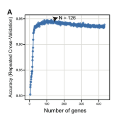

**Author(s)**: `r params$author`  
**Date**: `r Sys.Date()`  


# Academic Citation
If you use this code in your work or research, we kindly request that you cite our publication:

Xiaofan Lu, et al. (2025). FigureYa: A Standardized Visualization Framework for Enhancing Biomedical Data Interpretation and Research Efficiency. iMetaMed. https://doi.org/10.1002/imm3.70005

```{r setup, include=FALSE}
knitr::opts_chunk$set(echo = TRUE)
```

# 需求描述

想实现10折交叉验证的分析方法，FigureYa182RFSurv和FigureYa198SignatureComb 都是根据基因的重要性筛选的，直接根据随机森林的准确度筛选，又是另一种不同的展示方式。



出自<https://www.aging-us.com/article/102814>

Supplementary Figure 4. (A) Relation between classification accuracy and selected genes via recursive feature elimination algorithm.

# 应用场景

随机森林的10折交叉验证。

Using recursive feature elimination (RFE) with random forest as classifier and 10-fold cross-validation method in R package caret to screen features.

cox模型的10折交叉验证可参考FigureYa220repeatedLasso

# 环境设置

```{r}
source("install_dependencies.R")

library(caret)
library(survival)
library(shape)
Sys.setenv(LANGUAGE = "en") #显示英文报错信息
options(stringsAsFactors = FALSE) #禁止chr转成factor
```

自定义函数

```{r}
display.progress = function (index, totalN, breakN=20) {
  if ( index %% ceiling(totalN/breakN)  ==0  ) {
    cat(paste(round(index*100/totalN), "% ", sep=""))
  }
}
```

# 输入文件

InnateDB_genes.csv，免疫基因集。数据来自<https://www.innatedb.com/redirect.do?go=resourcesGeneLists> Immunogenetic Related Information Source (IRIS)

easy_input_expr.txt，表达谱。

easy_input_surv.txt，生存数据。

```{r}
# 加载表达谱和生存数据
expr <- read.table("easy_input_expr.txt",sep = "\t",row.names = 1,check.names = F,stringsAsFactors = F,header = T)
surv <- read.table("easy_input_surv.txt",sep = "\t",row.names = 1,check.names = F,stringsAsFactors = F,header = T)
pct <- 0.1
# 1. 根据情况对表达谱做对数转换
expr <- t(log2(expr + 1))

# 2. 取方差大于1的基因
expr <- expr[,apply(expr, 2, sd) > 0]

# 3. 取表达量为0的样本数目小于总样本数pct%的样本，这里pct默认为0.1，即10%
expr <- expr[,apply(expr, 2, function(x) sum(x == 0) < pct * nrow(expr))]

# 4. 防止基因名出错
colnames(expr) <- make.names(colnames(expr))

# 加载免疫基因集
immune.gene <- read.csv("InnateDB_genes.csv",row.names = NULL,check.names = F,stringsAsFactors = F,header = T)

# 取出基因和样本
comgene <- unique(intersect(colnames(expr),immune.gene$name))
comsam <- intersect(rownames(surv),rownames(expr))
norsam <- rownames(expr)[substr(rownames(expr),14,15) == "11"]
expr.surv <- cbind.data.frame(surv[comsam,c("OS","OS.time")],
                              as.data.frame(expr[comsam,comgene]))
```

# 单变量cox模型筛选基因

```{r}
Coxoutput <- NULL
for(i in 3:ncol(expr.surv)){
  display.progress(index = i,totalN = ncol(expr.surv),breakN = 20)
  g <- colnames(expr.surv)[i]
  cox <- coxph(Surv(OS.time,OS) ~ expr.surv[,i], data = expr.surv)
  coxSummary = summary(cox)
  Coxoutput=rbind(Coxoutput,data.frame(gene=g,
                                       HR=as.numeric(coxSummary$coefficients[,"exp(coef)"])[1],
                                       z=as.numeric(coxSummary$coefficients[,"z"])[1],
                                       pvalue=as.numeric(coxSummary$coefficients[,"Pr(>|z|)"])[1],
                                       lower=as.numeric(coxSummary$conf.int[,3][1]),
                                       upper=as.numeric(coxSummary$conf.int[,4][1]),stringsAsFactors = F))
}
Coxoutput$fdr <- p.adjust(Coxoutput$pvalue, method = "BH") # 矫正P值
candidate.gene <- Coxoutput[which(Coxoutput$fdr < 0.05),"gene"] # 取出FDR<0.05的基因为候选基因
```

# 随机森林筛选过程

There are a number of pre-defined sets of functions for several models, including: linear regression (in the object lmFuncs), random forests (rfFuncs), naive Bayes (nbFuncs), bagged trees (treebagFuncs) and functions that can be used with caret’s train function (caretFuncs).

```{r}
set.seed(19991018) # 设置种子
control <- rfeControl(functions = rfFuncs, # 选择随机森林；详细可参考http://topepo.github.io/caret/recursive-feature-elimination.html#rfe
                      method = "LGOCV", # 选择交叉验证法
                      number = 10) # 10折交叉验证
tmp <- cbind.data.frame(tissue = rep(c(1,0),c(length(comsam),length(norsam))),
                        expr[c(comsam,norsam),candidate.gene])

## 注意，由于原文没有具体写这个随机森林过程的因变量是什么，在我尝试以生存状态为因变量时，预测准确率只有0.7，即便使用原文附件的基因列表(easy_input_gene.txt)也只有0.7不到
# results <- rfe(x = expr.surv[,candidate.gene], 
#                y = as.factor(expr.surv$OS), 
#                metric = "Accuracy",
#                sizes = 1:(length(candidate.gene)-1), # 步长为1，速度较慢请耐心（约2小时）
#                rfeControl = control)

## 因此这一步我将因变量改为组织类型，也就是说第一步得到预后相关的基因背景集，第二步得到在这些预后基因里，能够最大限度区分肿瘤与正常组织的预后签名最小子集
results <- rfe(x = tmp[,candidate.gene], 
               y = as.factor(tmp$tissue), 
               metric = "Accuracy",
               sizes = 1:(length(candidate.gene)-1), # 步长为1，速度较慢请耐心（约2小时）
               rfeControl = control)
final.gene <- predictors(results) # 取出最终基因
write.table(final.gene,"output_selected features.txt",sep = "\t",row.names = F,col.names = F,quote = F)

accres <- results$results # 取出迭代结果
write.table(accres, "output_accuracy result.txt", sep = "\t", row.names = F,col.names = T,quote = F)
```

# 开始画图

```{r}
# 设置颜色
jco <- c("#2874C5","#EABF00")

# 图1：随机森林准确性图
pdf(file = "accuracy.pdf", width = 6, height = 4.5)
par(bty="o", mgp = c(2,0.5,0), mar = c(3.1,4.1,2.1,2.1),tcl=-.25,las = 1)
index <- which.max(accres$Accuracy) # 取出准确率最大时的索引（基因个数）
## 画圈圈
plot(accres$Variables,
     accres$Accuracy,
     ylab = "",
     xlab = "Number of genes",
     col = "steelblue")
## 添加连线
lines(accres$Variables,accres$Accuracy,col = "steelblue")
## 定位最大值
points(index, accres[index,"Accuracy"],
       col = "steelblue",
       pch = 19,
       cex = 1.2)
## 补Y轴坐标（在plot时候写会和axis文字重叠）
mtext("Accuracy (Repeated Cross-Validation)",side = 2,line = 2.5, las = 3)
## 添加好看滴箭头
Arrows(x0 = index-15, x1 = index-10,
       y0 = accres[index,"Accuracy"], y1 = accres[index,"Accuracy"],
       arr.length = 0.2,
       lwd = 2,
       col = "black",
       arr.type = "triangle")
## 添加基因数目信息
text(x = index - 15,
     y = accres[index,"Accuracy"],
     labels = paste0("N=",index),
     pos = 2)
invisible(dev.off())

# 图2：基因集的风险得分及K玛曲县
fit <- coxph(Surv(OS.time,OS) ~ .,data = expr.surv[,c(final.gene,"OS.time","OS")])
risk.score <- apply(expr.surv[,final.gene],1,function(x) {x %*% fit$coefficients})

tmp <- expr.surv[,c("OS.time","OS")]
tmp$OS.time <- tmp$OS.time/30.5
tmp$risk.score <- as.numeric(risk.score)
tmp$RiskGroup <- ifelse(tmp$risk.score > median(risk.score) ,"HRisk","LRisk")

fitd <- survdiff(Surv(OS.time, OS) ~ RiskGroup, data=tmp, na.action=na.exclude)
p1 <- 1-pchisq(fitd$chisq, length(fitd$n)-1)
fit <- survfit(Surv(OS.time, OS)~ RiskGroup, data=tmp, type="kaplan-meier", error="greenwood", conf.type="plain", na.action=na.exclude)

pdf("KM.pdf",width = 4.5,height = 4)
par(bty="o", mgp = c(1.9,.33,0), mar=c(4.1,4.1,2.1,2.1)+.1, las=1, tcl=-.25)
plot(fit, col = jco[2:1], lwd = 1.4, xlab="Time (Months)", ylab="Overall survival",mark.time = T)
par(xpd=TRUE)
legend(x=140, y=1.05, bty="n", "Risk", cex=1, text.font=2)
legend(x=140, y=0.97, bty="n", text.col = jco[2:1], c("High (n = 250)","Low (n = 251)"), cex=0.9)
text(x=0, y=0.05, paste0("P ",ifelse(p1 < 0.001,"< 0.001",paste0("= ",round(p1,3)))), cex=1, pos=4)
invisible(dev.off())
```


# Session Info

```{r}
sessionInfo()
```