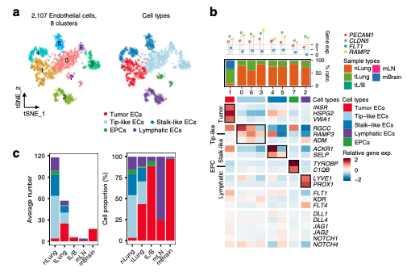

**Author(s)**: `r params$author`  
**Date**: `r Sys.Date()`  

# Academic Citation
If you use this code in your work or research, we kindly request that you cite our publication:

Xiaofan Lu, et al. (2025). FigureYa: A Standardized Visualization Framework for Enhancing Biomedical Data Interpretation and Research Efficiency. iMetaMed. https://doi.org/10.1002/imm3.70005

```{r setup, include=FALSE}
knitr::opts_chunk$set(echo = TRUE)
```

# 需求描述

这篇NC单细胞展示比例和marker基因的图很好看啊

# Requirement Description

This diagram of NC single-cell display ratio and marker gene is very good.



出自<https://www.nature.com/articles/s41467-020-16164-1>
from<https://www.nature.com/articles/s41467-020-16164-1>

Fig. 3 Tumor endothelial cells and myofibroblasts promoting angiogenesis and tissue remodeling. 
a tSNE plot of endothelial cells, color-coded by clusters and cell subsets as indicated. EPCs: endothelial progenitor cells. 
b Three-layered complex heatmap of **selected endothelial cell marker genes** in each cell cluster. 
Top: Mean expression of known lineage markers. 
Middle: Tissue preference of each cluster; 
Bottom: Relative expression map of known marker genes associated with each cell subset. 
Mean expression values are scaled by mean-centering, and transformed to a scale from -2 to 2. 
c **Average cell number and relative proportion** of EC subsets from tissues of each origin. nLung, n = 11 samples; tLung, n = 11 samples; tL/B, n = 3 samples; mLN, n = 2 samples; mBrain, n = 9 samples. 

# 应用场景

单细胞数据展示细胞比例和marker基因。

# Application Scenarios

Single-cell data showing cell ratios and marker genes.

# 环境设置

# Environment settings

```{r}
source("install_dependencies.R")

# 加载所需的R包
# Load required R packages
library(dplyr)         # 用于数据操作和处理的包 # For data manipulation and processing
library(Seurat)        # 用于单细胞数据分析的包 # For single-cell data analysis
library(patchwork)     # 用于拼接多个图的包 # For combining multiple plots
library(reshape2)      # 用于数据重塑的包 # For data reshaping
library(RColorBrewer)  # 提供颜色调色板的包 # For color palettes
library(scales)        # 用于缩放和格式化数据的包 # For scaling and formatting data
library(ggplot2)       # 用于数据可视化的包 # For data visualization
library(ggpubr)        # 用于增强ggplot2功能的包 # For enhancing ggplot2 functionalities
library(ggplotify)     # 将其他图形对象转换为ggplot对象的包 # For converting other plot objects to ggplot objects
library(pheatmap)      # 用于绘制热图的包 # For creating heatmaps
Sys.setenv(LANGUAGE = "en") #显示英文报错信息 # error messages are displayed in English
options(stringsAsFactors = FALSE) #禁止chr转成factor # chr is not allowed to be converted to factor
```

# 输入文件及预处理

以Seurat官网PBMC数据为例，跟FigureYa111markerGene和FigureYa160scGSVA用的是同一套数据，出自不同作者之手，可相互参考。

下载<https://cf.10xgenomics.com/samples/cell/pbmc3k/pbmc3k_filtered_gene_bc_matrices.tar.gz>，解压到当前文件夹。

预处理过程参考<https://satijalab.org/seurat/v3.2/pbmc3k_tutorial.html>

# Input files and preprocessing

Taking the PBMC data on the official website of Seurat as an example, it uses the same set of data as FigureYa111markerGene and FigureYa160scGSVA, which are from different authors and can be cross-referenced.

Download the <https://cf.10xgenomics.com/samples/cell/pbmc3k/pbmc3k_filtered_gene_bc_matrices.tar.gz> and extract it to the current folder.

Refer to <https://satijalab.org/seurat/v3.2/pbmc3k_tutorial.html> for the pretreatment process

```bash
tar -zxvf pbmc3k_filtered_gene_bc_matrices.tar.gz
```

```{r}
plot_wd <- "plot_result/"
dir.create(plot_wd)

# Load the PBMC dataset
pbmc.data <- Read10X(data.dir = "filtered_gene_bc_matrices/hg19/")
# Initialize the Seurat object with the raw (non-normalized data).
pbmc <- CreateSeuratObject(counts = pbmc.data, project = "pbmc3k", min.cells = 3, min.features = 200)
pbmc
```

```{r}
# 进行QC
# 计算mitochondria基因比例
# Perform QC
# Calculate the mitochondria gene ratio
pbmc[["percent.mt"]] <- PercentageFeatureSet(pbmc, pattern = "^MT-")

# Visualize QC metrics as a violin plot
VlnPlot(pbmc, features = c("nFeature_RNA", "nCount_RNA", "percent.mt"), ncol = 3)
plot1 <- FeatureScatter(pbmc, feature1 = "nCount_RNA", feature2 = "percent.mt")
plot2 <- FeatureScatter(pbmc, feature1 = "nCount_RNA", feature2 = "nFeature_RNA")
plot1 + plot2

# Normalizing the data
pbmc <- NormalizeData(pbmc, normalization.method = "LogNormalize", scale.factor = 10000)

#Identification of highly variable features
pbmc <- FindVariableFeatures(pbmc, selection.method = "vst", nfeatures = 2000)

# Identify the 10 most highly variable genes
# top10 <- head(VariableFeatures(pbmc), 10)
# plot variable features with and without labels
# plot1 <- VariableFeaturePlot(pbmc)
# plot2 <- LabelPoints(plot = plot1, points = top10, repel = TRUE)
# plot1 + plot2

# Scale the data
all.genes <- rownames(pbmc)
pbmc <- ScaleData(pbmc, features = all.genes)

# Perform linear dimensional reduction
pbmc <- RunPCA(pbmc, features = VariableFeatures(object = pbmc))
#print(pbmc[["pca"]], dims = 1:5, nfeatures = 5)
VizDimLoadings(pbmc, dims = 1:2, reduction = "pca")
DimPlot(pbmc, reduction = "pca")
DimHeatmap(pbmc, dims = 1:15, cells = 500, balanced = TRUE)

# NOTE: This process can take a long time for big datasets, comment out for expediency. More
# approximate techniques such as those implemented in ElbowPlot() can be used to reduce
# computation time

##以下酌情运行，比较耗时，可以不运行，直接看ElbowPlot
## The following is run as appropriate, it is more time-consuming, you can not run it, and directly look at ElbowPlot
#pbmc <- JackStraw(pbmc, num.replicate = 100)
#pbmc <- ScoreJackStraw(pbmc, dims = 1:20)
#JackStrawPlot(pbmc,dims = 1:20)
ElbowPlot(pbmc)
```

ElbowPlot对主要PC进行排序，“拐弯”处之前的PC均可被选择，这里看到第10个PC处出现拐点，所以后续选择前10个PC进行降维

ElbowPlot sorts the main PCs, and the PCs before the "bend" can be selected, and here we see that there is an inflection point at the 10th PC, so the first 10 PCs are selected for dimensionality reduction

```{r}
# Cluster the cells
pbmc <- FindNeighbors(pbmc, dims = 1:10)
pbmc <- FindClusters(pbmc, resolution = 0.5)

#Run non-linear dimensional reduction (UMAP/tSNE)
pbmc <- RunUMAP(pbmc, dims = 1:10)
pA1 <- DimPlot(pbmc, reduction = "umap", label=T)+ NoLegend()
ggsave(paste0(plot_wd,"plotA_1_UMAP_cluster.pdf"), plot = pA1, width = 6, height = 6)
```

```{r}
# Finding differentially expressed features (cluster biomarkers)
# find markers for every cluster compared to all remaining cells, report only the positive ones
pbmc.markers <- FindAllMarkers(pbmc, only.pos = TRUE, min.pct = 0.25, logfc.threshold = 0.25)
# pbmc.markers %>% group_by(cluster) %>% top_n(n = 2, wt = avg_logFC)

# 查看top10 marker gene
# View the top 10 marker gene
top10 <- pbmc.markers %>% group_by(cluster) %>% top_n(n = 10, wt = avg_log2FC)
DoHeatmap(pbmc, features = top10$gene) + NoLegend()
```

# 结合每个cluster的marker基因和生物学知识确定细胞类型，顺便画图A

为了接近真实情况并结合示例数据，这里不将细胞类型划分得这么详细，进行以下更改：

# Determine the cell type by combining the marker gene and biological knowledge of each cluster, and draw Figure A by the way

In order to get close to the real situation and combine the example data, the cell types are not divided into such details here, and the following changes are made:

```{r}
# 给每个cluster标注细胞类型
# Label each cluster with cell types
new.cluster.ids <- c("T", "Mono", "T", "B", "T", "Mono", "NK", "DC", "Platelet")
names(new.cluster.ids) <- levels(pbmc)
pbmc <- RenameIdents(pbmc, new.cluster.ids)

# 添加细胞类型至meta data
# Add cell types to meta data
pbmc@meta.data$celltype <- pbmc@active.ident
DimPlot(pbmc, reduction = "umap", label = TRUE, pt.size = 0.5) + NoLegend()
pA2 <-  pA2 <- DimPlot(pbmc, reduction = "umap", label=F,group.by="celltype")
ggsave(paste0(plot_wd,"plotA_1_UMAP_celltype.pdf"), plot = pA2, width = 6, height = 6)

# 自定义颜色
# Custom colors
colourCount = length(unique(pbmc@meta.data$celltype))
getPalette = colorRampPalette(brewer.pal(8, "Dark2"))
celltype_colors <- getPalette(colourCount)

pA2 <-  pA2 <- DimPlot(pbmc, reduction = "umap", label=F,group.by="celltype",cols=celltype_colors)
ggsave(paste0(plot_wd,"plotA_1_UMAP_celltype_color.pdf"), plot = pA2, width = 6, height = 6)

## 拼图
## Puzzles
pA_all <- pA1 + pA2 + plot_layout(ncol = 2, widths=c(1, 1))
ggsave(paste0(plot_wd,"plotA_all.pdf"), plot = pA_all, width = 12, height = 6)

celltype <- c("T","Mono","B","NK","DC","Platelet")
pbmc@meta.data$celltype <- factor(pbmc@meta.data$celltype, levels = celltype)

## 为了符合真实情况（大多数数据来自多个样本）和原文数据中的sample type，这里模拟一个数据，为pbmc数据中加入sample信息
## In order to match the real situation (most of the data comes from multiple samples) and the sample type in the article data, here simulate a data and add sample information to the PBMC data
sample_type <- c("nLung","tLung","tL/B","mLN","mBrain")

### 设置set.seed方便重复
### Set set.seed for easy repetition
set.seed(1)
pbmc@meta.data$sample <- sample(sample_type,  nrow(pbmc@meta.data), replace = TRUE)
pbmc@meta.data$sample <- factor(pbmc@meta.data$sample, levels = sample_type)

## 从上述标注细胞类型信息可知0,2,4属于T，1,5属于Mono，3属于B，6属于NK，7属于DC，8属于Platelet
## 所以设定cluster为factor，levels=c(0,2,4,1,5,3,6,7,8)
## From the above annotated cell type information, it can be seen that 0,2,4 belong to T, 1,5 belong to Mono, 3 belong to B, 6 belong to NK, 7 belong to DC, and 8 belong to Platelet
## So set cluster to factor,levels=c(0,2,4,1,5,3,6,7,8)
cluster <- c(0,2,4,1,5,3,6,7,8)
pbmc@meta.data$seurat_clusters <- factor(pbmc@meta.data$seurat_clusters,levels=cluster)
saveRDS(pbmc, "pbmc_test_final.rds")
```

# 画图B - marker gene

图B主要由三部分组成，最上部的克利夫兰图（棒棒糖图），中部的bar图和下部的热图

先画上部棒棒糖图，用来展示Mean expression of known lineage markers

# Draw B - marker gene

Figure B is mainly composed of three parts, the uppermost Cleveland diagram (lollipop diagram), the middle bar diagram, and the lower heat map

Draw the upper lollipop diagram to show the Mean expression of known lineage markers

```{r}
#选择四个基因进行平均表达量展示
# Four genes were selected for average expression

select_gene <- c("CD3E","MS4A1","GNLY","CD14")
Idents(pbmc) <- "seurat_clusters"
AveExpression <- AverageExpression(pbmc, assays = "RNA", features = select_gene,verbose = TRUE) %>% .$RNA
Ave_df <- melt(AveExpression,id.vars= "Gene")
colnames(Ave_df) <- c("Gene", "Cluster", "Expression")
Ave_df$Group <- paste(Ave_df$Cluster,Ave_df$Gene,sep = "_")
Ave_df$Expression[which(Ave_df$Expression>10)] <- 10 ####设置平均表达量大于10的值为10，放置画出来的bar太高，按照自己数据情况设定
#### Set the average expression value greater than 10 to 10, and place the drawn bar too high, set it according to your own data

pB1 <- ggplot(Ave_df,aes(x=rownames(Ave_df), y=Expression))+
  geom_hline(yintercept = seq(0, 10, 2.5),linetype = 2, color = "lightgray",size=1)+
  geom_line()+
  geom_segment(aes(x=rownames(Ave_df),xend=rownames(Ave_df),y=0,yend=Expression),color="lightgray",size = 1.5)+
  geom_point(size=3,aes(color=rownames(Ave_df)))+
  scale_color_manual(values=c("#00AFBB", "#E7B800", "#FC4E07", "#41ab5d")) +
  theme_bw()+
  theme(panel.grid =element_blank()) +
  labs(x="",y="Gene exp.")

pB1 <- facet(pB1, facet.by = "Cluster",ncol = length(unique(Ave_df$Cluster)),panel.labs.font = list(size = 12),panel.labs.background = list(fill = "#a6cee3"))

pB1 <- pB1 + scale_y_continuous(position = "right")+  ####用来将y轴移动位置 #### Used to move the y-axis in position
  theme(axis.text.y = element_text(size=12, colour = "black"))+
  theme(axis.text.x = element_blank())+ ## 删去所有刻度标签# theme(axis.text.y = element_blank())   ## 设置 axis.text.y 则只删去 Y 轴的刻度标签，X 轴同理。 ## If you set axis.text.y, only the tick label for the Y axis will be removed, and the same will be true for the X axis.
  theme(axis.title.y = element_text(size=12, colour = "black"))+
  theme(axis.title.x = element_blank())+
  theme(legend.position = "right",
        panel.border = element_blank(),## 去掉最外层的正方形边框 ## Remove the outermost square border
        axis.ticks.x = element_line(color =  NA))

pB1
```

下面来画中部的bar图，用来展示Tissue preference of each cluster

Let's draw a bar diagram in the middle to show the Tissue preference of each cluster

```{r}
pB2_df <- table(pbmc@meta.data$seurat_clusters,pbmc@meta.data$sample) %>% melt()
colnames(pB2_df) <- c("Cluster","Sample","Number")
pB2_df$Cluster <- factor(pB2_df$Cluster,levels = cluster)

sample_color <- c("#d95f02","#66a61e","#1b9e77","#e7298a","#386cb0")
pB2 <- ggplot(data = pB2_df, aes(x = Cluster, y = Number, fill = Sample)) +
  geom_bar(stat = "identity", width=0.8,position="fill")+
  scale_fill_manual(values=sample_color) +
  theme_bw()+
  theme(panel.grid =element_blank()) +
  labs(x="",y="Ratio")+
  scale_y_continuous(position = "right",labels = percent)+  ####用来将y轴移动位置
  theme(axis.text.y = element_text(size=12, colour = "black"))+
  theme(axis.text.x = element_text(size=12, colour = "black"))
pB2
```

接下来用pheatmap绘制下部热图，展示Relative expression map of known marker genes associated with each cell subset. 

Next, the lower heat map is drawn with pheatmap to show the Relative expression map of known marker genes associated with each cell subset.

```{r}
####此处可计算细胞类型的marker用于展示，这里选择用于鉴定细胞类型的marker
#### Here the marker for the cell type can be calculated for display, and here the markers for identifying the cell type are selected
heatmap_gene <- c("CD3E", "CD8A","CD14", "LYZ","FCGR3A", "MS4A7","MS4A1","GNLY", "NKG7","FCER1A", "CST3", "PPBP")
heatmap_AveE <- AverageExpression(pbmc, assays = "RNA", features = heatmap_gene,verbose = TRUE) %>% .$RNA

gene_num <- c(2,4,1,2,2,1)
gaps_row <- cumsum(gene_num)

cluster_num <- c(3,2,1,1,1,1)
gaps_col <- cumsum(cluster_num)

bk <- c(seq(-2,-0.1,by=0.01),seq(0,2,by=0.01))
annotation_row <- data.frame(row.names = rownames(heatmap_AveE),
                             `CellType` = rep(factor(celltype,levels = celltype),gene_num))
annotation_col <- data.frame(row.names = colnames(heatmap_AveE),
                             `CellType` = rep(factor(celltype,levels = celltype),cluster_num))
annotation_colors = list(`CellType` = celltype_colors)
names(annotation_colors$`CellType`) = celltype
ph3 <- pheatmap(heatmap_AveE,cluster_cols = F,cluster_rows = F,show_colnames=F,show_rownames=T,
                border=F,#border_color = "white",
                color = c(colorRampPalette(colors = c("#2166ac","#f7fbff"))(length(bk)/2),
                          colorRampPalette(colors = c("#f7fbff","#b2182b"))(length(bk)/2)),
                breaks=bk,scale="row",legend_breaks=seq(-2,2,2),
                gaps_row = gaps_row,gaps_col = gaps_col,
                annotation_row = annotation_row,annotation_col = annotation_col,
                annotation_colors = annotation_colors,
                annotation_names_row = F,annotation_names_col = T)

pB3 = as.ggplot(ph3) ### 将pheatmap对象转为ggplot对象，便于后续拼图 ### Convert the pheatmap object to a ggplot object for easy follow-up puzzles
```

拼图
puzzle

```{r}
pB_1_2 <- pB1 + pB2 + plot_layout(ncol = 1, heights = c(1, 2))
## 尝试将热图也拼在一起，发现并不能完全对，后期用AI拼效果更好
## I tried to put the heat map together, but I found that it was not completely right, and it was better to use AI to spell it later
## pB_all <- pB1 + pB2 + pB3 + plot_layout(ncol = 1, heights = c(1, 2,3))
pB_1_2

## 保存
## save
ggsave(paste0(plot_wd,"plotB_1_2.pdf"), plot = pB_1_2, width = 8, height = 5)
ggsave(paste0(plot_wd,"plotB_3_heatmap.pdf"), plot = pB3, width = 8, height = 7)
```

后期用AI拼效果更好。输出到pdf文件都是矢量图，可以用Illustrator等矢量图软件打开，编辑文字、图形等。

# 画图C - Average cell number and relative proportion

In the later stage, it is better to use AI to spell the effect. The output to pdf files is all vector graphics, which can be opened with vector software such as Illustrator to edit text, graphics, etc.

# Paint C - Average cell number and relative proportion

```{r}
data_plotC <- table(pbmc@meta.data$sample, pbmc@meta.data$celltype) %>% melt()
colnames(data_plotC) <- c("Sample", "CellType","Number")

pC1 <- ggplot(data = data_plotC, aes(x = Sample, y = Number, fill = CellType)) +
  geom_bar(stat = "identity", width=0.8,aes(group=CellType),position="stack")+
  scale_fill_manual(values=celltype_colors) +
  theme_bw()+
  theme(panel.grid =element_blank()) +
  labs(x="",y="Average number")+
  theme(axis.text = element_text(size=12, colour = "black"))+
  theme(axis.title.y = element_text(size=12, colour = "black"))+
  theme(panel.border = element_rect(size = 1, linetype = "solid", colour = "black"))+
  theme(axis.text.x = element_text(angle = 45,hjust = 0.8,  vjust = 0.6)) 

pC2 <- ggplot(data = data_plotC, aes(x = Sample, y = Number, fill = CellType)) +
  geom_bar(stat = "identity", width=0.8,aes(group=CellType),position="fill")+
  scale_fill_manual(values=celltype_colors) +
  theme_bw()+
  theme(panel.grid =element_blank()) +
  labs(x="",y="Cell proportion")+
  scale_y_continuous(labels = percent)+  ####用来将y轴移动位置 #### Used to move the y-axis in position
  theme(axis.text = element_text(size=12, colour = "black"))+
  theme(axis.title.y = element_text(size=12, colour = "black"))+
  theme(panel.border = element_rect(size = 1, linetype = "solid", colour = "black"))+
  theme(axis.text.x = element_text(angle = 45,hjust = 0.8,  vjust = 0.6))      #让横轴上的标签倾斜45度 # Tilt the label on the horizontal axis 45 degrees

pC <- pC1 + pC2 + plot_layout(ncol = 2, widths = c(1,1),guides = 'collect')

pC

ggsave(paste0(plot_wd,"plotC.pdf"), plot = pC, width = 7, height = 5)
```

# Session Info

```{r}
sessionInfo()
```