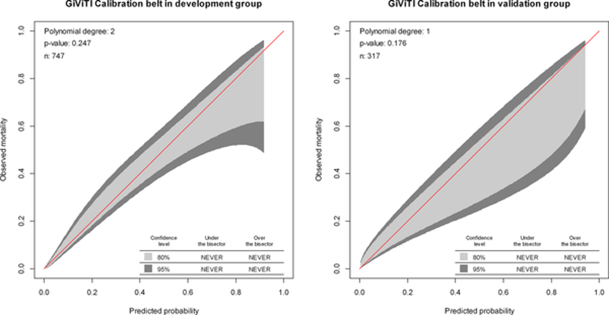
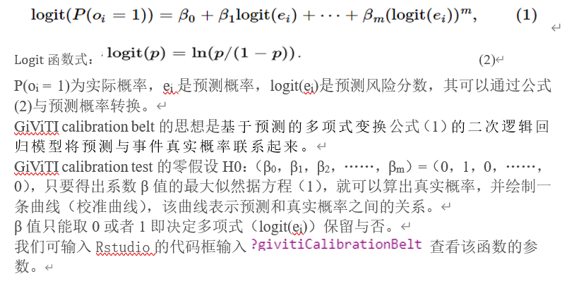
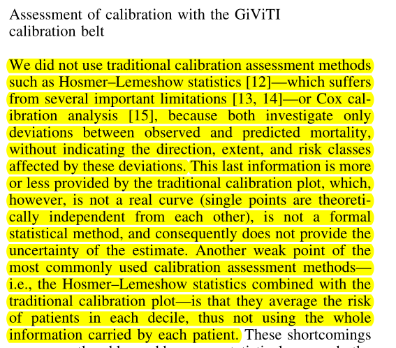

**Author(s)**: `r params$author`  
**Date**: `r Sys.Date()`  

# Academic Citation
If you use this code in your work or research, we kindly request that you cite our publication:

Xiaofan Lu, et al. (2025). FigureYa: A Standardized Visualization Framework for Enhancing Biomedical Data Interpretation and Research Efficiency. iMetaMed. https://doi.org/10.1002/imm3.70005

```{r setup, include=FALSE}
knitr::opts_chunk$set(echo = TRUE)
```

# 需求描述

用givitiR包复现文章里的图

# Requirement Description

Use the givitiR package to reproduce the diagram in the article



出自<https://journals.plos.org/plosone/article?id=10.1371/journal.pone.0201515>
from<https://journals.plos.org/plosone/article?id=10.1371/journal.pone.0201515>

Fig 4. Calibration plots of the nomogram for the probability of urosepsis patients with ureteral calculi in the development group and validation group. 

相似的图：
Similar diagrams:


出自<https://link.springer.com/article/10.1007/s00134-012-2578-0>
from<https://link.springer.com/article/10.1007/s00134-012-2578-0>

# 应用场景
# Application Scenarios

**Functions to assess the calibration of logistic regression models** with the GiViTI (Gruppo Italiano per la Valutazione degli interventi in Terapia Intensiva, Italian Group for the Evaluation of the Interventions in Intensive Care Units - see <http://www.giviti.marionegri.it/>) approach. The approach consists in a graphical tool, namely the GiViTI calibration belt, and in the associated statistical test. These tools can be used both to evaluate the internal calibration (i.e. the goodness of fit) and to assess the validity of an externally developed model.

引自givitiR包的[首页简介](https://cran.r-project.org/web/packages/givitiR/index.html)

原文method说是用rms包实现的，rms包功能确实强大，我初步查阅了[rms包的Reference manual](https://cran.r-project.org/web/packages/rms/rms.pdf)并没有发现绘制GiViTI calibration belt的函数，我推测作者应该是写错了，查阅文献后，发现应该是通过givitiR包绘制的。

Quote from the [Home Introduction] of the givitiR package (https://cran.r-project.org/web/packages/givitiR/index.html)

The original method said that it was implemented with the rms package, the rms package is really powerful, I initially checked the [rms package Reference manual](https://cran.r-project.org/web/packages/rms/rms.pdf) and did not find the function of drawing the GiViTI calibration belt, I speculate that the author should have written it wrong, after consulting the literature, The discovery should be drawn through the givitiR package.


# 环境设置

# Environment settings

```{r}
source("install_dependencies.R")

library(givitiR)  # 绘制GiViTI calibration belt # Draw the GiViTI calibration belt
library(foreign)  # 读入sav格式文件 # Load the SAV file
library(rms)      # 拟合模型 # Fitting the model
library(ResourceSelection) # Hosmer-Lemeshow拟合优度检验 # Hosmer-Lemeshow goodness-of-fit test

Sys.setenv(LANGUAGE = "en") #显示英文报错信息  # error messages are displayed in English
options(stringsAsFactors = FALSE) #禁止chr转成factor # chr is not allowed to be converted to factor
```

# 输入文件

例文旨在开发一个预测尿脓毒症的个性化模型，结局事件是尿脓毒症，并且纳入了性别、肾积水平均CT值、功能性孤立肾、尿WBC数、尿亚硝酸盐等五个因素

easyinput_train.csv和easyinput_test.csv，分别为训练集和验证集临床信息。构建模型需要这几列：

- 结局事件：Urosepsis
- 因素：这里有五个Gender、Functional_solitary_kidney、Mean_CT_value_of_hedronephrosis、Urine_WBC_count、Urine_nitrite

另外，PRE_1列是例文模型的预测概率，用我们复现的预测概率值跟它做比较，即可看出我们复现的效果。我们最后也像这样输出预测概率，放到最后一列（见output_*.csv），可作为文章的补充材料。

下载自[训练集](https://ndownloader.figstatic.com/files/12624572)和[验证集](https://ndownloader.figstatic.com/files/12624578)，下载后重命名为train set 和test set，为sav格式（SPSS）。为方便小伙伴套用到自己到数据上，把它们转成csv格式。

# Input files

The aim of this article was to develop a personalized model for predicting urinary sepsis, with the outcome event of urinary sepsis and including five factors: gender, hydronephrosis CT value, functional solitary kidney, urine WBC number, and urine nitrite

easyinput_train.csv and easyinput_test.csv, respectively, are the training set and the validation set of clinical information. These columns are required to build the model:

- Ending Event: Urosepsis
- Factors: There are five Gender, Functional_solitary_kidney, Mean_CT_value_of_hedronephrosis, Urine_WBC_count, and Urine_nitrite

In addition, column PRE_1 is the prediction probability of the example model, and we can see the effect of our recurrence by comparing it with the prediction probability value of our recurrence. We also output the predicted probabilities like this at the end and put them in the last column (see output_*.csv) as a supplement to the article.

It was downloaded from [Training Set] (https://ndownloader.figstatic.com/files/12624572) and [Validation Set] (https://ndownloader.figstatic.com/files/12624578), renamed to train set and test set, and in sav format (SPSS). In order to facilitate the small partners to apply their own data, convert them to CSV format.

```{r eval=FALSE}
# 读入sav格式文件
# Load the SAV file
devedf <- read.spss(file = "development set.sav",
                  use.value.labels = F,    # 如果想显示标签信息可以设置为T # If you want to display tag information, you can set it to T
                  to.data.frame = T)
validf <- read.spss(file = "validation set.sav",use.value.labels = F,to.data.frame = T)
# 保存为csv格式，便于套用在自己的数据上
# Save as a CSV format for easy application to your own data
write.csv(devedf, "easyinput_train.csv", quote = F, row.names = F)
write.csv(validf, "easyinput_test.csv", quote = F, row.names = F)
```

```{r}
# 读取输入文件
# Read the input files
devedf <- read.csv("easyinput_train.csv")
dim(devedf)
validf <- read.csv("easyinput_test.csv")
dim(validf)
```

# 第一步：拟合模型并验证复现效果
# Step 1: Fit the model and verify the reproducibility

```{r}
# 拟合逻辑回归模型
# Fit logistic regression models
model <- glm(formula = Urosepsis ~ #结局事件 # Ending Event
               # 下面是因素
               # Here are the factors
               Gender +
               Functional_solitary_kidney +
               Mean_CT_value_of_hedronephrosis +
               Urine_WBC_count +
               Urine_nitrite,
             na.action = na.exclude,
             family = binomial(link='logit'),
             data = devedf)

# 获得预测概率值
# Get the predicted probability value
PpreD <- predict(model,
                 type = 'response') # response gives you the numerical result
# 计算验证集的预测概率
# Calculate the prediction probability of the validation set
PpreV <- predict(model,
                 validf, #a data frame in which to look for variables with which to predict. If omitted, the fitted linear predictors are used.
                 type = c("response"))
# ?predict.glm # 查看predict函数的用法 # Check the usage of the predict function

# 保存到文件
# 前面是输入文件的内容，最后一列就是我们算出来的预测概率
# Save to file
# The first column is the content of the input file, and the last column is the prediction probability we calculated
devedf$PpreD <- PpreD
validf$PpreV <- PpreV
write.csv(devedf, "output_train.csv", quote = F, row.names = F)
write.csv(validf, "output_test.csv", quote = F, row.names = F)
```

跟原文对比，验证我们复现的建模结果

原文Table 2：

Compare with the original text to verify the modeling results we reproduced

Table 2 of the original text:


```{r}
# 查看模型详情和P-value
# View model details and P-value
summary(model)
# 查看OR值
# Check the OR value
round(exp(model$coefficients[-1]),digits = 2)
```

OR、P value与原文的Table 2基本一致
The OR and P values are basically the same as Table 2 in the original text

```{r}
# 比较复现的预测概率与原文的预测概率
# Compare the predicted probability of recurrence with the prediction probability of the original text
identical(round(as.numeric(PpreD),digits = 6), #我们复现的预测概率 # The predicted probability of our recurrence
          round(devedf$PRE_1,digits = 6)) #原文的预测概率 # Predicted probability of the original text
 
# 比较验证集的预测概率与原文的预测概率
# Compare the prediction probability of the validation set with the prediction probability of the original text
cor(round(as.numeric(PpreV),digits = 6), #我们复现的验证集的预测概率 # The predicted probability of the validation set that we reproduced
          round(validf$PRE_1,digits = 6)) #原文的预测概率 # Predicted probability of the original text
```

相关性达到0.999999，基本一致

# 第二步：GiViTI calibration belt

givitiCalibrationBelt函数说明，可参考文末所附“GiViTI calibration belt and test原理”。

The correlation reached 0.999999, which was basically the same

# Step 2: GiViTI calibration belt

For more information about the givitiCalibrationBelt function, please refer to the "GiViTI calibration belt and test principle" attached at the end of this article.

```{r}
# 训练集
# Training set
cb <- givitiCalibrationBelt(o = devedf$Urosepsis,      # 表示二分类变量的数值向量（0，1表示，1为结局事件） # Numerical vectors representing dichotomous variables (0, 1 for the outcome event)
                            e = PpreD,                 # 预测概率 # Predict probability
                            devel = "internal",        # 指定模型校准的数据集（internal开发集/external验证集） # Specify the dataset of model calibration (internal development set/external verification set)
                            subset = 1:nrow(devedf),   # 取子集 # Take a subset
                            confLevels = c(0.8,0.95),  # 指定校准带的置信区间 # Specify the confidence interval for the calibration band
                            thres = 0.95,              # 前向选择中采用的显著性级别 # The level of significance used in forward selection
                            maxDeg = 4,                # 前向选择中考虑的最大自由度 # Maximum degrees of freedom considered in forward selection
                            nPoints = 200)             # 指定绘制校准带时的点数 # Specifies the number of points when drawing the calibration band

#pdf("GiViTI calibration belt in development groups.pdf")
plot.givitiCalibrationBelt(cb, 
                           xlim = c(0,1),ylim = c(0,1),
                           colBis = "red",        # 设置对角线颜色 # Set the diagonal color
                           xlab = "Predicted probability",ylab = "Observed mortality",
                           main = "GiViTI calibration belt in development groups",
                           pvalueString = T, nString = T,  # 显示右上方的P值和样本量 # Shows the P-value and sample size in the upper right
                           table = T,                      # 显示图像右下方的置信区间表格 # A table of confidence intervals is displayed at the bottom right of the image
                           tableStrings = NULL,            # 设置打印在右下角列表的四个字符串 # Set the four strings that are printed in the list in the lower right corner
                           unableToFitString = "Unable to Fit") # 设置当数据集与校准带不能拟合时的报错信息 # Set the error message when the dataset and the calibration band cannot be fitted
#dev.off()
```

**结果解读：**p-value=0.247表明尚不能认为该模型拟合不良。

**Interpretation of the results**: P-value=0.247 indicates that the model cannot be considered to be poorly fitted.

```{r}
# 验证集
# Validation set
cb2 <- givitiCalibrationBelt(o = validf$Urosepsis, e = PpreV,
                            devel = "external")

#pdf("GiViTI calibration belt in validation groups.pdf")
plot(cb2, main = "GiViTI calibration belt in validation groups",
     xlab = "Predicted probability",
     ylab = "Observed mortality")
#dev.off()
```

提需求的小伙伴提供的例文2[Intensive Care Med. 2012 Aug;38(8):1280-8.](https://pubmed.ncbi.nlm.nih.gov/22584793/) 的结果描述部分，对GiViTI calibration belt的解释值得一看：

Example 2 provided by the partner in need [Intensive Care Med. 2012 Aug; 38(8):1280-8.] In the description of the results of (https://pubmed.ncbi.nlm.nih.gov/22584793/), the explanation of the GiViTI calibration belt is worth seeing:


# 附：

## GiViTI calibration belt and test原理

# Attached:

## GiViTI calibration belt and test principle



想要了解详细的原理可以参考[givitiR package: assessing the calibration of binary outcome models with the GiViTI calibration belt](https://cran.r-project.org/web/packages/givitiR/vignettes/givitiR.html)

- Thres就是在多项式选择（前向选择）时保留的阈值，即当β>Thre时，β取1，保留该多项式

- maxDeg表示方程式1中保留的多项式的最大自由度

## 传统的校准曲线与GiViTI校准曲线的比较

总的来说：与GiViTI校准曲线相比，传统校准曲线（是通过loess拟合的曲线，并不是真实的预测概率分布）只考虑实际死亡率和预测死亡率之间的偏差，而没有指出受这些偏差影响的方向、程度和风险类别，也没有考虑每个个体的偏差。

For more information, please refer to [givitiR package: assessing the calibration of binary outcome models with the GiViTI calibration belt]( https://cran.r-project.org/web/packages/givitiR/vignettes/givitiR.html)

- Thres is the threshold that is preserved in the case of polynomial selection (forward selection), i.e., when Thre is β>, the β takes 1 and retains the polynomial

- maxDeg represents the maximum degree of freedom of the polynomial preserved in Equation 1

## Comparison of conventional calibration curves with GiViTI calibration curves

Overall: In contrast to the GiViTI calibration curve, the traditional calibration curve (the curve fitted by loess and not the true predicted probability distribution) only considers the deviation between the actual and predicted mortality rates, without indicating the direction, extent, and risk category affected by these deviations, nor does it take into account the bias of each individual.



出自[Intensive Care Med. 2012 Aug;38(8):1280-8.](https://pubmed.ncbi.nlm.nih.gov/22584793/)
from[Intensive Care Med. 2012 Aug;38(8):1280-8.](https://pubmed.ncbi.nlm.nih.gov/22584793/)

传统的校准曲线，画法可参考FigureYa138NiceCalibration
For the traditional calibration curve, please refer to FigureYa138NiceCalibration


引自 [JAMA Surg. 2016 Apr;151(4):356-63. Fig B](https://jamanetwork.com/journals/jamasurgery/fullarticle/2469647)

Quoted from  [JAMA Surg. 2016 Apr;151(4):356-63. Fig B](https://jamanetwork.com/journals/jamasurgery/fullarticle/2469647)


强烈推荐此文，出自 [JAMA. 2017 Oct 10;318(14):1377-1384. Fig 2](https://pubmed.ncbi.nlm.nih.gov/29049590/)

Highly recommend this article, from:[JAMA. 2017 Oct 10;318(14):1377-1384. Fig 2](https://pubmed.ncbi.nlm.nih.gov/29049590/)

# Session Info

```{r}
sessionInfo()
```