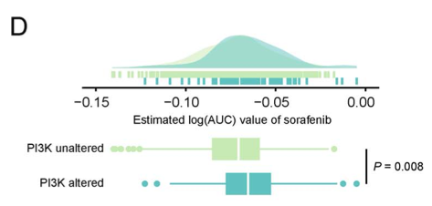

**Author(s)**: `r params$author`  
**Date**: `r Sys.Date()`  

# Academic Citation
If you use this code in your work or research, we kindly request that you cite our publication:

Xiaofan Lu, et al. (2025). FigureYa: A Standardized Visualization Framework for Enhancing Biomedical Data Interpretation and Research Efficiency. iMetaMed. https://doi.org/10.1002/imm3.70005

```{r setup, include=FALSE}
knitr::opts_chunk$set(echo = TRUE)
```

# 需求描述

用高逼格的方式展示两组之间对于索拉菲尼药物治疗敏感性的差异。。也是出自上次那个药物敏感的文章。。

# Requirement Description

The difference in susceptibility to sorafenib between the two groups is also from the previous article on drug sensitivities.



出自<https://academic.oup.com/bib/advance-article/doi/10.1093/bib/bbaa164/5891146>
from<https://academic.oup.com/bib/advance-article/doi/10.1093/bib/bbaa164/5891146>

Figure 5. Identification of candidate agents with higher drug sensitivity in high-PPS score patients. (D) Comparison of estimated sorafenib’s sensitivity (logAUC) between PI3K-MTOR altered and unaltered groups.

另外，FigureYa212drugTargetV2复现了例文的Figure 5FG，利用细胞系表达谱（CCLE）及药敏结果（PRISM和CTRP），预测癌症样本的药敏结果。

FigureYa213customizeHeatmap复现了Figure 6，实现CMap analysis及画图。

In addition, FigureYa212drugTargetV2 reproduces Figure 5FG in the example to predict the antimicrobial susceptibility of cancer samples using cell line expression profiling (CCLE) and drug susceptibility results (PRISM and CTRP).

FigureYa213customizeHeatmap reproduces Figure 6 to implement CMap analysis and drawing.

# 应用场景

绘制箱线图时同时给出数据的密度分布图，叠加展示美美哒～

类似的，FigureYa68friends曾画过一半小提琴、一半box plot和散点图。

# Application Scenarios

When drawing the box plot, the density distribution map of the data is given at the same time, and the beauty is displayed on a superimposed basis~

Similarly, FigureYa68friends has drawn half violin, half box plot, and scatter plot.

# 环境设置

# Environment settings

```{r}
source("install_dependencies.R")

library(ggplot2)
library(data.table)
library(aplot)
library(ggpubr)
library(dplyr)
Sys.setenv(LANGUAGE = "en") #显示英文报错信息 # error messages are displayed in English
options(stringsAsFactors = FALSE) #禁止chr转成factor # chr is not allowed to be converted to factor
```

# 输入文件

easy_input.csv，包含三列，后两列必需：分组信息Subtype和每个sample对应的AUC。

# Input the file

easy_input.csv, it contains three columns, the last two columns are required: the grouping information Subtype and the AUC corresponding to each sample.

```{r}
# 加载模拟数据(因为是用ggplot做，所以多个组都可以)
# Load simulation data (because it is done with ggplot, so multiple groups are OK)
df <- read.table("easy_input.txt",sep = "\t",row.names = NULL,check.names = F,stringsAsFactors = F,header = T)
head(df)

# 计算p值
# 这里是多组，用kruskal.test函数，还可以改为aov
# 如果是两组，可以改为t.test，或wilcox.test
# Calculate the p-value
# Here are multiple groups, use the kruskal.test function, and you can change it to aov
# If there are two groups, you can change it to t.test, or wilcox.test
p.val <- kruskal.test(AUC ~ Subtype,
                      data = df)
p.lab <- paste0("P",
                ifelse(p.val$p.value < 0.001, " < 0.001",
                       paste0(" = ",round(p.val$p.value, 3)))) 
p.lab
```

# 开始画图
# Start drawing

```{r}
# 设置颜色
# Set the color
green <- "#C7EAB2"
cyan <- "#5FC1C2"
blue <- "#1B90BE"

# 绘制上半部分密度图
# Draw the density map of the upper half
p_top <- ggplot(df, aes(x = AUC, color = Subtype, fill = Subtype)) +
  geom_density() +
  # 让箱子的所有位置都颜色统一，如例文所示
  # Make all positions of the box uniform in color, as shown in the example
  scale_color_manual(values = c(alpha(green,0.7),alpha(cyan,0.7),alpha(blue,0.7))) + # 设置透明色 # Set the transparent color
  scale_fill_manual(values = c(alpha(green,0.7),alpha(cyan,0.7),alpha(blue,0.7))) +
  theme_classic() + # 如果显示采用这一行 # Use this line if you want to display
   
  # 这里提取输入文件的第一列药物名称，写入x轴标签
  # Here extract the drug name in the first column of the input file and write it to the x-axis label
  xlab(paste0("Estimated AUC of ", unique(df$Drug))) + 
  # 第一列非必需，可以像下面这样直接写xlab
  # The first column is not required, you can write xlab directly like the following xlab("Estimated AUC of Cisplatin") +
  
  ylab(NULL) + 
  theme(legend.position = "none", 
        legend.title = element_blank(),
        axis.text.x = element_text(size = 12,color = "black"),
        axis.text.y = element_blank(), # 原文不显示纵轴的密度 # The original text does not show the density of the vertical axis
        #axis.text.y = element_text(size = 12,color = "black"), # 如果要显示采用这一行 # If you want to display ,youcan use this line
        axis.ticks.y = element_blank(),
        axis.line.y = element_blank(),
        panel.background = element_blank(),
        panel.grid.major = element_blank(),
        panel.grid.minor = element_blank()) +
  geom_rug()
p_top

# 画box plot
# Draw a box plot
p_bot <- ggplot(df, aes(Subtype, AUC, fill = Subtype)) + 
  geom_boxplot(aes(col = Subtype)) + 
  scale_fill_manual(values = c(green, cyan, blue)) + 
  scale_color_manual(values = c(green, cyan, blue)) + 
  xlab(NULL) + ylab("Estimated AUC") + 
  theme_void() +
  theme(legend.position = "right",
        legend.title = element_blank(),
        axis.text.x = element_blank(), # 原文不显示箱线图的x轴 # The original text does not show the x-axis of the boxplot
        #axis.text.x = element_text(size = 12,color = "black"), # 如要显示箱线图x轴采用这一行 # If you want to display the boxplot x-axis, use this row
        axis.text.y = element_text(size = 11,color = "black"),
        panel.background = element_blank(),
        panel.grid.major = element_blank(),
        panel.grid.minor = element_blank()) + 
  annotate(geom="text",
           x = 1.5,
           hjust = 1,
           y = max(df$AUC),
           size = 4, angle = 270, fontface = "bold",
           label = p.lab) +
  coord_flip() # 翻转图像 # Flip the image

# 用白色标记箱子的基本统计量
# Mark the basic stats of the box in white
dat <- ggplot_build(p_bot)$data[[1]]
p_bot <- p_bot + geom_segment(data=dat, aes(x=xmin, xend=xmax, y=middle, yend=middle), color="white", inherit.aes = F)
p_bot

# 使用aplot拼图，底部箱型图稍微小一些 
# Use the aplot puzzle and make the bottom box plot slightly smaller
p <- p_top %>% insert_bottom(p_bot, height = 0.4)
pdf(file = "boxdensity.pdf", width = 6,height = 3)
p
invisible(dev.off())
```

# Session Info

```{r}
sessionInfo()
```