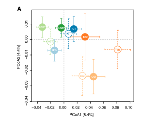

**Author(s)**: `r params$author`  
**Date**: `r Sys.Date()`  

# Academic Citation
If you use this code in your work or research, we kindly request that you cite our publication:

Xiaofan Lu, et al. (2025). FigureYa: A Standardized Visualization Framework for Enhancing Biomedical Data Interpretation and Research Efficiency. iMetaMed. https://doi.org/10.1002/imm3.70005

```{r setup, include=FALSE}
knitr::opts_chunk$set(echo = TRUE)
```

# 需求描述

把PCOA的散点图变成这样的：

# Requirement Description

Turn the scatter plot of PCOA like this:



出自<https://www.cell.com/cell-metabolism/fulltext/S1550-4131(20)30312-0?_returnURL=https%3A%2F%2Flinkinghub.elsevier.com%2Fretrieve%2Fpii%2FS1550413120303120%3Fshowall%3Dtrue>

from<https://www.cell.com/cell-metabolism/fulltext/S1550-4131(20)30312-0?_returnURL=https%3A%2F%2Flinkinghub.elsevier.com%2Fretrieve%2Fpii%2FS1550413120303120%3Fshowall%3Dtrue>

Figure 1. Shifts in the Gut Microbiota Composition in Parallel with Impaired Glycemic Status
(A) The **principle coordinate analysis** of Bray-Curtis dissimilarities obtained for the metagenomic species profiles in the discovery (closed circles) and validation (open circles) cohorts. **The circles and error bars indicate the mean and standard errors of the mean**. p values for the comparison of gut microbiota composition in the high-risk NGT (hrNGT), IFG, IGT, CGI, and T2D groups versus the low-risk NGT (lrNGT) group in the discovery cohort are 0.086, 0.069, 0.00070, 0.00010, and 0.00030, respectively, and in the IGT, CGI, and T2D groups versus the NGT group in the validation cohort are 0.009, 0.015, and 0.0001, respectively (PERMANOVA test with 10,000 permutations).

Principal coordinate analysis of the gut microbiota profiles in the discovery cohort showed that **significant shifts separated** the gut microbiota composition of the IGT, CGI, and T2D groups from that of the low-risk NGT group (p = 0.0007, 0.00010, and 0.00030, respectively; PERMANOVA test with 10,000 permutations), but no significant changes in composition were observed between the high- and low-risk NGT groups (p = 0.086), between the IFG and low-risk NGT group (p = 0.069), or between the CGI and T2D groups (p = 0.14; Figure 1A) ... A **similar pattern** was observed for the shifts in microbial composition **in the validation cohort** (Figures 1A and S3A).

# 应用场景

转录组的表达矩阵都有成千上万个基因，这类高维度数据很难直接进行可视化展示。

为了能够在二维平面上展示，就需要对其进行降维，PCA分析是目前最常用的降维工具。

实际应用时，想突出强调自己想要展示的特征，就需要变换展示方式：

- 样本量不太大、区分比较好，可以画经典的带圈（置信区间）、带箭头的PCA，画法可参考FigureYa38PCA；
- 大部分情况两个主成分就够了，有时你可能需要3个主成分才能区分开，就需要画3D PCA展示三个主成分，可参考FigureYa164PCA3D；
- 想看多次生物学重复的重复效果，需要用不同形状和颜色同时展示分组和重复，可参考FigureYa101PCA；
- 当分组（亚型）较多且每组样本量较大时，画散点图相互覆盖很难看清，就可以像例文这样计算相同组的均值以及标准误后画图。这样能够看出各亚型距离较远，两个队列的结果相近。这种眼睛看出来的差异有统计学意义吗？作者用PERMANOVA test来做组间差异显著性分析，做法见“附：PERMANOVA test (2-way adonis)”。

# Application Scenarios

The transcriptome expression matrix has thousands of genes, and such high-dimensional data is difficult to visualize directly.

In order to be able to display it on a two-dimensional plane, it is necessary to reduce the dimensionality, and PCA analysis is the most commonly used dimensionality reduction tool at present.

In practice, if you want to highlight the features you want to show, you need to change the way you display them:

- If the sample size is not too large and the discrimination is good, you can draw the classic PCA with circles (confidence intervals) and arrows, and refer to FigureYa38PCA for the drawing method;
- In most cases, two principal components are enough, sometimes you may need 3 principal components to distinguish them, you need to draw 3D PCA to show the three principal components, you can refer to FigureYa164PCA3D;
- If you want to see the repetition effect of multiple biological replicates, you need to display the grouping and repetition with different shapes and colors at the same time, please refer to FigureYa101PCA;
- When there are many groups (subtypes) and the sample size of each group is large, and it is difficult to see that the scatter plots cover each other, you can calculate the mean of the same group and the standard error after plotting as in the example. This allows for the distantness of the subtypes and the similar results of the two cohorts. Is there a statistically significant difference in what the eye sees? The authors used the PERMANOVA test to analyze the significance of differences between groups, as described in "Appendix: PERMANOVA test (2-way adonis)".

# 环境设置

# Environment settings

```{r}
source("install_dependencies.R")

library(vegan)        #用于计算距离矩阵 # Used to calculate the distance matrix
library(ape)          #做PCoA # Do PCoA
library(RColorBrewer) #配色 # Color matching
library(usedist)      #PERMANOVA test时处理距离矩阵 # Handle distance matrices when doing PERMANOVA test

Sys.setenv(LANGUAGE = "en") #显示英文报错信息 # error messages are displayed in English
options(stringsAsFactors = FALSE) #禁止chr转成factor # chr is not allowed to be converted to factor
```

# 输入文件

easy_input_expr.txt，表达矩阵。

easy_input_sinfo.txt，样本信息，第一列是sample ID，跟表达矩阵一致，第二列是第一种分组方式（这里是亚型），第三列是二种分组方式（这里是队列），这里对比两个队列。

# Input files

easy_input_expr.txt, the expression matrix.

easy_input_sinfo.txt, the sample information, the first column is the sample ID, which is consistent with the expression matrix, the second column is the first grouping method (here the subtype), and the third column is the two grouping methods (here the cohort), and here the two cohorts are compared.

```{r}
# 读取表达矩阵
# Read the expression matrix
expr <- read.table("easy_input_expr.txt",sep = "\t",row.names = 1,check.names = F,stringsAsFactors = F,header = T)

# 读取样本信息
# Read the sample information
sinfo <- read.table("easy_input_sinfo.txt",sep = "\t",row.names = 1,check.names = F,stringsAsFactors = F,header = T)
# 查看亚型
# View subtypes
table(sinfo$PAM50) # 这里有5个亚型
# 查看队列
# View the queue
table(sinfo$Cohort) # 2个队列
```

# PCA

```{r}
# 计算距离矩阵（非相似性矩阵）
# Calculating Distance Matrix (Non-Similarity Matrix)
brca.dist <- vegdist(t(expr), # 注意行为观测（样本），列为特征（基因）# Attention rows are Observations (Sample),columns as Trait (Gene)
                     method = "euclidean") # 原文使用Bray-Curtis dissimilarity matrix针对非负矩阵(method = "bray")，这里表达谱有负值，所以采用普通的欧氏距离 # The original text uses the Bray-Curtis dissimilarity matrix for the non-negative matrix (method = "bray"), where the expression spectrum has a negative value, so the ordinary Euclidean distance is used

# 计算principal coordinates
# Calculate principal coordinates
pc <- cmdscale(brca.dist, eig = FALSE)

# 计算percentage of variance explained
# Calculate the percentage of variance explained
eig <- pcoa(brca.dist)
pct1 <- round(eig$values$Relative_eig[1]/sum(eig$values$Relative_eig), digits=3)*100
pct2 <- round(eig$values$Relative_eig[2]/sum(eig$values$Relative_eig), digits=3)*100
xlab.text = paste("PCoA1 [", pct1, "%]", sep = "") # 生成x轴标签 # Generate x-axis labels
ylab.text = paste("PCoA2 [", pct2, "%]", sep = "") # 生成y轴标签 # Generate y-axis labels
```

# 开始画图

先产生基本图看一下效果

# Start drawing

Let's start by generating a base diagram and see the effect

```{r}
# 创建绘图信息
# Create drawing information
plotinfo <- cbind.data.frame(x = pc[,1],
                             y = pc[,2],
                             PAM50 = sinfo[rownames(pc),"PAM50"],
                             Cohort = sinfo[rownames(pc),"Cohort"],
                             Class = paste(sinfo[rownames(pc),"PAM50"], # 根据class信息确定颜色 # Determine the color based on the class information
                                           sinfo[rownames(pc),"Cohort"],
                                           sep = "_"))

# 为了使来自两个队列相同亚型的颜色相近，像这样修改因子，使得配对颜色可以对应上
# In order to make the colors from the same subtype of the two cohorts similar, modify the factor like this so that the paired colors can correspond
plotinfo$Class <- factor(plotinfo$Class, 
                         levels = c("Basal_TCGA","Basal_Yau",
                                    "Her2_TCGA","Her2_Yau",
                                    "LumA_TCGA","LumA_Yau",
                                    "LumB_TCGA","LumB_Yau",
                                    "Normal_TCGA","Normal_Yau"))

# 10个组（5个亚型*2个队列），定义10种颜色，采用配对颜色分别表示TCGA和Yau对应亚型
# 10 groups (5 subtypes * 2 cohorts), 10 colors are defined, and paired colors are used to represent the corresponding subtypes of TCGA and Yau
mycol <- brewer.pal(n = 10, name = "Paired") # Paired最多可设置12组颜色 # Paired can be set up to 12 groups of colors
plotinfo$color <- mycol[plotinfo$Class] # 匹配颜色 # Match the color

# 保存到文件
# Save to file
write.csv(plotinfo, "output_PCA1_PCA2.csv", quote = F)

# 产生基本图看一下效果，可以看到不同的亚型还是可以分开的
# Generate a basic diagram and look at the effect, you can see that the different subtypes can be separated
pdf("basic scatter plot.pdf", width = 5,height = 5)
par(bty="o", mgp = c(1.9,.33,0), mar=c(3.1,3.1,2.1,2.1)+.1, las=1, tcl=-.25)
plot(plotinfo$x,
     plotinfo$y,
     pch = 19,
     col = plotinfo$color,
     xlab = xlab.text,
     ylab = ylab.text)
invisible(dev.off())
```


可以看到不同的亚型还是可以分开的

**存在的问题**：由于样本太多，各个分组的散点叠在一起，不易辨认。

> 例文的解决方法：计算相同组的均值以及标准误后画图

It can be seen that the different subtypes can be separated

**Problem**: Due to the large number of samples, the scatters of each grouping are stacked on top of each other and are not easy to identify.

> Example workaround: Calculate the mean for the same group and plot after the standard error

```{r}
plotinfo2 <- NULL
for (i in unique(plotinfo$Class)) {
  tmp <- plotinfo[plotinfo$Class == i,] # 取出当前亚型当前来源下的数据 # Retrieve the data from the current source of the current subtype
  avgx <- mean(tmp$x) # 计算横坐标均值 # Calculate the mean abscissa value
  avgy <- mean(tmp$y) # 计算纵坐标均值 # Calculate the mean ordinate of the ordinate
  sdx <- sd(tmp$x) # 计算横坐标标准差 # Calculate the abscissa standard deviation
  sdy <- sd(tmp$y) # 计算纵坐标标准差 # Calculate the standard deviation of the ordinate
  
  plotinfo2 <- rbind.data.frame(plotinfo2,
                                data.frame(Class = i,
                                           color = unique(tmp$color), # 添加颜色 # Add color
                                           shape = ifelse(unique(tmp$Cohort) == "TCGA", # 如果是TCGA就实心圆 # If it is a TCGA, it is a solid circle
                                                          "closed","opened"), # 如果是Yau就为空心圆 # If it is Yau, it is a hollow circle
                                           label = switch(i, # 创建简易标签以显示在圆中 # Create a simple label to display in a circle
                                                          "Her2_TCGA" = "HT",
                                                          "Normal_TCGA" = "NT",
                                                          "Basal_TCGA" = "BT",
                                                          "LumA_TCGA" = "LaT",
                                                          "LumB_TCGA" = "LbT",
                                                          "Her2_Yau" = "HY",
                                                          "Normal_Yau" = "NY",
                                                          "Basal_Yau" = "BY",
                                                          "LumA_Yau" = "LaY",
                                                          "LumB_Yau" = "LbY"),
                                           avgx = avgx, # 添加圆的x位置 # Add the x-position of the circle
                                           avgy = avgy, # 添加圆的y位置 # Add the y-position of the circle
                                           sdx = sdx, # 添加圆的水平标准差 # Add the horizontal standard deviation of the circle
                                           sdy = sdy, # 添加圆的垂直标准差 # Add the vertical standard deviation of the circle
                                           stringsAsFactors = F),
                                stringsAsFactors = F)
}

# 保存到文件
# Save to file
write.csv(plotinfo2, "output_av_sd.csv", quote = F)

# 绘图
# Drawing
pdf("PoCA.pdf", width = 5,height = 5)
par(bty="o", mgp = c(1.9,.33,0), mar=c(3.1,3.1,2.1,2.1)+.1, las=1, tcl=-.25)
# 根据上面的基础图像，调整横轴纵轴的宽度，生成一张空白图像
# Based on the base image above, adjust the width of the horizontal and vertical axes to generate a blank image
plot(NULL,NULL,
     xlab = xlab.text,
     ylab = ylab.text,
     xlim = c(-25,25),
     ylim = c(-20,20))

# 先产生误差线，这样可以被后面的圆挡住
# Error bars are generated first, so that they can be blocked by the circles that follow
for (i in 1:nrow(plotinfo2)) {
  tmp <- plotinfo2[i,]
  
  # 产生横向误差线
  # Generate transverse error bars
  lines(x = c(tmp$avgx - tmp$sdx,
              tmp$avgx + tmp$sdx),
        y = c(tmp$avgy, tmp$avgy),
        lty = ifelse(tmp$shape == "closed",1,2), # 如果是closed就是实线，否则为虚线 # If it is closed, it is a solid line, otherwise it is a dotted line
        col = tmp$color,
        lwd = 2)
  
  # 产生横向误差线的封口线
  # A sealing line that produces transverse error bars
  lines(x = c(tmp$avgx - tmp$sdx,
              tmp$avgx - tmp$sdx),
        y = c(tmp$avgy - 0.5, # 宽度根据情况调整 # The width is adjusted according to the situation
              tmp$avgy + 0.5),
        col = tmp$color,
        lwd = 2)
  lines(x = c(tmp$avgx + tmp$sdx,
              tmp$avgx + tmp$sdx),
        y = c(tmp$avgy - 0.5,
              tmp$avgy + 0.5),
        col = tmp$color,
        lwd = 2)
  
  # 产生纵向误差线
  # Generate longitudinal error bars
  lines(x = c(tmp$avgx, tmp$avgx),
        y = c(tmp$avgy - tmp$sdy,
              tmp$avgy + tmp$sdy),
        lty = ifelse(tmp$shape == "closed",1,2),
        col = tmp$color,
        lwd = 2)
  
  # 产生纵向误差线的封口线
  # # Generate longitudinal error bars and sealing lines
  lines(x = c(tmp$avgx - 0.5,
              tmp$avgx + 0.5),
        y = c(tmp$avgy + tmp$sdy,
              tmp$avgy + tmp$sdy),
        col = tmp$color,
        lwd = 2)
  lines(x = c(tmp$avgx - 0.5,
              tmp$avgx + 0.5),
        y = c(tmp$avgy - tmp$sdy,
              tmp$avgy - tmp$sdy),
        col = tmp$color,
        lwd = 2)
}

# 后添加圆，以挡住误差线
# Add a circle to block the error bars
points(plotinfo2$avgx,
       plotinfo2$avgy,
       pch = ifelse(plotinfo2$shape == "closed",19,21), # 如果为closed就是实心圆，否则为空心圆 # If it is closed, it is a solid circle, otherwise it is a hollow circle
       bg = ifelse(plotinfo2$shape == "closed",plotinfo2$color,"white"), # 填充背景色，如果为closed就是为该颜色，否则为白色 # Fill the background color, if it is closed, it is this color, otherwise it is white
       col = plotinfo2$color, # 填充边框颜色 # Fill the border color
       lwd = 2, # 边框粗细 # Border thickness
       cex = 5) # 圆的大小 # The size of the circle

# 添加文本
# Add text
text(plotinfo2$avgx,
     plotinfo2$avgy,
     plotinfo2$label,
     col = ifelse(plotinfo2$shape == "closed","white",plotinfo2$color), # 如果是实心圆文字为白色，否则为对应颜色 # If it is a solid circle, the text is white, otherwise it is the corresponding color
     cex = 1.1)

# 关闭图像句柄
# Close the image handle
invisible(dev.off())
```


# 附：PERMANOVA test (2-way adonis)

各组之间的差异有统计学意义吗？作者用了PERMANOVA test。

这是生态学中常用的统计方法，样品组间差异显著性分析。非参数检验，不需要满足正态分布。

这里分别以两个队列（TCGA和Yau）的各亚组之间比较为例，展示其用法。具体到自己的数据，自己决定谁跟谁比。

# Attached: PERMANOVA test (2-way adonis)

Was there a statistically significant difference between the groups? the authors used the PERMANOVA test.

This is a commonly used statistical method in ecology to analyze the significance of differences between sample groups. Non-parametric test, which does not need to satisfy a normal distribution.

Here, a comparison between the subgroups of the two cohorts (TCGA and Yau) is used as an example to illustrate its usage. Be specific to your own data and decide who compares to whom.

```{r}
## TCGA队列数据
## TCGA queue data
tcga.sam <- rownames(sinfo[sinfo$Cohort == "TCGA",])
# 抽取tcga样本的距离矩阵
# Extract the distance matrix of TCGA samples
tcga.dist <- dist_subset(brca.dist,tcga.sam) 
# PERMANOVA test
brca.TCGA <- adonis2(tcga.dist~PAM50, data=sinfo[tcga.sam,], 
                     permutations = 1000, method="bray") 
# 打印结果
# Print the result
print(brca.TCGA) 
# 结果表明TCGA样本在PAM50（亚型，第一种分组方式）上确实存在很大差异
# 提取P value
# The results show that there is indeed a large difference in the PAM50 (subtype, the first grouping) of the TCGA samples
# Extract P value
brca.TCGA$`Pr(>F)`

## Yau队列数据，也是同样的道理
## The same goes for Yau queue data
yau.sam <- rownames(sinfo[sinfo$Cohort == "Yau",])
yau.dist <- dist_subset(brca.dist,yau.sam) 
brca.Yau <- adonis2(yau.dist~PAM50, data=sinfo[yau.sam,], 
                    permutations = 1000, method="bray")
print(brca.Yau)
```

# Session Info

```{r}
sessionInfo()
```