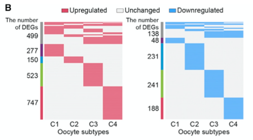

**Author(s)**: `r params$author`  
**Date**: `r Sys.Date()`  

# Academic Citation
If you use this code in your work or research, we kindly request that you cite our publication:

Xiaofan Lu, et al. (2025). FigureYa: A Standardized Visualization Framework for Enhancing Biomedical Data Interpretation and Research Efficiency. iMetaMed. https://doi.org/10.1002/imm3.70005

```{r setup, include=FALSE}
knitr::opts_chunk$set(echo = TRUE)
```

# 需求描述

这种图把富集的上调和下调的基因展示一下，常规用柱状图或点状图，太腻味了，热图要高大上一些，几乎用于所有差异分析的构图需求。

跟FigureYa114ternaryCluster的图相似，这次是单细胞的，改动较大。

# Requirement Description

This kind of diagram shows the up-regulated and down-regulated genes of enrichment, and the conventional histogram or dot plot is too conventional, and the heat map is more advanced, which can be used for all the compositional needs of differential analysis.

Similar to the figure of FigureYa114ternaryCluster, this time it is single-celled, and the changes are large.



出自<https://linkinghub.elsevier.com/retrieve/pii/S0092867420300568>
from<https://linkinghub.elsevier.com/retrieve/pii/S0092867420300568>

Figure 4. Downregulation of Antioxidant Genes in Aged Oocytes of Early-Stage Follicles
(B) Heatmaps showing the distribution of DEGs between old and young monkeys in each oocyte subtype. The gray bars on the left of the heatmaps denote DEGs shared by at least two oocyte subtypes and the others are oocyte subtype-specific DEGs.

# 应用场景

与上述例文（例文1）出自同一实验室的[例文2](<https://www.cell.com/developmental-cell/pdf/S1534-5807(20)30877-7.pdf)也出现了很多同类型的Figure 。推荐对照着阅读，有助于学习思路、理解图的用法。

- 单细胞RNA-seq的表达谱和基因功能富集分析结果展示。例文1的Figure 1H和例文1的Figure 1G，画法可参考FigureYa206scHeatmap。
- 主成分分析。
  - 例文1的Figure 3A和B从PCA结果就能看出基因表达模式跟细胞类型的关系，可参考FigureYa222PCAgene。
  - 例文1的Figure S6H用颜色和形状展示两个层面的分组信息，可参考FigureYa101PCA。
  - 例文2的Figure 2D，用3D图形展示3个主成分，可参考FigureYa164PCA3D
- 各细胞类型中富集的上下调基因。例文1的Figure 4B、Figure 5B，例文2的Figure 2A和B、Figure 4C。本文档带你实现。
- 对比展示两组细胞里上下调核心转录因子的调控关系。例文2的Figure 5I，可参考FigureYa199crosslink。

# Application Scenarios

Many figures of the same type appear in [Example 2] (<https://www.cell.com/developmental-cell/pdf/S1534-5807(20)30877-7.pdf) from the same laboratory as the above example (Example 1). It is recommended to read it in comparison to help you learn ideas and understand the use of diagrams.

- Single-cell RNA-seq expression profile and gene function enrichment analysis results are displayed. Figure 1H in Example 1 and Figure 1G in Example 1 can be drawn by FigureYa206scHeatmap.
- Principal component analysis.
- Figure 3A and B in Example 1 can see the relationship between gene expression patterns and cell type from the PCA results, please refer to FigureYa222PCAgene.
- Figure S6H in Example 1 shows the grouping information at two levels with color and shape, see Figure Ya101PCA.
- Figure 2D in Example 2 shows the three principal components in 3D, see FigureYa164PCA3D
- Up- and down-regulated genes enriched in each cell type. Figure 4B and Figure 5B in Example 1, Figure 2A and B and Figure 4C in Example 2. This document takes you through the implementation.
- Compare and contrast the regulatory relationship between the two groups of cells to downregulate the core transcription factors. For Figure 5I in Example 2, see FigureYa199crosslink.

# 环境设置

# Environment settings

```{r}
source("install_dependencies.R")

library(Seurat)
library(dplyr)
library(pheatmap)
Sys.setenv(LANGUAGE = "en") #显示英文报错信息 # error messages are displayed in English
options(stringsAsFactors = FALSE) #禁止chr转成factor # chr is not allowed to be converted to factor
```

# 输入文件

sc.seurat.Rdata，单细胞RNA-seq预处理获得的文件。出自FigureYa206scHeatmap

怎样获得这个文件？拖到文末看“附：单细胞RNA-seq数据预处理”

# Input files

sc.seurat.Rdata, file obtained from single-cell RNA-seq pretreatment from FigureYa206scHeatmap

How do I get this document? Drag to the end of the article to see "Attached: Single-cell RNA-seq data preprocessing"

```{r}
(load("sc.seurat.Rdata"))

## 提取oocytes subtype的细胞的数据
# 从文章附件获得oocytes subtype的细胞ID（191 young oocytes, 227 old oocytes）
# 用到第一列cell ID（用于提取oocytes subtype的细胞）
## Extract the data of oocytes subtype cells
# Obtain the cell ID of oocytes subtype from the attachment (191 young oocytes, 227 old oocytes)
# Use the first column of cell IDs (for extracting oocytes subtype cells)
meta_oo <- readxl::read_excel(path = "1-s2.0-S0092867420300568-mmc2.xlsx", sheet = 2)
sc_oo <- sc[,meta_oo$cell] # only 414 (not 418?! ) cells in the metadata 

## 自己的数据，就不涉及取子集，直接用sc就好，用下面这行代替上面两行：
## Your own data, it doesn't involve taking subsets, just use sc, and use the following line instead of the above two lines:
# sc_oo <- sc
```

cluster信息，即图中的4个sybtype C1-C4，这里直接用文章附件`1-s2.0-S0092867420300568-mmc2.xlsx`文件第二列，包含原文获得的细胞所在的cluster信息。
The cluster information, that is, the 4 subtypes C1-C4 in the figure, is directly used in the second column of the '1-s2.0-S0092867420300568-mmc2.xlsx' file attached to the article, which contains the cluster information of the cells obtained in the original text.

```{r}
sc_oo$seurat_clusters <- meta_oo$cluster[match(colnames(sc_oo), meta_oo$cell)]
## 自己的数据做聚类，可参考文末看“Seurat自带的无监督聚类”，替换掉上面这行即可
## For clustering of your own data, you can refer to "Seurat's own unsupervised clustering" at the end of the article, and replace the above line
```

# 差异基因筛选
# Differential gene screening

To identify aging-associated DEGs between old and young individuals in each specific cell type, the function FindMarkers in the R package Seurat was used based on t test. Only genes with an average **log2-transformed difference greater than 0.5**, a **P value less than 0.05** and a **percentage of expressed cells greater than 70%** were considered as aging-associated DEGs. 

```{r}
# Identify DEGs between old and young
Idents(sc_oo) <- "aging"
table(sc_oo@meta.data$aging)

lapply(paste0("C", 1:4), function(x) {
  degs <- FindAllMarkers(sc_oo[,sc_oo$seurat_clusters == x],
                         logfc.threshold = 0.5, test.use = "t",
                         min.pct = 0.7,
                         only.pos = T) %>% # Only return positive markers
    filter(p_val < 0.05)
  degs$subtype = x
  return(degs)
}) %>% do.call(rbind, .) -> degData

head(degData)

# 输出差异表达分析结果
# Output the results of differential expression analysis
write.csv(degData, file = "output_degData.csv")
```

# 开始画图

先整理一下

# Start drawing

Let's sort it out first

```{r}
heatData <- reshape2::dcast(degData[,c("subtype", "gene", "cluster")], 
                           gene ~ subtype)
heatData %<>%
  mutate(count = rowSums(is.na(heatData))) %>%
  arrange(count,C1, C2, C3, C4)

heatAnnot <- data.frame(number = 
                          case_when(
                            heatData$count < 3 ~ "other",
                            !is.na(heatData$C1) ~ "C1",
                            !is.na(heatData$C2) ~ "C2",
                            !is.na(heatData$C3) ~ "C3",
                            !is.na(heatData$C4) ~ "C4",
                          ))
```

## Up-regulated

```{r}
phData <- 0 + (heatData[rowSums(heatData[2:5] == "O", na.rm = T) > 0 & 
                     rowSums(heatData[2:5] == "Y", na.rm = T) == 0, 
                   2:5] == "O")
phData[is.na(phData)] <- 0
dim(phData)

pheatmap(phData,
         cellwidth = 40, 
         cellheight = .1,
         border_color = NA,
         cluster_rows = F, 
         cluster_cols = F, 
         show_rownames = F, 
         color = c("grey97", "lightcoral"),
         annotation_row = heatAnnot, 
         annotation_colors = list(number = setNames(c("darkblue", "steelblue", "lightgreen", "red3", "grey"),
                                                    c(paste0("C", 1:4), "other"))),
         filename = "scRankHeatmp_up.pdf")
```


## Down-regulated

```{r}
phData <- 0 + (heatData[rowSums(heatData[2:5] == "Y", na.rm = T) > 0 & 
                     rowSums(heatData[2:5] == "O", na.rm = T) == 0, 
                   2:5] == "Y")
phData[is.na(phData)] <- 0
dim(phData)

pheatmap(phData,
         cellwidth = 40, 
         cellheight = .416, #为了让两个热图一样高，根据自己的基因数量调整
         border_color = NA,
         cluster_rows = F, cluster_cols = F, 
         show_rownames = F, 
         color = c("grey97", "cornflowerblue"),
         annotation_row = heatAnnot, 
         annotation_colors = list(number = setNames(c("darkblue", "steelblue", "lightgreen", "red3", "grey"), 
                                                    c(paste0("C", 1:4), "other"))),
         filename = "scRankHeatmp_down.pdf")
```


# 附：单细胞RNA-seq数据预处理

以下代码出自`FigureYa206scHeatmap`，会输出`sc.seurat.Rdata`，可作为以上代码的输入文件。

# Attached: Single-cell RNA-seq data preprocessing

The following code is from 'FigureYa206scHeatmap' and outputs 'sc.seurat.Rdata', which can be used as an input file for the above code.

## 下载单细胞RNA-seq数据

1) UMI count，从NCBI[GSE130664](https://www.ncbi.nlm.nih.gov/geo/query/acc.cgi?acc=GSE130664)下载：`GSE130664_merge_UMI_count.txt.gz`文件。

## Download single-cell RNA-seq data

1) UMI count, download from NCBI[GSE130664](https://www.ncbi.nlm.nih.gov/geo/query/acc.cgi?acc=GSE130664): 'GSE130664_merge_UMI_count.txt.gz' file.


```{r download, eval=FALSE}
download.file("https://www.ncbi.nlm.nih.gov/geo/download/?acc=GSE130664&format=file&file=GSE130664%5Fmerge%5FUMI%5Fcount%2Etxt%2Egz", 
              destfile = "GSE130664_merge_UMI_count.txt.gz")
```

2) metadata，从[例文的](https://doi.org/10.1016/j.cell.2020.01.009)Supplementary Tables获得：`1-s2.0-S0092867420300568-mmc1.xlsx`

2) metadata, obtained from (https://doi.org/10.1016/j.cell.2020.01.009) Supplementary Tables in [example]: '1-s2.0-S0092867420300568-mmc1.xlsx'

## Read data

```{r preprocessing, eval=FALSE}
umi <- read.table(file = gzfile("GSE130664_merge_UMI_count.txt.gz"), header = T, row.names = 1, sep = "\t")
qc <- readxl::read_excel("1-s2.0-S0092867420300568-mmc1.xlsx", sheet = 2)
meta <- readxl::read_excel("1-s2.0-S0092867420300568-mmc1.xlsx", 3) %>% 
  column_to_rownames("cell")
```

## 数据预处理
## Data preprocessing

See Methods:  
QUANTIFICATION AND STATISTICAL ANALYSIS -> Single-Cell RNA-Seq Data Processing

```{r, eval=FALSE}
# QC of Cells
cells <- qc %>% 
  filter(`Mapping rate` >= 0.2 &
           `Gene number` >= 700 &
           UMI >= 3000) %>%
  pull(Rename)

# seurat object
sc <- CreateSeuratObject(counts = umi[,cells], meta.data = meta)

# expression transformation
sc@assays$RNA@data <- sc@assays$RNA@counts %>% 
  apply(2, function(x){
    log2(10^5*x/sum(x)+1)
    })

# remove other cells
sc <- sc[,sc$cluster != "other"]

# 给cluster改名
# Rename the cluster
sc$cluster_short <- factor(
  plyr::mapvalues(sc$cluster, 
                  c("Oocyte", "Natural killer T cell", "Macrophage",
                    "Granulosa cell", "Endothelial cell", 
                    "Smooth muscle cell", "Stromal cell"),
                  c("OO", "NKT", "M", "GC", "EC", "SMC", "SC")),
  levels = c("OO", "NKT", "M", "GC", "EC", "SMC", "SC"))

# 给cluster自定义颜色
# Customize the color for the cluster
cluster_colors <- setNames(brewer.pal(7, "Set1"), levels(sc$cluster_short))

# 保存一下，便于停下来接着跑
# Save it so you can stop and run
save(sc, cluster_colors, file = "sc.seurat.Rdata")

# 还可以把表达矩阵输出到文件
# It is also possible to output the expression matrix to a file
#write.csv(sc@assays$RNA@data, "easy_input_expr.csv", quote = F)
```

## Seurat自带的无监督聚类

以下代码出自`FigureYa222PCAgene`，获得cluster。

## Seurat's built-in unsupervised clustering

The following code is from 'FigureYa222PCAgene', which gets the cluster.

```{r eval=FALSE}
library(magrittr)

sc_oo_mnn <- batchelor::mnnCorrect(# mmnCorrect is no longer in scran 
  as.SingleCellExperiment(sc_oo),
  batch = sc_oo$individual,
  k = 4, 
  sigma = 0.1, cos.norm.in = T, cos.norm.out = T, 
  var.adj = T
)
prData <- SummarizedExperiment::assay(sc_oo_mnn)

# HVGs
sc_oo %<>% FindVariableFeatures(selection.method = "mvp", mean.cutoff = c(1,8))
VariableFeatures(sc_oo) %>% length()

# unsupervised clustering based on mnn matrix
sc_oo %<>% ScaleData 
sc_oo@assays$RNA@scale.data <- prData[rownames(sc_oo@assays$RNA@scale.data), colnames(sc_oo@assays$RNA@scale.data)]
sc_oo %<>% RunPCA
ElbowPlot(sc_oo)

sc_oo %<>% FindNeighbors(dims = 1:15) %>% FindClusters(resolution = 0.6)

# 把seurat_clusters的名字0-3改为C1-C4
# Change the name of the seurat_clusters 0-3 to C1-C4
sc_oo@meta.data$seurat_clusters <- factor(sc_oo@meta.data$seurat_clusters, 
                                          levels = c("0", "1", "2", "3"), 
                                          labels = c("C1", "C2", "C3", "C4"))
sc_oo@meta.data$seurat_clusters
```

# Session Info

```{r}
sessionInfo()
```