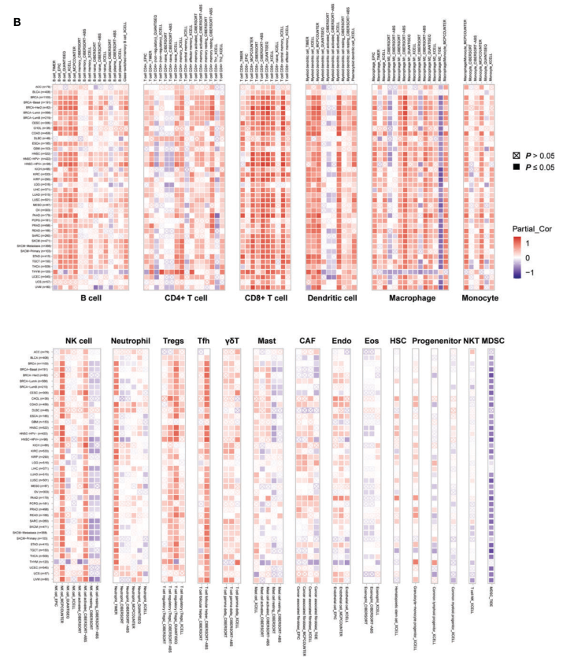
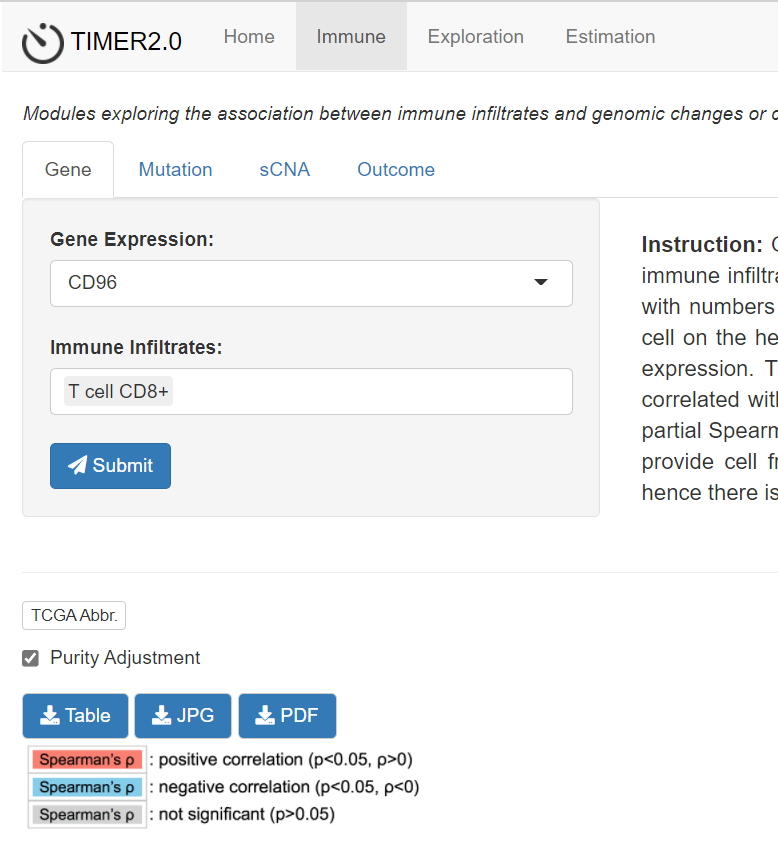
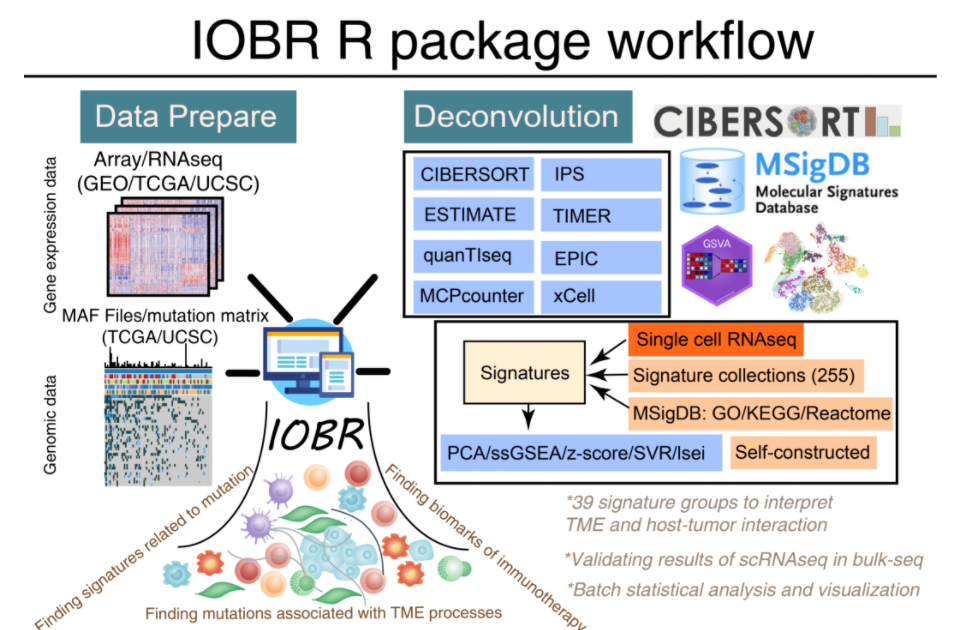

**Author(s)**: `r params$author`  
**Date**: `r Sys.Date()`  

# Academic Citation
If you use this code in your work or research, we kindly request that you cite our publication:

Xiaofan Lu, et al. (2025). FigureYa: A Standardized Visualization Framework for Enhancing Biomedical Data Interpretation and Research Efficiency. iMetaMed. https://doi.org/10.1002/imm3.70005

```{r setup, include=FALSE}
knitr::opts_chunk$set(echo = TRUE)
```

# 需求描述

实现利用USCS上的pan-cancer数据分别通过EPIC和Cibersort算法，计算各个肿瘤的免疫细胞浸润信息，并输出结果，同时计算某个指定基因在各个肿瘤中分别与免疫细胞的相关性，并分别输出相关性热图和相关性信息的excel表

例文只使用了一种方法，我想用多种方法来证明相关性

# Requirement Description

Use the pan-cancer data on USCS to calculate the immune cell infiltration information of each tumor through the EPIC and Cibersort algorithms, and output the results, and at the same time calculate the correlation between a specified gene and immune cells in each tumor, and output the correlation heat map and correlation information in the excel sheet.

The example uses only one method, and I want to use multiple methods to prove correlation



出自<https://www.frontiersin.org/articles/10.3389/fonc.2021.634617/full>
from<https://www.frontiersin.org/articles/10.3389/fonc.2021.634617/full>

FIGURE 7 | Associations of CD96 expression to tumor purity and immune infiltration.
(B) The correlations of CD96 expression and immune infiltration in cancers.

Besides, we employed **TIMER2.0** to exhibit the landscape of CD96 correlating with various immune infiltrates in human cancers (Figure 7B). 
# 应用场景

分别用TIMER、EPIC、Cibersort计算各个肿瘤的免疫细胞浸润信息。

热图可用于展示目的基因在泛癌中与免疫浸润之间的关系。

下面分别展示TIMER、EPIC、Cibersort这三种计算方法并画图（例文用的是TIMER2.0）。三种方法的细胞不同，可相互参照，结合研究兴趣，讨论自己的结果。

# Application Scenarios

TIMER, EPIC, and Cibersort were used to calculate the immune cell infiltration information of each tumor.

Heatmaps can be used to demonstrate the relationship between genes of interest and immune invasion in pan-cancer.

The following three calculation methods are shown and plotted respectively (TIMER 2.0 is used in the example). The cells of the three methods are different, and they can be cross-referenced, combined with research interests, and discuss their own results.

# 环境设置

# Environment settings

```{r}
source("install_dependencies.R")

library(ggplot2)
library(ggpubr)
library(patchwork)
library(showtext)
library(EPIC)
library(IOBR)

showtext.auto(enable = TRUE)
font.add('arial', 'arial.ttf') #设置字体，windows用户  # Set fonts for Windows users

Sys.setenv(LANGUAGE = "en") #显示英文报错信息 #error messages are displayed in English
options(stringsAsFactors = FALSE) #禁止chr转成factor # chr is not allowed to be converted to factor
```

# TIMER

## 从TIMER下载数据

Methods: Tumor IMmune Estimation Resource 2.0 (TIMER2.0; http://timer.cistrome.org/) web server is a comprehensive resource forsystematical analysis of immune infiltrates across diverse cancertypes. At first, we used it to study the differential expressionof CD96 between tumor and adjacent normal tissues across all TCGA cohorts.

We then explored the association between CD96 expression and immune infiltration based on several immune deconvolution algorithms

进入 [TIMER2.0](http://timer.cistrome.org/) 或者 [TIMER2.0 (comp-genomics.org)](http://timer.comp-genomics.org/)，按一下步骤获得分析结果文件：

- 点击Immune
- 在`Gene Expression`里选择`CD96`
- 在`Immune Infiltrates`里每次选一种免疫细胞
- 点击`Submit`
- 点击`Table`下载分析结果
- 重复以上操作，直到获得所有免疫细胞的分析结果，放到data文件夹下。（虽然一次可以选择多个细胞，但网站对数量有限制，所以我们还是一次只选一种细胞。 !!!Querying 115 interested features exceeds the limited amount (n=20). Please reduce the number. ）

# TIMER

## Download data from TIMER

Methods: Tumor IMmune Estimation Resource 2.0 (TIMER2.0; http://timer.cistrome.org/) web server is a comprehensive resource forsystematical analysis of immune infiltrates across diverse cancertypes. At first, we used it to study the differential expressionof CD96 between tumor and adjacent normal tissues across all TCGA cohorts.

We then explored the association between CD96 expression and immune infiltration based on several immune deconvolution algorithms

Go to [TIMER2.0](http://timer.cistrome.org/) or [TIMER2.0 (comp-genomics.org)](http://timer.comp-genomics.org/) and follow the steps below to obtain the analysis result file:

- Click Immune
- Select 'CD96' in 'Gene Expression'
- Select one type of immune cell at a time in 'Immune Infiltrates'
- Click 'Submit'
- Click 'Table' to download the analysis results
- Repeat the above until you have the results of the analysis of all immune cells and put them in the data folder. (Although you can select more than one cell at a time, the website has a limit on the number, so we still only select one cell at a time.) !! Querying 115 interested features exceeds the limited amount (n=20). Please reduce the number. ）



## 批量读入TIMER结果
## Batch reading TIMER results

data文件夹里除了从TIMER下载的Table表以外，不要放其他任何文件。
Do not put any files in the data folder except for the table table downloaded from the TIMER.

```{r}
setwd("./data")
file <- dir()
data <- list()
for (i in (1:length(file))) {
  data[[i]] <- read.csv(file[i],header = T)
}
```

## 画图前的数据预处理

TIMER的免疫细胞分类细致，有19类，例文给每一类画成一个小热图，排成了两行，因此画图时麻烦些。

## Pre-processing of data before drawing

There are 19 types of immune cells in TIMER, and each type is drawn into a small heat map arranged in two rows, so it is more troublesome to draw the picture.

```{r}
# y轴排列顺序
# Y-axis sort order
name <- c("UVM (n=80)", "UCS (n=57)", "UCEC (n=545)", "THYM (n=120)", 
        "THCA (n=509)", "TGCT (n=150)", "STAD (n=415)", "SKCM (n=471)", 
        "SKCM-Primary (n=103)", "SKCM-Metastasis (n=368)", "SARC (n=260)", 
        "READ (n=166)", "PRAD (n=498)", "PCPG (n=181)", "PAAD (n=179)", 
        "OV (n=303)", "MESO (n=87)", "LUSC (n=501)", "LUAD (n=515)", 
        "LIHC (n=371)", "LGG (n=516)", "KIRP (n=290)", "KIRC (n=533)", 
        "KICH (n=66)", "HNSC (n=522)", "HNSC-HPV +  (n=98)", "HNSC-HPV- (n=422)", 
        "GBM (n=153)", "ESCA (n=185)", "DLBC (n=48)", "COAD (n=458)", 
        "CHOL (n=36)", "CESC (n=306)", "BRCA (n=1100)", "BRCA-LumB (n=219)", 
        "BRCA-LumA (n=568)", "BRCA-Her2 (n=82)", "BRCA-Basal (n=191)", 
        "BLCA (n=408)", "ACC (n=79)")

# 定义函数画heatmap
# Define the function to draw a heatmap
plot_tme <- function(x){
  x$pvalue = ifelse(x$adj.p >= 0.05, "p≥0.05", "p<0.05")
  x$cancer = factor(x$cancer, levels = name) 
  
  ggplot(x, aes(infiltrates, cancer, 
                shape = pvalue, 
                color = rho)) +
    geom_point(size = 3) + 
    scale_shape_manual(values = c(15, 7)) + 
    scale_color_gradient2(low = "#2b8cbe",mid = "white",high = "#e41a1c") + 
    #scale_x_discrete(position = "top") + 
    theme_bw() + 
    theme(axis.title.y = element_blank(),
          axis.title.x = element_blank(),
          axis.text.x = element_text(angle = 90,hjust = 0,vjust = 0),
          axis.text.x.bottom = element_text(family = "arial"))
}

# 画出19个热图
# Draw 19 heat maps
dd <- lapply(data, plot_tme)
#dd[[1]] # 可以这样查看每一个heatmap # You can view each heatmap like this
```

## 画图
## Drawing

```{r fig.width=10, fig.height=7}
# 设置和下半部分分割的位置
# Set the position of the division with the lower half
breakpoint <- 8 # 上面画8个热图，下面画19-8=11个 # Draw 8 heat maps on the top and 19-8=11 on the bottom

## 先画上半部分
# 画第1个热图（第1个热图左侧带label，其余不带）
## Draw the top half first
# Draw the first heatmap (the left side of the first heatmap has a label, and the rest is not)
up <- dd[[1]] + 
  scale_x_discrete(position = "top") + 
  guides(color=FALSE) + guides(shape=FALSE) # 不画图例 # No legend

# 加上第2-8个热图
# Plus the 2nd-8th heatmap
for (i in 2:(breakpoint)) {
  up <- up + dd[[i]] + 
    scale_x_discrete(position = "top") + 
    theme(axis.text.y = element_blank()) + # 不画y轴label # Don't draw the y-axis label
    guides(color = FALSE) + guides(shape = FALSE) # 不画图例 # No legend
}

# 按照x轴来调整图片组合宽度
# Adjust the width of the image combination according to the x-axis
width_up <- NULL
for (i in 1:breakpoint) {
  width_up <- c(width_up,length(unique(data[[i]]$infiltrates)))
}

# 画完上半部分
# Finish the first half
up + plot_layout(guides = 'collect',widths = width_up)


## 画下半部分
# 画下面第1个
## Draw the bottom half
# Draw the first one below
down <- dd[[breakpoint + 1]] + scale_x_discrete(position = "bottom") + 
  guides(color = FALSE) + guides(shape = FALSE) + # 不画图例
  theme(axis.text.x = element_text(angle = 90,hjust = 1,vjust = 0))

# 画第10-18个热图
# Draw the 10th-18th heatmap
for (i in (breakpoint + 2):(length(file)-1)) {
  down <- down + dd[[i]] + scale_x_discrete(position = "bottom") + 
    theme(axis.text.y = element_blank(),
          axis.text.x = element_text(angle = 90,hjust = 1,vjust = 0)) + 
    guides(color=FALSE) + guides(shape=FALSE) # 不画图例
}

# 画第19个，画图例
# Draw the 19th one, draw a legend
down <- down + dd[[length(file)]] + scale_x_discrete(position = "bottom") + 
  theme(axis.text.y = element_blank(),
        axis.text.x = element_text(angle = 90,hjust = 1,vjust = 0))

down <- down & scale_fill_continuous(limits = c(-1, 1))

# 按照x轴来调整图片组合宽度
# Adjust the width of the image combination according to the x-axis
width_down <- NULL
for (i in (breakpoint + 1):length(file)) {
  width_down <- c(width_down,length(unique(data[[i]]$infiltrates)))
}

# 画完下半部分
# Finish the bottom half
down + plot_layout(guides = 'collect',widths = width_down)
```


```{r fig.width=10, fig.height=15}
## 上下组合
## Combination of top and bottom
(up + plot_layout(guides = 'collect',widths = width_up))-(down + plot_layout(guides = 'collect',widths = width_down)) + plot_layout(nrow = 2)

# 保存到文件
# Save to file
ggsave("TIMER.pdf", 
       height=15, width=10)
# 输出的PDF文件是矢量图，可以用illustrator等矢量图编辑器打开，进一步调整图形、文字
# The output PDF file is a vector image, which can be opened with a vector editor such as illustrator to further adjust the graphics and text
```

# EPIC

免疫浸润算法强烈推荐IOBR（[GitHub - IOBR/IOBR: IOBR is an R package to perform comprehensive analysis of tumor microenvironment and signatures for immuno-oncology.](https://github.com/IOBR/IOBR)）

# EPIC

IOBR is highly recommended for immunoinfiltration algorithms （[GitHub - IOBR/IOBR: IOBR is an R package to perform comprehensive analysis of tumor microenvironment and signatures for immuno-oncology.](https://github.com/IOBR/IOBR)）




## 输入数据

pancancer_mRNA_exprSet.Rdata，表达矩阵和癌症名type

expr_pancancer.Rda，表达矩阵，取自pancancer_mRNA_exprSet.Rdata。

数据来源于UCSC xena Pan-cancer，从数据下载到获得以上两个文件的过程见`TCGA_pan.R`（位于当前文件夹）

## Enter data

pancancer_mRNA_exprSet.Rdata, expression matrix and cancer name type

expr_pancancer. Rda, Expression Matrix, taken from pancancer_mRNA_exprSet.Rdata.

The data is from UCSC xena Pan-cancer, and the process from data download to obtaining the above two files is described in 'TCGA_pan. R' (located in the current folder).

```{r}
# 载入数据
# Load data
(load("expr_pancancer.Rda"))
expr[1:5,1:5]
dim(expr)

(load("pancancer_mRNA_exprSet.Rdata")) 
mRNA_exprSet[1:5,1:5]
dim(mRNA_exprSet)
```

## 运行EPIC
## Run EPIC

```{r}
#epic <- deconvo_tme(eset = expr, 
#                    method = "epic", 
#                    arrays = FALSE)
# save(epic,file = "epic.Rda")

load("epic.Rda")
dim(epic)
#epic[1:5,]
epic$ID <- gsub("\\.","-",epic$ID)
data <- merge(epic, 
              mRNA_exprSet, 
              by.x = "ID", by.y = "sample")
#data[1:5,]
dim(data)
```

## 计算相关性
## Calculate relevance

```{r}
# 自定义计算相关性的函数
# Customize the function to calculate the relevance
corr <- function(gene){
  y <- as.numeric(data[, gene])
  colnames <- colnames(epic[, 2:9])
  do.call(rbind,lapply(colnames, function(x){
    dd <- cor.test(as.numeric(data[, x]), y, type = "spearman")
    data.frame(gene = gene, immune_cells = x,
               cor = dd$estimate, p.value = dd$p.value )
  }))
}
# 计算相关性
# Calculate relevance
corr("CD96")

gene <- "CD96"
cancertype <- unique(data$type)
res <- data.frame(type=NULL,
                  gene=NULL,
                  immune_cells=NULL,
                  cor=NULL,
                  p.value=NULL)

for (i in cancertype){
  data2 <- data %>% filter(type==i)
  y <- as.numeric(data2[,gene])
  colnames <- colnames(epic[,2:9])
  dd2 <- do.call(rbind,lapply(colnames, function(x){
    dd <- cor.test(as.numeric(data2[,x]),y,type = "spearman")
    data.frame(type = i,
               gene = gene,
               immune_cells = x,
               cor = dd$estimate,
               p.value = dd$p.value )
             }))
  res <- rbind(res,dd2)
}
res$pvalue <- ifelse(res$p.value >= 0.05,"p≥0.05","p<0.05")
head(res)
write.csv(res,"output_res.EPIC.csv")
```

## 画图

EPIC只有8种细胞，画在一起就可以了。

保持跟上面TIMER组合图的风格一致。

## Drawing

EPIC has only 8 types of cells, and it is enough to draw them together.

Keep the same style as the TIMER combo chart above.

```{r fig.width=4, fig.height=7}
ggplot(res, aes(immune_cells,
               type,
               shape = pvalue,
               color = cor)) +  
geom_point(size = 3) + 
scale_shape_manual(values = c(15,7)) + 
scale_color_gradient2(low = "#2b8cbe",
                      mid = "white",
                     high = "#e41a1c",
                   limits = c(-1, 1)) + 
theme_bw() + 
theme(axis.title.y = element_blank(),
      axis.title.x = element_blank(),
      axis.text.x = element_text(angle = 90,
                                 hjust = 1,
                                 vjust = 0,
                                family = "arial"))

ggsave("EPIC.pdf", width = 4, height = 7)
```

# Cibersort

输入数据同“EPIC”的输入数据

## 运行Cibersort

# Cibersort

The input data is the same as the input data of "EPIC".

## Run Cibersort

```{r}
# 用IOBR包计算
# Calculated using IOBR packets
#cibersort <- deconvo_tme(eset = expr, 
#                      method = "cibersort", 
#                      arrays = FALSE, 
#                      perm = 200 )

# pancancer的免疫细胞浸润信息可以用IOBR计算，也可以直接导入官方数据 [CIBERSORT immune fractions](https://gdc.cancer.gov/about-data/publications/panimmune)
# 这里直接导入官方数据
# The immune cell infiltration information of pancancer can be calculated using IOBR or directly imported into the official data [CIBERSORT immune fractions](https://gdc.cancer.gov/about-data/publications/panimmune)
# Import official data directly here
cibersort <- read.table("TCGA.Kallisto.fullIDs.cibersort.relative.tsv", header = T)

cibersort$SampleID <- substring(cibersort$SampleID,1,15)
cibersort$SampleID <- gsub("\\.","-",cibersort$SampleID)

cibersort <- merge(cibersort,
                   mRNA_exprSet,
                   by.x = "SampleID",
                   by.y = "sample")
```

## 计算相关性
## Calculate relevance

```{r}
gene <- "CD96"
res <- data.frame(type=NULL,
                  gene=NULL,
                  immune_cells=NULL,
                  cor=NULL,
                  p.value=NULL)

for (i in cancertype){
  data2 <- cibersort %>% filter(type==i)
  y <- as.numeric(data2[,gene])
  colnames <- colnames(cibersort[,3:24])
  dd2 <- do.call(rbind,lapply(colnames, function(x){
    dd <- cor.test(as.numeric(data2[,x]),y,type = "spearman")
    data.frame(type = i,
               gene = gene,
               immune_cells = x,
               cor = dd$estimate,
               p.value = dd$p.value )
  }))
  res <- rbind(res,dd2)
}

res$pvalue <- ifelse(res$p.value >= 0.05,"p≥0.05","p<0.05")
head(res)
write.csv(res, "output_res.Cibersort.csv")
```

## 画图

Cibersort有22种细胞，也可以画在一起。并保持跟以上两种方法的画图风格一致。

## Drawing

Cibersort has 22 types of cells, which can also be drawn together. And keep the drawing style consistent with the above two methods.

```{r}
ggplot(res, aes(immune_cells,
            type,
            shape = pvalue,
            color = cor)) +  
  geom_point(size = 3) + 
  scale_shape_manual(values = c(15,7)) + 
  scale_color_gradient2(limits = c(-1, 1),
                        low = "#2b8cbe",
                        mid = "white",
                        high = "#e41a1c") + 
  theme_bw() + 
  theme(axis.title.y= element_blank(),
        axis.title.x = element_blank(),
        axis.text.x = element_text(angle = 90,
                                   hjust = 1,
                                   vjust = 0,
                                   family = "arial"))
ggsave("Cibersort.pdf", width = 5, height = 7)
```

# Session Info

```{r}
sessionInfo()
```