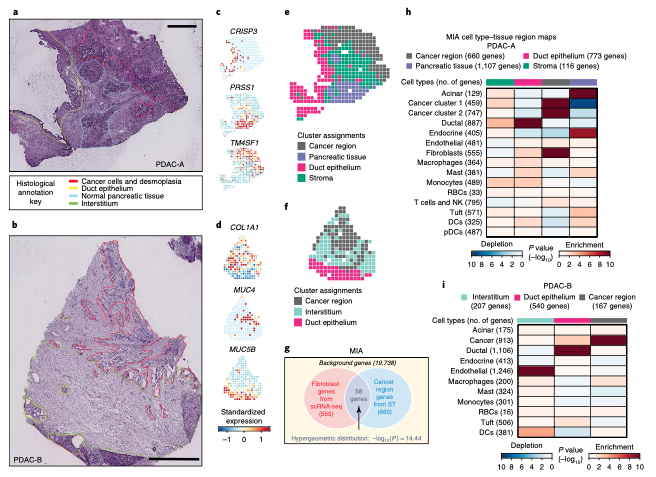
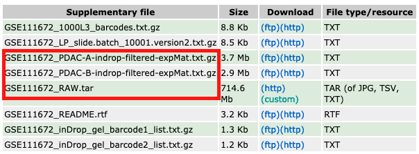
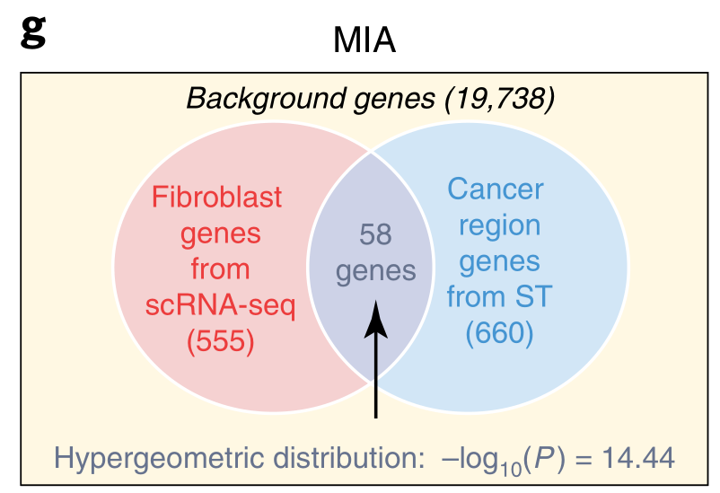

**Author(s)**: `r params$author`  
**Date**: `r Sys.Date()`  

# Academic Citation
If you use this code in your work or research, we kindly request that you cite our publication:

Xiaofan Lu, et al. (2025). FigureYa: A Standardized Visualization Framework for Enhancing Biomedical Data Interpretation and Research Efficiency. iMetaMed. https://doi.org/10.1002/imm3.70005

```{r setup, include=FALSE}
knitr::opts_chunk$set(echo = TRUE)
```

# 需求描述

我想实现这篇单细胞空间转录组的Figure 2，作者已经把原始数据都提供了。

# Requirement Description

I want to crowdsource Figure 2 of this single-cell spatial transcriptome, and the author has provided all the original data.



出自<https://www.nature.com/articles/s41587-019-0392-8>
from<https://www.nature.com/articles/s41587-019-0392-8>

Fig. 2 | St of PDAC and mapping of cell types. 
a, Annotated PDAC-A tumor cryosection on the ST slide. The annotations indicate a region high in cancer cells and desmoplasia (red), duct epithelium (yellow) and normal pancreatic tissue (blue). Scale bar, 1 mm. 
b, Annotated PDAC-B tumor cryosection on the ST slide. Annotated regions include a cancer cell-rich region (red), duct epithelium (yellow) and interstitium (green). Scale bar, 1 mm. 
c,d, Standardized expression levels of three genes in the PDAC-A ST (c) and PDAC-B ST (d) datasets. 
e,f, Clustering of the PDAC-A (e) and PDAC-B (f) ST spots. Color indicates the clustering assignments. 
g, MIA. The hypergeometric distribution is used to infer the significance of the intersection of genes specifically expressed in a given cell type (fibroblasts in this case) and genes specifically expressed in a given tissue region (cancer region). Applying this analysis systematically for all pairs of cell types and tissue regions allows for insight into the spatial distribution of the cell types in the tumor. The numbers of genes used in the calculation are shown. 
h, The PDAC-A **MIA map** of all scRNA-seq-identified cell types and ST-defined regions. Each element in the matrix is computed as described in g for all pairs of cell types and tissue regions using the same 19,738 background genes. The numbers of cell type- and tissue region-specific genes used in the calculation are shown. Red indicates enrichment (significantly high overlap); blue indicates depletion (significantly low overlap). The bar on top indicates the regions delineated in e. 
i, The PDAC-B MIA map for the ST clusters identified in f. Matrix elements were computed as described in g and h. The bar on top indicates the regions delineated in f.

# 应用场景

单细胞测序和空间转录组数据各有优缺点，作者开发的MIA (multimodal intersection analysis)算法整合了单细胞数据以及空间转录组数据，解决了ST技术无法达到单细胞分辨率、scRNA-seq无法进行空间定位的问题，从而实现了优势互补。（出自这篇中文解读<https://mp.weixin.qq.com/s/52xYNJ-xprLLQ-ZfiB4fig>）

因为原文没有指出一些重要的参数，最后的图和原文有出入，但是算法一定是准确的，可以用到自己的数据中。

# Application Scenarios

Single-cell sequencing and spatial transcriptome data have their own advantages and disadvantages, and the MIA (multimodal intersection analysis) algorithm developed by the authors integrates single-cell data and spatial transcriptome data to solve the problem that ST technology cannot achieve single-cell resolution and scRNA-seq cannot be spatially localized, thus achieving complementary advantages. (From this Chinese interpretation <https://mp.weixin.qq.com/s/52xYNJ-xprLLQ-ZfiB4fig>)

Because the original text does not point out some important parameters, the final graph is different from the original text, but the algorithm must be accurate and can be used in its own data.

# 环境设置

# Environment settings

```{r}
source("install_dependencies.R")

library(data.table)
library(Seurat)
library(tidyverse)
library(ggplot2)
library(tidyHeatmap)

Sys.setenv(LANGUAGE = "en") #显示英文报错信息 # error messages are displayed in English
options(stringsAsFactors = FALSE) #禁止chr转成factor # chr is not allowed to be converted to factor
```

# 输入文件的下载

下载原文的数据<https://www.ncbi.nlm.nih.gov/geo/query/acc.cgi?acc=GSE111672>，解压缩GSE111672_RAW.rar

# Download the input file

Download the data <https://www.ncbi.nlm.nih.gov/geo/query/acc.cgi?acc=GSE111672> in the original text, unzip the GSE111672_RAW.rar



# PDAC-A

## Figure 2c - 空间转录组

c,d, Standardized expression levels of three genes in the **PDAC-A ST (c)** and PDAC-B ST (d) datasets.

结论：In both sample datasets, we found that the spatial expression of many variably expressed genes (see Methods) matched the annotated histological regions.

这里需要注意，方法中提到 UMI counts in each spot were normalized by the total transcript count and then scaled by the median number transcript count across all spots. A pseudocount of 1 was added before log10 transformation.

# PDAC-A

## Figure 2c - Spatial transcriptome

c,d, Standardized expression levels of three genes in the **PDAC-A ST (c)** and PDAC-B ST (d) datasets.

Conclusion: In both sample datasets, we found that the spatial expression of many variably expressed genes (see Methods) matched the annotated histological regions.

It is important to note here that the method mentions UMI counts in each spot were normalized by the total transcript count and then scaled by the median number transcript count across all spots. A pseudocount of 1 was added before log10 transformation.

```{r}
# 首先是PDAC-A空间转录组数据的读入
# The first is the read-in of the PDAC-A spatial transcriptome data
dataA <- fread("GSE111672_RAW/GSM3036911_PDAC-A-ST1-filtered.txt", header = T,check.names = F)
dataA <- as.data.frame(dataA)

# 去重
# Deduplication
dataA <- dataA %>%
  distinct(Genes,.keep_all = T) %>% 
  column_to_rownames("Genes")

# 构建seurat对象
# Build a Seurat object
stRNA <- CreateSeuratObject(counts = dataA)
stRNA <- NormalizeData(stRNA, normalization.method = "LogNormalize", scale.factor = 10000)
stRNA <- FindVariableFeatures(stRNA, selection.method = "vst", nfeatures = 2000)
all.genes <- rownames(stRNA)
stRNA <- ScaleData(stRNA, features = all.genes)

# 降维，原文分成了四个亚群
# Dimensionality reduction, the original text is divided into four subgroups
stRNA <- RunPCA(stRNA, features = VariableFeatures(object = stRNA))
stRNA <- FindNeighbors(stRNA, dims = 1:5)
stRNA <- FindClusters(stRNA, resolution = 0.3)
stRNA <- RunUMAP(stRNA, dims = 1:5)
plot <- DimPlot(stRNA)
data <- plot$data

# 提取各个spot坐标，这里是空间转录组和单细胞转录组的区别——数据有了空间信息
# 原文的坐标信息在列名中，如果是10x数据走Space Ranger流程应该在spatial文件夹下
# Extract the coordinates of each spot, here is the difference between the spatial transcriptome and the single-cell transcriptome - the data has spatial information
# The coordinate information of the original text is in the column name, if it is 10x data, it should be in the spatial folder if it is a Space Ranger process
sp_1 <- colnames(dataA)
sp_2 <- str_split(sp_1, "x")
index_get <- function(x){
  x <- as.numeric(x)
  x <- as.vector(x)
}
ind <- as.data.frame(t(sapply(sp_2, index_get)))
names(ind) <- c("row_ind", "col_ind")
rownames(ind) <- paste0(ind$row_ind,"x",ind$col_ind)
ind$col_ind <- ind$col_ind - 1  
ind$row_ind <- ind$row_ind - 1
ind_mat <- arrange(ind, col_ind, row_ind)
data <- data[rownames(ind_mat),]
ind_mat$ident <- data$ident
ind_mat$shape <- "A"
head(ind_mat)
```

画图
Drawing

```{r}
## 先进行转换
## Convert first
data <- dataA[,rownames(ind_mat)]
tmp2 <- 1e6 / colSums(data)
ST_norm <- sweep(data, 2, tmp2, '*')
ST_c <- log(ST_norm + 1)

data.gene <- ind_mat
data.gene$gene <- as.numeric(ST_c["PRSS1",])

data.gene <- data.gene %>% 
  mutate(zscore = (gene - mean(gene))/sd(gene))

gg <- ggplot(data.gene, aes(x = row_ind, y = col_ind))

pl <- gg + geom_point(data = data.gene, aes(size = 3, 
                                          shape = shape,
                                          color=zscore)) +
  scale_shape_manual(values = c(15))+
  scale_colour_gradientn(colors=c("#D0EBF8",
                                  "#9BCCDF",
                                  "#9BCCDF",
                                  "#9BCCDF",
                                  "#D0EBF8",
                                  "#9BCCDF",
                                  "#9BCCDF",
                                  "#9BCCDF",
                                  "#9BCCDF",
                                  "#FFEE9F",
                                  "#A11D2A",
                                  "red"))+
  theme_void()+
  guides(size=F,shape=F,color=F)
pl
ggsave("PRSS1_A.pdf",height = 6,width = 6)
## 其他marker gene同理
## The same goes for other marker genes
```

## Figure 2e - 空间转录组
## Figure 2e - Spatial transcriptome

Clustering of the **PDAC-A (e)** and PDAC-B (f) ST spots. Color indicates the clustering assignments. 

results：After clustering the spots of each ST array based on the principal component scores (see Methods), we found that the resulting clusters were consistent with the independent histological annotations (Fig. 2e,f and Supplementary Fig. 5g,h), 

```{r}
gg <- ggplot(ind_mat, aes(x = row_ind, y = col_ind))

region <- gg + geom_point(data = ind_mat, aes(size = 3, 
                                          shape = shape,
                                          color=ident)) +
         scale_shape_manual(values = c(15)) +
         scale_colour_manual(values = c("#189D77",
                                        "#666666",
                                        "#E42A88",
                                        "#766FB1"))+
  theme_void() +
  guides(size=F,shape=F)

region
ggsave("region_A.pdf", height = 6, width = 6)
```

## Figure 2h - MIA，空间转录组跟单细胞数据整合分析
## Figure 2h - MIA, Spatial Transcriptome Documentary Single Cell Data Integration Analysis

h, The PDAC-A MIA map of all **scRNA-seq-identified cell types** and **ST-defined regions**. Each element in the matrix is computed as described in g for all pairs of cell types and tissue regions using the same 19,738 background genes. The numbers of cell type- and tissue region-specific genes used in the calculation are shown. Red indicates enrichment (significantly high overlap); blue indicates depletion (significantly low overlap). The bar on top indicates the regions delineated in e. 

results：Extending this analysis to all pairs of cell types and tumor regions produces an ‘MIA map’. Thus, while the scRNA-seq data led to identification of fibroblasts, **MIA further revealed that these were enriched in the cancer region**, as opposed to the stromal region, suggesting that the **fibroblasts captured by scRNA-seq represent activated fibroblasts** (Fig. 2h). As expected, we found that the duct epithelium region was mainly enriched with ductal cells, while the pancreatic tissue was enriched with acinar cells and endocrine cells (P < 10−10, for all specified enrichments). 

这篇文章里用到了一个算法，作者把它命名为MIA (multimodal intersection analysis)，用来整合单细胞数据以及空间转录组数据。

In this article, we use an algorithm called MIA (multimodal intersection analysis) to integrate single-cell data as well as spatial transcriptome data.



实际上这个方法就是超几何分布：

In fact, this method is a hypergeometric distribution:

Determination of cell type enrichment/depletion by MIA. We queried the significance of the overlap between ST genes and cell type marker genes using the hypergeometric cumulative distribution, with all genes as the background to compute the P value. In parallel, we test for cell type depletion by computing −log10(1 − P).

这里有个简单的解释<https://zhuanlan.zhihu.com/p/50175830>，具体到R中，上述的韦恩图可以表示为

Here's a simple explanation <https://zhuanlan.zhihu.com/p/50175830>, specific to R, the above Venn diagram can be expressed as:

```{r}
p <- -log10(1 - phyper(58,
                       660,
                       19738 - 660,
                       555))
p
```

所以，为了实现这一过程，需要得到单细胞转录组和空间转录组各自的marker基因集

Therefore, in order to achieve this process, it is necessary to obtain the respective marker gene sets of the single-cell transcriptome and the spatial transcriptome

```{r}
# 导入单细胞转录组信息
# Import single-cell transcriptome information
scdataA <- fread("GSE111672_PDAC-A-indrop-filtered-expMat.txt",header=T)

cell <- data.frame(cell=c("Acinar cells", "Ductal - terminal ductal like", "Ductal - CRISP3 high/centroacinar like", 
                       "Cancer clone A", "Ductal - MHC Class II", "Cancer clone B", 
                       "mDCs A", "Ductal - APOL1 high/hypoxic", "Tuft cells", "mDCs B", 
                       "pDCs", "Endocrine cells", "Endothelial cells", "Macrophages A", 
                       "Mast cells", "Macrophages B", "T cells & NK cells", "Monocytes", 
                       "RBCs", "Fibroblasts"),
                   celltype=c("Acinar cells", "Ductal", "Ductal", 
                        "Cancer clone A", "Ductal", "Cancer clone B", 
                        "mDCs", "Ductal", "Tuft cells", "mDCs", 
                        "pDCs", "Endocrine cells", "Endothelial cells", "Macrophages", 
                        "Mast cells", "Macrophages", "T cells & NK cells", "Monocytes", 
                        "RBCs", "Fibroblasts"))

scdataA <- as.data.frame(scdataA)
names <- colnames(scdataA)[2:ncol(scdataA)]
colnames(scdataA) <- paste0(colnames(scdataA),"_",1:1927)

scdataA <- scdataA %>%
  distinct(Genes_1,.keep_all = T) %>% 
  column_to_rownames("Genes_1")

scRNA <- CreateSeuratObject(counts = scdataA)

scRNA <- NormalizeData(scRNA, normalization.method = "LogNormalize", scale.factor = 10000)
scRNA <- FindVariableFeatures(scRNA, selection.method = "vst", nfeatures = 2000)
all.genes <- rownames(scRNA)
scRNA <- ScaleData(scRNA, features = all.genes)
scRNA <- RunPCA(scRNA, features = VariableFeatures(object = scRNA))
scRNA <- FindNeighbors(scRNA, dims = 1:15)
scRNA <- FindClusters(scRNA, resolution = 0.5)
scRNA <- RunUMAP(scRNA, dims = 1:15)

scRNA@meta.data$cell <- names
scRNA@meta.data$id <- NA

# 改名，文章给了细胞信息，省略注释过程。
# Renamed, the article gives cell information, omitting the annotation process.
for(i in 1:nrow(cell)){
  scRNA@meta.data[which(scRNA@meta.data$cell == cell$cell[i]),'id'] <- cell$celltype[i]
}
Idents(scRNA) <- 'id'
DimPlot(scRNA)

# 注意，这里是与原文不符合的地方，原文并没有使用Seurat包进行下游分析，
# 这里为了简化过程直接使用了FindAllMarkers()
# Note that this is inconsistent with the original text, which does not use the Seurat package for downstream analysis.
# Here we use FindAllMarkers() to simplify the process

scRNA_marker <- FindAllMarkers(scRNA,test.use = "t",
                               only.pos = T,
                               logfc.threshold = 0.05)
# 原文根据p值提取marker基因集，我尝试了原文的阈值，实在是太少了，所以这里就保留
# The original text extracts the marker gene set according to the p-value, I tried the threshold of the original text, but it is too little, so I will keep it here
scRNA_marker2 <- subset(scRNA_marker)
table(scRNA_marker2$cluster)

# 同样的，空间转录组的marker基因集也可以得到
# Similarly, the marker gene set of the spatial transcriptome can also be obtained
newid <- c("Stroma","Cancer","Duct","Pancreatic")
names(newid) <- levels(stRNA)
stRNA <- RenameIdents(stRNA, newid)
# 这里也是和原文不符合的地方，简化过程
# This is also inconsistent with the original text, simplifying the process
stRNA_marker <- FindAllMarkers(stRNA,
                               only.pos = T,
                               test.use="t",
                               logfc.threshold = 0.1)
stRNA_marker2 <- subset(stRNA_marker)
table(stRNA_marker2$cluster)
```


```{r}
## MIA
## 超几何分布
## MIA
## Hypergeometric distributions
p.data <- data.frame(sc=NA,st=NA,p=NA)

for (i in unique(scRNA_marker2$cluster)) {
  sub_cluster = subset(scRNA_marker2,cluster==i)
  gene = sub_cluster$gene
  gene_l = length(gene)
  for (j in unique(stRNA_marker2$cluster)) {
    sub_cluster_st = subset(stRNA_marker2,cluster==j)
    gene_st = sub_cluster_st$gene
    gene_st_l = length(gene_st)
    gene_inter_l = length(intersect(gene_l,gene_st_l))
    p = -log10(1-phyper(gene_inter_l,
                      gene_st_l, 
                      19738-gene_st_l, 
                      gene_l))
    p.demo.data = data.frame(sc = paste0(i,"(",gene_l,")"),
                           st = paste0(j,"(",gene_st_l,")"),p = p)
    p.data = rbind(p.demo.data,p.data)
    p.data = na.omit(p.data)
  }
}

p.data$group <- p.data$st

## 画图
## Drawing
p.data <- as_tibble(p.data)
p.data %>%
  tidyHeatmap::heatmap(
    .column = st,
    .row = sc,
    .value = p,
    .scale = "both",
    show_column_names=F,
    palette_value = c("#1B4584","white","#660621"),
    rect_gp = grid::gpar(col = "black", lwd = 1),
    row_names_side = "left",
    cluster_rows = FALSE,
    cluster_columns = FALSE
  )%>%
  add_tile(group,palette = c("#189D77",
                             "#666666",
                             "#E42A88",
                             "#766FB1")) %>%
  tidyHeatmap::save_pdf("MIA_A.pdf",
                        width = 9,height =6)
```


# PDAC-B

同样的流程，PDAC-B也是一样的处理方法

## Figure 2d - 空间转录组

# PDAC-B

The same process is handled by PDAC-B

## Figure 2d - Spatial transcriptome

c,d, Standardized expression levels of three genes in the PDAC-A ST (c) and **PDAC-B ST (d)** datasets.

```{r}
## 读取PDAC-B空间转录组数据
## Read PDAC-B spatial transcriptome data
dataA <- fread("GSE111672_RAW/GSM3405534_PDAC-B-ST1-filtered.txt", header = T,check.names = F)
dataA <- as.data.frame(dataA)

# 去重
# Deduplication
dataA <- dataA %>%
  distinct(Genes,.keep_all = T) %>% 
  column_to_rownames("Genes")
# 构建seurat对象
# Build a seurat object
stRNA <- CreateSeuratObject(counts = dataA)
stRNA <- NormalizeData(stRNA, normalization.method = "LogNormalize", scale.factor = 10000)
stRNA <- FindVariableFeatures(stRNA, selection.method = "vst", nfeatures = 2000)
all.genes <- rownames(stRNA)
stRNA <- ScaleData(stRNA, features = all.genes)
# 降维，原文分成了四个亚群
# Dimensionality reduction, the original text is divided into four subgroups
stRNA <- RunPCA(stRNA, features = VariableFeatures(object = stRNA))
stRNA <- FindNeighbors(stRNA, dims = 1:5)
stRNA <- FindClusters(stRNA, resolution = 0.5)
stRNA <- RunUMAP(stRNA, dims = 1:5)
plot <- DimPlot(stRNA)
data <- plot$data

# 提取各个spot坐标
# Extract the coordinates of each spot
sp_1 <- colnames(dataA)
sp_2 <- str_split(sp_1, "x")
index_get <- function(x){
  x <- as.numeric(x)
  x <- as.vector(x)
}
ind <- as.data.frame(t(sapply(sp_2, index_get)))
names(ind) <- c("row_ind", "col_ind")
rownames(ind)=paste0(ind$row_ind,"x",ind$col_ind)
ind$col_ind <- ind$col_ind - 1  
ind$row_ind <- ind$row_ind - 1
ind_mat <- arrange(ind, col_ind, row_ind)
data <- data[rownames(ind_mat),]
ind_mat$ident <- data$ident
ind_mat$shape <- "A"
head(ind_mat)
```

画图
Drawing

```{r}
## 转换
## Convert
data <- dataA[,rownames(ind_mat)]
tmp2 <- 1e6 / colSums(data)
ST_norm <- sweep(data, 2, tmp2, '*')
ST_c <- log(ST_norm + 1)

data.gene <- ind_mat
data.gene$gene <- as.numeric(ST_c["MUC4",])

data.gene <- data.gene %>% 
  mutate(zscore = (gene - mean(gene))/sd(gene))

gg <- ggplot(data.gene, aes(x = row_ind, y = col_ind))

pl <- gg + geom_point(data = data.gene, aes(size = 3, 
                                          shape = shape,
                                          color=zscore)) +
  scale_shape_manual(values = c(15)) +
  scale_colour_gradientn(colors=c("#D0EBF8",
                                  "#9BCCDF",
                                  "#9BCCDF",
                                  "#9BCCDF",
                                  "#D0EBF8",
                                  "#9BCCDF",
                                  "#9BCCDF",
                                  "#FFEE9F",
                                  "#A11D2A",
                                  "red")) +
  theme_void() +
  guides(size=F, shape=F, color=F)
pl
ggsave("MUC4_B.pdf", height = 6, width = 6)
# 其他基因同理
# The same is true for other genes
```

## Figure 2f - 空间转录组

## Figure 2f - Spatial transcriptome

Clustering of the PDAC-A (e) and **PDAC-B (f)** ST spots. Color indicates the clustering assignments. 

```{r}
gg <- ggplot(ind_mat, aes(x = row_ind, y = col_ind))

region <- gg + geom_point(data = ind_mat, aes(size = 3, 
                                          shape = shape,
                                          color = ident)) +
         scale_shape_manual(values = c(15)) +
         scale_colour_manual(values = c("#189D77",
                                        "#666666",
                                        "#E42A88",
                                        "#766FB1")) +
  theme_void() +
  guides(size=F, shape=F)

region
ggsave("region_B.pdf", height = 6, width = 6)
```

## Figure 2i - MIA，空间转录组跟单细胞数据整合分析

## Figure 2i - MIA, Spatial Transcriptome Documentary Data Integration Analysis

i, The PDAC-B MIA map for the ST clusters identified in f. Matrix elements were computed as described in g and h. The bar on top indicates the regions delineated in f.

```{r}
scdataA <- fread("GSE111672_PDAC-B-indrop-filtered-expMat.txt",header=T)

cell=data.frame(cell=c("Cancer clone A", "Ductal - terminal ductal like", "Acinar cells", 
                       "Ductal - MHC Class II", "Ductal - CRISP3 high/centroacinar like", 
                       "Endothelial cells", "Endocrine cells", "mDCs", "Tuft cells", 
                       "Macrophages", "Mast cells", "Monocytes", "RBCs"),
            celltype=c("Cancer clone A", "Ductal", "Acinar cells", 
                       "Ductal", "Ductal", 
                       "Endothelial cells", "Endocrine cells", 
                       "mDCs", "Tuft cells", 
                       "Macrophages", "Mast cells", "Monocytes", "RBCs"))

scdataA=as.data.frame(scdataA)
names=colnames(scdataA)[2:ncol(scdataA)]
colnames(scdataA)=paste0(colnames(scdataA),"_",1:1734)

scdataA=scdataA %>%
  distinct(Genes_1,.keep_all = T) %>% 
  column_to_rownames("Genes_1")

scRNA=CreateSeuratObject(counts = scdataA)

scRNA <- NormalizeData(scRNA, normalization.method = "LogNormalize", scale.factor = 10000)
scRNA <- FindVariableFeatures(scRNA, selection.method = "vst", nfeatures = 2000)
all.genes <- rownames(scRNA)
scRNA <- ScaleData(scRNA, features = all.genes)
scRNA <- RunPCA(scRNA, features = VariableFeatures(object = scRNA))
scRNA <- FindNeighbors(scRNA, dims = 1:15)
scRNA <- FindClusters(scRNA, resolution = 0.5)
scRNA <- RunUMAP(scRNA, dims = 1:15)
scRNA@meta.data$cell=names
scRNA@meta.data$id=NA

#改名，文章给了细胞信息，省略注释过程。
# Renamed, the article gives cell information, omitting the annotation process.
for(i in 1:nrow(cell)){
  scRNA@meta.data[which(scRNA@meta.data$cell == cell$cell[i]),'id'] <- cell$celltype[i]
}
Idents(scRNA)='id'
DimPlot(scRNA)

#注意，这里是与原文不符合的地方，原文并没有使用Seurat包进行下游分析，
#这里为了简化过程直接使用了FindAllMarkers()
# Note that this is inconsistent with the original text, which does not use the Seurat package for downstream analysis.
# Here we use FindAllMarkers() to simplify the process

scRNA_marker=FindAllMarkers(scRNA,test.use = "t",
                            only.pos = T,
                            logfc.threshold = 0.05)
#原文根据p值提取marker基因集，我尝试了原文的阈值实在是太少了，所以这里就保留 # The original text extracts the marker gene set based on the p-value, and the threshold of the original text is too small, so I will keep it here
scRNA_marker2=subset(scRNA_marker)
table(scRNA_marker2$cluster)

#同样的，空间转录组的marker基因集也可以得到
# Similarly, the marker gene set of the spatial transcriptome can also be obtained
newid=c("Interstitium","Cancer region","Duct epithelium")
names(newid) <- levels(stRNA)
stRNA<- RenameIdents(stRNA, newid)
#简化过程
# Simplify the process
stRNA_marker=FindAllMarkers(stRNA,
                            only.pos = T,
                            test.use="t",
                            logfc.threshold = 0.1)
stRNA_marker2=subset(stRNA_marker)
table(stRNA_marker2$cluster)
```

```{r}
## MIA
## 超几何分布
## MIA
## Hypergeometric distributions
p.data <- data.frame(sc=NA,st=NA,p=NA)

for (i in unique(scRNA_marker2$cluster)) {
  sub_cluster=subset(scRNA_marker2,cluster==i)
  gene=sub_cluster$gene
  gene_l=length(gene)
  for (j in unique(stRNA_marker2$cluster)) {
    sub_cluster_st <- subset(stRNA_marker2,cluster==j)
    gene_st <- sub_cluster_st$gene
    gene_st_l <- length(gene_st)
    gene_inter_l <- length(intersect(gene_l,gene_st_l))
    p <- -log10(1-phyper(gene_inter_l,
                         gene_st_l, 
                         19738-gene_st_l, 
                         gene_l))
    p.demo.data <- data.frame(sc = paste0(i,"(",gene_l,")"),
                           st = paste0(j,"(",gene_st_l,")"),p=p)
    p.data <- rbind(p.demo.data,p.data)
    p.data <- na.omit(p.data)
  }
}

p.data$group <- p.data$st

## 画图
## Drawing
p.data <- as_tibble(p.data)
p.data %>%
  tidyHeatmap::heatmap(
    .column = st,
    .row = sc,
    .value = p,
    .scale = "both",
    show_column_names=F,
    palette_value = c("#1B4584","white","#660621"),
    rect_gp = grid::gpar(col = "black", lwd = 1),
    row_names_side = "left",
    cluster_rows = FALSE,
    cluster_columns = FALSE
  )%>%
  add_tile(group,palette = c("#189D77",
                             "#666666",
                             "#E42A88",
                             "#766FB1")) %>%
  tidyHeatmap::save_pdf("MIA_B.pdf",
                        width = 9,height =6)
```


# Session Info

```{r}
sessionInfo()
```