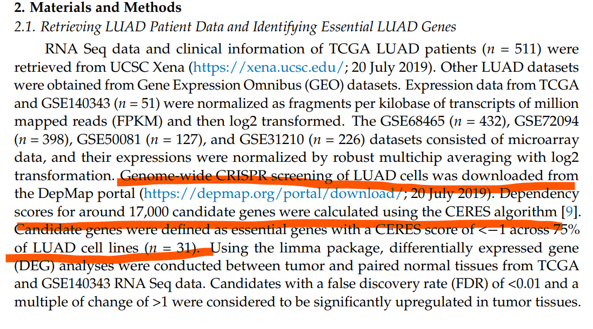
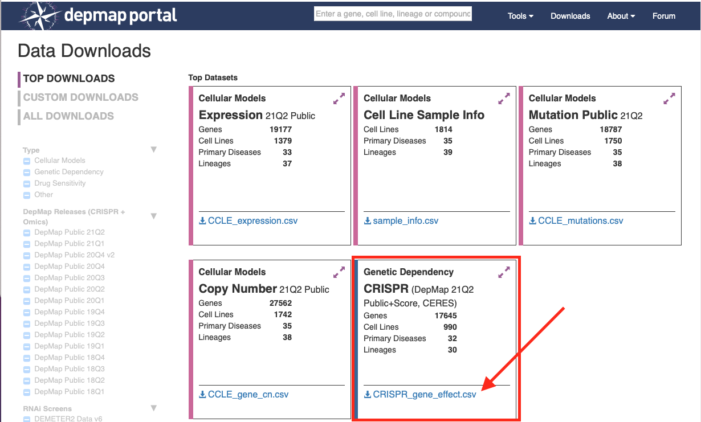

**Author(s)**: `r params$author`  
**Date**: `r Sys.Date()`  

# Academic Citation
If you use this code in your work or research, we kindly request that you cite our publication:

Xiaofan Lu, et al. (2025). FigureYa: A Standardized Visualization Framework for Enhancing Biomedical Data Interpretation and Research Efficiency. iMetaMed. https://doi.org/10.1002/imm3.70005

```{r setup, include=FALSE}
knitr::opts_chunk$set(echo = TRUE)
```

# 需求描述

想实现下这个算法，利用CRISPR数据库，筛选出某种肿瘤细胞影响生长的基因，再结合TCGA数据库，对湿实验的指导意义非常大。谢谢啦

# Requirement Description

I want to crowdsource this algorithm, use the CRISPR database to screen out the genes that affect the growth of certain tumor cells, and then combine it with the TCGA database, which is of great significance for the guidance of wet experiments. Thank you



出自<https://www.mdpi.com/2072-6694/13/9/2128>
from<https://www.mdpi.com/2072-6694/13/9/2128>

# 应用场景

癌症依赖关系图谱（简称DepMap）基于CRISPR screening技术，筛选出对数百种癌细胞生长必需的基因。例文进一步结合TCGA表达数据，给癌症做分子分型。

These findings may allow us to refine the preexisting subtype classification of LUAD, and also guide us in identifying tumors that may be vulnerable to specific treatments.

Figure 2的Consensus clustering可参考FigureYa202consensusGene

# Application Scenarios

The Cancer Dependency Atlas (DepMap) is based on CRISPR screening technology to screen out genes that are essential for the growth of hundreds of cancer cells. In this example, TCGA expression data is further combined to molecularly classify cancer.

These findings may allow us to refine the preexisting subtype classification of LUAD, and also guide us in identifying tumors that may be vulnerable to specific treatments.

For details about the consensus clustering of Figure 2, see FigureYa202consensusGene

# 环境设置

# Environment settings

```{r}
source("install_dependencies.R")

library(data.table)
library(limma)
library(ComplexHeatmap)
library(ClassDiscovery)
library(pheatmap)
Sys.setenv(LANGUAGE = "en") #显示英文报错信息 # error messages are displayed in English
options(stringsAsFactors = FALSE) #禁止chr转成factor # chr is not allowed to be converted to factor
```

自定义函数
Custom functions

```{r}
# 自定义函数
# Custom functions
standarize.fun <- function(indata=NULL, halfwidth=NULL, centerFlag=T, scaleFlag=T) {  
  outdata=t(scale(t(indata), center=centerFlag, scale=scaleFlag))
  if (!is.null(halfwidth)) {
    outdata[outdata>halfwidth]=halfwidth
    outdata[outdata<(-halfwidth)]= -halfwidth
  }
  return(outdata)
}
```

# 输入文件

TCGA-LUAD.htseq_fpkm.tsv.gz，表达矩阵。根据原文从XENA数据平台下载LUAD的FPKM数据，<https://xenabrowser.net/datapages/?dataset=TCGA-LUAD.htseq_fpkm.tsv&host=https%3A%2F%2Fgdc.xenahubs.net&removeHub=https%3A%2F%2Fxena.treehouse.gi.ucsc.edu%3A443>。跟FigureYa238corRiskMut为同一输入文件

gencode.v22.annotation.gene.probeMap，表达数据对应的GENECODE22注释文件。

CRISPR_gene_effect.csv，CRISPR相关信息。下载自DepMap，<https://depmap.org/portal/download/>; CRISPR (DepMap 21Q2 Public+Score, CERES)

# Input files

TCGA-LUAD.htseq_fpkm.tsv.gz, the expression matrix. According to the original text, download the FPKM data of LUAD from the XENA data platform, <https://xenabrowser.net/datapages/?dataset=TCGA-LUAD.htseq_fpkm.tsv&host=https://gdc.xenahubs.net&removeHub=https://xena.treehouse.gi.ucsc.edu:443>。 It is the same input file as FigureYa238corRiskMut

gencode.v22.annotation.gene.probeMap, the GENECODE22 annotation file corresponding to the expression data.

CRISPR_gene_effect.csv, CRISPR-related information. Download from DepMap, <https://depmap.org/portal/download/>; CRISPR (DepMap 21Q2 Public Score, CERES)



sample_info.csv，LUAD细胞系，数据来自<https://depmap.org/portal/download/>; Cell Line Sample Info
sample_info.csv, LUAD cell line, data from <https://depmap.org/portal/download/>; Cell Line Sample Info

```{r}
## TCGA数据
# 加载表达数据
## TCGA data
# Load the expression data
fpkm <- fread("TCGA-LUAD.htseq_fpkm.tsv.gz",sep = "\t",check.names = F,stringsAsFactors = F,header = T,data.table = F)
rownames(fpkm) <- fpkm[,1]; fpkm <- fpkm[,-1]

# 加载基因表达注释文件
# Load the gene expression annotation file
Ginfo <- read.table("gencode.v22.annotation.gene.probeMap",sep = "\t",row.names = 1,check.names = F,stringsAsFactors = F,header = T)

# 将FPKM的ENSEMBL ID转为Gene Symbol并去重
# Convert the ENSEMBL ID of the FPKM to Gene Symbol and remove the duplication
identical(rownames(Ginfo),rownames(fpkm))
comgene <- intersect(rownames(fpkm),rownames(Ginfo))
fpkm <- fpkm[comgene,]; Ginfo <- Ginfo[comgene,]
fpkm$Gene <- as.character(Ginfo$gene)
fpkm <- fpkm[!duplicated(fpkm$Gene),] # 重复基因去重 # Duplicate gene deduplication
rownames(fpkm) <- fpkm$Gene; fpkm <- fpkm[,-ncol(fpkm)]
fpkm <- as.data.frame(round(fpkm,3)) # 取表达的小数点后3位数 # Take 3 decimal places after the expression

# 提取配对的肿瘤和正常样本
# Extract paired tumor and normal samples
norsam <- colnames(fpkm[,substr(colnames(fpkm),14,16) == "11A"])
tumsam <- colnames(fpkm[,substr(colnames(fpkm),14,16) == "01A"])
toMatch <- substr(norsam,9,12) # 取出中段barcode唯一识别患者 # Remove the midsection barcode to uniquely identify the patient
matches <- unique(grep(paste(toMatch,collapse = "|"),  # 在肿瘤样本中匹配正常样本对应的患者 # Match the normal patient in the tumor sample
                       tumsam, value = TRUE))
t.code <- substr(matches, start = 1, stop = 12) # 取出前段barcode # Take out the barcode in the first paragraph
n.code <- substr(norsam, start = 1, stop = 12) # 取出前段barcode # Take out the barcode in the first paragraph
com_code <- intersect(t.code, n.code) # 取出相同患者的前段barcode # Remove the anterior segment barcode for the same patient

pair.t.sam <- paste0(com_code, "-01A") # 添加肿瘤的尾部barcode # Add the tail barcode of the tumor
pair.n.sam <- paste0(com_code, "-11A") # 添加正常的尾部barcode # Add normal tail barcode
```


```{r}
## CRISPR screening数据
# 读取CRISPR相关信息
## CRISPR screening data
# Read CRISPR-related information
ceres <- fread("CRISPR_gene_effect.csv",check.names = F,stringsAsFactors = F,header = T,data.table = F) 
rownames(ceres) <- ceres[,1]; ceres <- ceres[,-1]
ceres <- as.data.frame(t(ceres))
rownames(ceres) <- sapply(strsplit(rownames(ceres)," ",fixed = T),"[",1)

# 提取LUAD细胞系
# Extract the LUAD cell line
ccl.anno <- read.csv("sample_info.csv",row.names = 1,check.names = F,stringsAsFactors = F,header = T) # 数据来自 https://depmap.org/portal/download/; Cell Line Sample Info # Data from https://depmap.org/portal/download/; Cell Line Sample Info
ccl.luad <- ccl.anno[which(ccl.anno$Subtype == "Non-Small Cell Lung Cancer (NSCLC), Adenocarcinoma"),] #&
                             #ccl.anno$primary_or_metastasis == "Primary" &
                             #ccl.anno$sample_collection_site == "lung"),]
```

# 提取LUAD细胞系的CRISPR并计算候选基因
# Extract CRISPR from the LUAD cell line and count candidate genes

CRISPR screening. Project Achilles uses a genome-scale CRISPR-Cas9 tool to individually knock out each gene, thereby **identifying candidates which are critical for cancer survival**. Taking advantage of Project Achilles and RNA sequencing (RNA-Seq) data from LUAD patients, we were able to **pinpoint essential genes responsible for LUAD malignancy**. 

Candidate genes were defined as essential genes with a CERES score of < −1 across 75% of LUAD cell lines (n = 31). 

In total, 693 genes were found to be crucial for maintaining survival in 31 LUAD cell lines

```{r}
ceres.luad <- ceres[,intersect(rownames(ccl.luad), colnames(ceres))]
dim(ceres.luad) # 原文是31个，我这里筛到51个 # The original text is 31, and I have sifted 51 here

candidate.genes <- rownames(ceres.luad)[apply(ceres.luad, 1, function(x) {sum(x < -1) > 0.75 * ncol(ceres.luad)})] # CERES值小于-1在超过75%的细胞系中 # CERES values less than -1 in more than 75% of cell lines
length(candidate.genes)

candidate.genes <- intersect(rownames(fpkm), candidate.genes)
length(candidate.genes)
```

# TCGA数据中对肿瘤与正常样本做差异表达
# Differential expression of tumors and normal samples in TCGA data

These essential genes were used to **classify LUAD patients into different molecular types**. Clinical differences of these molecular types in multiple cohorts were investigated. Additionally, a new subset of patients with distinct prognoses in the TRU subtype was identified using our classification. 

Using the limma package, differentially expressed gene (DEG) analyses were conducted between tumor and paired normal tissues from TCGA and GSE140343 RNA Seq data. Candidates with a false discovery rate (FDR) of <0.01 and a multiple of change of >1 were considered to be significantly upregulated in tumor tissues.

To identify which candidates among these 693 genes were aberrantly expressed in tumor tissues, DEG analyses were carried out to compare tumor tissues with paired normal tissues in TCGA (number of pairs = 59) and GSE140343 (number of pairs = 49) RNA Seq data. Thirty-six of 693 essential genes were significantly upregulated in tumor tissues (with a multiple of change of >1 and an FDR of <0.01) (Figure 1B, Tables S2–S4). 

```{r}
pd <- data.frame(Samples = c(pair.t.sam, pair.n.sam),
                 Group = rep(c("pT","pN"),c(length(pair.t.sam),length(pair.n.sam))),
                 row.names = c(pair.t.sam,pair.n.sam),
                 stringsAsFactors = FALSE)
design <- model.matrix(~ -1 + factor(pd$Group, levels = c("pT","pN")))
colnames(design) <- c("pT","pN")

# 提取候选基因对应的肿瘤vs正常样本表达数据
# Extract the tumor vs normal sample expression data corresponding to the candidate genes
gset <- fpkm[candidate.genes, pd$Samples]
dim(gset)
gset[1:2,]

# 差异表达分析
# Differential expression analysis
fit <- limma::lmFit(gset, design = design);
contrastsMatrix <- limma::makeContrasts(pT - pN, levels = c("pT", "pN"))
fit2 <- limma::contrasts.fit(fit, contrasts = contrastsMatrix)
fit2 <- limma::eBayes(fit2, 0.01)
resData <- limma::topTable(fit2, adjust = "fdr", sort.by = "B", number = 100000)
resData <- as.data.frame(subset(resData, select=c("logFC","t","B","P.Value","adj.P.Val")))
resData$id <- rownames(resData)
colnames(resData) <- c("log2fc","t","B","pvalue","padj","id")
resData$fc <- 2^resData$log2fc
resData <- resData[order(resData$padj),c("id","fc","log2fc","pvalue","padj")]

# 保存到文件
# Save to file
write.table(resData,"limma results between pT and pN regarding CRISPR candidates.txt",sep = "\t",row.names = F,col.names = T,quote = F)
```

# 开始画图

选取差异表达基因绘制热图，看分型效果。

# Start drawing

Differentially expressed genes were selected to draw a heat map to see the typing effect.

```{r}
degs <- resData[which(resData$padj < 0.01 & resData$log2fc > 1.5),]

annCol <- pd # 样本注释 # Sample annotations
annColors <- list("Group" = c("pT" = "red","pN" = "steelblue")) # 注释颜色 # Annotate colors

indata <- as.matrix(gset[degs$id,rownames(annCol)])
plotdata <- standarize.fun(indata, halfwidth = 2) # 数据标准化并截断 # Data is normalized and truncated
hcs <- hclust(distanceMatrix(indata,metric = "euclidean"), method = "ward.D") # 样本聚类 # Sample clustering

pheatmap(plotdata,
         color = NMF:::ccRamp(x = c("blue","white","red"),n = 64), 
         border_color = NA,
         cluster_rows = T,
         cluster_cols = hcs,
         show_rownames = T,
         show_colnames = F,
         annotation_col = annCol[,"Group",drop = F],
         annotation_colors = annColors,
         treeheight_col = 20,
         treeheight_row = 20,
         cellwidth = 2.5,
         cellheight = 12,
         filename = "heatmap.pdf")
```


# Session Info

```{r}
sessionInfo()
```