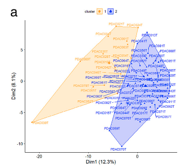

**Author(s)**: `r params$author`  
**Date**: `r Sys.Date()`  

# Academic Citation
If you use this code in your work or research, we kindly request that you cite our publication:

Xiaofan Lu, et al. (2025). FigureYa: A Standardized Visualization Framework for Enhancing Biomedical Data Interpretation and Research Efficiency. iMetaMed. https://doi.org/10.1002/imm3.70005

```{r setup, include=FALSE}
knitr::opts_chunk$set(echo = TRUE)
```

# 需求描述

基因聚类，然后在图上标注出来。不用说要跟原文一个数据吧，只要输入数据得出类似的图就行。

# Requirement Description

Genes are clustered and then annotated on the graph. Needless to say, you need to have the same data as the original text, as long as you enter the data to get a similar graph.



出自<https://www.sciencedirect.com/science/article/pii/S2352396421003340?via%3Dihub>
from <https://www.sciencedirect.com/science/article/pii/S2352396421003340?via%3Dihub>

Fig. 1. Prognostic stratification of PDAC through their GT gene expression profile (a, b) and clinical features of patients with their PDAC molecular profiles (c, d). 
(a) Biplot of the HCPC analysis result based on RNA-seq data of 74 PDAC and 169 GT genes.

# 应用场景

看这里<https://mp.weixin.qq.com/s/kNHM5teMRtL2dSZXzm4m8w>，带你看透文章里的PCA图的小心机。

# Application Scenarios

Take a look at the <https://mp.weixin.qq.com/s/kNHM5teMRtL2dSZXzm4m8w> here to take you to understand the PCA diagram in the article

# 环境设置

# Environment settings

```{r}
source("install_dependencies.R")
source("geom_convexhull.R") # from ggConvexHull package
library(tidyverse)
library(factoextra)
Sys.setenv(LANGUAGE = "en") #显示英文报错信息 # error messages are displayed in English
options(stringsAsFactors = FALSE) #禁止chr转成factor # chr is not allowed to be converted to factor
```

# 输入文件

easy_input.csv，表达矩阵，每行一个基因，每列一个sample。

# Input files

easy_input.csv, the expression matrix, one gene per row, one sample per column.

```{r}
data2 <- read.csv("easy_input.csv", header = T, row.names = 1)
data2[1:2,]

## kmeans by row. 注意kmean函数是按照行进行聚类的，因此这里需要进行转置，input matrix行为样本，列为特征(基因)
## kmeans by row. Note that the kmean function is clustered by row, so here you need to transpose it, input matrix behavior samples, and list as traits (genes)
k2 <- kmeans(
  x = t(data2), #如果你的数据是行为sample，列为基因，就不需要转置 # If your data is a behavioral sample, listed as a gene, you don't need to transpose it
  centers = 2 # 设置聚类数量 # Set the number of clusters
)

## PCA by row，prcomp函数的input matrix同kmeans
## PCA by row,The input matrix of the prcomp function is the same as that of kmeans
pca <- prcomp(t(data2))
```

# 开始画图

## 方法一: 调用factoextra包

# Start drawing

## Method 1: Call the factoextra package

```{r, fig.width=5, fig.height=5}
p <- fviz_pca_ind(
  X = pca, 
  repel = T, 
  geom = c("point", "text"), # 如果不想要文字标记,去掉text即可 # If you don't want the text tag, just remove the text
  habillage = k2$cluster, # 添加分组信息 # Add group information
  legend.title = "cluster", # 图例标题 # Legend title
  mean.point = FALSE, # 是否添加聚类中心 # Whether to add a cluster center
  palette = c("red","blue"), # change color, map to col.ind
  pointsize = 2.5, # 点的大小 # The size of the dot
  addEllipses = TRUE, # 添加外边框 # Add an outer border
  ellipse.type = "convex", # 外边框类型, 凸多边形"convex" # Outer Border Type, Convex Polygon "Convex"
  axes.linetype = "blank", # hide zerolines
  ggtheme = theme_classic(base_size = 15) # ggplot主题 # ggplot theme
)
# remove text legend
p <- p + guides(color = guide_legend(override.aes = aes(label = "")))
# theme
p + theme(
  legend.position = "top",
  plot.title = element_blank(),
  axis.text = element_text(color = "black")
)

ggsave("PCA_factoextra.pdf")
```

## 方法二: ggplot

准备数据

## Method 2: ggplot

Prepare the data

```{r}
data.use <- as.data.frame(pca$x[, c("PC1", "PC2")])
data.use$cluster <- factor(k2$cluster)
data.use$name <- rownames(data.use)

vars.percent <- pca$sdev^2 / sum(pca$sdev^2) # 计算不同主成分解释的数据方差 # Calculate the variance of the data for different principal component explanations
dims <- c(1,2) # 选择PC1和PC2进行可视化 # Select PC1 and PC2 for visualization
xlab <- paste0("Dim1 (", round(vars.percent[dims[1]]*100, 1), "%)")
ylab <- paste0("Dim2 (", round(vars.percent[dims[2]]*100, 1), "%)")
colors.use <- c("red", "blue")
```

画图
Drawing

```{r, fig.width=5, fig.height=5}
ggplot(data.use, aes(PC1, PC2, shape=cluster, color=cluster)) + 
  geom_point(size = 2.5) + 
  geom_convexhull(aes(fill=cluster), alpha = 0.15) + 
  ggrepel::geom_text_repel(
    aes(label=name), 
    size = 3, 
    max.iter = 2000, # 如果样本太多，text overlap无法解决，可以增大max.iter参数 # If there are too many samples and the text overlap cannot be solved, you can increase the max.iter parameter
    show.legend = F) + 
  scale_color_manual(values = colors.use) + 
  scale_fill_manual(values = colors.use) + 
  labs(x = xlab, y = ylab) + 
  theme_classic(base_size = 15) + 
  theme(
    legend.position = "top",
    plot.title = element_blank(),
    axis.text = element_text(color = "black")
  )

ggsave("PCA_ggplot2.pdf")
```

# Session Info

```{r}
sessionInfo()
```