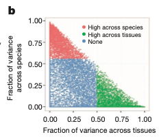

**Author(s)**: `r params$author`  
**Date**: `r Sys.Date()`  

# Academic Citation
If you use this code in your work or research, we kindly request that you cite our publication:

Xiaofan Lu, et al. (2025). FigureYa: A Standardized Visualization Framework for Enhancing Biomedical Data Interpretation and Research Efficiency. iMetaMed. https://doi.org/10.1002/imm3.70005

```{r setup, include=FALSE}
knitr::opts_chunk$set(echo = TRUE)
```

# 需求描述

我想实现这篇文献的Fig.2b，使用RNA-seq来衡量基因的表达保守性。

基因在物种之间表达量的保守性，想用来分析非编码RNA在不同物种之间的表达保守性。

# Requirement Description

I would like to draw Fig.2b of this article, using RNA-seq to measure the conserved expression of genes.

The conservation of gene expression between species was intended to analyze the expression conservation of non-coding RNAs between species.



出自<https://www.nature.com/articles/nature13992>
from<https://www.nature.com/articles/nature13992>

Figure 2: Comparative analysis of the gene expression programs in human and mouse samples. 

b, Gene expression variance decomposition (see Methods) estimates the relative contribution of tissue and species to the observed variance in gene expression for each orthologous human–mouse gene pair. Green dots indicate genes with **higher between-tissue contribution** and red dots genes with **higher between-species contributions**. 

Our initial analyses revealed that gene expression patterns tended to cluster more by species rather than by tissue (Fig. 2a). To resolve the sets of genes contributing to different components in the clustering, we employed variance decomposition (see Methods) to estimate, for each orthologous human–mouse gene pair, the proportion of the variance in expression that is contributed by tissue and by species (Fig. 2b). This analysis revealed the sets of genes **whose expression varies more across tissues than between species**, and those **whose expression varies more between species than across tissues**. As expected, **the clustering of the RNA-seq samples is dominated either by species or tissues**, depending on the gene set employed (Extended Data Fig. 1a, b). Furthermore, removal of the ~4,800 genes that drive the species-specific clustering (see ref. 47, Supplementary Fig. 1d therein) or normalization methods that reduce the species effects reveal tissue-specific patterns of expression in the same samples (Extended Data Fig. 1c). 

作者通过对人和鼠10个不同的组织的转录组数据通过PCA（Fig.2a，画法可参考FigureYa101PCA）评估了基因表达在人鼠之间的保守性，发现样本主要按照物种而不是组织分开，这表明人鼠之间的基因表达差异大于组织之间的差异。随后作者通过方差分解（线性混合模型）计算了组织和物种对基因表达方差的贡献，鉴定出了人鼠表达保守和人鼠表达差异的基因（Fig.2b）。在剔除了人鼠表达差异的基因后，PCA的结果表明样本按照组织而不是物种分布（Extend Fig.1c）。

The authors evaluated the conservation of gene expression between humans and mice by PCA (Fig.2a, see FigureYa101PCA) on transcriptome data from 10 different tissues of humans and mice, and found that the samples were mainly separated by species rather than tissues, indicating that the differences in gene expression between humans and mice were greater than the differences between tissues. The authors then calculated the contribution of tissues and species to the variance of gene expression by variance decomposition (linear mixed model) and identified genes with conservative human-mouse expression and differential human-mouse expression (Fig.2b). After culling the differentially expressed genes in humans and mice, the results of PCA showed that the samples were distributed by tissue rather than species (Extend Fig.1c).

# 应用场景

Fig.2b的方法具有普适性，对于研究某基因在物种之间表达的保守性有指导意义。如果某基因的表达水平在人鼠之间不保守，可能提示着该基因突变造成的效应在人鼠之间有差异。此时运用小鼠作为模式生物得到的结论泛化到人上时，需要特别谨慎。

# Application Scenarios

Fig.2b's method is universal and has guiding significance for studying the conserved expression of a gene between species. If the expression level of a gene is not conserved between humans and mice, it may indicate that the effects of the gene mutation are different between humans and mice. At this point, special caution is required when generalizing conclusions from mice as model organisms to humans.

original text：Categorizing orthologous gene pairs into these groups should enable more informative translation of research results between mouse and human. In particular, for **gene pairs whose variance in expression is largest between tissues (and less between species), mouse should be a particularly informative model for human biology**. In contrast, interpretation of studies involving **genes whose variance in expression is larger between species needs to take into account the species variation**. The relative contributions of species-specific and tissue-specific factors to each gene’s expression are further explored in two associated papers37,47.

本脚本主要实现了以下功能：

1) 按照直系同源关系（one2one orthologs）合并人鼠转录组
2) 数据重构，使之方便应用线性混合模型
3) 利用并行计算批量对每个基因构建线性混合模型，并计算物种和组织两个随机效应分别对基因表达方差的贡献
4) 绘图，复现Fig.2b

This script implements the following functions:

1) Merge the human and mouse transcriptomes according to the orthologous relationship (one2one orthologs).
2) Data reconstruction to facilitate the application of linear hybrid models
3) Parallel computational batches were used to construct a linear mixed model for each gene, and the contribution of two random effects, species and tissue, to the variance of gene expression was calculated
4) Drawing, reproduction Fig.2b

# 环境设置

# Environment settings

```{r}
source("install_dependencies.R")
# 加载所需的R包
# Load required R packages
library(tidyverse)      # 用于数据操作和可视化的包 # For data manipulation and visualization
library(lme4)           # 用于实现线性混合模型 (LMM) 的包 # Used to implement linear mixed model (LMM)
library(doParallel)     # 用于并行计算的包 # For parallel computing

# 设置环境变量
# Set environment variables
Sys.setenv(LANGUAGE = "en")  # 显示英文报错信息 # Display error messages in English
options(stringsAsFactors = FALSE)  # 禁止字符型数据自动转换为因子型 # Prevent automatic conversion of character data to factors
```

# 输入文件

human.tissue.fpkm.rds和mouse.tissue.fpkm.rds，人和鼠各器官的表达矩阵。

human2mouse.ortholog.txt，人和鼠同源基因的对应关系。

# Input files

human.tissue.fpkm.rds and mouse.tissue.fpkm.rds, expression matrices of human and mouse organs.

human2mouse.ortholog.txt, correspondence between human and mouse homologous genes.

```{r}
# 加载表达矩阵
# Load the Expression Matrix
human <- readRDS("human.tissue.fpkm.rds")
#如果你的数据是csv格式，可以这样读取
# If your data is in csv format, you can read it like this
#human <- read.csv("human.tissue.fpkm.csv")
mouse <- readRDS("mouse.tissue.fpkm.rds")

# 加载同源基因对应关系
# Load homologous gene correspondence
orthologs <- read_tsv("human2mouse.ortholog.txt")
```

Filter genes:

Genes with a maximum RPKM greater than 0.1 in each dataset were kept.

```{r}
kept.rows <- apply(human[, -c(1,2)], 1, max) > 0.1
table(kept.rows)
human <- human[kept.rows, ]
kept.rows <- apply(mouse[, -c(1,2)], 1, max) > 0.1
table(kept.rows)
mouse <- mouse[kept.rows, ]
```

# 1) 按照直系同源关系(one2one orthologs)合并人鼠转录组

# 1) Merge human-mouse transcriptomes according to orthologous relationships (one2one orthologs).

```{r}
in.human <- orthologs$`Gene stable ID` %in% human$Gene.ID
in.mouse <- orthologs$`Mouse gene stable ID` %in% mouse$Gene.ID
# 取人鼠的转录组都检测到的one2one.orthologs
# Take the transcriptomes of human mice that are detected by one2one.orthologs
orthologs <- orthologs[in.human & in.mouse, ]
human <- human %>% filter(Gene.ID %in% orthologs$`Gene stable ID`)
mouse <- mouse %>% filter(Gene.ID %in% orthologs$`Mouse gene stable ID`)

all(dim(human) == dim(mouse)) # should be TRUE

colnames(human) <- paste0("Human_", colnames(human))
colnames(mouse) <- paste0("Mouse_", colnames(mouse))

# Order by orthologs
rownames(human) <- human$Human_Gene.ID
rownames(mouse) <- mouse$Mouse_Gene.ID
human <- human[orthologs$`Gene stable ID`, ] %>% as_tibble()
mouse <- mouse[orthologs$`Mouse gene stable ID`, ] %>% as_tibble()
data <- cbind(human, mouse)
```

# 2) 数据重构，使之方便应用线性混合模型
# 2) Data reconstruction to facilitate the application of linear hybrid models

```{r}
data <- data %>% 
  mutate(GenePairs = paste(Human_Gene.Name, Mouse_Gene.Name, sep = "_"), .before = 1) %>% 
  select(-contains("Gene.")) %>% 
  pivot_longer(-GenePairs,
               names_to = c("Species", "Tissue"), 
               names_sep = "_", 
               values_to = c("FPKM"))
```

We used log10 (RPKM) to normalize the data and a pseudocount of 0.01 to deal with zero expression values.

```{r}
data$lgFPKM <- log10(data$FPKM + 0.01)
data$Tissue <- factor(data$Tissue) # Tissue should be factor for LMM model
data$Species <- factor(data$Species) # Species should be factor for LMM model 
head(data)
```


# 3) 批量对每个基因构建线性混合模型(LMM)，并计算物种和组织两个随机效应分别对基因表达方差的贡献
# 3) Construct a linear mixed model (LMM) for each gene in batches, and calculate the contribution of two random effects of species and tissue to gene expression variance, respectively

Gene expression was modeled as a function of tissue and the species (considered as random factors). 

The LMM was implemented in the R package lme4 (ref). 

The restricted maximum likelihood (REML) estimators for the random effects of **tissue, species and residual** variance were normalized by their sum to give the variance components (Fig. 2b). 

根据原文描述，LMM模型应该如下:
According to the original description, the LMM model should look like this:

logFPKM ~ 1 + (1|Tissue)     +     (1|Species) 

|Dependent variable|      |Random Effects (Intercept)|     |Random Effects 2 (Intercept)|

这里提供两种计算方式，“串行计算”慢，推荐找个服务器运行“并行运算”。
There are two computing methods here, "serial computing" is slow, it is recommended to find a server to run "parallel computing".

## 串行计算：大约15min
## Serial calculation: about 15min

```{r, warning=FALSE, message=FALSE, eval=FALSE}
gene.pairs <- unique(data$GenePairs)

lmm.var.dcp <- pbapply::pblapply(gene.pairs, function(xx) {
  model <- lmer(lgFPKM~1+(1|Tissue)+(1|Species), data = subset(data, GenePairs == xx), REML = TRUE, verbose = FALSE)
  results <- as.data.frame(VarCorr(model))
  res <- results$vcov / sum(results$vcov) # normalized by their sum to give the variance components
  data.frame(
    GenePairs = xx,
    frac.of.var.tissue = res[1],
    frac.of.var.species = res[2],
    frac.of.var.residual = res[3]
  )
}) %>% do.call(rbind, .)
```

## 并行计算(推荐)
## Parallel Computing (Recommended)

```{r eval=FALSE}
## ==== do parallel start ====
## apply for 20 workers
# 设定CPU数量，例如20，取决于你用的服务器 # Set the number of CPUs, e.g. 20, depending on the server you are using
cl <- makeCluster(20) 
registerDoParallel(cl)
```

```{r, warning=FALSE, message=FALSE, eval=FALSE}
gene.pairs <- unique(data$GenePairs)

lmm.var.dcp <- foreach(
  xx = gene.pairs, 
  .combine = "rbind", 
  .packages = c("lme4"),
  .export = c("data")) %dopar% {
    model <- lmer(lgFPKM~1+(1|Tissue)+(1|Species), data = subset(data, GenePairs == xx), REML = TRUE, verbose = FALSE)
    results <- as.data.frame(VarCorr(model))
    res <- results$vcov / sum(results$vcov)
    data.frame(
      GenePairs = xx,
      frac.of.var.tissue = res[1],
      frac.of.var.species = res[2],
      frac.of.var.residual = res[3]
    )
  }

head(lmm.var.dcp)
```

```{r eval=FALSE}
## close workers (free memory taken up by workers)
stopCluster(cl)
## ==== do parallel end ====

saveRDS(lmm.var.dcp, "lmm.var.dcp.rds")

# 输出到文件，便于查看和选择自己感兴趣的基因
# Export to a file for easy viewing and selection of genes of interest
write.csv(lmm.var.dcp, "output_lmm.var.dcp.csv", quote = F, row.names = F)
```

# 开始画图 - Fig.2b
# Start Drawing - Fig.2b

```{r}
lmm.var.dcp <- readRDS("lmm.var.dcp.rds")

(top.quantile.tissue <-  quantile(lmm.var.dcp$frac.of.var.tissue)[4])
(top.quantile.species <- quantile(lmm.var.dcp$frac.of.var.species)[4])
```

```{r, fig.width=5, fig.height=4}
lmm.var.dcp %>% 
  mutate(group = ifelse(
    frac.of.var.tissue > top.quantile.tissue & 
      frac.of.var.tissue > frac.of.var.species, "High across tissues", 
    ifelse(
      frac.of.var.species > top.quantile.species & 
        frac.of.var.species > frac.of.var.tissue, "High across species", "None")
  )) %>% 
  ggplot(aes(frac.of.var.tissue, frac.of.var.species, color = group)) + 
  geom_point(size = 0.5) + 
  guides(color = guide_legend(override.aes = list(size = 3))) + 
  theme_bw(base_size = 15) + 
  labs(x = "Fraction of variance across tissues", 
       y = "Fraction of variance\nacross species") + 
  theme(
    panel.grid = element_blank(),
    legend.title = element_blank(),
    legend.position = c(0.7, 0.85),
    legend.background = element_blank(),
    axis.text = element_text(color = "black")
  )

ggsave("VarDecompose.pdf")
```

# 顺便看两个同源基因

分别画图看一下人鼠之间基因表达水平相对保守/有差异的基因

## 在人鼠之间基因表达水平相对保守的基因

# By the way, look at the two homologous genes

Draw separate graphs to see genes with relatively conserved/differential gene expression levels between humans and mice

## Genes with relatively conserved gene expression levels between humans and mice

Example of genes with higher between-tissue contribution

```{r}
subset(lmm.var.dcp, GenePairs=="LRRIQ3_Lrriq3")
data %>% filter(GenePairs=="LRRIQ3_Lrriq3") %>% 
  ggplot(aes(Tissue, lgFPKM, color=Species)) + 
  geom_point() + 
  geom_text(aes(label=Tissue))
```

## 在人鼠之间基因表达水平有差异的基因
## Genes with differential gene expression levels between humans and mice

Example of genes with higher between-species contribution

```{r}
subset(lmm.var.dcp, GenePairs=="EMC10_Emc10")
data %>% filter(GenePairs=="EMC10_Emc10") %>% 
  ggplot(aes(Tissue, lgFPKM, color=Species)) + 
  geom_point() + 
  geom_text(aes(label=Tissue))
```

> 效果还挺明显
> The effect is quite obvious

# Session Info

```{r}
sessionInfo()
```