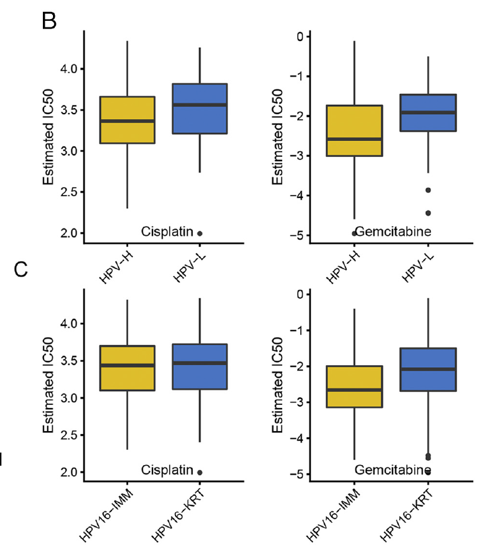

**Author(s)**: `r params$author`  
**Reviewer(s)**: `r params$reviewer`  
**Date**: `r Sys.Date()`  


# Academic Citation
If you use this code in your work or research, we kindly request that you cite our publication:

Xiaofan Lu, et al. (2025). FigureYa: A Standardized Visualization Framework for Enhancing Biomedical Data Interpretation and Research Efficiency. iMetaMed. https://doi.org/10.1002/imm3.70005

To cite package 'pRRophetic' in publications use:

Geeleher P, Cox NJ, Huang RS. Clinical drug response can be predicted using baseline gene expression levels and in vitro drug sensitivity in cell lines. Genome Biology. 2014;15(3):R47.

```{r setup, include=FALSE}
knitr::opts_chunk$set(echo = TRUE)
```

# 需求描述 Demand Description

oncoPredict包的用法。pRRophetic包的升级版，表达谱药物敏感性评估的。用FigureYa105GDSC的输入文件，画出同一类型的图。 
I’d like to crowdsource how to use the newly released oncoPredict package. It’s an upgraded version of pRRophetic for evaluating drug sensitivity from expression profiles. Use the input files from FigureYa105GDSC to produce the same type of plots.



出自<https://www.sciencedirect.com/science/article/pii/S1476558619301307>
From https://www.sciencedirect.com/science/article/pii/S1476558619301307

注意：由于包含原文数据，若涉及到注释文件亚型及其他相关数据的使用，请引用： Note: Since original data are included, if subtype annotations or other related data are used, please cite:
Lu X, Jiang L, Zhang L, et al. Immune Signature-Based Subtypes of Cervical Squamous Cell Carcinoma Tightly Associated with Human Papillomavirus Type 16 Expression, Molecular Features, and Clinical Outcome[J]. Neoplasia, 2019, 21(6): 591-601. Lu X, Jiang L, Zhang L, et al. Immune Signature-Based Subtypes of Cervical Squamous Cell Carcinoma Tightly Associated with Human Papillomavirus Type 16 Expression, Molecular Features, and Clinical Outcome[J]. Neoplasia, 2019, 21(6): 591-601.

# 应用场景 Application Scenario

发布oncoPredict包的文章https://academic.oup.com/bib/advance-article/doi/10.1093/bib/bbab260/6321360 The article releasing the oncoPredict package https://academic.oup.com/bib/advance-article/doi/10.1093/bib/bbab260/6321360

oncoPredict包把三个方法包装成三个函数：GLDS, calcPhenotype and IDWAS，官方用法文档看这里：https://cran.r-project.org/web//packages/oncoPredict/index.html The oncoPredict package wraps three methods as three functions: GLDS, calcPhenotype, and IDWAS; see the official usage docs here: https://cran.r-project.org/web//packages/oncoPredict/index.html

This functionality (指的是calcPhenotype函数) is similar to our original pRRophetic package [13] but has been overhauled to enable faster implementation, provides updated CTRP and GDSC screening data and allows for increased user customization. This functionality (referring to the calcPhenotype function) is similar to our original pRRophetic package [13] but has been overhauled to enable faster implementation, provides updated CTRP and GDSC screening data and allows for increased user customization.

这里采用oncoPredict包里的calcPhenotype函数来通过细胞系表达谱预测肿瘤样本药物敏感性。 Here we use the calcPhenotype function in oncoPredict to predict tumor sample drug sensitivity from cell line expression profiles.

> oncoPredict和pRRopetic的异同： Similarities and differences between oncoPredict and pRRophetic:

从算法角度看起来oncoPredict和pRRopetic没什么区别，只是更快了一些。 From an algorithmic perspective oncoPredict and pRRophetic are largely similar, but oncoPredict is faster.
oncoPredict可以通过细胞系表达谱预测肿瘤样本药物敏感性。 oncoPredict can predict tumor sample drug sensitivity using cell line expression.
对于不使用自定义细胞系表达/药敏的小伙伴来说，pRRopetic包会更友好，内置GDSC数据。pRRophetic的用法可参考FigureYa105GDSC，根据GDSC细胞系表达谱和TCGA基因表达谱构建岭回归模型预测药物IC50。 For those not using custom cell line expression/sensitivity data, pRRophetic is more user-friendly with built-in GDSC data. See FigureYa105GDSC for usage: build a ridge regression model using GDSC cell line expression and TCGA gene expression to predict drug IC50.
FigureYa212drugTarget也用了pRRophetic。根据PRISM和CTRP2.0药物敏感性AUC值数据、以及CCLE表达谱数据，预测TCGA亚组潜在性治疗药物。不同于FigureYa105GDSC，这个数据是药物敏感性AUC值，以及药物的范围更加广泛。 FigureYa212drugTarget also used pRRophetic. Using PRISM and CTRP2.0 drug sensitivity AUC data plus CCLE expression, it predicted potential therapeutics for TCGA subgroups. Unlike FigureYa105GDSC, this uses AUC values and covers a broader drug space.

还可以不用这两个R包，从TCGA表达谱分出的亚型推演到GDSC数据库里的细胞系，由此推出各亚型的药物敏感性，可参考FigureYa246supervisedGDSC。 You can also skip both R packages: project TCGA-derived subtypes onto GDSC cell lines to infer subtype-specific drug sensitivity; see FigureYa246supervisedGDSC.

或者使用在线工具CMap，任何感兴趣的差异基因都可以用CMap分析得到靶向干性特征的潜在化合物/抑制剂，可参考FigureYa131CMap。 Or use the online tool CMap: any differential genes of interest can be analyzed to obtain potential compounds/inhibitors targeting stemness features; see FigureYa131CMap.

自己的数据，可以都跑跑看。 For your own data, try running all of them.

# 环境设置 Environment Setup

```{r}
source("install_dependencies.R")

# library(oncoPredict) # 这里我没有加载因为这个包依赖R版本>4.1.0，并且这个包提供的三个函数不是相互依赖的，所以我直接加载药敏预测的函数 | I didn't load it here because it requires R > 4.1.0, and the three functions are not interdependent, so I source only the drug prediction function
source("CALCPHENOTYPE.R") # 如果安装了包就加载包，这个函数是需要自己提供细胞系表达谱以及对应药物的敏感性数据的，其实pRRophetic这个包也可以做，这篇BIB其实也表明函数是“similar”的，但是貌似在运算上做了优化，会更快一些。 | If installed, load the package; otherwise source the function. You must provide cell line expression and matching drug response. pRRophetic can also do this; the BIB paper notes the functions are “similar,” but optimized for speed.
library(sva)
library(preprocessCore)
library(ridge)
library(glmnet)
library(car)
library(tidyverse)
library(impute)
library(ggplot2)
library(cowplot)
Sys.setenv(LANGUAGE = "en") #显示英文报错信息 | display error messages in English
options(stringsAsFactors = FALSE) #禁止chr转成factor | prevent chr to factor conversion
```

# 输入文件 Input files

## 测试集数据 Test set data

用的是FigureYa105GDSC的输入数据： We use the input data from FigureYa105GDSC:

easy_input_expr.txt，基因表达矩阵。 easy_input_expr.txt, gene expression matrix.

easy_input_anno.txt，分组信息。示例数据里的C1和C2分别对应"HPV16-IMM"和"HPV16-KRT"。也可以是按某个基因的突变类型分组、或按某个基因表达量高低分组。 easy_input_anno.txt, grouping information. In the example, C1 and C2 correspond to "HPV16-IMM" and "HPV16-KRT". You may also group by mutation status of a gene or by high/low expression of a gene.

这两个文件的sample ID必须一致。 The sample IDs in these two files must match.

```{r}
#表达矩阵 | expression matrix
dat <- read.table("easy_input_expr.txt",sep = "\t",row.names = 1,header = T,stringsAsFactors = F,check.names = F)
dat[1:3, 1:3]

#分组信息 | grouping info
ann <- read.table("easy_input_anno.txt",sep = "\t",row.names = 1,header = T,stringsAsFactors = F,check.names = F)
head(ann)
table(ann$ImmClust)

# 构建测试集数据 | build test set
testingExprData <- as.matrix(dat[,rownames(ann)])
```

## 药敏数据 Drug response data

```{r}
# 注意原文给出的示例数据非常小，我估计并不是完整的细胞系表达和药敏数据 | Note the provided example data are very small and likely not the full cell line expression/response datasets
# 原文说可以做GDSC和CTRP，但包并不像pRRophetic那样内置了一些数据 | The paper says GDSC and CTRP are supported, but unlike pRRophetic, the package doesn’t ship with those data
# 所以请下载自己想用的细胞系表达和对应药敏，具体可参考FigureYa212drugTarget | Please download your desired cell line expression and matching drug response; see FigureYa212drugTarget
# 这里我只使用示例数据来运行药敏程序，并解释数据结构，方便小伙伴使用自定义的数据 | Here I use toy data to run the pipeline and explain data structures for custom usage

# 准备数据1：细胞系表达 | prepare data 1: cell line expression
trainingExprData <- readRDS(file='GDSC2_Expr_short.rds') # 数据类型为矩阵，细胞系表达是行为基因，列为细胞系，入值为表达谱的矩阵，表达谱需做log2标准化 | Matrix: genes x cell lines; log2-normalized

# 准备数据2：细胞系对应药敏 | prepare data 2: cell line drug response
trainingPtype <- readRDS(file = "GDSC2_Res.rds") # 数据类型为矩阵，细胞系药敏是行为细胞系，列为药物，入值为药物敏感性的矩阵，数据一般存在NA，需要过滤或进行填补 | Matrix: cell lines x drugs; contains NAs; filter/impute
trainingPtype <- trainingPtype[,apply(trainingPtype, 2, function(x) {sum(is.na(x)) < 0.2 * nrow(trainingPtype)})] # 去除在超过20%样本中都缺失的药物 | remove drugs missing in >20% samples
trainingPtype <- trainingPtype[apply(trainingPtype, 1, function(x) {sum(is.na(x)) < 0.2 * ncol(trainingPtype)}),] # 去除在超过20%药物中都缺失的样本 | remove lines missing >20% drugs
trainingPtype <- t(impute.knn(t(trainingPtype))$data) # KNN填补缺失值 | KNN imputation
trainingPtype <- exp(trainingPtype) # 这里根据数据特点做指数化，因为原始数据是经过取对数的，但CALCPHENOTYPE.R会做一步power transformation，因此避免重复，这里还原数据规模 | Exponentiate to undo prior log because CALCPHENOTYPE.R applies a power transform
```

# 构建模型并预测 Build model and predict

用到calcPhenotype函数 We use the calcPhenotype function

This function implements the pipeline for the prediction of clinical chemotherapeutic response by using only baseline tumor gene expression data.

```{r}
# 下面介绍这个函数中的其他参数 | Additional parameters in this function
# batchCorrect选项: "eb"对应ComBat, "qn"对应quantiles normalization, "standardize", 以及 "none" | batchCorrect options
# "eb" 在使用微阵列数据做训练集（细胞系），并且应用到微阵列测试集（临床样本）时比较有效 | "eb" effective for microarray→microarray
# "standardize" 在使用微阵列数据做训练集（细胞系），但应用在RNA-seq测试集（临床样本）时比较有效 | "standardize" for microarray→RNA-seq
batchCorrect <- "eb" # 但我的测试集是标准化的RNA-seq，和芯片信号强度类似，所以依然选择eb | my test set is normalized RNA-seq; I still choose "eb"

# 是否进行power transform选项：默认进行 | whether to power-transform phenotype (default TRUE)
powerTransformPhenotype <- TRUE

# 低变异基因过滤阈值选项：默认为0.2 | low-variance gene filter threshold (default 0.2)
removeLowVaryingGenes <- 0.2

# 在过滤基因时候采用的数据类型选项：'homogenizeData' （批次效应消除后的数据）或 'rawData'（原始数据） | choose data space for variance filter
removeLowVaringGenesFrom <- "homogenizeData"

# 确定最小训练样本数目（一般不存在这个问题因为GDSC，CTRP，PRISM都有很多细胞系） | minimum number of training samples
minNumSamples <- 10

# 确定如何处理重复基因选项： -1是询问用户, 1 取均值, 以及 2 移除重复 | how to handle duplicated genes
selection <- 1

# 确定是否打印结果选项：默认进行 | whether to print progress
printOutput <- FALSE # 这里我不进行，免得最终markdown文件很长，自己运行的时候可以改为TRUE看到进度 | set TRUE to see progress

# 确定是否采用PCA对基因表达进行降维选项：默认不进行 | use PCR (PCA-based regression)
# 注意，如果选项report_pca = TRUE则上述选项必须为TRUE | if report_pc=TRUE then pcr must be TRUE
pcr <- FALSE
report_pc <- FALSE

# 确定是否需要列出相关性结果来确定潜在的药物biomarker（个人觉得没有必要，药物靶标的搜寻可以参考FigureYa212drugTarget，这里的做法过于“简单粗暴”） | list correlation-based biomarkers
cc <- FALSE

# 确定是否要输入模型的拟合优度值R^2（细胞系训练集的模型回代到训练集的预测结果之间的吻合程度） | output R^2 on training data
rsq <- FALSE # 想虐一下自己看看模型准确度的可以改为TRUE | set TRUE to inspect fit

# 确定在pcr=TRUE时，主成份分析需要达到的解释度，默认80，即所得到的主成份的解释度相加要大于80% | cumulative variance explained target for PCR
percent <- 80

# 构建模型并预测，该函数会在当前目录下生成calcPhenotype_Output，并且将药敏预测结果输入该目录，名为：DrugPredictions.csv | Build model and predict; outputs to calcPhenotype_Output/DrugPredictions.csv
calcPhenotype(trainingExprData = as.matrix(trainingExprData), # 函数会自己匹配细胞系表达和药敏的共有样本 | matches overlapping cell lines automatically
              trainingPtype = trainingPtype, # 但如果要选用特殊的细胞系类型，比如“生殖系统”、“消化系统”等，需要提前对细胞系做预筛选，函数不提供该操作 | pre-filter lines yourself for tissue-specific models
              testExprData = as.matrix(testingExprData),
              batchCorrect = batchCorrect,
              powerTransformPhenotype = powerTransformPhenotype,
              removeLowVaryingGenes = removeLowVaryingGenes,
              minNumSamples = minNumSamples,
              selection = selection,
              printOutput = printOutput,
              pcr = pcr,
              removeLowVaringGenesFrom = removeLowVaringGenesFrom,
              report_pc = report_pc,
              cc = cc,
              percent = percent,
              rsq = rsq)
```

到这里这个包预测药敏的内容就结束了，下面的内容只是出个图看看，所有阈值、检验方法或者出图样式均可自行调整。 That concludes the package’s drug prediction workflow; below we just plot results. Thresholds, tests, and plotting styles are adjustable.

# 开始画图 Start plotting

这里我做两样本检验，看哪些药物的敏感性有显著差异。 Here I perform a two-sample test to see which drugs show significant sensitivity differences.

```{r}
drugsen <- read.csv("./calcPhenotype_Output/DrugPredictions.csv",row.names = 1,check.names = F,stringsAsFactors = F,header = T)
outTab <- NULL
for (drug in colnames(drugsen)) {
  tmp <- data.frame(sen = drugsen[,drug],
                    group = ann[rownames(drugsen),"ImmClust"],
                    row.names = rownames(drugsen),
                    stringsAsFactors = F)
  
  avg <- as.numeric(by(tmp$sen, tmp$group, mean))
  wt <- wilcox.test(sen~group,data = tmp)
  
  outTab <- rbind.data.frame(outTab,
                             data.frame(drug = drug,
                                        avg1 = avg[1],
                                        avg2 = avg[2],
                                        p = wt$p.value,
                                        stringsAsFactors = F),
                             stringsAsFactors = F)
}
outTab$fc <- outTab$avg2/outTab$avg1
outTab$log2fc <- log2(outTab$fc)

# 把统计结果输出到文件 | write stats to file
write.table(outTab,"output_wilcox test for potential drugs.txt",sep = "\t",row.names = F,col.names = T,quote = F)
```

接下来就可以对预测出的数据绘图了，可以使用热图或者箱型图等等，这里模仿FigureYa105GDSC输出箱型图。 Next, plot the predicted data using heatmaps or boxplots; here we mimic FigureYa105GDSC with boxplots.

```{r}
# 设置颜色 | set colors
jco <- c("#EABF00", "#2874C5")

plotp <- list()
GCP.drug <- outTab[which(outTab$p < 0.05 & outTab$log2fc > 1),"drug"] # 这是我随便选取的阈值，控制药物数目 | ad hoc thresholds to limit the number of drugs

for (drug in GCP.drug) {
  
  predictedBoxdat <- data.frame("response" = drugsen[rownames(ann),drug],
                                "Group" = ann$ImmClust, 
                                 row.names = rownames(ann)) 
  # 绘图 | plotting
  p <- ggplot(data = predictedBoxdat, aes(x=Group, y=response))
  p <- p + geom_boxplot(aes(fill = Group)) + 
    scale_fill_manual(values = jco[1:length(unique(predictedBoxdat$Group))]) + #自定义box的配色 | custom colors
    theme_classic() +
    theme(legend.position="none") + # 倾斜字体 | hide legend
    theme(axis.text.x = element_text(angle = 45, hjust = 1,size = 12), plot.title = element_text(size = 12, hjust = 0.5)) + 
    xlab("") + ylab("Drug sensitivity") + # 这里可能是AUC，可能是IC50，根据具体情况调整 | could be AUC or IC50; adjust accordingly
    ggtitle(drug) # 补上title | add title

  # 每种药物的结果画到一个单独的文件里 | save each drug to a separate file
  ggsave(paste("boxplot of", drug, "sensitivity.pdf"), width = 4, height = 5)
  plotp[[drug]] <- p # 保存在列表里供合并图片用 | store for combining
}

# 合并图片 | combine plots
p <- plot_grid(plotlist = plotp,nrow = 2) # title可以AI下拉到合适位置，就如例文所示 | adjust titles in a vector editor if needed
p
ggsave("boxplot of predicted drug sensitivity.pdf", width = 6, height = 5)
```

# Session Info

```{r}
sessionInfo()
```