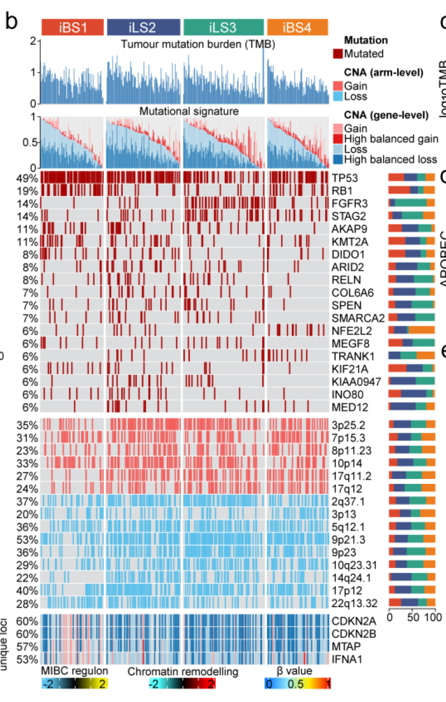

**Author(s)**: `r params$author`  
**Date**: `r Sys.Date()`  

# Academic Citation
If you use this code in your work or research, we kindly request that you cite our publication:

Xiaofan Lu, et al. (2025). FigureYa: A Standardized Visualization Framework for Enhancing Biomedical Data Interpretation and Research Efficiency. iMetaMed. https://doi.org/10.1002/imm3.70005

If you use ComplexHeatmap in published research, please cite:

Zuguang Gu, et al., Complex heatmaps reveal patterns and correlations in multidimensional genomic data, Bioinformatics, 2016.

Zuguang Gu. Complex Heatmap Visualization, iMeta, 2022.

```{r setup, include=FALSE}
knitr::opts_chunk$set(echo = TRUE)
```

# 需求描述

Xiaofan Lu写的MOVICS包很神奇，一个包几乎就画出了分子分型文章的大部分图。Xiaofan Lu写的这篇预印本最近已接收，刚好可以作为MOVICS包的应用案例。接下来会连续实现这篇文章里的几个图。

Figure2b的突变综合性热图，看起来非常酷炫。里头涉及的分析可参考相应的FigureYa，包括TMB计算，突变signature，突变频数，拷贝数变异情况等等。如果Xiaofan Lu可以随便拟定数据画图也可以！

# Requirement Description

The MOVICS package I wrote was amazing, and a single package almost drew most of the diagram of the molecular typing article. This preprint I wrote was recently received and could be used as an example of the use case for the MOVICS package. Next, we will continue to crowdsource several pictures in this article.

Figure2b's comprehensive heatmap of mutations looks really cool. The analysis involved in it is also available in FigureYa, including TMB calculation, mutation signature, mutation frequency, copy number variation, and so on.



出自<https://www.biorxiv.org/content/10.1101/2021.05.30.446369v1.full>
from<https://www.biorxiv.org/content/10.1101/2021.05.30.446369v1.full>

Figure 2. Molecular landscape of four MIBC iCSs.
b) Genomic alteration landscape according to iCS. Samples are ordered by the combined contribution of APOBEC-related mutational signatures (SBS2 + SBS13) with each iCS. Tumour mutation burden (TMB), relative contribution of four mutational signatures, selected differentially mutated genes (>5%) and broad-level copy number alterations (>20%), and selected genes located within chromosome 9p21.3 are shown from the top to the bottom panels. The proportion of iCS in each alteration is presented in the right bar charts.

# 应用场景

这里用complexheatmap绘制mutation landscape，图中同时展示了各亚型的突变01矩阵、突变频数、突变signature、拷贝数。这种组合热图也可以用于其他类型数据的合并展示。

- 突变频数TMB可参考FigureYa51TMB的mutation-load.txt，TCGA的TMB，来源于2018年的这篇文献：The Immune Landscape of Cancer <https://pubmed.ncbi.nlm.nih.gov/29628290/>，我们直接拿来用就好。
- 突变签名可参考FigureYa110mutationSignature。
- 更多分析、展示突变、拷贝数的FigureYa看这里

文中很多图我们都实现过，例如：

- Figure 1b的画法可参考FigureYa196PanPie
- Figure 3de可产考FigureYa25sankey和FigureYa125Fishertest
- Figure 4f可参考FigureYa106immunotherapy
- Figure 5b可参考FigureYa12box，f可参考FigureYa162boxViolin
- Figure 6可参考FigureYa35batch_bestSeparation，FigureYa144DiagHeatmap或<https://mp.weixin.qq.com/s/34WRZRBVPHUNRLlzNH2nzw>

# Application Scenarios

Here, the mutation landscape is plotted with ComplexHeatMap, which shows the mutation 01 matrix, mutation frequency, mutation signature, and copy number of each subtype at the same time. This combined heatmap can also be used for the combined display of other types of data.

- For the mutation frequency TMB, please refer to the mutation-load.txt of FigureYa51TMB, the TMB of TCGA, from this 2018 article: The Immune Landscape of Cancer <https://pubmed.ncbi.nlm.nih.gov/29628290/>, let's just use it.
- For more information about mutation signatures, see FigureYa110mutationSignature.
- For more analysis and display of mutations and copy numbers of FigureYa see here 

Many of the pictures in the article, such as:

- For more information about Figure 1b, see FigureYa196PanPie
- Figure 3de can be tested with FigureYa25sankey and FigureYa125Fishertest
- Figure 4f can refer to Figure Ya106 immunotherapy
- Figure 5b can refer to FigureYa12box, and f can refer to FigureYa162boxViolin
- For Figure 6, see FigureYa35batch_bestSeparation, FigureYa144DiagHeatmap, or <https://mp.weixin.qq.com/s/34WRZRBVPHUNRLlzNH2nzw>

# 环境设置

# Environment settings

```{r}
source("install_dependencies.R")

library(ComplexHeatmap)
library(RColorBrewer)

Sys.setenv(LANGUAGE = "en") #显示英文报错信息 # error messages are displayed in English
options(stringsAsFactors = FALSE) #禁止chr转成factor  #chr is not allowed to be converted to factor
```

# 输入文件
# Input files

```{r}
## 突变二值矩阵
## Mutation binary matrix
mut <- read.table("mutation.txt",sep = "\t",row.names = 1,check.names = F,stringsAsFactors = F,header = T)

## 突变频数
## Frequency of mutations
tmb <- read.table("TMB.txt",sep = "\t",row.names = 1,check.names = F,stringsAsFactors = F,header = T)

## 突变签名
## Mutation signature
mutsig <- read.csv("mutationsignature.cosmic2013.csv",row.names = 1,check.names = F,stringsAsFactors = F,header = T)
# 或者换成下面这行，读取FigureYa110mutationSignature的输出文件mutsig.weightMatrix.txt
# Or change it to the following line and read the output file of FigureYa110mutationSignature mutsig.weightMatrix.txt
# mutsig <- read.table("mutsig.weightMatrix.txt", row.names = 1, header = T) 

## 拷贝数GISTIC2.0结果（利用SNP segment文件在GenePattern上获得）
## Copy number GISTIC2.0 results (obtained on GenePattern using SNP segment file)
cna.region <- read.table("all_lesions.conf_90.txt",sep = "\t",row.names = 1,check.names = F,stringsAsFactors = F,header = T)
cna.gene <- read.table("all_thresholded.by_genes.txt",sep = "\t",row.names = 1,check.names = F,stringsAsFactors = F,header = T)

## 亚型数据
## Subtype data
subt <- read.table("subtype.txt",sep = "\t",row.names = 1,check.names = F,stringsAsFactors = F,header = T)
```

# 开始画图

整个图形由热图、热图上方注释（包括柱形图和瀑布图）、热图右侧百分比堆积图组成。自上而下分别是：

- 突变负荷柱状图，Tumour mutation burden (TMB)
- 突变签名瀑布图，relative contribution of four mutational signatures
- 突变基因热图，selected differentially mutated genes (>5%)
- 拷贝数热图1，broad-level copy number alterations (>20%)
- 拷贝数热图2，selected genes located within chromosome 9p21.3

# Start drawing

The entire graph consists of a heatmap, annotations above the heatmap (including column charts and waterfall charts), and a percentage stacked plot on the right side of the heatmap. From top to bottom, they are:

- Tumour mutation burden (TMB)
- Waterfall chart of mutational signatures, relative contribution of four mutational signatures
- Mutated gene heatmap, selected differentially mutated genes (>5%)
- Copy number heatmap 1, broad-level copy number alterations (>20%)
- Copy number heatmap 2, selected genes located within chromosome 9p21.3

```{r}
# 设置亚型颜色
# Set the subtype color
clust.col <- c("#DD492E","#40548A","#32A087","#EC7D21")
blue   <- "#5bc0eb"
red    <- "#f25f5c"

# 处理突变签名数据
# Handle mutation signature data
mutsig <- mutsig[,c("Signature.1","Signature.2","Signature.5","Signature.13")] # 文章中用到3种类型的signature， SBS1 (age-related), SBS2 and SBS13 (APOBEC activity-related) and SBS5 (ERCC2 mutation-related) # There are 3 types of signatures used in the article, SBS1 (age-related), SBS2 and SBS13 (APOBEC activity-related) and SBS5 (ERCC2 mutation-related)
mutsig$APOBEC <- mutsig$Signature.2 + mutsig$Signature.13 # APOBEC相关的签名由签名2和3叠加 # APOBEC-related signatures are overlaid by signatures 2 and 3
mutsig$CMOIC <- subt[rownames(mutsig),"CMOIC"] # 添加亚型结果 # Add subtype results
mutsig <- mutsig[order(mutsig$CMOIC,-mutsig$APOBEC,decreasing = F),] # 确定整个热图的排序，按照亚型升序以及APOBEC降序排列 # Determine the order of the entire heat map, in ascending order of subtype and descending order of APOBEC
```

## 突变主区域热图 （分析结果来自突变二值矩阵以及突变签名分析） #
## Heatmap of the main region of the mutation (analysis results from the mutation binary matrix and mutation signature analysis)

```{r}
# 挑选要展示的基因
# Pick the genes you want to display
mutgene <- c("FGFR3",
             "TP53",
             "RB1",
             "NFE2L2",
             "KIAA0947",
             "MEGF8",
             "STAG2",
             "SMARCA2",
             "RELN",
             "INO80",
             "TRANK1",
             "SPEN",
             "MED12",
             "KMT2A",
             "COL6A6",
             "AKAP9",
             "KIF21A",
             "ARID2",
             "DIDO1")

# 制作oncoprint的输入数据
# Create input data for oncoprint
onco.input <- mut[mutgene,rownames(mutsig),]
onco.input[onco.input == 1] <- "Mutated" # 二值矩阵中1记为突变 # 1 in the binary matrix is denoted as a mutation
onco.input[onco.input != "Mutated"] <- "" # 非“突变”给予空值 # Non-"mutations" are given null values
alter_fun = list(
  background = function(x, y, w, h) {
    grid.rect(x, y, w-unit(0.5, "mm"), h-unit(0.5, "mm"), gp = gpar(fill = "#dcddde", col = "#dcddde"))
  },
  Mutated = function(x, y, w, h) {
    grid.rect(x, y, w-unit(0.5, "mm"), h-unit(0.5, "mm"), gp = gpar(fill = "#A60000", col = "#A60000")) 
  }
)
col = c("Mutated" ="#A60000") # 突变颜色，注意这里只给了主图像的图例 # Mutate color, note that only the legend of the main image is given here

my_ann <- subt[rownames(mutsig),,drop = F]
my_annotation = HeatmapAnnotation(df = my_ann, 
                                  col = list(CMOIC = c("CS1" = clust.col[1],
                                                       "CS2" = clust.col[2],
                                                       "CS3" = clust.col[3],
                                                       "CS4" = clust.col[4])))

# 突变主区域的上部注释（突变负荷柱状图）
# Upper annotation of the main region of the mutation (histogram of mutation burden)
top_anno <- anno_barplot(as.numeric(tmb[rownames(mutsig),"log10TMB"]),
                         border = FALSE,
                         gp = gpar(fill = "#3379B4",border =NA,lty="blank"), 
                         height = unit(2.5, "cm"))

# 突变主区域的上部注释（突变签名柱状图）
# Upper annotation of the main region of the mutation (histogram of mutation signature)
tmp <- mutsig[,c("Signature.2","Signature.13","Signature.1","Signature.5")] # 只取和APOBEC有关的签名 # Only APOBEC-related signatures are taken
tmp$Others <- 1 - rowSums(tmp) # 计算其他签名的比例 # Calculate the proportion of other signatures
top_anno2 <- anno_barplot(as.matrix(tmp),
                          border = FALSE,
                          gp = gpar(fill = c(brewer.pal(6,"Paired")[c(2,1,6,5)],"grey90"), 
                                    border = NA, # 无边框 # Borderless
                                    lty = "blank"),
                          height = unit(2, "cm")) # 高度 # Height

tmp <- as.data.frame(t(mut[mutgene,rownames(mutsig),]))
mut.order <- names(sort(colSums(tmp),decreasing = T)) # 根据突变频数高低排序展示突变的顺序 # Displays the order of mutations according to the frequency of mutations
tmp$CMOIC <- subt[rownames(tmp),"CMOIC"]
pct <- NULL # 计算各个基因突变的百分比 # Calculate the percentage of mutations in each gene
for (i in mut.order) {
  tmp1 <- tmp[,c(i,"CMOIC")]
  tmp1 <- as.data.frame.array(table(tmp1[,1],tmp1$CMOIC))[2,]/sum(tmp1[,1])
  pct <- rbind.data.frame(pct,tmp1)
}
rownames(pct) <- mut.order

# 添加右侧百分比堆积柱状图
# Add the percentage stacked histogram on the right
right_anno <- anno_barplot(as.matrix(pct),
                           which = "row",
                           border = FALSE,
                           gp = gpar(fill = clust.col,border=NA,lty="blank"), 
                           bar_width = 0.6,
                           width = unit(1.8, "cm"),
                           height = unit(1, "cm"))
 
op1 <- oncoPrint(onco.input[mut.order,rownames(my_ann)], # 排序的突变矩阵 # Sorted mutation matrix
                 alter_fun = alter_fun,  # 主区域的函数，包括各单元格大小、背景颜色等等 # Functions in the main area, including cell size, background color, etc
                 col = col, # 突变颜色 # Mutate colors
                 bottom_annotation = NULL, # 无底部注释 # No bottom comment
                 top_annotation = c(HeatmapAnnotation(TMB = top_anno), # 顶部第一个注释：TMB # First note at the top: TMB
                                    my_annotation, # 顶部第二个注释：亚型 # Second note at the top: Isotype
                                    HeatmapAnnotation(MutSig = top_anno2)), # 顶部第三个注释：突变签名 # Third note at the top: Mutation signature
                 column_order = rownames(my_ann), # 样本的排序，根据突变签名的顺序 # Sorting of samples, according to the order of mutation signatures
                 right_annotation = rowAnnotation(PCT = right_anno), # 右侧堆叠柱状图注释 # Annotation of the stacked column chart on the right
                 show_pct = T, # 展示左侧的百分比 # Show the percentage on the left
                 column_title = "", # 不显示主题 # Topics are not displayed
                 show_heatmap_legend = T, # 展示图例 # Show legend
                 column_split = my_ann$CMOIC, # 根据亚型切分热图 # Slice the heat map according to the subtype
                 column_title_gp = gpar(fontsize = 8),
                 row_names_gp = gpar(fontsize = 8),
                 column_names_gp = gpar(fontsize = 8))
op1
```

## 拷贝数主区域热图1 （分析结果来自GISTIC2.0） #
## Copy number primary region heatmap 1 (analysis results from GISTIC2.0)

```{r}
# 选择要展示的拷贝数区域
# Select the copy number area you want to display
lesion.sig <- c("3p25.2-Amp",
                "7p15.3-Amp",
                "8p11.23-Amp",
                "10p14-Amp",
                "17q11.2-Amp",
                "17q12-Amp",
                "2q37.1-Del",
                "3p13-Del",
                "5q12.1-Del",
                "9p23-Del",
                "9p21.3-Del",
                "10q23.31-Del",
                "14q24.1-Del",
                "17p12-Del",
                "22q13.32-Del")

cna <- cna.region[1:(nrow(cna.region)/2),c(1,8,9:(ncol(cna.region)-1))] # 选取有效列 # Select a valid column
rownames(cna) <- paste0(gsub(" ","",cna$Descriptor),"-", substr(rownames(cna),1,3)) # 重命名行以确定扩增和缺失的位点 # Rename rows to identify amplified and missing sites
cna.modified <- cna[1:nrow(cna),3:ncol(cna)]
onco.input2 <- cna.modified[lesion.sig,rownames(mutsig)] # 选取要展示的拷贝数变异 # Select the copy number variation you want to display
tmp1 <- onco.input2[1:6,] # 前6个为扩增 # The first 6 are amplification
tmp1[tmp1 == 1] <- "Gain" # 数值大于0即为Gain # A value greater than 0 is considered a Gain
tmp1[tmp1 == 2] <- "Gain"
tmp1[tmp1 == 0] <- ""

tmp2 <- onco.input2[7:15,] # 后9个为缺失 # The last 9 are missing
tmp2[tmp2 == 1] <- "Loss"
tmp2[tmp2 == 2] <- "Loss"
tmp2[tmp2 == 0] <- ""
onco.input2 <- rbind.data.frame(tmp1,tmp2)

alter_fun2 = list(
  background = function(x, y, w, h) {
    grid.rect(x, y, w-unit(0.5, "mm"), h-unit(0.5, "mm"), gp = gpar(fill = "#dcddde", col = "#dcddde"))
  },
  Gain = function(x, y, w, h) {
    grid.rect(x, y, w-unit(0.5, "mm"), h-unit(0.5, "mm"), gp = gpar(fill = red, col = red)) 
  },
  Loss = function(x, y, w, h) {
    grid.rect(x, y, w-unit(0.5, "mm"), h-unit(0.5, "mm"), gp = gpar(fill = blue, col = blue)) 
  }
)
col2 = c("Gain" = red,
         "Loss" = blue)
# 确定展示的顺序（看自己喜好，我这里是按照臂的顺序来的） 
# Determine the order of display (depending on your preference, I will follow the order of the arms here)
lesion.order <- c("3p25.2-Amp","7p15.3-Amp","8p11.23-Amp","10p14-Amp","17q11.2-Amp","17q12-Amp",
                  "2q37.1-Del","3p13-Del","5q12.1-Del","9p21.3-Del","9p23-Del","10q23.31-Del","14q24.1-Del","17p12-Del","22q13.32-Del")
tmp <- as.data.frame(t(cna.modified[lesion.order,rownames(mutsig),]))
tmp[tmp > 0] <- 1 # 所有大于1的均改为1以便计算变异频数 # All values greater than 1 are changed to 1 to calculate the variation frequency
tmp$CMOIC <- as.character(subt[rownames(tmp),"CMOIC"])
pct <- NULL
for (i in lesion.order) {
  tmp1 <- tmp[,c(i,"CMOIC")]
  tmp1 <- as.data.frame.array(table(tmp1[,1],tmp1$CMOIC))[2,]/sum(tmp1[,1])
  pct <- rbind.data.frame(pct,tmp1)
}
rownames(pct) <- lesion.order

# 右侧堆叠百分比柱状图
# Stacked percentage histogram on the right
right_anno2 <- anno_barplot(as.matrix(pct),
                            which = "row",
                            border = FALSE,
                            gp = gpar(fill = clust.col,
                                      border = NA,
                                      lty = "blank"), 
                            bar_width = 0.6,
                            width = unit(1.8, "cm"),
                            height = unit(1, "cm"))

# 同样的方式绘制热图
# Draw heatmaps the same way
op2 <- oncoPrint(onco.input2[lesion.order,rownames(my_ann)], 
                 alter_fun = alter_fun2, 
                 col = col2, 
                 bottom_annotation = NULL, 
                 top_annotation = NULL,
                 column_order = rownames(my_ann),
                 right_annotation = rowAnnotation(PCT = right_anno2),
                 row_order = lesion.order, 
                 show_pct = T,
                 column_title = "", 
                 show_heatmap_legend = T, 
                 column_split = my_ann$CMOIC,
                 column_title_gp = gpar(fontsize = 8),
                 row_names_gp = gpar(fontsize = 8),
                 column_names_gp = gpar(fontsize = 8))
op2
```

## 拷贝数主区域热图2 （分析结果来自GISTIC2.0） #
## Copy number main region heatmap 2 (analysis results from GISTIC2.0)

```{r}
cna <- cna.gene
cna <- cna[c("IFNA1","MTAP","CDKN2A","CDKN2B"),rownames(mutsig)] # 文章筛选了4个基因 # Four genes were screened in this article
onco.input3 <- cna
# 由于上面的分析中缺失的部分不存在High balanced loss，所以直接让2也属于Gain而没有添加High balanced gain
# 这里小伙伴如果自己的数据满足要求，上面的拷贝数也可以分为4类
# Since there is no High balanced loss in the missing part of the above analysis, we directly let 2 also belong to Gain and do not add High balanced gain
# If your data meets the requirements, the number of copies above can also be divided into 4 categories
onco.input3[onco.input3 == 1] <- "Gain"
onco.input3[onco.input3 == 2] <- "High_balanced_gain"
onco.input3[onco.input3 == 0] <- ""
onco.input3[onco.input3 == -1] <- "Loss"
onco.input3[onco.input3 == -2] <- "High_balanced_loss"

alter_fun3 = list(
  background = function(x, y, w, h) {
    grid.rect(x, y, w-unit(0.5, "mm"), h-unit(0.5, "mm"), gp = gpar(fill = "#dcddde", col = "#dcddde"))
  },
  Gain = function(x, y, w, h) {
    grid.rect(x, y, w-unit(0.5, "mm"), h-unit(0.5, "mm"), gp = gpar(fill = brewer.pal(6,"Paired")[5], col = brewer.pal(6,"Paired")[5])) 
  },
  High_balanced_gain = function(x, y, w, h) {
    grid.rect(x, y, w-unit(0.5, "mm"), h-unit(0.5, "mm"), gp = gpar(fill = brewer.pal(6,"Paired")[6], col = brewer.pal(6,"Paired")[6]))
  },
  Loss = function(x, y, w, h) {
    grid.rect(x, y, w-unit(0.5, "mm"), h-unit(0.5, "mm"), gp = gpar(fill = brewer.pal(6,"Paired")[1], col = brewer.pal(6,"Paired")[1])) 
  },
  High_balanced_loss = function(x, y, w, h) {
    grid.rect(x, y, w-unit(0.5, "mm"), h-unit(0.5, "mm"), gp = gpar(fill = brewer.pal(6,"Paired")[2], col = brewer.pal(6,"Paired")[2]))
  }
)
col3 = c("Gain" = brewer.pal(6,"Paired")[5],
         "High_balanced_gain" =brewer.pal(6,"Paired")[6],
         "Loss" = brewer.pal(6,"Paired")[1],
         "High_balanced_loss" =brewer.pal(6,"Paired")[2])

op3 <- oncoPrint(onco.input3[,rownames(my_ann)], 
                 alter_fun = alter_fun3,  
                 col = col3, 
                 bottom_annotation = NULL, 
                 top_annotation = NULL,
                 column_order = rownames(my_ann), 
                 right_annotation = NULL,
                 show_pct = T, 
                 column_title = "", 
                 show_heatmap_legend=T, 
                 column_split = my_ann$CMOIC,
                 column_title_gp = gpar(fontsize = 8),
                 row_names_gp = gpar(fontsize = 8),
                 column_names_gp = gpar(fontsize = 8))
op3

# 构建额外图例
# Build additional legends
lgd.mutsig = Legend(labels = c("SBS2","SBS13","SBS1","SBS5","Others"), 
                    title = "MutSig", 
                    legend_gp = gpar(fill = c(brewer.pal(6,"Paired")[c(2,1,6,5)],"grey90")))

lgd.cna.region = Legend(labels = c("Gain","Loss"), 
                    title = "CNA (arm-level)", 
                    legend_gp = gpar(fill = c(red,blue)))
                    
lgd.cna.gene = Legend(labels = c("Gain","High_balanced_gain","Loss","High_balanced_loss"), 
                        title = "CNA (gene-level)", 
                        legend_gp = gpar(fill = brewer.pal(6,"Paired")[c(5,6,1,2)]))              

lgd_list <- list(lgd.mutsig, lgd.cna.region, lgd.cna.gene)

# 合并热图
# Merge heatmaps
pdf("mutational landscape in TCGA.pdf", width = 10,height = 10)
draw(op1 %v% op2 %v% op3, # 垂直叠加热图 # Vertical overlay heatmap
     annotation_legend_list = lgd_list) # 添加自定义的图例 # Add a custom legend
invisible(dev.off())
```


# 写在后面

我使用complexheatmap还没有那么熟练，也许还存在其他参数优化热图，但目前我没有做到，如果熟练的小伙伴可以在此技术上修缮代码。

1. 最明显的不足是右侧堆叠柱状图的长度不同，可能由于行名不等长引起的，但是由于最终排版，没有足够的位置让我把名字和百分比全部放到左边，因此依然保留了把名字放在右侧。最后我是通过AI把横向百分比柱状图拉到相同长度的；

2. 顶部亚型注释之所以在第二个位置，是因为如果在第一个位置，那个TMB和MutSig之间将会没有任何空隙，很难从AI中拉出一部分距离来填补文字，所以我这里把亚型注释放在第二位，最后通过AI拖动到顶部，并且在间隙处填补了文字；

3. 同样是右侧的堆叠柱状图，由于每个注释都有名字，所以上面的PCT会出现在下面柱状图的背景里，这里是用AI去掉的，不知道有没有参数可以隐藏名字。

# Written last

I'm not that proficient in using complexheatmap, and maybe there are other parameters that can optimize the heatmap, but at the moment I haven't done it, if a skilled guy can fix the code on this technique.

1. The most obvious disadvantage is that the length of the stacked column chart on the right is different, which may be caused by the unequal length of the line names, but due to the final layout, there is not enough space for me to put all the names and percentages on the left, so I still put the names on the right. In the end, I used AI to pull the horizontal percentage bar chart to the same length;

2. The reason why the top subtype annotation is in the second position is because if it is in the first position, there will be no gap between TMB and MutSig, and it is difficult to pull out a part of the distance from the AI to fill in the text, so I put the subtype annotation in the second position here, and finally drag it to the top by the AI, and fill the text in the gap;

3. The same is the stacked histogram on the right, because each annotation has a name, so the PCT above will appear in the background of the lower histogram, which is removed by AI, I don't know if there are any parameters to hide the name.

# Session Info

```{r}
sessionInfo()
```