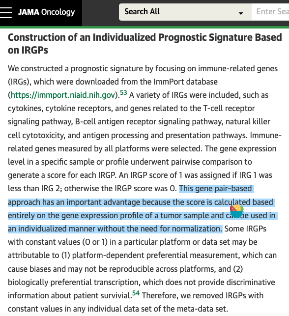

**Author(s)**: `r params$author`  
**Date**: `r Sys.Date()`  

# Academic Citation
If you use this code in your work or research, we kindly request that you cite our publication:

Xiaofan Lu, et al. (2025). FigureYa: A Standardized Visualization Framework for Enhancing Biomedical Data Interpretation and Research Efficiency. iMetaMed. https://doi.org/10.1002/imm3.70005

```{r setup, include=FALSE}
knitr::opts_chunk$set(echo = TRUE)
```

# 需求描述

希望复现第一段构建的算法。只要第一段的计算就行，后面lasso的FigureYa也都有。

# Requirement Description

I want to reproduce the algorithm built in the first segment. As long as the calculation of the first paragraph is OK, the FigureYa of lasso also has it.



Construction of an Individualized Prognostic Signature Based on IRGPs

We constructed a prognostic signature by focusing on immune-related genes (IRGs), which were downloaded from the ImmPort database (https://immport.niaid.nih.gov). A variety of IRGs were included, such as cytokines, cytokine receptors, and genes related to the T-cell receptor signaling pathway, B-cell antigen receptor signaling pathway, natural killer cell cytotoxicity, and antigen processing and presentation pathways. Immune-related genes measured by all platforms were selected. The gene expression level in a specific sample or profile underwent pairwise comparison to generate a score for each IRGP. **An IRGP score of 1 was assigned if IRG 1 was less than IRG 2; otherwise the IRGP score was 0**. 

This **gene pair–based approach has an important advantage because the score is calculated based entirely on the gene expression profile of a tumor sample and can be used in an individualized manner without the need for normalization**. Some IRGPs with constant values (0 or 1) in a particular platform or data set may be attributable to 
(1) platform-dependent preferential measurement, which can cause biases and may not be reproducible across platforms, and 
(2) biologically preferential transcription, which does not provide discriminative information about patient survivial. Therefore, we removed IRGPs with constant values in any individual data set of the meta-data set.

Prognostic IRGPs were selected using the log-rank test to assess the association between each IRGP and patients’ overall survival in the meta-training data set. **Prognostic IRGPs with a familywise error rate less than 0.05 were candidates to build the IRGP index (IRGPI).** To minimize the risk of overfitting, we applied a Cox proportional hazards regression model combined with the least absolute shrinkage and selection operator (glmnet, version 2.0-5). The penalty parameter was estimated by 10- fold cross-validation in the meta-training data set at 1 SE beyond the minimum partial likelihood deviance.

出自<https://jamanetwork.com/journals/jamaoncology/fullarticle/2643120>
from<https://jamanetwork.com/journals/jamaoncology/fullarticle/2643120>

# 应用场景

采用较为传统的方式构建基因对。小伙伴可以后续继续运行lasso或者其他模型构建算法，可参考FigureYa31lasso或FigureYa65SVM。

本文档作者参考例文的思路写了这篇文章，<https://onlinelibrary.wiley.com/doi/10.1002/ctm2.453>，小伙伴可参考。这篇文章里的多个图都可以用FigureYa实现：

- Figure 1E可参考FigureYa90subgroup，F可参考FigureYa35batch_bestSeparation；
- Figure 3G画法可参考FigureYa227boxdensity；
- Figure 4A可参考FigureYa187RMS，E可参考FigureYa173fancybar。

类似的文章，例如<https://www.frontiersin.org/articles/10.3389/fonc.2021.665870/full>，其中多个图也可以用FigureYa实现：

- Figure 2B可参考FigureYa31lasso，C可参考FigureYa39bar；EG可参考FigureYa141risk；
- Figure 3AC可参考FigureYa35batch_bestSeparation；
- Figure 4A可参考FigureYa56immune_inflitration，B-E可参考FigureYa12box；
- Figure 5A可参考FigureYa193RiskTable，B-E可参考FigureYa30nomogram；
- Figure 6可以用clusterprofiler实现<https://github.com/YuLab-SMU/clusterProfiler-book>
- Figure 7可参考FigureYa71ssGSEA和FigureYa165heatmapPvalue；

类似的文章<https://www.sciencedirect.com/science/article/abs/pii/S088875432030971X>，对应的中文解读<https://mp.weixin.qq.com/s/-9xnZos9UVx4ySaZKBWF3Q>。用到的FigureYa：FigureYa69cancerSubtype、FigureYa66单因素cox、FigureYa141risk、FigureYa35batch_bestSeparation、FigureYa162boxViolin、FigureYa131CMap、FigureYa30nomogram

# Application Scenarios

Gene pairs were constructed in a more traditional way. You can continue to run lasso or other model construction algorithms in the future, please refer to FigureYa31lasso or FigureYa65SVM.

The author of this document wrote this article with reference to the idea of example texts, <https://onlinelibrary.wiley.com/doi/10.1002/ctm2.453>, small partners can refer to. Many of the diagrams in this article can be implemented with FigureYa:

- Figure 1E can refer to FigureYa90subgroup, F can refer to FigureYa35batch_bestSeparation;
- Figure 3G can be drawn by FigureYa227boxdensity;
- For Figure 4A, see Figure Ya187RMS, and for E, see Figure Ya173fancybar.

Similar articles, such as <https://www.frontiersin.org/articles/10.3389/fonc.2021.665870/full>, multiple of which can also be implemented with FigureYa:

- Figure 2B can refer to FigureYa31lasso, C can refer to FigureYa39bar; For EG, please refer to FigureYa141risk;
- Figure 3AC can be found in FigureYa35batch_bestSeparation;
- Figure 4A can refer to FigureYa56immune_inflitration, B-E can refer to FigureYa12box;
- Figure 5A can refer to FigureYa193RiskTable, B-E can refer to FigureYa30nomogram;
- Figure 6 can be <https://github.com/YuLab-SMU/clusterProfiler-book> with clusterprofiler
- For Figure 7, refer to FigureYa71ssGSEA and FigureYa165heatmapPvalue;

Similar articles <https://www.sciencedirect.com/science/article/abs/pii/S088875432030971X>, corresponding Chinese interpretation <https://mp.weixin.qq.com/s/-9xnZos9UVx4ySaZKBWF3Q>。 FigureYa used: FigureYa69cancerSubtype, FigureYa66 one-factor cox, FigureYa141risk, FigureYa35batch_bestSeparation, FigureYa162boxViolin, FigureYa131CMap, FigureYa30nomogram

# 环境设置

# Environment settings

```{r}
source("install_dependencies.R")

library(survival)

Sys.setenv(LANGUAGE = "en") #显示英文报错信息 # error messaes are displayed in English
options(stringsAsFactors = FALSE) #禁止chr转成factor # chr is not allowed to be converted to factor
```

加载自定义函数
Load custom functions

```{r}
## 显示进程
## Displays the process
display.progress = function (index, totalN, breakN=20) {
  
  if ( index %% ceiling(totalN/breakN)  ==0  ) {
    cat(paste(round(index*100/totalN), "% ", sep=""))
  }
  
}  

## 生成基因对
## Generate gene pairs
IRGP.generator <- function(expr = NULL, immuneGene = NULL) {
  
  imm_mat <- as.data.frame(t(combn(immuneGene, 2, simplify = T))) # 构建免疫基因的排列组合 # Construct permutations and combinations of immune genes
  rownames(imm_mat) <- paste0("P",rownames(imm_mat))
  colnames(imm_mat) <- c("IRGP1","IRGP2") # 排列组合分为IRGP1和IRGP2 # Permutations are divided into IRGP1 and IRGP2
  IRGP_matrix_1 <- expr[as.character(imm_mat$IRGP1),] # 取出对应的表达 # Take out the corresponding expression
  IRGP_matrix_2 <- expr[as.character(imm_mat$IRGP2),]
  
  # Original text：An IRGP score of 1 was assigned if IRG 1 was less than IRG 2; otherwise the IRGP score was 0. 
  IRGP_matrix <- IRGP_matrix_1 - IRGP_matrix_2  # IRGP矩阵为IRGP1和IRGP2的差值 # The IRGP matrix is the difference between IRGP1 and IRGP2
  for( p in 1:ncol(IRGP_matrix)){
    IRGP_matrix[,p] <- ifelse(IRGP_matrix[,p] < 0,1,0) # 如果IRGP1 < IGRP2，则记为1，否则为0 # If IRGP1 < IGRP2, it is denoted as 1, otherwise it is 0
  }
  rownames(IRGP_matrix) <- rownames(imm_mat)
  
  # Original text：Some IRGPs with constant values (0 or 1) in a particular platform or data set may be attributable to 
  # (1) platform-dependent preferential measurement, which can cause biases and may not be reproducible across platforms, 
  # and (2) biologically preferential transcription, which does not provide discriminative information about patient survivial. 
  # Therefore, we removed IRGPs with constant values in any individual data set of the meta-data set.
  IRGP_matrix <- IRGP_matrix[rowSums(IRGP_matrix) > 0,] # 去掉在所有样本中基因对差值记录为0的基因对 # Remove the gene pairs that were recorded as having a difference of 0 in all samples
  IRGP_matrix <- IRGP_matrix[rowSums(IRGP_matrix) < ncol(IRGP_matrix),] # 去掉在所有样本中基因对差值记录为1的基因对 # Remove the gene pairs that were recorded as 1 in all samples
  
  return(list(IRGP_matrix = IRGP_matrix, IRGP_info = imm_mat))
}
```

# 输入文件

easyinput_tcga_tpm.txt，表达矩阵

easyinput_tcga_surv.txt，样本生存信息

InnateDB_genes_IRIS.txt，免疫基因，来自IRIS <https://innatedb.com/redirect.do?go=resourcesGeneLists>，原文使用ImmPort，这里也提供了list，但是我电脑内存比较小，生成不了那么大的基因对矩阵，所以换用IRIS。

# Input files

easyinput_tcga_tpm.txt, the expression matrix.

easyinput_tcga_surv.txt, sample survival information.

InnateDB_genes_IRIS.txt, immune genes, from IRIS <https://innatedb.com/redirect.do?go=resourcesGeneLists>, the original text uses ImmPort, and a list is also provided here, but my computer memory is relatively small, and I can't generate such a large gene pair matrix, so I use IRIS instead.

```{r}
# 加载表达谱
# Load the expression spectrum
expr <- read.table("easyinput_tcga_tpm.txt",sep = "\t",row.names = 1,check.names = F,stringsAsFactors = F,header = T)

# 加载生存信息
# Load survival information
surv <- read.table("easyinput_tcga_surv.txt",sep = "\t",row.names = 1,check.names = F,stringsAsFactors = F,header = T)

# 加载免疫基因
# Load immune genes
immport <- read.delim("InnateDB_genes_IRIS.txt",sep = "\t",row.names = 1,check.names = F,stringsAsFactors = F,header = T)
```

# 构建基因对并检验
# Construct gene pairs and test them

```{r}
# 取出共有样本和共有免疫基因
# Collect the common samples and common immune genes
comgene <- intersect(rownames(expr),immport$name)[1:100] # 为了加快速度这里只取100个基因，运行自己的程序时请删除末尾[1:100] # In order to speed things up, only 100 genes are taken here, please delete the end when running your own program [1:100]
comsam <- intersect(colnames(expr),rownames(surv))
expr <- expr[comgene,comsam]

# 构建免疫基因对矩阵
# Construct a matrix of immune gene pairs
TCGA.IRPG <- IRGP.generator(expr = expr, # 对数转化与否不重要 # It doesn't matter if you convert logarithmically or not
                            immuneGene = comgene)
# 查看需要构建的基因对数目,4950，100*99/2
# Check the number of gene pairs to be constructed, 4950, 100*99/2
dim(TCGA.IRPG$IRGP_info)
# [1] 4950       2

# 查看最终构建的基因对矩阵，3910（21%）的基因对存在稳定表达故而被删去
# Looking at the final gene pair matrix, 3910 (21%) gene pairs were deleted because they had stable expression
dim(TCGA.IRPG$IRGP_matrix)
# [1] 3910    396

# 采用对数秩检验确定具有预后意义的基因对
# Log-rank test was used to determine the prognostic gene pairs
tmp <- cbind.data.frame(surv[comsam,],as.data.frame(t(TCGA.IRPG$IRGP_matrix)))
futime <- tmp$OS.time
fustat <- tmp$OS
outTab <- NULL
for(i in 3:ncol(tmp)){
  display.progress(index = i,totalN = ncol(tmp),breakN = 20)
  IRGP <- colnames(tmp)[i]

  score <- tmp[,i]
  fitd <- survdiff(Surv(futime, fustat) ~ score, na.action = na.exclude)
  p <- 1-pchisq(fitd$chisq, length(fitd$n)-1)
  outTab <- rbind.data.frame(outTab,
                             data.frame(IRGP = IRGP,
                                        IRGP1 = TCGA.IRPG$IRGP_info[IRGP,"IRGP1"],
                                        IRGP2 = TCGA.IRPG$IRGP_info[IRGP,"IRGP2"],
                                        logrank.p = p,
                                        stringsAsFactors = F),
                             stringsAsFactors = F)
}

# 对p值进行FWER矫正
# FWER correction is performed on the p-value
# Original text：Prognostic IRGPs with a familywise error rate less than 0.05 were candidates to build the IRGP index (IRGPI)
# 在R中，Holm, Hochberg, Hommel, and Bonferroni control the family-wise error rate，所以我们采用Bonferroni
# In R, Holm, Hochberg, Hommel, and Bonferroni control the family-wise error rate, so we use Bonferroni
outTab$fwer <- p.adjust(outTab$logrank.p, method = "bonferroni")
outTab <- outTab[order(outTab$fwer),]
write.table(outTab,file = "output_km screening of gene pair.txt",sep = "\t",row.names = F,col.names = T,quote = F)
```

# Session Info

```{r}
sessionInfo()
```