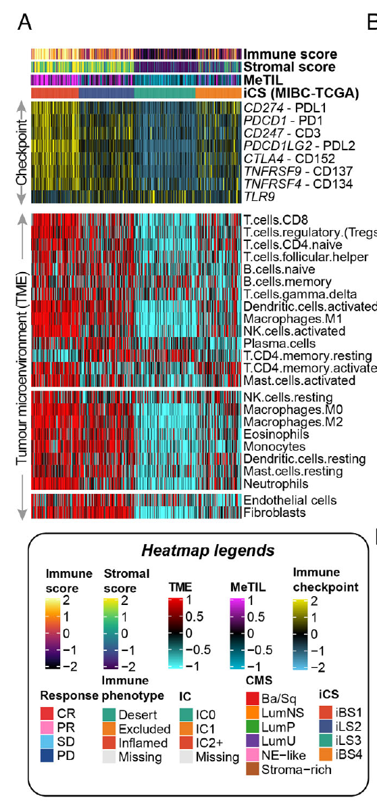

**Author(s)**: `r params$author`  
**Reviewer(s)**: `r params$reviewer`  
**Date**: `r Sys.Date()`  


# Academic Citation
If you use this code in your work or research, we kindly request that you cite our publication:

Xiaofan Lu, et al. (2025). FigureYa: A Standardized Visualization Framework for Enhancing Biomedical Data Interpretation and Research Efficiency. iMetaMed. https://doi.org/10.1002/imm3.70005

```{r setup, include=FALSE}
knitr::opts_chunk$set(echo = TRUE)
```

# 需求描述# Requirement Description

Figure3a的免疫landscape，包括免疫检查点的表达，免疫signature的富集，免疫/基质得分的估计还有甲基化淋巴细胞的定量（Xiaofan Lu老师真是热图高手！）这里主要就是这个DNA甲基化淋巴细胞的定量计算，不知道是怎么来的，所有TCGA数据都可以计算吗？
The immune landscape of Figure 3a includes immune checkpoint expression, immune signature enrichment, immune/stromal score estimation, and methylated lymphocyte quantification (Xiaofan Lu is truly a heatmap expert!). The main goal here is to calculate the quantification of DNA methylated lymphocytes. I'm not sure where this came from, but can this be performed on all TCGA data?



出自<https://www.biorxiv.org/content/10.1101/2021.05.30.446369v1>
Source: <https://www.biorxiv.org/content/10.1101/2021.05.30.446369v1>

该文已被Clinical and Translational Medicine接收<https://doi.org/10.1002/ctm2.601>
This article has been accepted by Clinical and Translational Medicine <https://doi.org/10.1002/ctm2.601>

FIGURE 3 Differential immune profile across MIBC subtypes and its association with genomic alteration and immunotherapeutic response. (A) Heatmap showing the immune profile in the MIBC-TCGA cohort, with the top panel showing the **expression of genes involved in immune checkpoint targets** and the bottom panel showing the **enrichment level of 24 microenvironment cell types**. The immune enrichment score, stromal enrichment score and DNA methylation of tumour-infiltrating lymphocytes (MeTILs) were annotated at the top of the heatmap.

# 应用场景
# Application Scenarios

Xiaofan Lu写了一个神奇的R包——[MOVICS](https://academic.oup.com/bioinformatics/article/36/22-23/5539/6033582)，用自己的数据跑一遍，文章里的key figure就出来了。怎么把这些图组织到一起讲故事呢？这篇文章是个很好的应用MOVICS的例子。
Xiaofan Lu wrote an amazing R package called [MOVICS](https://academic.oup.com/bioinformatics/article/36/22-23/5539/6033582). Run it with your own data, and you'll instantly see the key figures from your article. How can you organize these figures to tell a story? This article provides a great example of MOVICS.

根据甲基化计算DNA methylation of tumour-infiltrating lymphocyte (MeTIL)得分，并根据免疫检查点表达和肿瘤免疫微环境富集绘制热图。
We calculated DNA methylation of tumor-infiltrating lymphocyte (MeTIL) scores based on methylation, and created heatmaps based on immune checkpoint expression and tumor immune microenvironment enrichment.

我们曾在FigureYa170ImmuLncRNA里用estimate包计算肿瘤纯度
We previously used the estimate package in FigureYa170ImmuLncRNA to calculate tumor purity.

例文中很多图我们都实现过，例如：
Many of the figures in the example article:

- Figure 1b的画法可参考FigureYa196PanPie
- Figure 2a的算法可参考FigureYa249Regulon，b的画法可参考FigureYa248MutLandscape
- Figure 3de可产考FigureYa25sankey和FigureYa125Fishertest
- Figure 4f可参考FigureYa106immunotherapy
- Figure 5b可参考FigureYa12box，f可参考FigureYa162boxViolin
- Figure 6可参考FigureYa35batch_bestSeparation，FigureYa144DiagHeatmap或<https://mp.weixin.qq.com/s/34WRZRBVPHUNRLlzNH2nzw>
- Figure S4a可参考FigureYa251NPHSurv
- For the plotting method of Figure 1b, refer to FigureYa196PanPie
- For the algorithm of Figure 2a, refer to FigureYa249Regulon; for the plotting method of Figure 2b, refer to FigureYa248MutLandscape
- For Figure 3d, refer to FigureYa25Sankey and FigureYa125Fishertest
- For Figure 4f, refer to FigureYa106immunotherapy
- For Figure 5b, refer to FigureYa12box; for Figure 5f, refer to FigureYa162boxViolin
- For Figure 6, refer to FigureYa35batch_bestSeparation, FigureYa144DiagHeatmap, or <https://mp.weixin.qq.com/s/34WRZRBVPHUNRLlzNH2nzw>
- For Figure S4a, refer to FigureYa251NPHSurv

# 环境设置
# Environment Setup

```{r}
source("install_dependencies.R")
library(utils)
library(GSVA)
library(ComplexHeatmap) # 用到里面的pheatmap画图然后拼图，需安装2.8以上版本的ComplexHeatmap # Use the pheatmap function to plot and then assemble the image. You must have ComplexHeatmap version 2.8 or later installed.
source("pheatmap_translate.R") # 如果不想放弃较老版本的R及其对应的老ComplexHeatmap，可以只加载新版ComplexHeatmap里的这个函数，该脚本出自2.9.4版ComplexHeatmap # If you don't want to abandon an older version of R and its corresponding ComplexHeatmap, you can just load this function from the newer ComplexHeatmap version. This script is from ComplexHeatmap version 2.9.4.
library(circlize)
library(viridis)
library(gplots)
library(data.table)
library(tidyestimate)
source("annTrackScale.R") # 加载函数，对数值进行标准化并对极端值做截断 # Load the function to normalize and truncate extreme values.
Sys.setenv(LANGUAGE = "en") #显示英文报错信息 # Display English error messages.
options(stringsAsFactors = FALSE) #禁止chr转成factor # Disable conversion of chr values ​​to factors.
```

```{r}
# 加载自定义函数
standarize.fun <- function(indata=NULL, halfwidth=NULL, centerFlag=T, scaleFlag=T) {  
  outdata=t(scale(t(indata), center=centerFlag, scale=scaleFlag))
  if (!is.null(halfwidth)) {
    outdata[outdata>halfwidth]=halfwidth
    outdata[outdata<(-halfwidth)]= -halfwidth
  }
  return(outdata)
}
```

# 利用PCA计算MeTIL得分 # Calculate MeTIL score using PCA

参考文献：Jeschke J, Bizet M, Desmedt C et al. [DNA methylation-based immune response signature improves patient diagnosis in multiple cancers](https://www.jci.org/articles/view/91095), Journal of Clinical Investigation 2017;127:3090-3102.

```{r}
# 读入用MOVICS获取的muscle-invasive bladder cancer (MIBC)亚型
# Read muscle-invasive bladder cancer (MIBC) subtypes obtained using MOVICS
annCol.tcga <- read.table("tcga.mibc.anno.txt",sep = "\t",row.names = 1,check.names = F,stringsAsFactors = F,header = T)

# 读取450K甲基化数据
# 甲基化数据只要用到5个探针的marker就可以，所以这里我的输入数据是简化的，方便传输
# Read 450K methylation data
# Methylation data only requires markers with 5 probes, so the input data here is simplified for ease of transmission
meth <- fread("TCGA-BLCA.methylation450.tsv.gz",sep = "\t",check.names = F,stringsAsFactors = F,header = T,data.table = F)
rownames(meth) <- meth[,1]; meth <- as.data.frame(na.omit(meth[,-1]))

# 匹配亚型 Matching subtypes
colnames(meth) <- substr(colnames(meth), start = 1,stop = 16)
meth <- meth[,which(substr(colnames(meth), 14, 15) == "01")]
meth <- meth[,rownames(annCol.tcga)] 

MeTIL.marker <- c("cg20792833","cg20425130","cg23642747","cg12069309","cg21554552")
meth.metil <- meth[MeTIL.marker,]
MeTIL <- meth[MeTIL.marker,]
MeTIL <- t(scale(t(MeTIL)))

# 计算MeTIL得分 Calculate MeTIL score
pca.MeTIL <- prcomp(MeTIL,center = F,scale. = F)
MeTIL <- pca.MeTIL$rotation[,1]
annCol.tcga$MeTIL <- MeTIL
```

# 计算免疫微环境 Computational immune microenvironment

使用curated免疫签名，包括22个CIBERSORT签名以及2个MCPcounter签名
Using curated immune signatures, including 22 CIBERSORT signatures and 2 MCPcounter signatures

参考文献：Xiao Y, Ma D, Zhao S, et al. [Multi-Omics Profiling Reveals Distinct Microenvironment Characterization and Suggests Immune Escape Mechanisms of Triple-Negative Breast Cancer](https://clincancerres.aacrjournals.org/content/25/16/5002). Clin Cancer Res. 2019
Reference: Xiao Y, Ma D, Zhao S, et al. [Multi-Omics Profiling Reveals Distinct Microenvironment Characterization and Suggests Immune Escape Mechanisms of Triple-Negative Breast Cancer](https://clincancerres.aacrjournals.org/content/25/16/5002). Clin Cancer Res. 2019

```{r}
# 加载表达数据
# Load expression data
tpm <- read.table("tcga.mibc.tpm.txt",
                  sep = "\t", header = TRUE, row.names = 1, 
                  check.names = FALSE, stringsAsFactors = FALSE)

immune.signature <- read.table("Curated_Immune_Cell_Signature.txt",sep = "\t",check.names = F,stringsAsFactors = F,header = T,row.names = NULL)

# 构建计算GSVA的列表 Construct a list for calculating GSVA
cell.type <- unique(immune.signature$CellType)
immune.sig.ccr <- list()
for (i in cell.type) {
  immune.sig.ccr[[i]] <- immune.signature[which(immune.signature$CellType == i),"Symbol"]
}

# 免疫检查点相关基因 Immune checkpoint-related genes
imm.targets <- c("CD274","PDCD1","CD247","PDCD1LG2","CTLA4","TNFRSF9","TNFRSF4","TLR9") 

# 免疫细胞的排序 # Sorting of immune cells
immune.sig.ccr.order <- c("T.cells.CD8", 
                          "T.cells.regulatory..Tregs.",
                          "T.cells.CD4.naive",
                          "T.cells.follicular.helper",
                          "B.cells.naive",
                          "B.cells.memory",
                          "T.cells.gamma.delta",
                          "Dendritic.cells.activated",
                          "Macrophages.M1",
                          "NK.cells.activated",
                          "Plasma.cells",
                          "T.cells.CD4.memory.resting",
                          "T.cells.CD4.memory.activated",
                          "Mast.cells.activated",
                          "NK.cells.resting",
                          "Macrophages.M0",
                          "Macrophages.M2",
                          "Eosinophils",
                          "Monocytes",
                          "Dendritic.cells.resting",
                          "Mast.cells.resting",
                          "Neutrophils",
                          "Endothelial cells",
                          "Fibroblasts")

# 计算immune/stromal得分 # Calculate immune/stromal score
indata <- log2(tpm + 1)

est.tcga <- indata |> 
  filter_common_genes(id = "hgnc_symbol", tell_missing = FALSE, find_alias = TRUE) |> 
  estimate_score(is_affymetrix = TRUE)

rownames(est.tcga) <- est.tcga[,2]; colnames(est.tcga) <- est.tcga[1,]; est.tcga <- est.tcga[-1,c(-1,-2)];
est.tcga <- sapply(est.tcga, as.numeric); rownames(est.tcga) <- c("StromalScore","ImmuneScore","ESTIMATEScore","TumorPurity"); est.tcga.backup = as.data.frame(est.tcga); colnames(est.tcga.backup) <- colnames(indata)

# 对数值进行标准化并对极端值做截断 # Standardize the values ​​and truncate extreme values
est.tcga <- annTrackScale(indata = est.tcga, halfwidth = 2, poolsd = F); est.tcga <- as.data.frame(t(est.tcga)) 
rownames(est.tcga) <- colnames(tpm)

tcga.immune.gsva <- gsva(as.matrix(log2(tpm + 1)),
                         immune.sig.ccr,
                         method = "gsva")
```

# 开始画图 # Start plotting

用complexheatmap里的pheatmap分别画三个热图，然后拼在一起
Use pheatmap in complexheatmap to plot three heatmaps separately, then combine them.

```{r}
# 设置颜色# Set colors
clust.col <- c("#DD492E","#40548A","#32A087","#EC7D21")
heatmap.BlBkRd <- c("#54FEFF","#32ABAA","#125456","#000000","#510000","#A20000","#F30000")
blue <- "#5bc0eb"
gold <- "#ECE700"
cyan <- "#00B3D0"

annCol.tcga$ImmuneScore <- as.numeric(est.tcga[rownames(annCol.tcga),"ImmuneScore"])
annCol.tcga$StromalScore <- as.numeric(est.tcga[rownames(annCol.tcga),"StromalScore"])
annCol.tcga <- annCol.tcga[order(annCol.tcga$CMOIC),]
annColors.tcga <- list() # 构建热图的图例颜色 # Construct the legend color of the heat map
annColors.tcga[["CMOIC"]] <- c("CS1" = clust.col[1],
                               "CS2" = clust.col[2],
                               "CS3" = clust.col[3],
                               "CS4" = clust.col[4])
annColors.tcga[["ImmuneScore"]] <- inferno(64)
annColors.tcga[["StromalScore"]] <- viridis(64)

## 热图1：免疫检查点基因表达
## Heatmap 1: Immune Checkpoint Gene Expression
indata <- log2(tpm[intersect(rownames(tpm),imm.targets),] + 1)
hm1 <- pheatmap(standarize.fun(indata[imm.targets,rownames(annCol.tcga)],halfwidth = 2), # 表达谱数据标准化 # Normalize expression profile data
                border_color = NA, # 热图单元格无边框 # Heatmap cell borders are not displayed
                annotation_col = annCol.tcga[,c("CMOIC","StromalScore","ImmuneScore")],
                annotation_colors = annColors.tcga[c("CMOIC","StromalScore","ImmuneScore")],
                color = colorpanel(64,low=blue,mid = "black",high=gold),
                show_rownames = T, # 显示行名 # Show row names
                show_colnames = F, # 不显示列名# Hide column names
                cellheight = 12, # 热图高度固定# Fixed heatmap height
                cellwidth = 0.6, # 热图宽度固定# Fixed heatmap width
                name = "ICI", # 图例名字# Legend name
                cluster_rows = F, # 行不聚类# No clustering for rows
                cluster_cols = F) # 列不聚类# No clustering for columns

#pdf("CheckPoint_heatmap.pdf",width = 10,height = 10)
hm1
#dev.off()

## 热图2：肿瘤免疫微环境富集得分 Heatmap 2: Tumor Immune Microenvironment Enrichment Scores
hm2 <- pheatmap(standarize.fun(tcga.immune.gsva[immune.sig.ccr.order,rownames(annCol.tcga)],halfwidth = 1), # 富集得分标准化并排序
                border_color = NA,
                color = NMF:::ccRamp(x = heatmap.BlBkRd,n = 64),
                gaps_row = c(14,22), # 根据不同类别的免疫细胞分割 # Segmentation by immune cell class
                show_rownames = T,
                show_colnames = F,
                cellheight = 12,
                cellwidth = 0.6,
                name = "TIME",
                cluster_rows = F,
                cluster_cols = F)

#pdf("TIMEheatmap.pdf",width = 10,height = 10)
hm2
#dev.off()

## 热图3：MeTIL得分 Heatmap 3: MeTIL Score
hm3 <- pheatmap(standarize.fun(t(annCol.tcga[,"MeTIL",drop = F]),halfwidth = 1),
                border_color = NA,
                color = NMF:::ccRamp(c(cyan,"black","#F12AFE"),64),
                show_rownames = T,
                show_colnames = F,
                cellheight = 12,
                cellwidth = 0.6,
                name = "MeTIL",
                cluster_rows = F,
                cluster_cols = F)

#pdf("MeTILheatmap.pdf",width = 10,height = 10)
hm3
#dev.off()
```

可以用下面的方法拼成一张图。也可以分别输出以上三个图到pdf文件，然后用Illustrator等软件打开后拼接。
You can use the following method to create a single image. You can also export the three images above to PDF files separately and then open them in software such as Illustrator to combine them.

```{r}
# 合并热图并输出 # Merge heatmaps and output
pdf("TIME.pdf",width = 10,height = 10)
draw(hm1 %v% hm2 %v% hm3, 
     heatmap_legend_side = "right", 
     annotation_legend_side = "right")
invisible(dev.off())
```

# 后期处理 # Post-processing

输出的pdf文件是矢量图，可以用illustrator等软件打开，编辑图形和文字。
The output PDF file is a vector image and can be opened in software such as Illustrator to edit graphics and text.

# Session Info

```{r}
sessionInfo()
```
