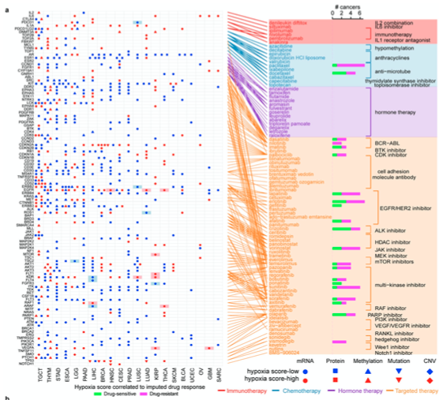

**Author(s)**: `r params$author`  
**Reviewer(s)**: `r params$reviewer`  
**Date**: `r Sys.Date()`  


# Academic Citation
If you use this code in your work or research, we kindly request that you cite our publication:

Xiaofan Lu, et al. (2025). FigureYa: A Standardized Visualization Framework for Enhancing Biomedical Data Interpretation and Research Efficiency. iMetaMed. https://doi.org/10.1002/imm3.70005

```{r setup, include=FALSE}
knitr::opts_chunk$set(echo = TRUE)
```

# 需求描述

这个图有机会能实现吗？感觉很强大



出自<https://doi.org/10.1038/s42255-019-0045-8>

Fig. 7 |. Hypoxia-associated molecular signatures in clinically actionable genes and effects on the response to individual drugs.
(a) Association between FDA-approved drugs and their linked clinically actionable genes (right) and alterations of these genes at mRNA, protein, DNA methylation, mutation and SCNA levels based on hypoxia score-high (red) or hypoxia score-low (blue) samples across 21 cancer types (left). Different symbol shapes represent different types of molecular signatures. 
Filled cells indicate that the gene is a therapeutic target of clinical practice in the corresponding cancer type. 
Bar plots in right panel indicate the number of cancer types with positive correlation (drug-sensitive, magenta) and negative correlation (drug-resistant, green) between hypoxia score and drug response (Spearman’s correlation).

# 应用场景

跟FigureYa174squareCross和FigureYa199crosslink出自同一篇文章，这篇文章以连线著称。后面我们还会实现Figure 3c。

该图的优势是将左右两个panel连起来，同时展示多种特征，具体让哪个形状、颜色代表哪些特征，自己可灵活运用。

为了画这个图，完善了crosslink包，该R包会继续添加更多有趣的连线功能，感兴趣可前往<https://github.com/zzwch/crosslink>查看最新版本及功能，在github上还能提交issue跟作者直接交流。

# 环境设置

```{r}
source("install_dependencies.R")
source("crosslink.R") # From R package crosslink
source("layout.R") # From R package crosslink
source("transfromation.R") # From R package crosslink
source("utils.R") # From R package crosslink

library(magrittr)
library(tidyverse)
library(ggplot2)
source("new-scale.R") # From R package ggnewscale
library(rlang)
library(patchwork)

Sys.setenv(LANGUAGE = "en") #显示英文报错信息
options(stringsAsFactors = FALSE) #禁止chr转成factor
```

自定义函数

```{r}
revLevels <- function(x, levels = NULL){
  if(is.null(levels)) levels <- rev(sort(unique(x)))
  return(factor(x, levels = levels))
}
```

# 输入文件

```{r}
# 加载左侧散点图的数据
hypoxia <- read.csv("easy_input_hypoxia.csv") # 
# 按自己的想法排序
hypoxia$direction <- factor(hypoxia$direction, levels = c("high", "low"))
hypoxia$omics <- factor(hypoxia$omics, levels = c("mRNA", "Protein", "Methylation", "Mutation", "CNV"))
# 背景填充颜色的格子
practice <- read.csv("easy_input_practice.csv") 

# 加载右侧柱状图的数据
drugAnn <- read.csv("easy_input_drugAnn.csv") #
drugs <- drugAnn$drug

# 加载左侧和右侧之间的连线数据
geneAnn <- read.csv("easy_input_geneAnn.csv") #
genes <- unique(geneAnn$gene)

# 设置右侧区域背景/文字/方括号的颜色
color_num <- length(unique(drugAnn$therapy))
# 这里提供了充足的备选颜色
mycolor <- c("red", "dodgerblue3", "darkorchid1", "darkorange",
             "#223D6C","#D20A13","#088247","#FFD121","#11AA4D","#58CDD9","#7A142C","#5D90BA","#431A3D","#91612D","#6E568C","#E0367A","#D8D155","#64495D","#7CC767")[1:color_num]
```

# 开始画图

## 1. prepare left panel

原文：alterations of these genes at mRNA, protein, DNA methylation, mutation and SCNA levels based on hypoxia score-high (**red**) or hypoxia score-low (**blue**) samples across 21 cancer types (left). 

**Different symbol shapes** represent different types of molecular signatures. 

**Filled cells** indicate that the gene is a therapeutic target of clinical practice in the corresponding cancer type.

```{r}
ggplot() +
  # grid tile 
  geom_tile(
    mapping = aes(cancer, gene %>% revLevels()),
    data = expand_grid(cancer = hypoxia$cancer %>% unique(), 
                       gene = hypoxia$gene %>% unique()),
    fill = NA, color = "grey" # 画灰色格子
    ) +
  # fill tile 
  geom_tile(
    mapping = aes(cancer, gene, fill = direction),
    data = hypoxia %>% filter(paste0(gene, "-", cancer) %in% practice$x),
    alpha = 0.3 # 个别格子填充半透明的背景
    ) + 
  geom_point(
    mapping = aes(cancer, gene, color = direction, shape = omics),
    data = hypoxia,
    size = 3) + # 形状的大小
  scale_shape_manual(values = c(15:19)) + # 根据自己的喜好选择形状，这里用实心形状
  scale_color_manual(values = c(low = "blue", high = "red")) +
  scale_fill_manual(values = c(low = "blue", high = "red")) +
  theme_void() +
  theme(axis.text.x = element_text(angle = 90),
        axis.text.y = element_text()) -> p_left
p_left
```

## 2. prepare right panel

```{r}
# 确保加载了 ggnewscale 包
library(ggnewscale)

bracketData <- drugAnn %>%
  select(drug, therapy, signaling) %>%
  unique() %>%
  arrange(desc(drug), signaling) %$%
  data.frame(
    min = !duplicated(signaling) %>% which(),
    max = c((!duplicated(signaling) %>% which())[-1] - 1, length(signaling)),
    signaling = signaling[!duplicated(signaling)],
    therapy = therapy[!duplicated(signaling)]
  )

rectData <- drugAnn %>%
  select(drug, therapy) %>%
  unique() %>%
  arrange(desc(drug)) %$%
  data.frame(
    min = !duplicated(therapy) %>% which(),
    max = c((!duplicated(therapy) %>% which())[-1] - 1, length(therapy)),
    therapy = therapy[!duplicated(therapy)]
  )

# 创建基础图形
base_plot <- ggplot(
  mapping = aes(value, drug),
  data = drugAnn %>%
    select(drug, n_sensitive, n_resistant) %>%
    mutate(drug = revLevels(drug)) %>%
    gather(key = "cat", value = "value", -drug)
)

# 添加第一个填充层（矩形背景）
p_right <- base_plot +
  geom_rect(
    mapping = aes(xmin = -2, xmax = 12, ymin = min - 0.5, ymax = max + 0.5, fill = therapy),
    data = rectData,
    alpha = 0.2, inherit.aes = FALSE
  ) +
  scale_fill_manual(values = mycolor, name = "Therapy") +
  
  # 正确使用 new_scale_fill()
  new_scale_fill() +
  
  # 添加条形图（使用新的填充尺度）
  geom_bar(
    mapping = aes(fill = cat),
    stat = "identity",
    position = position_dodge(width = 0.8)
  ) +
  scale_fill_manual(values = c("magenta", "green"), name = "Category") +
  
  # 添加其他图层
  geom_segment(
    mapping = aes(x = 9, xend = 9, y = min, yend = max, color = therapy),
    data = bracketData, inherit.aes = FALSE
  ) +
  geom_segment(
    mapping = aes(x = 9 - 0.1, xend = 9, y = min, yend = min, color = therapy),
    data = bracketData, inherit.aes = FALSE
  ) +
  geom_segment(
    mapping = aes(x = 9 - 0.1, xend = 9, y = max, yend = max, color = therapy),
    data = bracketData, inherit.aes = FALSE
  ) +
  scale_color_manual(values = mycolor, guide = "none") +
  
  geom_text(
    mapping = aes(x = 9, y = (max + min) / 2, label = signaling),
    data = bracketData,
    hjust = -0.1, inherit.aes = FALSE, size = 3
  ) +
  
  geom_text(
    mapping = aes(x = -1, y = drug, label = drug, color = therapy),
    data = drugAnn %>% mutate(drug = revLevels(drug)),
    inherit.aes = FALSE, hjust = 1
  ) +
  
  theme_void() + 
  theme(
    axis.text.x = element_text(),
    axis.ticks.x = element_line(), 
    axis.title.x = element_text(),
    axis.line.x = element_line(),
    legend.position = "bottom"
  ) +
  labs(x = "# Cancers") +
  coord_cartesian(xlim = c(-2, 12))

# 显示图形
print(p_right)
```

## 3. crosslink combining left and right panels

```{r fig.width=10, fig.height=8}
cl_plot(
  crosslink(
    data.frame(
      key = c(genes, drugAnn$drug),
      therapy = c(rep(NA, length(genes)), drugAnn$therapy),
      by = c(rep("Gene", length(genes)),
             rep("Drug", length(drugAnn$drug)))
      ), 
  geneAnn %>% mutate(therapy = drugAnn$therapy[match(drug ,drugAnn$drug)]), 
  cross.by = "by",
  key.by = "key",
  src.by = "gene",
  tar.by = "drug") %>% 
    tf_flip("y"), 
  link = list(mapping = aes(color = therapy),
              scale = list(color = scale_color_manual(values = mycolor))),
  cross = NA,
  label = NA,
  add = theme_void(),
  annotation = cl_annotation(
    left = p_left, left.by = "Gene", left.width = 2,
    right = p_right, right.by = "Drug", right.width = 4
  ))

ggsave("panelLink.pdf", width = 10, height = 10)
```

# 附：示例数据生成过程

```{r eval=FALSE}
# Drug1-Drug20
# Gene1-Gene30
# Cancer1-Cancer10

drugs <- paste0("Drug", 1:20 %>% format)
genes <- paste0("Gene", 1:30 %>% format)
cancers <- paste0("Cancer", 1:10 %>% format)

set.seed(666)

drugAnn <- data.frame(
  drug = drugs,
  therapy = rep(c("Immunotherapy", "Chemotherapy", "Hormone therapy", "Targeted therapy"), each = 5),
  n_sensitive = sample(c(NA, 1:4), 20, replace = T),
  n_resistant = sample(c(NA, 1:4), 20, replace = T),
  signaling = paste0("Signaling", c(1, 2, 3, 3, 4, 5, 5, 6, 6,6, 7, 7, 7, 7, 7, 8, 9,9, 10, 10) %>% format))
write.csv(drugAnn, "easy_input_drugAnn.csv", quote = F, row.names = F)

geneAnn <- data.frame(
  gene = c(genes, sample(genes, 10, replace = T)) %>% sort(),
  drug = c(drugs, sample(drugs, 20, replace = T)) %>% sort()
) %>% unique()
write.csv(geneAnn, "easy_input_geneAnn.csv", quote = F, row.names = F)

n_pairs <- 200
hypoxia <- data.frame(
  cancer = sample(cancers, n_pairs, replace = T),
  gene = sample(genes, n_pairs, replace = T)
) %>% unique()

hypoxia %<>% 
  mutate(
    direction = sample(c("high", "low"), nrow(hypoxia), replace = T),
    omics = sample(c("mRNA", "Protein", "Methylation", "Mutation", "CNV"), nrow(hypoxia), replace = T)
    )
write.csv(hypoxia, "easy_input_hypoxia.csv", quote = F, row.names = F)

practice <- sample(paste0(hypoxia$gene, "-", hypoxia$cancer), 10, replace = T) %>% unique()
write.csv(practice, "easy_input_practice.csv", quote = F, row.names = F)
```

# Session Info

```{r}
sessionInfo()
```