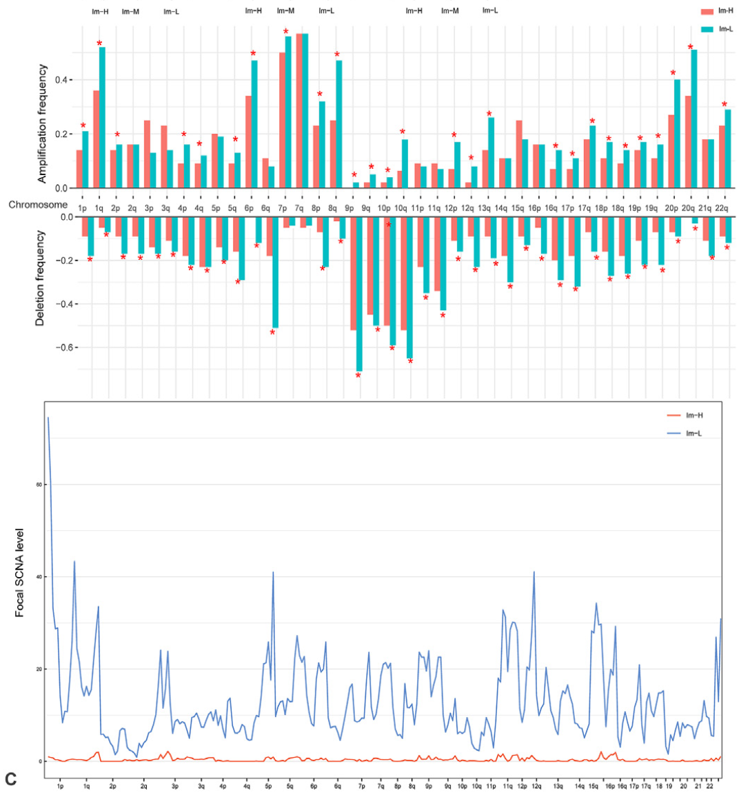

**Author(s)**: `r params$author`  
**Date**: `r Sys.Date()`  

# Academic Citation
If you use this code in your work or research, we kindly request that you cite our publication:

Xiaofan Lu, et al. (2025). FigureYa: A Standardized Visualization Framework for Enhancing Biomedical Data Interpretation and Research Efficiency. iMetaMed. https://doi.org/10.1002/imm3.70005

```{r setup, include=FALSE}
knitr::opts_chunk$set(echo = TRUE)
```

# 需求描述

比较Im-H和Im-L两个组臂级扩增和缺失频率和焦点级扩增和缺失水平，画出图4B的最后两个图。示例数据随便就行。

# Requirement Description

Compare the arm-level amplification and deletion frequencies and focus-level amplification and deletion levels between the two groups of Im-H and Im-L, and plot the last two plots of Figure 4B. Sample data is just fine.



出自<https://linkinghub.elsevier.com/retrieve/pii/S2001037021003366>
from<https://linkinghub.elsevier.com/retrieve/pii/S2001037021003366>

Fig. 4. Molecular features of the immune subtypes of melanoma. 
B. Comparisons of tumor mutation burden (TMB), homologous recombination deficiency (HRD) scores, and global methylation levels among the three immune subtypes in TCGA-melanoma; 
prediction of **high-immune-score (upper third) versus low-immune-score (bottom third)** melanomas using **TMB and somatic copy number alteration (SCNA) score** by the logistic regression model; 
comparisons of **arm-level amplification and deletion frequencies** and **focal-level amplification and deletion levels** between Im-H and Im-L melanomas.

# 应用场景

循环计算不同组别的扩增和缺失比例，对臂水平扩增和缺失做检验，并绘图。

另外，Figure 5E、7D、9这种分布图的画法可参考FigureYa227boxdensity。

# Application Scenarios

The amplification and deletion ratios of different groups were calculated in cycles, and the horizontal amplification and deletion of the arm were tested and plotted.

In addition, for the distribution chart of Figure 5E, 7D, and 9, please refer to FigureYa227boxdensity.

# 环境设置

# Environment settings

```{r}
source("install_dependencies.R")

library(ggplot2)
library(patchwork)
library(data.table)

Sys.setenv(LANGUAGE = "en") #显示英文报错信息 # error messages are displayed in English
options(stringsAsFactors = FALSE) #禁止chr转成factor # chr is not allowed to be converted to factor
```

# 输入文件

用GenePattern上的GISTIC分析可得到broad_data_by_genes.txt以及all_data_by_genes.txt文件，或可参照FigureYa79CNV。

easy_input_annotation.txt，样本分组信息。

# Input files

The broad_data_by_genes.txt and all_data_by_genes.txt files can be obtained by GISTIC analysis on GenePattern, or refer to FigureYa79CNV.

easy_input_annotation.txt. Sample grouping information.

```{r}
# 读取GISTIC结果
# Read GISTIC results
# arm-level
armCNV <- read.delim("broad_values_by_arm.txt",sep = "\t",row.names = 1,check.names = F,stringsAsFactors = F,header = T)
# focal-level
geneCNV <- read.delim("all_data_by_genes.txt",sep = "\t",row.names = 1,check.names = F,stringsAsFactors = F,header = T)

# 读取样本分组信息
# Read the sample grouping information
subt <- read.delim("easy_input_annotation.txt",sep = "\t",row.names = 1,check.names = F,stringsAsFactors = F,header = T)
comsam <- intersect(rownames(subt),colnames(armCNV))
armCNV <- armCNV[,comsam]
subt <- subt[comsam,,drop = F]

sam1 <- rownames(subt[which(subt$PAM == "basal"),,drop = F])
sam2 <- rownames(subt[which(subt$PAM == "luminal"),,drop = F])
```

# arm-level amplification and deletion frequencies

```{r}
# 设置扩增和缺失的阈值
# Set thresholds for amplification and deletions
cna.cutoff <- 0 # 这里认为>0则为扩增，<0则为缺失 # >0 is considered to be amplification, and <0 is missing

# 循环计算不同组别的扩增和缺失比例
# Cycle to calculate the proportion of amplification and deletion in different groups
outTab.arm <- NULL
for (i in rownames(armCNV)) {
  message(i)
  
  # 取出当前臂的结果
  # Take out the result of the current arm
  tmp <- data.frame(cna = as.numeric(armCNV[i,]),
                    group = subt$PAM,
                    stringsAsFactors = F)
  
  # 初始化loss和amp
  # Initialize loss and amp
  loss <- amp <- tmp
  loss$cna <- ifelse(loss$cna < cna.cutoff,"LOSS","Others") # 当cna小于阈值则loss，正常或扩增认为是others # When the CNA is less than the threshold, it is considered loss, and normal or amplified is considered to be others
  amp$cna <- ifelse(amp$cna > -cna.cutoff,"AMP","Others") # 当cna大于阈值则amplification，正常或缺失认为是others # When the CNA is greater than the threshold, it is amplification, normal or absent is considered to be others
  
  # 构建数据框
  # Build a data frame
  loss.dt <- as.data.frame.array(table(loss$cna,loss$group)) 
  amp.dt <- as.data.frame.array(table(amp$cna,amp$group))
  
  # 计算扩增或者缺失的比例，以及对应在两组间的p值
  # Calculate the proportion of amplifications or deletions, and the corresponding p-values between the two groups
  if(!is.element("AMP",rownames(amp.dt))) { # 如果在该臂中不存在扩增，则比例记为0，p值记为空 # If there is no amplification in this arm, the scale is denoted as 0 and the p-value is denoted as empty
    amp.pct <- c(0,0)
    amp.p <- NA
  } else {
    amp.pct <- as.numeric(amp.dt[1,]/colSums(amp.dt))
    amp.p <- fisher.test(amp.dt)$p.value
  }
  
  if(!is.element("LOSS",rownames(loss.dt))) { # 如果在该臂中不存在缺失，则比例记为0，p值记为空 # If there are no missing in that arm, the scale is denoted as 0 and the p-value is denoted as empty
    loss.pct <- c(0,0)
    loss.p <- NA
  } else {
    loss.pct <- as.numeric(loss.dt[1,]/colSums(loss.dt))
    loss.p <- fisher.test(loss.dt)$p.value
  }
  
  outTab.arm <- rbind.data.frame(outTab.arm,
                                 data.frame(arm = i,
                                            loss.C1 = loss.pct[1],
                                            loss.C2 = loss.pct[2],
                                            p.loss = loss.p,
                                            amp.C1 = amp.pct[1],
                                            amp.C2 = amp.pct[2],
                                            p.amp = amp.p,
                                            stringsAsFactors = F),
                                  stringsAsFactors = F)
}

# 输出到文件
# Output to file
write.table(outTab.arm, file = "output_percentage and fisher test of cnv in two groups.txt",sep = "\t",row.names = F,col.names = T,quote = F)
```

用ggplot2绘制柱状图

先绘制下面的缺失部分

Plot a histogram with ggplot2

Draw the missing parts below first

```{r}
# 使用 reshape2::melt() 来明确指定使用 reshape2 包中的 melt 函数
wide <- outTab.arm[,1:4]
df <- as.data.frame(reshape2::melt(wide, measure.vars = c("loss.C1", "loss.C2")))
df$variable <- gsub("loss.","",df$variable,fixed = TRUE)
df$arm <- factor(df$arm, levels = c("1p","1q","2p","2q","3p","3q","4p","4q","5p","5q","6p","6q","7p","7q","8p","8q","9p","9q","10p","10q","11p","11q","12p","12q","13p","13q","14p","14q","15p","15q","16p","16q","17p","17q","18p","18q","19p","19q","20p","20q","21p","21q","22p","22q"))

p_bot <- ggplot(df, aes(arm, value)) +   
  geom_bar(aes(fill = variable), position = "dodge", stat="identity") +
  xlab(NULL) + ylab("Deletion frequency") +
  
  #scale_fill_manual(values = c("#2874C5", "#EABF00")) + # 可以用这行修改配色 # You can use this line to change the color scheme
  annotate(geom="text", # 标星* # Star*
           x = 1:nrow(wide),
           y = ifelse(wide[,2] > wide[,3],
                      wide[,2] + 0.03, # 微调*的位置 # Fine-tune* the position
                      wide[,3] + 0.03),
           size = 10, angle = 0, fontface = "bold",
           label = ifelse(wide[,4] < 0.05,"*",""),
           color = "red") + # 星的颜色 # The color of the star
  
  theme_bw() + 
  theme(axis.ticks.y = element_line(size = 0.2),
        axis.text.y = element_text(size = 10, color = "black"),
        axis.title.x = element_text(vjust = -0.3,size = 12, color = "black"),
        axis.text.x = element_blank(),
        plot.margin = unit(c(0.3, -1.7, 0.3, 0.3), "lines"),
        legend.position = "none",
        #panel.border = element_blank(),
        legend.title = element_blank()) +
  scale_y_reverse()

p_bot
```

然后绘制上面的扩增部分
Then plot the amplification section above

```{r}
wide <- outTab.arm[,c(1,5:7)]
df <- as.data.frame(reshape2::melt(wide, measure.vars = c("amp.C1", "amp.C2")))
df$variable <- gsub("amp.","",df$variable,fixed = T)
df$arm <- factor(df$arm, levels = c("1p","1q","2p","2q","3p","3q","4p","4q","5p","5q","6p","6q","7p","7q","8p","8q","9p","9q","10p","10q","11p","11q","12p","12q","13p","13q","14p","14q","15p","15q","16p","16q","17p","17q","18p","18q","19p","19q","20p","20q","21p","21q","22p","22q"))

p_top <- ggplot(df, aes(arm, value)) +   
  geom_bar(aes(fill = variable), position = "dodge", stat="identity") +
  xlab(NULL) + ylab("Amplification frequency") +
  
  annotate(geom="text", # 标星* # Star*
           x = 1:nrow(wide),
           y = ifelse(wide[,2] > wide[,3],
                      wide[,2] + 0.01, # 微调*的位置 # # Adjust the position of the star
                      wide[,3] + 0.01),
           size = 10, angle = 0, fontface = "bold",
           label = ifelse(wide[,4] < 0.05,"*",""),
           color = "red") +
  
  theme_bw() + 
  theme(axis.ticks.y = element_line(size = 0.2),
        axis.text.y = element_text(size = 10, color = "black"),
        axis.title.x = element_text(vjust = -0.3,size = 12, color = "black"),
        axis.text.x = element_text(size = 10, color = "black"),
        plot.margin = unit(c(0.3, -1.7, 0.3, 0.3), "lines"),
        legend.position = "top",
        #panel.border = element_blank(),
        legend.title = element_blank())

p_top
```

拼在一起
Piece it together

```{r fig.width=12, fig.height=10}
pal <- p_top + p_bot +
  plot_layout(ncol = 1,widths = c(6,6), guides = 'collect') & theme(legend.position = 'right',legend.key.size = unit(0.4, 'cm'))
pal

# 输出pdf文件
# Export PDF file
ggsave("arm-level scnv frequency barplot.pdf", width = 12, height = 10)
```

# focal-level amplification and deletion levels

对同样cytoband的gene-level的SCNA取均值，得到不同染色体臂不同focal的SCNA
The gene-level SCNA of the same cytoband was averaged to obtain SCNA with different focal cals of different chromosomal arms

```{r}
focal.level <- factor(geneCNV$Cytoband, levels = unique(geneCNV$Cytoband))
focal.cna <- apply(geneCNV[,setdiff(colnames(geneCNV), c("Cytoband","Gene ID"))], 2, 
                    function(x) tapply(x, INDEX=factor(geneCNV$Cytoband), FUN=mean, na.rm=TRUE)) 
focal.cna <- focal.cna[levels(focal.level),] # 按照染色体臂顺序排列 # Arranged in chromosomal arm order

# 保存到文件
# Save to file
write.table(focal.cna, file = "output_focal-level cnv.txt",sep = "\t",row.names = T,col.names = NA,quote = F)
```

提取两个分组的SCNA
Extract two grouped SCNAs

```{r}
tmp1 <- as.data.frame(focal.cna[,sam1]) # 取出类1的SCNA # Remove Class 1 SCNA
tmp1$scna <- as.numeric(rowSums(tmp1)) # 对SCNA取行和，表示该亚型的在染色体上的SCNA水平 # Sums the rows of SCNA to indicate the chromosomal SCNA level of the subtype
tmp1$loci <- 1:nrow(tmp1)
lw1 <- loess(scna ~ loci,data=tmp1,span = 0.02) # 直接使用行和会让折线变得很尖锐，所以这里我采用loess平滑来表现SCNA的趋势（原文并没有采用） # Using the row sum directly will make the line very sharp, so here I use loess smoothing to show the trend of SCNA (the original text did not use it)

tmp2 <- as.data.frame(focal.cna[,sam2]) # 取出类2的SCNA # Extract Class 2 SCNA
tmp2$scna <- as.numeric(rowSums(tmp2)) # 对SCNA取行和，表示该亚型的在染色体上的SCNA水平 # Sums the rows of SCNA to indicate the chromosomal SCNA level of the subtype
tmp2$loci <- 1:nrow(tmp2)
lw2 <- loess(scna ~ loci,data=tmp2,span = 0.02) # 直接使用行和会让折线变得很尖锐，所以这里我采用loess平滑来表现SCNA的趋势（原文并没有采用） # Using the row sum directly will make the line very sharp, so here I use loess smoothing to show the trend of SCNA (the original text did not use it)
```

用base plot画图
Draw with base plot

```{r}
ylim <- pretty(c(min(c(range(lw1$fitted),range(lw2$fitted))),max(c(range(lw1$fitted),range(lw2$fitted))))) # 得到比较“温和”的y轴区间 # Get a more "mild" y-axis interval
xlab <- rownames(focal.cna) # 得到具体的染色体focal # Get the specific chromosome focal
xlab <- sapply(strsplit(xlab,".",fixed = T),"[",1) # 只取focal中“.”之前的字符串部分 # Take only the "focal" in the focal." string part before that
xlab <- substr(xlab, 1, nchar(xlab) - 2); txt <- unique(xlab) # 去掉字符串末尾的2个字符，以获得带有q或者p的染色体臂字符串，此时取独特的字符作为x轴的标签 # Remove the 2 characters at the end of the string to get a chromosome arm string with q or p, and use the unique character as the x-axis label
xlab <- factor(xlab, levels = c("1p","1q","2p","2q","3p","3q","4p","4q","5p","5q","6p","6q","7p","7q","8p","8q","9p","9q","10p","10q","11p","11q","12p","12q","13p","13q","14p","14q","15p","15q","16p","16q","17p","17q","18p","18q","19p","19q","20p","20q","21p","21q","22p","22q")) # 赋予因子 # Bestow factor

pdf("focal-scna line chart.pdf", width = 12, height = 8)
par(bty="o", mgp = c(2,0.3,0), mar = c(3.1,3.1,2.1,3.1),tcl=-.25, font.main = 3, las = 1)
plot(1:nrow(tmp1),     
     lw1$fitted,
     ylim = range(ylim),
     ylab = "Focal SCNA level",
     xlab = "",
     xaxt = "n",
     yaxs = "i", # 移除y轴和图像间的空隙 # Remove the gap between the y-axis and the image
     xaxs = "i", # 移除x轴和图像间的空隙 # Remove the gap between the x-axis and the image
     type = "l",
     cex = 1.5,
     col = "red")
lines(1:nrow(tmp2),
      lw2$fitted,
      col = "#2166AC", #蓝色 # Blue
      cex = 1.5)
axis(side = 1, at = unique(cumsum(table(xlab))), labels = txt, cex.axis = 0.8, gap.axis = -1) # gap.axis为负数强制标记出所有的x轴标签 # gap.axis is a negative number, which can force all x-axis tags to be marked
grid() # 添加网格 # Add a grid
legend("topright", legend = c("Basal","Luminal"), lty = 1, col = c("red","blue"), cex = 1, bty = "n")

invisible(dev.off())
```


# 后期处理

focal-scna line chart.pdf的横坐标label有重叠，原文的处理方式是删掉重叠部分，间隔保留几个label。

输出的PDF文件是矢量图，可以用Illustrator等编辑器打开，修改图形和文字。

也可以在dev.off之前用axis手动写入要写的label，用?axis查看写法。

# Post-processing

The abscissa label of the focal-scna line chart.pdf overlaps, and the original treatment is to delete the overlapping part and keep several labels at intervals.

The output PDF file is a vector that can be opened with an editor such as Illustrator to modify graphics and text.

You can also manually write the label you want to write with axis before dev.off. axis to see how to write it.

# Session Info

```{r}
sessionInfo()
```