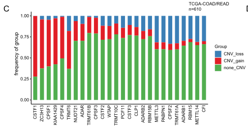

**Author(s)**: `r params$author`  
**Reviewer(s)**: `r params$reviewer`  
**Date**: `r Sys.Date()`  

# Academic Citation
If you use this code in your work or research, we kindly request that you cite our publication:

Xiaofan Lu, et al. (2025). FigureYa: A Standardized Visualization Framework for Enhancing Biomedical Data Interpretation and Research Efficiency. iMetaMed. https://doi.org/10.1002/imm3.70005

```{r setup, include=FALSE}
knitr::opts_chunk$set(echo = TRUE)
```

# 需求描述
# Demand description

画出CNV的这个图。

Draw this CNV plot.



出自：<https://molecular-cancer.biomedcentral.com/articles/10.1186/s12943-021-01322-w>，跟FigureYa259circLink和FigureYa262GDC出自同一篇文章。

图1. CRC中RNA修饰“书写器”的遗传及转录改变。
c, 柱状图显示TCGA-COAD/READ队列中RNA修饰“书写器”的CNV增益（红色）、缺失（蓝色）和非CNV（绿色）的频率。每根柱子的高度代表改变频率。

Source: <https://molecular-cancer.biomedcentral.com/articles/10.1186/s12943-021-01322-w>, it is from the same article as FigureYa259circLink and FigureYa262GDC.

Fig. 1 Genetic and transcriptional alterations of RNA modification “writers” in CRC. 
c, Bar graphs showing the frequency of CNV gain (red), loss (blue) and non_CNV (green) of RNA modification “writers” in the TCGA-COAD/READ cohort. The height of each bar represents the alteration frequency.

# 应用场景
# Application scenarios

外显子测序数据可以画这样的图。

RNA-seq数据也可以借助这样的分析来深挖。例如RNA-seq筛出成百上千个差异基因，谁才是关键基因？它通过什么方式影响了下游基因的表达？或许是某些基因发生了高频copy number variation（gain/loss）。

Exome sequencing data can generate similar plots.

RNA-seq data can also be leveraged for in-depth analysis using such approaches. For example, when RNA-seq identifies hundreds or thousands of differentially expressed genes, how can we pinpoint the key drivers? By what mechanisms do they regulate downstream gene expression? One possible explanation could be high-frequency copy number variations (gain/loss) in certain genes.

# 环境设置
# Environment Setup

```{r}
source("install_dependencies.R")

library(magrittr)
library(tidyverse)
library(org.Hs.eg.db)
library(TCGAbiolinks)
library(clusterProfiler)
library(SummarizedExperiment)

# 显示英文报错信息
# Show English error messages
Sys.setenv(LANGUAGE = "en") 

# 禁止chr转成factor
# Prevent character-to-factor conversion
options(stringsAsFactors = FALSE) 
```

# 输入数据
# Input Files

从GDC下载hg38的CNV数据，以COAD/READ为例。

easy_input_gene.txt，要看哪些基因的CNV，就写到这个文件里。甚至可以把所有差异基因或参与某个通路的基因都拿来计算，查看输出文件`output_cnv.csv`。然后筛选gain或loss频率高的前十几个基因，进行画图展示。

Download hg38 CNV data from GDC, using COAD/READ as an example.

The file easy_input_gene.txt should contain the list of genes for CNV analysis. You may include all differentially expressed genes or pathway-related genes for calculation, then check the output file `output_cnv.csv`. Subsequently, select the top ~10 genes with high-frequency gains or losses for visualization.

```{r}
on.exit(unlink("GDCdata", recursive = TRUE, force = TRUE), add = TRUE)

# 查询并下载TCGA-COAD拷贝数变异数据
# Query and download TCGA-COAD copy number variation data
cnv_COAD <- GDCquery(
  project = "TCGA-COAD",  
  data.category = "Copy Number Variation",
  data.type = "Gene Level Copy Number",
  access = "open",
  workflow.type = "ASCAT3",
  experimental.strategy = "Genotyping Array"
) %T>%
  GDCdownload %>% GDCprepare
dim(cnv_COAD)

# 查询并下载TCGA-READ拷贝数变异数据
# Query and download TCGA-READ copy number variation data
cnv_READ <- GDCquery(project = "TCGA-READ",  
  data.category = "Copy Number Variation",
  data.type = "Gene Level Copy Number",
  access = "open",
  workflow.type = "ASCAT3",
  experimental.strategy = "Genotyping Array"
) %T>%
  GDCdownload %>% GDCprepare
dim(cnv_READ)

# 提取拷贝数数据
# Extract copy number data
cnv_COAD_data <- assay(cnv_COAD, "copy_number")
cnv_READ_data <- assay(cnv_READ, "copy_number")

# 合并COAD和READ数据
# Merge COAD and READ data
cnv_data <- cbind(cnv_COAD_data, cnv_READ_data)

# 统一colData
# Harmonize colData
common_cols <- intersect(colnames(colData(cnv_COAD)), colnames(colData(cnv_READ)))
colData_COAD <- colData(cnv_COAD)[, common_cols]
colData_READ <- colData(cnv_READ)[, common_cols]
combined_colData <- rbind(colData_COAD, colData_READ)

# 重建 SummarizedExperiment
# Reconstruct SummarizedExperiment
cnv <- SummarizedExperiment(
  assays = list(copy_number = cnv_data),
  colData = combined_colData,
  rowData = rowData(cnv_COAD)
)

# 检查合并结果
# Check merging results
dim(cnv)

# 删除重复的sample
# Remove duplicate samples
cnv <- cnv[,!duplicated(colnames(cnv))]
dim(cnv)

# Define a gene set of interest
# 定义感兴趣的基因集

## 方法1：从文件读取
## Option 1: Read from file
genes <- read.table("easy_input_gene.txt", header = T)$SYMBOL

## 方法2：直接指定基因
## Option 2: Directly specify genes (commented out example)
#genes <- c("METTL3", "METTL14", "FTO", "ALKBH5","IGF2BP3",
#           "YTHDF1", "YTHDF2", "YTHDF3", "IGF2BP1", "IGF2BP2", )
```

# 计算gain和loss频率
# Calculate gain and loss frequency
```{r}
# 将CNV数据转换为数据框并处理基因符号
# Convert CNV data to dataframe and process gene symbols 
cnv_df <- as.data.frame(assay(cnv, "copy_number")) %>%
  rownames_to_column("Gene_Symbol")

# CNV数据处理流程
# Process CNV data    
cnv2 <- cnv_df %>%
  
  # 提取ENSEMBL ID（取前15位字符）  
  # Extract ENSEMBL IDs (first 15 characters)  
  mutate(ENSEMBL = str_sub(Gene_Symbol, 1, 15)) %>%
  
  # 转换为基因名SYMBOL
  # Convert to gene symbols
  inner_join(bitr(.$ENSEMBL,
                  fromType = "ENSEMBL",
                  toType = "SYMBOL",
                  OrgDb = org.Hs.eg.db)) %>% 
  
  # 去除转换时可能产生的重复项
  # Remove potential duplicates after conversion
  distinct(SYMBOL, .keep_all = TRUE) %>% 
  
  # 仅保留目的基因
  # Filter for target genes
  filter(SYMBOL %in% genes) %>% 
  
  # 将SYMBOL作为行名
  # SYMBOL is used as rownames
  column_to_rownames("SYMBOL") %>% 
  
  # 移除注释信息列  
  # Remove metadata columns  
  dplyr::select(-ENSEMBL, -Gene_Symbol) %>% 
  
  # 筛选肿瘤样本（TCGA编号第14-15位<10）  
  # Filter tumor samples (TCGA barcode positions 14-15 < 10)  
  select_if(str_sub(colnames(.), 14, 15) < 10) %>% 
  
  # 计算CNV频率（基于ASCAT3的整数拷贝数）
  # Calculate CNV frequencies (based on ASCAT3-derived integer copy number values)
    mutate(
    CNV_loss = rowMeans(.< 2, na.rm = TRUE),   
    CNV_gain = rowMeans(.> 2, na.rm = TRUE),   
    CNV_normal = rowMeans(. == 2, na.rm = TRUE)  
  ) %>% 
 
  # 仅保留频率指标
  # Keep only frequency metrics  
  dplyr::select(CNV_loss, CNV_gain, CNV_normal) %>% 
  
  # 恢复基因名列  
  # Restore gene symbols column  
  rownames_to_column("gene") %>% 
  
  # 将数据转变为长数据，便于绘图
  # Convert to long format for plotting  
  pivot_longer(!gene, names_to = "Group", values_to = "pct") %>% 
  
  # 转换为百分比
  # Convert to percentage
  mutate(pct = pct * 100)

# 保存处理结果  
# Save processed data  
write.csv(cnv2, "output_cnv.csv", row.names = F, quote = F)
```

# 开始画图
# Plotting

```{r}
# 选项1：使用easy_input_gene.txt中预定义的顺序
# Option 1: Use predefined order from easy_input_gene.txt
#cnv2$gene <- factor(cnv2$gene, levels = genes)

# 选项2：按CNV扩增频率降序排序
# Option 2: Sort by CNV gain frequency (descending)
cnv2_gain <- cnv2[cnv2$Group == "CNV_gain",]
cnv2_gain_sorted <- cnv2_gain[order(cnv2_gain$pct, decreasing = T),] 
cnv2$gene <- factor(cnv2$gene, levels = cnv2_gain_sorted$gene)


# 设置条形图堆叠顺序
# Set bar plot order
cnv2$Group <- factor(cnv2$Group, levels = c("CNV_loss", "CNV_gain", "CNV_normal"))

# 生成堆积条形图
# Generate stacked bar plot
ggplot(cnv2, aes(x = gene, y = pct, fill = Group)) +
  
  # 绘制堆积条形图
  # Draw stacked bars
  geom_col(position = "stack") +
  
  # 添加标题
  # Add title
  ggtitle(paste0("TCGA-COAD/READ\nn=", ncol(cnv) - 3)) +
  
  # 手动添加颜色
  # Custom color scheme
  scale_fill_manual(values = c("steelblue3", "firebrick2",  "forestgreen")) +
  
  # 坐标轴标签
  # Axis labels
  xlab("m6A genes") +
  ylab("Frequency of group(%)") +
  
  theme_classic() +
  theme(axis.line = element_line(size = 1, lineend = "square"),
        axis.title = element_text(size = 15,face = "bold"),
        axis.text.y = element_text(size = 12,face = "bold"),
        axis.text.x = element_text(size = 12,face = "bold", angle = 90, hjust = 1),
        axis.ticks.length = unit(0.25,"cm"),
        axis.ticks = element_line(size = 1),
        legend.text = element_text(size = 12,face = "bold"),
        legend.title = element_text(size = 15,face = "bold")) 

# 保存为PDF
# Save as PDF
ggsave("CNV.pdf", width = 6, height = 4)
```

我们算出的frequency跟原文差距较大，跟[cBioPortal](/www.cbioportal.org)结果相近。跟原文作者联系，还没有回复。

The frequencies we calculated show significant discrepancies from those reported in the original paper, but align closely with results from [cBioPortal](/www.cbioportal.org). We have reached out to the original authors for clarification but have not yet received a response.


# Session Info

```{r}
sessionInfo()
```
