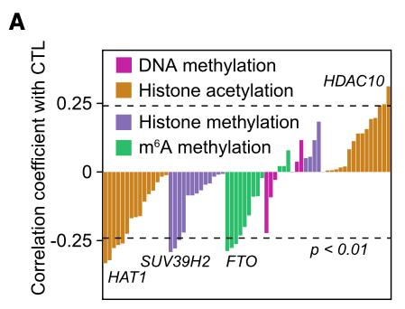

**Author(s)**: `r params$author`  
**Reviewer(s)**: `r params$reviewer`  
**Date**: `r Sys.Date()`  

# Academic Citation
If you use this code in your work or research, we kindly request that you cite our publication:

Xiaofan Lu, et al. (2025). FigureYa: A Standardized Visualization Framework for Enhancing Biomedical Data Interpretation and Research Efficiency. iMetaMed. https://doi.org/10.1002/imm3.70005

```{r setup, include=FALSE}
knitr::opts_chunk$set(echo = TRUE)
```

# 需求描述
# Demand description

我想实现这篇文章的Figure 1A。

- 此图的内容：在117例CD8+T细胞高浸润的TCGA黑色素瘤样本中，表观遗传调节因子的表达与细胞毒性T淋巴细胞（CTL）评分之间的相关性。注：1.细胞毒性T淋巴细胞（CTL）评分：文献报道（PMID: 30127393）的CD8+T细胞标志与功能的基因的平均表达水平（CD8A、CD8B、GZMA、GZMB和PRF1）。2.CD8+ T细胞高浸润水平：高于TIMER上的四分位数。
  
- 此图的优点：1.扩展性强，换成其他基因及免疫细胞也可以用。2.实用性强：很密集的展示了很多信息。

- 绘图的难点：1.作者通过5个基因的平均表达量来定义CTL评分，代码如何实现呢？2.如何通过TIMER确定CD8 +T细胞高浸润的TCGA样本？3.CTL评分与TCGA基因表达水平之间的相关性，代码如何实现？4.如何绘制文章中的柱状图？

I would like to draw the creation of Figure 1A for this article.

- Content of the figure: The correlation between the expression of epigenetic regulators and the Cytotoxic T Lymphocyte (CTL) score in 117 TCGA melanoma samples with high CD8+ T-cell infiltration. Notes: 1.CTL score: The average expression level of genes associated with CD8+ T-cell markers and function, as reported in the literature (PMID: 30127393) (CD8A, CD8B, GZMA, GZMB, and PRF1). 2.High CD8+ T-cell infiltration level: Above the upper quartile on TIMER.
  
- Advantages of this figure: 1.Highly scalable: It can be adapted for other genes and immune cells. 2.Highly practical: It densely presents a large amount of information.

- Challenges in creating the figure: 1.How to implement the code for calculating the CTL score based on the average expression of the five genes? 2.How to identify TCGA samples with high CD8+ T-cell infiltration using TIMER? 3.How to implement the code for calculating the correlation between the CTL score and TCGA gene expression levels? 4.How to reproduce the bar plot shown in the article?



出自：<https://linkinghub.elsevier.com/retrieve/pii/S1550413121001674>

图1. FTO缺失通过增强肿瘤浸润性T细胞抑制肿瘤生长。
(A) 在117例具有充分CD8+ T细胞浸润的TCGA黑色素瘤样本中（定义为TIMER估算的CD8+ T细胞浸润水平高于上四分位数，详见方法部分），已知表观遗传调控因子表达与细胞毒性T淋巴细胞（CTL）评分（CD8A、CD8B、GZMA、GZMB和PRF1的平均表达量）的Spearman相关性分析。采用Spearman秩相关系数（rho）评估基于秩次的关联性度量。

Source: <https://linkinghub.elsevier.com/retrieve/pii/S1550413121001674>

Figure 1. The absence of FTO inhibits tumor growth by enhancing tumor-infiltrating T cells.
(A) Spearman correlation of the expression of known epigenetic regulators with cytotoxic T lymphocyte (CTL) scores (average expression of CD8A, CD8B, GZMA, GZMB, and PRF1) in 117 TCGA melanoma samples with sufficient CD8+ T cell infiltration (defined as an estimated CD8+ T cell infiltration level higher than upper quartile by TIMER) (STAR methods). Spearman’s rho statistic is used to estimate a rank-based measure of association.

# 应用场景
# Application scenarios

从下载TCGA数据开始，进行TIMER打分，根据某一类免疫细胞分组，计算表观遗传调控因子的表达与细胞毒性T淋巴细胞CTL评分之间的相关性，并画出柱形图。

把TCGA表达数据跟免疫浸润、表观遗传都联系起来了，或许对挖掘调控机制有启发。

Starting from downloading TCGA data, perform TIMER scoring, group by a specific type of immune cell, calculate the correlation between the expression of epigenetic regulatory factors and the cytotoxic T lymphocyte (CTL) score, and plot a bar chart.  

This connects TCGA expression data with immune infiltration and epigenetics, which may provide insights into regulatory mechanisms.  

# 环境设置
# Environment Setup

```{r}
source("install_dependencies.R")

library(ggprism)
library(magrittr)
library(tidyverse)
library(ggcorrplot)
library(immunedeconv)
library(TCGAbiolinks)
library(org.Hs.eg.db)
library(clusterProfiler)
library(SummarizedExperiment)

# 自定义函数，把FPKM转换成TPM
# Custom function to convert FPKM to TPM
fpkmToTpm <- function(fpkm) {exp(log(fpkm) - log(sum(fpkm)) + log(1e6))}

# 显示英文报错信息
# Show English error messages
Sys.setenv(LANGUAGE = "en") 

# 禁止chr转成factor
# Prevent character-to-factor conversion
options(stringsAsFactors = FALSE) 
```

# 下载TCGA数据并根据文章描述进行过滤
# Download TCGA data and filter according to the article description

```{r eval=FALSE}
# 从GDC获取TCGA-SKCM项目的RNA-seq计数数据
# Query TCGA-SKCM RNA-seq count data from GDC
TCGA_SKCM_FPKM <- GDCquery(project = "TCGA-SKCM",
                           data.category = "Transcriptome Profiling",
                           data.type = "Gene Expression Quantification",
                           workflow.type = "STAR - Counts") %T>% 
  GDCdownload %>% GDCprepare 

# 数据转换与清洗
# Data Transformation and Cleaning
TCGA_SKCM_TPM <- TCGA_SKCM_FPKM %>% 
  assay() %>% 
  as.data.frame() %>% 
  rownames_to_column("ENSEMBL") %>% 
  mutate(ENSEMBL = sub("\\..*", "", ENSEMBL)) %>% 
  left_join(
    bitr(.$ENSEMBL, "ENSEMBL", "SYMBOL", org.Hs.eg.db) %>% 
      group_by(ENSEMBL) %>% 
      summarise(SYMBOL = SYMBOL[1], .groups = "drop"),  
    by = "ENSEMBL"
  ) %>% 
  # 过滤无效映射
  # Filter invalid mappings
  filter(!is.na(SYMBOL) & SYMBOL != "") %>% 
  # 按基因符号聚合（保留最大值）
  # Aggregate by gene symbol (keeping maximum values)
  group_by(SYMBOL) %>% 
  summarise(across(where(is.numeric), max), .groups = "drop") %>% 
  # 检查重复行名
  # Check for duplicate row names
  { 
    dup <- duplicated(.$SYMBOL)
    if(any(dup)) warning(paste("Duplicated SYMBOL removed:", .$SYMBOL[dup]))
    filter(., !dup)
  } %>% 
  column_to_rownames("SYMBOL") %>% 
  # FPKM转TPM
  # Convert FPKM to TPM
  apply(2, fpkmToTpm) %>% 
  as.data.frame() %>% 
  # 过滤低表达基因
  # Filter low-expressed genes
  filter(rowMeans(.) > 1)

# 保存到文件
# Save to file
save(TCGA_SKCM_TPM, file = "TCGA_SKCM_TPM.Rdata")
```

# 进行TIMER打分，并根据CD8分为3组
# Perform TIMER scoring and divide into 3 groups based on CD8 levels

这里用immunedeconv包进行TIMER打分

Here we use the immunedeconv package for TIMER scoring

```{r, message=FALSE}
# 加载前面处理好的数据
# Load the pre-processed data
(load("TCGA_SKCM_TPM.Rdata")) 

# 使用TIMER进行打分，指明每个样本所属的癌种
# Perform TIMER scoring, specifying the cancer type for each sample
TCGA_SKCM_imme <- deconvolute_timer(TCGA_SKCM_TPM, indications = rep("skcm", ncol(TCGA_SKCM_TPM))) %>%
  t %>% as.data.frame

# 计算四分位数# Calculate quartiles
# Calculate quartiles
(TIMER4 <- quantile(TCGA_SKCM_imme$T_cell.CD8))

# 根据四分位数分为3组
# Divide into 3 groups based on quartiles
TCGA_SKCM_CD8_h <- TCGA_SKCM_imme %>% filter(T_cell.CD8 >= TIMER4[4])
TCGA_SKCM_CD8_m <- TCGA_SKCM_imme %>% filter(T_cell.CD8 >= TIMER4[2]
 & T_cell.CD8 < TIMER4[2])
TCGA_SKCM_CD8_l <- TCGA_SKCM_imme %>% filter(T_cell.CD8 < TIMER4[2])
```

# 自定义表观修饰基因集，并进行整合
# Custom epigenetic modification gene sets and integration

文中没有找到定义的表观修饰相关的基因集，可以根据背景知识自定义，这里提供的基因集仅供参考。

The article did not provide defined gene sets related to epigenetic modifications. Custom gene sets can be created based on background knowledge. The gene sets provided here are for reference only.

```{r, message=FALSE}
# 这里定义三类表观修饰基因
# Define three categories of epigenetic modification genes
m6A_genes <- c("METTL3", "METTL14", "FTO", "ALKBH5",
           "YTHDF1", "YTHDF2", "YTHDF3", "IGF2BP1", "IGF2BP2", "IGF2BP3") %>% 
  as.data.frame %>% mutate(type = "m6A_genes")
DNAm_genes <- c("CTCF", "DNMT1", "HELLS", "UHRF1", "UHRF2", "USP7", "ZNF445") %>% 
  as.data.frame %>% mutate(type = "DNAm_genes")
His_genes <- c("CARM1", "COPRS", "NR1H4", "PRDM14", "PRDM4",
               "PRMT1", "PRMT2", "PRMT5", "PRMT6", "PRMT7", "PRMT8") %>% 
  as.data.frame %>% mutate(type = "His_genes")

# 合并基因集
# Merge gene sets
genes_df <- rbind(m6A_genes, DNAm_genes, His_genes) %>% set_colnames(c("gene", "type"))
```

# 计算CTL
# Calculate CTL score

根据文中定义，CTL为CD8A、CD8B、GZMA、GZMB和PRF1表达的均值。

As defined in the paper, CTL score is calculated as the mean expression of CD8A, CD8B, GZMA, GZMB and PRF1.

```{r, message=FALSE}
# CD8+ T细胞细胞毒性评分计算
# CD8+ T Cell Cytotoxicity Score Calculation
TCGA_SKCM_CD8_h_score <- TCGA_SKCM_TPM %>% 
  select(rownames(TCGA_SKCM_CD8_h)) %>% 
  t %>% as.data.frame %>% 
  mutate(CTL = (CD8A + CD8B + GZMA + GZMB + PRF1)/5) %>% 
  select_if(colnames(.) %in% c("CTL", all_of(genes_df$gene)))

# 保存到文件
# Save results to file
write.csv(TCGA_SKCM_CD8_h_score, "output_CTL.csv", quote = F)
```

# 计算相关系数以及显著性
# Calculate correlation coefficients and significance

```{r, message=FALSE, warning=FALSE}
# 使用spearman方法计算P值
# Calculate p-values using Spearman method
corp_df <- cor_pmat(TCGA_SKCM_CD8_h_score, method = "spearman") %>%
  as.data.frame %>%
  select(CTL) %>% 
  set_colnames("p.val") %>% 
  filter(rownames(.) != "CTL") %>% 
  rownames_to_column("gene") 

# 使用spearman方法计算相关系数
# Calculate correlation coefficients using Spearman method
cor_df <- cor(TCGA_SKCM_CD8_h_score, method = "spearman") %>%
  as.data.frame %>%
  select(CTL) %>% 
  filter(rownames(.) != "CTL") %>% 
  rownames_to_column("gene") %>% 
  inner_join(genes_df) %>% 
  inner_join(corp_df) %>% 
  
  # 这一步因为筛选之后基因太少，不好看，故而注释掉了，实际作图时根据需要调整
  # This filtering step is commented out because too few genes remain after filtering, making the visualization less informative. Adjust as needed for actual plotting.
  # filter(p.val < 0.01) %>% 
  mutate(group = ifelse(CTL > 0, 1, -1))

# 保存到文件
# Save results to file
write.csv(cor_df, "output_cor.csv")
```

# 开始画图
# Plotting

```{r, message=FALSE}
# 相关性柱状图绘制
# Correlation Barplot Visualization
ggplot(cor_df, aes(x = gene, y = CTL, fill = type)) +
  geom_col() +
  geom_hline(yintercept = c(-0.25, 0.25), lwd = 1, lty = 2) +
  scale_y_continuous(breaks = c(-0.25, 0, 0.25), 
                     labels = c("-0.25", "0", "0.25")) +
  scale_x_discrete(limits = cor_df %>% arrange(group, type, CTL) %$% gene) +
  
  # 设置填充色标尺（三种甲基化类型）
  # Set fill color scale (three methylation types)
  scale_fill_manual(labels = c("DNA Methylation", "Histone Methylation", "m6A Methylation"),
                    values = c("darkgoldenrod3", "mediumorchid3", "seagreen3")) +
  
  # 坐标轴标签设置
  # Axis labels settings
  xlab(NULL) +
  ylab("Correlation coefficient with CTL") +
  
  # 使用prism主题（仿GraphPad风格）
  # Use prism theme (GraphPad style)
  theme_prism() +
  
  # 自定义主题元素
  # Custom theme elements
  theme(panel.border = element_rect(fill=NA, color="black", size=1.5, linetype="solid"),
        axis.line = element_line(size = 0),
        axis.ticks.x = element_blank(),
        axis.text.x = element_blank(), 
        legend.position = c(0.02, 0.95), legend.justification = c(0, 1),
        legend.text = element_text(size = 12)) -> p
p  

# 以下代码可用于在图中添加文字，也可以忽略代码，手动添加
# 写pvalue，根据自己的数据调整位置
# Optional gene labeling (can also add manually in Illustrator)
# Add p-value annotation (adjust position as needed)
p + annotate("text", x = 20, y = -0.3, 
           label = "p < 0.01", size = 5) + 
  geom_text(data = subset(cor_df, gene == "USP7"),
            aes(gene, CTL - 0.02,label = "USP7")) + 
  geom_text(data = subset(cor_df, gene == "COPRS"),
            aes(gene, CTL - 0.02,label = "COPRS")) +
  geom_text(data = subset(cor_df, gene == "YTHDF2"),
            aes(gene, CTL - 0.02,label = "YTHDF2")) +
  geom_text(data = subset(cor_df, gene == "IGF2BP1"),
            aes(gene, CTL + 0.02,label = "IGF2BP1"))

# 保存为PDF
# Save as PDF
ggsave("epiImmune.pdf", width = 6, height = 4)
```

# 后期处理
# Post-processing

输出的PDF文件是矢量图，可以用Illustrator等矢量图编辑器打开，把图中文字改为斜体，调整左右两侧基因名的位置。或者干脆手动添加想要显示的基因名。

The output PDF file is a vector graphic, which can be opened in vector editing software like Illustrator. You can modify the text in the figure to italics and adjust the positions of gene names on both sides. Alternatively, you can manually add the desired gene names.

# Session Info

```{r}
sessionInfo()
```
