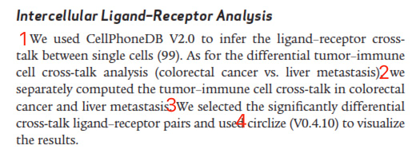
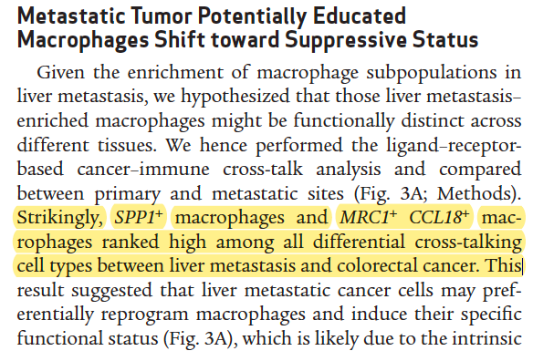

**Author(s)**: `r params$author`  
**Reviewer(s)**: `r params$reviewer`  
**Date**: `r Sys.Date()`  


# Academic Citation
If you use this code in your work or research, we kindly request that you cite our publication:

Xiaofan Lu, et al. (2025). FigureYa: A Standardized Visualization Framework for Enhancing Biomedical Data Interpretation and Research Efficiency. iMetaMed. https://doi.org/10.1002/imm3.70005

```{r setup, include=FALSE}
knitr::opts_chunk$set(echo = TRUE)
# 设置knitr代码块的全局选项 / Set global options for knitr code chunks
```

# 需求描述

希望用cellchat来实现：

# Requirement description

I hope to use CellChat to achieve:


出自<https://aacrjournals.org/cancerdiscovery/article/12/1/134/675646/Spatiotemporal-Immune-Landscape-of-Colorectal>

from<https://aacrjournals.org/cancerdiscovery/article/12/1/134/675646/Spatiotemporal-Immune-Landscape-of-Colorectal>

Figure 3. MRC1+ CCL18+ macrophages in metastatic tumors exhibited terminally differentiated and suppressive states. 
A, The ranked differential tumor–immune cell cross-talk [liver metastasis (LM) vs. colorectal cancer (CRC)] shows MRC1+ CCL18+ M2-like macrophages ranked the second among all ligand–receptor pairs.



> 本文档作者古潇的comments:

例文提出假设“Given the enrichment of macrophage subpopulations in liver metastasis, we hypothesized that those liver metastasis–enriched macrophages might be functionally distinct across
different tissues.” 怎样验证这个假设呢？

作者用CellPhoneDB分析 + circlize可视化来解决。由于CellPhoneDB不能直接处理两组间的关系，所以作者用了一个变通的方法：

- 把直肠癌的所有细胞类型combined到一起，相当于一种细胞类型，命名为tumor，这样就可以克服cellphonedb无法一次性比较两组间的关系的困难。

这个方法其实我不太认可，这样抹掉了结肠癌的细胞类型的信息。我个人认为cellchat的算法是优于cellphonedb的，尤其是在有对照处理的分析中。

提需求的小伙伴要求用cellchat来实现，用cellchat的确可以很方便的实现。详见“开始画图”结尾的“结果解读”。

>Comments from the author of this document, Xiao Gu:

Given the enrichment of macrophage subpopulations in liver metastasis, we hypothesize that those liver metastases – enriched macrophages may be functionally distinct across
How to test this hypothesis for 'different disorders'?

The author uses CellPhoneDB analysis and circlize visualization to solve the problem. Due to CellPhoneDB's inability to directly handle the relationship between two groups, the author used an alternative approach:

-Combining all cell types of rectal cancer together, equivalent to one cell type, named tumor, can overcome the difficulty of cellphonedb in comparing the relationship between two groups at once.

I actually don't quite agree with this method, as it erases information about the cell types of colon cancer. I personally believe that Cellchat's algorithm is superior to Cellphonedb, especially in analyses with control processing.

The friend who raised the request requested to use Cellchat to implement it, which can indeed be very convenient. See "Interpretation of Results" at the end of "Start Drawing" for details.

# 应用场景

单细胞RNA-seq数据，对比两组样本（例文的原发vs.转移、不同亚型、不同发育时期等）之间，基于“受体-配体”的差异，用cellchat来实现。

另外，CellPhoneDB的用法可参考FigureYa178receptorLigand

# Application scenarios

Single cell RNA seq data was compared between two groups of samples (e.g. primary vs. metastasis, different subtypes, different developmental stages, etc.) using cellchat based on the differences in "receptor ligand".

In addition, the usage of CellPhoneDB can refer to FigureYa178receptorLigand< https://k.youshop10.com/YICoy-XB >

# 环境设置

# Environment settings

```{r}
source("install_dependencies.R")

# 加载Seurat包用于单细胞数据分析（Load the Seurat package for single-cell RNA-seq data analysis）
library(Seurat)
# 加载SeuratData包用于获取示例数据集（Load the SeuratData package for accessing example datasets）
library(SeuratData)
# 加载RColorBrewer包用于创建自定义配色方案（Load the RColorBrewer package for creating color palettes）
library(RColorBrewer)
# 加载dplyr包用于数据处理和转换（Load the dplyr package for data manipulation and transformation）
library(dplyr)
# 加载magrittr包以使用管道操作符（Load the magrittr package to use pipe operators）
library(magrittr)
# 加载CellChat包用于细胞间通讯分析（Load the CellChat package for cell-cell communication analysis）
library(CellChat)
# 加载patchwork包用于组合多个ggplot2图形（Load the patchwork package for combining multiple ggplot2 plots）
library(patchwork)
library(ifnb.SeuratData)
library(presto)
# 设置系统环境以显示英文错误信息（Set system environment to display error messages in English）
Sys.setenv(LANGUAGE = "en") 
# 禁止自动将字符串转换为因子类型（Prevent automatic conversion of strings to factors）
options(stringsAsFactors = FALSE) 
```

# 输入数据预处理

`ifnb` - A Seurat object with the PBMC control/IFNB-stimulated dataset。出自<https://pubmed.ncbi.nlm.nih.gov/29227470/>，已被打包到SeuratData里，我们直接安装、加载它。

示例数据ifnb有STIM和CTRL两组：

- 先拆分成两个seurat object，对两个数据集单独进行normalize并识别各自的高变异基因，使用高变异基因在两个基因集中分别执行PCA。
- 然后对两个数据集进行整合，进行常规数据预处理，存入immune.combined，以便进行后续分析。

# Input data preprocessing

`ifnb` - A Seurat object with the PBMC control/IFNB-stimulated dataset。 From< https://pubmed.ncbi.nlm.nih.gov/29227470/ >, has been packaged into SeuratData, we can directly install and load it.

The example data ifnb has two groups: STIM and CTRL:

-First, split it into two seurat objects, normalize the two datasets separately and identify their respective highly variable genes. Use the highly variable genes to perform PCA on the two gene sets separately.
-Then integrate the two datasets, perform regular data preprocessing, and store them in immunembined for subsequent analysis.

```{r eval=FALSE}
## 加载示例数据 (Load example dataset)
# 安装并加载ifnb数据集，包含IFN-β刺激的PBMC单细胞RNA-seq数据
# Install and load the 'ifnb' dataset containing single-cell RNA-seq data of IFN-β stimulated PBMCs
# InstallData("ifnb")
# (LoadData("ifnb"))
data("ifnb")
ifnb <- UpdateSeuratObject(ifnb)
?ifnb  # 查看数据集帮助文档 (View dataset documentation)

# ifnb数据集中包含两个样本数据，分别为CTRL和STIM
# The 'ifnb' dataset contains two conditions: CTRL (control) and STIM (stimulated)
head(ifnb@meta.data)  # 查看元数据前几行 (View first few rows of metadata)
table(ifnb@meta.data$stim)  # 统计各组细胞数量 (Count cells in each condition)


## 数据拆分成两组(STIM和CTRL)
# 使用splitobject将ifnb数据集分割成两个seurat对象的列表(STIM和CTRL)
# Split the dataset into two Seurat objects based on stimulation condition (STIM vs CTRL)
ifnb.list <- SplitObject(ifnb, split.by = "stim")

# 对两个数据集单独进行normalize并识别各自的高变异基因
# Normalize each dataset and identify highly variable features (genes)
ifnb.list <- lapply(X = ifnb.list, FUN = function(x) {
  x <- NormalizeData(x)  # 标准化基因表达值 (Normalize gene expression values)
  x <- FindVariableFeatures(x, selection.method = "vst", nfeatures = 2000)  # 识别高变异基因 (Identify highly variable genes)
})

# 计算两个数据中排完rank后top2000的高变异基因
# Select features for integration (top 2000 variable genes across both datasets)
features <- SelectIntegrationFeatures(object.list = ifnb.list, nfeatures = 2000)

# 使用上述高变异基因在两个基因集中分别执行PCA
# Perform PCA on each dataset using the selected features
ifnb.list <- lapply(X = ifnb.list, FUN = function(x) {
  x <- ScaleData(x, features = features, verbose = T)  # 数据缩放 (Scale data)
  x <- RunPCA(x, features = features, verbose = T)  # 主成分分析 (Perform PCA)
})


## 对两个数据集进行整合
# 首先使用findinintegrationanchors函数标识锚点，然后使用IntegrateData函数将两数据集整合在一起
# 可以通过调整k.anchor参数调整两个样本整合的强度，默认为5，数字越大整合强度越强
# Identify integration anchors and integrate the two datasets
# Adjust k.anchor to control integration strength (higher values = stronger integration)
immune.anchors <- FindIntegrationAnchors(object.list = ifnb.list, anchor.features = features, 
                                         reduction = "rpca", k.anchor = 20)
immune.combined <- IntegrateData(anchorset = immune.anchors)  # 整合数据集 (Integrate datasets)

# 对整合后的数据进行后续分析
# Set the default assay to the integrated data for downstream analysis
DefaultAssay(immune.combined) <- "integrated"

# 常规流程，scale数据，跑PCA，使用前30个PC进行降维跑UMAP，计算Neighbors，分cluster
# Standard workflow: scale data, run PCA, UMAP, neighbor graph construction, and clustering
immune.combined <- ScaleData(immune.combined, verbose = FALSE)  # 缩放整合后的数据 (Scale integrated data)
immune.combined <- RunPCA(immune.combined, npcs = 30, verbose = FALSE)  # PCA降维 (PCA dimensionality reduction)
immune.combined <- RunUMAP(immune.combined, reduction = "pca", dims = 1:30)  # UMAP可视化 (UMAP visualization)
immune.combined <- FindNeighbors(immune.combined, reduction = "pca", dims = 1:30)  # 构建近邻图 (Construct k-nearest neighbor graph)
immune.combined <- FindClusters(immune.combined, resolution = 0.5)  # 聚类分析 (Cluster cells)

# 切换回RNA assay进行差异表达分析
# Switch back to RNA assay for differential expression analysis
DefaultAssay(immune.combined) <- "RNA"
Idents(immune.combined) <- "CellType"  # 设置细胞类型标识 (Set cell type identities)

# 可视化
# 按刺激条件分组的UMAP图 (UMAP colored by stimulation condition)
p1 <- DimPlot(immune.combined, reduction = "umap", group.by = "stim")
# 按细胞类型分组的UMAP图 (UMAP colored by cell type annotation)
p2 <- DimPlot(immune.combined, reduction = "umap", group.by = "seurat_annotations", 
             label = TRUE, repel = TRUE)

# 保存UMAP可视化结果到PDF
# Save UMAP plots to PDF
pdf("immune.combined.UMAP.pdf", height = 5, width = 12)
p1 + p2  # 组合两个图 (Combine plots)
dev.off()

# 保存整合后的Seurat对象用于后续分析
# Save the integrated Seurat object for downstream analysis
saveRDS(immune.combined, "immune.combined.rds")
```


# 提取数据分别创建CellChat对象

STIM和CTRL两组，分别提取数据，创建CellChat对象。

运行时间约10min

# Extract data and create CellChat objects separately

Extract data from STIM and CTRL groups respectively, and create CellChat objects.

Running time is about 10 minutes

```{r eval=FALSE}
## STIM组 (STIM Group)
# 从整合的免疫数据中提取STIM处理组的细胞 (Subset cells from the stimulated (STIM) group)
stim.object <- subset(immune.combined, stim == "STIM")
# 获取RNA表达矩阵数据用于CellChat分析 (Retrieve normalized RNA expression matrix for CellChat)
stim.data.input <- GetAssayData(stim.object, assay = "RNA", slot = "data")
# 提取细胞类型注释和刺激条件元数据 (Extract cell type annotations and stimulation condition)
stim.meta <- stim.object@meta.data[, c("seurat_annotations", "stim")] 
# 确保CellType列以向量形式存储 (Ensure CellType is stored as a vector)
stim.meta$CellType %<>% as.vector(.)
# 创建CellChat对象用于细胞间通讯分析 (Initialize CellChat object for communication analysis)
stim.cellchat <- createCellChat(object = stim.data.input)
# 将细胞元数据添加到CellChat对象中 (Add cell metadata to CellChat object)
stim.cellchat <- addMeta(stim.cellchat, meta = stim.meta)
# 设置细胞标识为Seurat聚类注释 (Set cell identities to Seurat annotations)
stim.cellchat <- setIdent(stim.cellchat, ident.use = "seurat_annotations")

# 使用CellChat提供的人类配受体相互作用数据库 (Use human ligand-receptor database provided by CellChat)
stim.cellchat@DB <- CellChatDB.human 
# 基于当前细胞类型子集数据库 (Subset database based on available cell types)
stim.cellchat <- subsetData(stim.cellchat) 
# 设置并行计算参数，使用10个工作线程 (Set parallel computation with 10 workers)
future::plan("multisession", workers = 10) 
# 识别每个细胞类型中高表达的基因 (Identify overexpressed genes in each cell type)
stim.cellchat <- identifyOverExpressedGenes(stim.cellchat)
# 识别显著的配受体相互作用对 (Identify overexpressed ligand-receptor pairs)
stim.cellchat <- identifyOverExpressedInteractions(stim.cellchat)
# 将数据投影到人类蛋白质相互作用网络 (Project data onto human PPI network)
stim.cellchat <- smoothData(stim.cellchat, adj = PPI.human)  

# 计算细胞间通讯概率 (Compute communication probabilities between cells)
stim.cellchat <- computeCommunProb(stim.cellchat)
# 可选：过滤掉细胞数量过少的细胞类型间的通讯 (Optional: Filter out low-confidence interactions)
# stim.cellchat <- filterCommunication(stim.cellchat, min.cells = 10)

# 计算信号通路水平的通讯概率 (Compute pathway-specific communication probabilities)
stim.cellchat <- computeCommunProbPathway(stim.cellchat)
# 整合所有配受体对的通讯概率为网络矩阵 (Aggregate communication probabilities into a network)
stim.cellchat <- aggregateNet(stim.cellchat)
# 计算信号通路网络中的中心性指标 (Calculate network centrality measures for pathways)
stim.cellchat <- netAnalysis_computeCentrality(stim.cellchat, slot.name = "netP") 
# 保存STIM组的CellChat分析结果 (Save CellChat object for STIM group)
saveRDS(stim.cellchat, "stim.cellchat.rds")

## CTRL组 (CONTROL Group)
# 从整合的免疫数据中提取对照组的细胞 (Subset cells from the control (CTRL) group)
ctrl.object <- subset(immune.combined, stim == "CTRL")
# 获取RNA表达矩阵数据用于CellChat分析 (Retrieve normalized RNA expression matrix for CellChat)
ctrl.data.input <- GetAssayData(ctrl.object, assay = "RNA", slot = "data")
# 提取细胞类型注释和刺激条件元数据 (Extract cell type annotations and stimulation condition)
ctrl.meta <- ctrl.object@meta.data[, c("seurat_annotations", "stim")] 
# 确保CellType列以向量形式存储 (Ensure CellType is stored as a vector)
ctrl.meta$CellType %<>% as.vector(.)
# 创建CellChat对象用于细胞间通讯分析 (Initialize CellChat object for communication analysis)
ctrl.cellchat <- createCellChat(object = ctrl.data.input)
# 将细胞元数据添加到CellChat对象中 (Add cell metadata to CellChat object)
ctrl.cellchat <- addMeta(ctrl.cellchat, meta = ctrl.meta)
# 设置细胞标识为Seurat聚类注释 (Set cell identities to Seurat annotations)
ctrl.cellchat <- setIdent(ctrl.cellchat, ident.use = "seurat_annotations")
# 使用CellChat提供的人类配受体相互作用数据库 (Use human ligand-receptor database provided by CellChat)
ctrl.cellchat@DB <- CellChatDB.human 
# 基于当前细胞类型子集数据库 (Subset database based on available cell types)
ctrl.cellchat <- subsetData(ctrl.cellchat) 
# 设置并行计算参数，使用10个工作线程 (Set parallel computation with 10 workers)
future::plan("multisession", workers = 10) 
# 识别每个细胞类型中高表达的基因 (Identify overexpressed genes in each cell type)
ctrl.cellchat <- identifyOverExpressedGenes(ctrl.cellchat, do.fast = F)
# 识别显著的配受体相互作用对 (Identify overexpressed ligand-receptor pairs)
ctrl.cellchat <- identifyOverExpressedInteractions(ctrl.cellchat)
# 将数据投影到人类蛋白质相互作用网络 (Project data onto human PPI network)
ctrl.cellchat <- smoothData(ctrl.cellchat, adj = PPI.human)  

# 计算细胞间通讯概率 (Compute communication probabilities between cells)
ctrl.cellchat <- computeCommunProb(ctrl.cellchat)
# 可选：过滤掉细胞数量过少的细胞类型间的通讯 (Optional: Filter out low-confidence interactions)
# ctrl.cellchat <- filterCommunication(ctrl.cellchat, min.cells = 10)

# 计算信号通路水平的通讯概率 (Compute pathway-specific communication probabilities)
ctrl.cellchat <- computeCommunProbPathway(ctrl.cellchat)
# 整合所有配受体对的通讯概率为网络矩阵 (Aggregate communication probabilities into a network)
ctrl.cellchat <- aggregateNet(ctrl.cellchat)
# 计算信号通路网络中的中心性指标 (Calculate network centrality measures for pathways)
ctrl.cellchat <- netAnalysis_computeCentrality(ctrl.cellchat, slot.name = "netP") 
# 保存对照组的CellChat分析结果 (Save CellChat object for control group)
saveRDS(ctrl.cellchat, "ctrl.cellchat.rds")
```

# 开始画图

# Start drawing

```{r}
## 加载上面保存的运行结果文件，可以从微云下载<https://share.weiyun.com/xcfPWC0L>
# 加载刺激组的CellChat分析结果 (Load CellChat results for stimulated group)
stim.cellchat <- readRDS("stim.cellchat.rds")
# 加载对照组的CellChat分析结果 (Load CellChat results for control group)
ctrl.cellchat <- readRDS("ctrl.cellchat.rds")

# 创建包含两个条件的CellChat对象列表 (Create a list of CellChat objects for both conditions)
object.list <- list(CTRL = ctrl.cellchat, STIM = stim.cellchat)
# 合并两个CellChat对象以便进行比较分析 (Merge CellChat objects for comparative analysis)
cellchat <- mergeCellChat(object.list, add.names = names(object.list))
```

## 细胞间互作次数bar图

## Bar chart of intercellular interaction frequency

Comparing the number of inferred communication links between different datasets

```{r}
# 比较两组间的细胞通讯相互作用（默认使用通讯频率）
# Compare cell-cell communication interactions between two groups (default: communication frequency)
gg1 <- compareInteractions(cellchat, show.legend = F, group = c(1,2))
# 比较两组间的细胞通讯相互作用（使用通讯权重）
# Compare cell-cell communication interactions between two groups (using communication weight)
gg2 <- compareInteractions(cellchat, show.legend = F, group = c(1,2), measure = "weight")

# 保存比较结果为PDF文件
# Save the comparison results as a PDF file
pdf("compareInteractions.pdf", height = 5, width = 8)
# 组合两个图形
# Combine the two graphs
gg1 + gg2
# 关闭图形设备
# Close the graphics device
dev.off()
```


## 细胞间互作次数网络图

Circle plot showing differential cell-cell communication network **between two datasets**

红色为STIM组相比CTRL组互作次数和互作强度增加，线越粗表示差异越大；蓝色则表示减少。

两个数据集之间的细胞-细胞通信网络中的交互或交互强度的差异数量可以使用圆形图来可视化，其中红色(或蓝色)边表示第二个数据集相比于第一个数据集增加(或减少)的信号。

## Network diagram of intercellular interaction frequency

Circle plot showing differential cell-cell communication network **between two datasets**

The red color indicates an increase in the number and intensity of interactions between the STIM group and the CTRL group, with thicker lines indicating greater differences; Blue indicates a decrease.

The difference in the number of interactions or interaction strengths in the cell-cell communication network between two datasets can be visualized using a circular graph, where the red (or blue) edges represent the signal increase (or decrease) in the second dataset compared to the first dataset.

```{r}
# 创建PDF文件用于保存差异相互作用网络图
# Create a PDF file to save differential interaction network plots
pdf("netVisual_diffInteraction.pdf", height = 8, width = 8)
# 设置图形布局为1行1列，并允许图形元素超出绘图区域
# Set plot layout to 1 row and 1 column, allow elements to extend beyond plot area
par(mfrow = c(1,1), xpd = TRUE)

# 可视化两组间的差异细胞通讯相互作用（基于通讯概率）
# Visualize differential cell-cell communication interactions between groups (based on communication probability)
netVisual_diffInteraction(cellchat, weight.scale = T)
# 可视化两组间的差异细胞通讯相互作用（基于通讯权重）
# Visualize differential cell-cell communication interactions between groups (based on communication weight)
netVisual_diffInteraction(cellchat, weight.scale = T, measure = "weight")

# 关闭PDF设备
# Close the PDF device
dev.off()
```


## 结果解读：

## Interpretation of Results:



红色表示处理 vs 对照后受体-配体对增加，蓝色表示降低。
可以看到CD14 Mono的线很粗，线越粗数量越多。这样就可以回答文中提出的假设了。

把圆形网络拉开看更明显：

Red indicates an increase in receptor ligand pairs after treatment compared to control, while blue indicates a decrease.
It can be seen that the lines of CD14 Mono are very thick, and the thicker the lines, the more they are. This will answer the hypothesis proposed in the article.

Pull open the circular network to see more clearly:

```{r}
# 计算STIM组与CTRL组之间细胞通讯次数的差异矩阵
# Calculate the difference matrix of cell-cell communication counts between STIM and CTRL groups
diff.count <- cellchat@net$STIM$count - cellchat@net$CTRL$count

# 将STIM组和CTRL组的通讯次数矩阵保存为CSV文件
# Save communication count matrices of STIM and CTRL groups to CSV files
write.csv(cellchat@net$STIM$count, "output_STIMcount.csv", quote = F)
write.csv(cellchat@net$CTRL$count, "output_CTRLcount.csv", quote = F)

# 加载pheatmap包用于绘制热图
# Load the pheatmap package for heatmap visualization
library(pheatmap)

# 绘制差异通讯次数热图，展示两组间细胞通讯的变化
# Plot heatmap of differential communication counts to show changes between groups
pheatmap(diff.count,
         treeheight_row = 0,    # 不显示行聚类树 (Suppress row clustering tree)
         treeheight_col = 0,    # 不显示列聚类树 (Suppress column clustering tree)
         cluster_rows = TRUE,   # 对行进行聚类 (Cluster rows)
         cluster_cols = TRUE)   # 对列进行聚类 (Cluster columns)
```

热图虽然朴素，更直观。或者自己用cytoscape画，更自如一点。

另外，cellchat里有丰富的“受体-配体”分析结果，可以运行下面这行查看。结合自己的假设，设计合适的图形展示数据。

Although heat maps are simple, they are more intuitive. Alternatively, you can use Cytoscape to draw on your own, which would be more comfortable.

In addition, CellChat provides rich results of "receptor ligand" analysis, which can be viewed by running the following line. Design appropriate graphics to display data based on one's own assumptions.

```{r eval=FALSE}
# 在RStudio中打开交互式查看器查看CellChat对象的结构和内容
# Open an interactive viewer in RStudio to explore the structure and contents of the CellChat object
View(cellchat)
```

# Session Info

```{r}
sessionInfo()
```