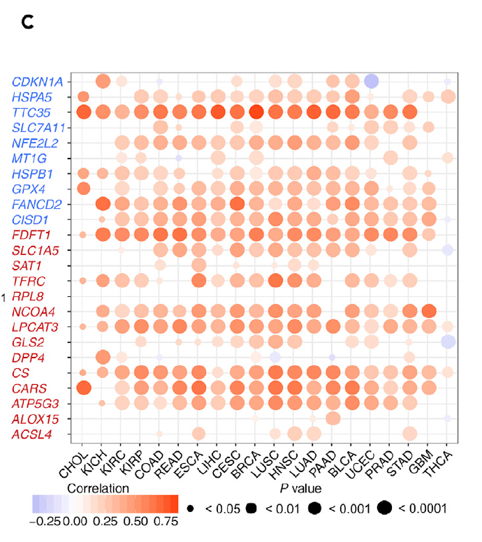

**Author(s)**: `r params$author`  
**Reviewer(s)**: `r params$reviewer`  
**Date**: `r Sys.Date()`  

# Academic Citation
If you use this code in your work or research, we kindly request that you cite our publication:

Xiaofan Lu, et al. (2025). FigureYa: A Standardized Visualization Framework for Enhancing Biomedical Data Interpretation and Research Efficiency. iMetaMed. https://doi.org/10.1002/imm3.70005

If you use ComplexHeatmap in published research, please cite:

Zuguang Gu, et al., Complex heatmaps reveal patterns and correlations in multidimensional genomic data, Bioinformatics, 2016.

Zuguang Gu. Complex Heatmap Visualization, iMeta, 2022.

```{r setup, include=FALSE}
knitr::opts_chunk$set(echo = TRUE)
```

# 需求描述
# Demand description

想实现这篇铁死亡泛癌的其他图片，主要是Figure 1。感觉这个套路只要换一个通路就可以测试，我看Xiaofan Lu写了这篇文章的Figure 2A（铁死亡基因在泛癌肿瘤与正常的差异箱线图，FigureYa208FPI），Figure 3B（铁死亡与免疫通路的相关性，FigureYa253panGSEA），可否请Xiaofan Lu详细写一下文章Figure 1的相关代码？

- 1A（铁死亡在泛癌中体细胞拷贝数变异情况，绘制条形图，可参考FigureYa265panCNV）
- 1B（铁死亡基因在肿瘤与正常的差异表达，绘制拼接的点图和柱状图，可参考FigureYa263panDiff）
- 1C（铁死亡基因体细胞拷贝数与基因表达的相关性点图）
- 1D（铁死亡基因肿瘤与正常组织甲基化状态点图）
- 1E（铁死亡转录组表达与启动子甲基化相关性的点图）

这些图都是泛癌的，不知道Xiaofan Lu可不可以用例文数据分别实现个教程 [皱眉] ？（感觉都可以出一期专栏——iSicence复现了哈哈）

这次实现Figure 1C，铁死亡基因体细胞拷贝数与基因表达的相关性点图。

The other figures from this pan-cancer ferroptosis study, mainly Figure 1. It seems that this approach can be tested just by switching to a different pathway. I noticed that Xiaofan Lu has already written about Figure 2A (boxplot of ferroptosis gene differences between tumors and normal tissues in pan-cancer, FigureYa208FPI) and Figure 3B (correlation between ferroptosis and immune pathways, FigureYa253panGSEA) from this article. Could Xiaofan Lu please provide a detailed explanation of the code for Figure 1 in the article?

- 1A (somatic copy number variation of ferroptosis in pan-cancer, bar plot, refer to FigureYa265panCNV)
- 1B (differential expression of ferroptosis genes in tumors vs. normal tissues, combined dot and bar plot, refer to FigureYa263panDiff)
- 1C (correlation scatter plot between somatic copy number and gene expression of ferroptosis genes)
- 1D (methylation status dot plot of ferroptosis genes in tumor vs. normal tissues)
- 1E (scatter plot of correlation between ferroptosis transcriptome expression and promoter methylation)

All these figures are pan-cancer analyses. I wonder if Xiaofan Lu could create separate crowdsourcing tutorials using the example data? (Feels like it could even be a column—iScience reproduction, haha!)

This time, we’re drawing Figure 1C: the scatter plot showing the correlation between somatic copy number and gene expression of ferroptosis genes."



出自<https://linkinghub.elsevier.com/retrieve/pii/S2589004220304892>

图1. 铁死亡调控基因（FRGs）的失调。
其中，正调控因子和负调控因子分别用红色和蓝色标注。
(C) FRGs体细胞拷贝数变异与基因表达的Spearman相关性分析。

接下来会陆续实现Figure1DE，敬请关注。

Source: <https://linkinghub.elsevier.com/retrieve/pii/S2589004220304892>

Figure 1. The Dysregulation of Ferroptosis Regulator Genes (FRGs).
For which the positive and negative regulators are marked in red and blue, respectively.
(C) The Spearman’s correlation between somatic copy number alterations and the expression of FRGs.

Figure 1DE will be launched successively, so stay tuned.

# 应用场景
# Application scenarios

分析基因（以铁死亡为例）体细胞拷贝数与基因表达的相关性，并绘制点图。

Analyze the correlation between somatic copy number and gene expression (using ferroptosis as an example) and plot a scatter diagram.

# 环境设置
# Environment Setup

```{r}
source("install_dependencies.R")

library(ggplot2)
library(data.table)
library(randomcoloR)
library(ggpubr)
library(GSVA)
library(clusterProfiler)
library(impute)
library(ComplexHeatmap)
source("twoclasslimma.R")

# 显示英文报错信息
# Show English error messages
Sys.setenv(LANGUAGE = "en") 

# 禁止chr转成factor
# Prevent character-to-factor conversion
options(stringsAsFactors = FALSE) 
```

# 输入文件
# Input Files

跟FigureYa263panDiff、FigureYa265panCNV使用的是同一套数据，已经下载的小伙伴就不用重复下载了。

merged_sample_quality_annotations.tsv，下载自 <https://gdc.cancer.gov/about-data/publications/pancanatlas>，下载地址 <http://api.gdc.cancer.gov/data/1a7d7be8-675d-4e60-a105-19d4121bdebf>

EBPlusPlusAdjustPANCAN_IlluminaHiSeq_RNASeqV2.geneExp.tsv，表达矩阵，第一列是基因，之后是其在每个样本中的表达量。下载自 <http://api.gdc.cancer.gov/data/3586c0da-64d0-4b74-a449-5ff4d9136611>

TCGA.PANCAN.sampleMap_Gistic2_CopyNumber_Gistic2_all_data_by_genes.gz，CNV数据，下载地址 <https://xenabrowser.net/datapages/?dataset=TCGA.PANCAN.sampleMap%2FGistic2_CopyNumber_Gistic2_all_data_by_genes&host=https%3A%2F%2Ftcga.xenahubs.net&removeHub=https%3A%2F%2Fxena.treehouse.gi.ucsc.edu%3A443>

The same dataset is used as in FigureYa263panDiff and FigureYa265panCNV, so those who have already downloaded it do not need to download it again.

merged_sample_quality_annotations.tsv: Downloaded from  <https://gdc.cancer.gov/about-data/publications/pancanatlas>, download link: <http://api.gdc.cancer.gov/data/1a7d7be8-675d-4e60-a105-19d4121bdebf>

EBPlusPlusAdjustPANCAN_IlluminaHiSeq_RNASeqV2.geneExp.tsv: Expression matrix, where the first column contains gene names, followed by their expression levels in each sample. Downloaded from <http://api.gdc.cancer.gov/data/3586c0da-64d0-4b74-a449-5ff4d9136611>

TCGA.PANCAN.sampleMap_Gistic2_CopyNumber_Gistic2_all_data_by_genes.gz: CNV data, download link: <https://xenabrowser.net/datapages/?dataset=TCGA.PANCAN.sampleMap%2FGistic2_CopyNumber_Gistic2_all_data_by_genes&host=https%3A%2F%2Ftcga.xenahubs.net&removeHub=https%3A%2F%2Fxena.treehouse.gi.ucsc.edu%3A443>

```{r}
# 获得同时有肿瘤和正常样本的肿瘤名
# Get tumor names that have both tumor and normal samples
tumors <- c("BLCA","BRCA","CESC","CHOL","COAD",
            "ESCA","GBM","HNSC","KICH","KIRC",
            "KIRP","LIHC","LUAD","LUSC","PAAD",
            "PRAD","READ","STAD","THCA","UCEC")

# 获得感兴趣的基因集(TTC35是EMC2的同名)
# Get the gene set of interest (TTC35 is an alias for EMC2)
frg <- c("CDKN1A","HSPA5","TTC35","SLC7A11","NFE2L2","MT1G","HSPB1","GPX4","FANCD2","CISD1","FDFT1","SLC1A5","SAT1",
         "TFRC","RPL8","NCOA4","LPCAT3","GLS2","DPP4","CS","CARS","ATP5G3","ALOX15","ACSL4","EMC2")

# 修正TCGA名称
# 数据来自PanCanAtlas
# Correct TCGA names
# Data from PanCanAtlas
rawAnno <- read.delim("merged_sample_quality_annotations.tsv",sep = "\t",row.names = NULL,check.names = F,stringsAsFactors = F,header = T) 
# 简化样本ID（取前15位TCGA条码）
# Simplify sample IDs (first 15 characters of TCGA barcode)
rawAnno$simple_barcode <- substr(rawAnno$aliquot_barcode,1,15)

# 创建精简注释表（去重+关键列）
# Create concise annotation table (deduplicated + key columns)
samAnno <- rawAnno[!duplicated(rawAnno$simple_barcode),c("cancer type", "simple_barcode")]

# 过滤无效记录（癌症类型为空）
# Filter invalid records (empty cancer type)
samAnno <- samAnno[which(samAnno$`cancer type` != ""),]

# 保存注释文件（供后续分析使用）
# Save annotation (for downstream analysis)
write.table(samAnno,"simple_sample_annotation.txt",sep = "\t",row.names = F,col.names = T,quote = F)

# 快速读取表达谱，然后按癌症名拆分成单个文件
# Quickly read the expression profile and split it into individual files by cancer name
expr <- fread("EBPlusPlusAdjustPANCAN_IlluminaHiSeq_RNASeqV2.geneExp.tsv",sep = "\t",stringsAsFactors = F,check.names = F,header = T)

# 转换为数据框并设置行名
# Convert to dataframe and set row names
expr <- as.data.frame(expr); rownames(expr) <- expr[,1]; expr <- expr[,-1]

# 调整基因名（去除Ensembl ID版本号）
# Adjust gene names (remove Ensembl ID version)
gene <- sapply(strsplit(rownames(expr),"|",fixed = T), "[",1) 
expr$gene <- gene

# 移除重复样本
# Remove duplicate samples
expr <- expr[!duplicated(expr$gene),] 

# 重置行名并移除临时基因列
# Reset row names and remove temporary gene column
rownames(expr) <- expr$gene; expr <- expr[,-ncol(expr)]

# 取部分表达谱（感兴趣的基因集）
# Extract a subset of the expression profile (gene set of interest)
comgene <- intersect(rownames(expr),frg) 

# 提取基因表达子集
# Extract gene expression subset
expr_sub <- expr[comgene,]

# 简化样本ID（取前15位）
# Simplify sample IDs (first 15 characters)
colnames(expr_sub) <- substr(colnames(expr_sub),1,15)

# 去除重复样本（基于简化后的ID）
# Remove duplicate samples (based on simplified IDs)
expr_sub <- expr_sub[,!duplicated(colnames(expr_sub))]

# 按癌症类型分割表达数据
# Split Expression Data by Cancer Type
for (i in tumors) {
  message("--",i,"...")
  
  # 获取该肿瘤的全部样本
  # Get all samples for this tumor
  sam <- samAnno[which(samAnno$`cancer type` == i),"simple_barcode"] 
  
  # 取出与基因表达泛癌数据交集的样本
  # Extract samples overlapping with the pan-cancer gene expression data
  comsam <- intersect(colnames(expr_sub), sam) 
  
  # 获得肿瘤样本
  # Get tumor samples
  tumsam <- comsam[substr(comsam,14,14) == "0"] 
  
  # 获得正常样本
  # Get normal samples
  norsam <- comsam[substr(comsam,14,14) == "1"] 
  
  # 提取当前癌症的表达子集
  # Extract expression subset for current cancer
  expr_subset <- expr_sub[,c(tumsam,norsam)]
  
  # 这份数据里存在负值，即便负值比较小，但也要矫正，如果使用其他泛癌表达谱根据情况而定
  # This dataset contains negative values, which are relatively small but still need correction. Adjust accordingly if using other pan-cancer expression profiles.
  expr_subset[expr_subset < 0] <- 0 
  
  # 使用KNN算法填补缺失值
  # Impute missing values using KNN algorithm
  expr_subset <- as.data.frame(impute.knn(as.matrix(expr_subset))$data)
  
  # 保存癌症特异的表达子集
  # Save cancer-specific expression subset
  write.table(expr_subset, paste0("TCGA_",i,"_expr_subset.txt"),sep = "\t",row.names = T,col.names = NA,quote = F)
}
rm(expr); gc()

# 快速读取CNA数据
# Quickly read CNA data
cna <- fread("TCGA.PANCAN.sampleMap_Gistic2_CopyNumber_Gistic2_all_data_by_genes.gz",sep = "\t",stringsAsFactors = F,header = T,check.names = F)
cna <- as.data.frame(cna)
comgene <- intersect(cna$Sample,frg)

# 只包含感兴趣基因的CNA子集
# CNA subset containing only genes of interest
cna <- cna[cna$Sample %in% comgene,] 

rownames(cna) <- cna[,1]; cna <- cna[,-1]
```

# 相关性分析
# Correlation Analysis

```{r}
# 创建空对象存储拷贝数与表达相关性结果
# Create empty object to store CNA-expression correlations
corCnaExpr <- NULL

# 跨癌种相关性分析
# Pan-Cancer Correlation Analysis
for (i in tumors) {
  message("--",i,"...")
  
  # 读取上面拆分好的表达数据
  # Read the pre-split expression data
  expr_subset <- read.table(paste0("TCGA_",i,"_expr_subset.txt"),sep = "\t",row.names = 1,check.names = F,stringsAsFactors = F,header = T)
  
  # 取出同时具有表达且具有拷贝数的样本
  # Extract samples that have both expression and copy number data 
  comsam <- intersect(colnames(expr_subset),colnames(cna))
  
  # 生成拷贝数子集
  # Generate a copy number subset
  cna_subset <- cna[,comsam] 
  
  # EMC2是原文使用的TTC35基因的同名，使用子集数据时无须修正
  # EMC2 is an alias for the TTC35 gene used in the original study; no correction is needed when using subset data
  rownames(cna_subset) <- gsub("EMC2","TTC35",rownames(cna_subset)) 
  
  # 生成基因表达子集
  # Generate a gene expression subset
  expr_subset <- expr_subset[,comsam] 
  
  # 把cnv按癌症名保存到单个文件
  # Save CNV data by cancer type into individual files
  # write.table(cna_subset, paste0("TCGA_",i,"_broadcnv_subset_matched_expr.txt"),sep = "\t",row.names = F,col.names = T,quote = F)
  
  # 计算相关系数
  # Calculate correlation coefficients
  corTab <- NULL
  for (j in rownames(cna_subset)) {
    
    # 相应的CNA数据
    # Corresponding CNA data
    tmp1 <- as.numeric(cna_subset[j,]) 
    
    # 相应的表达数据
    # Corresponding expression data
    tmp2 <- as.numeric(expr_subset[j,]) 
    
    # Spearman相关性
    # Spearman correlation
    cor.res <- cor.test(tmp1,tmp2, method = "spearman") 
    
    # 将结果存入临时表（处理可能的NA值）
    # Store results in temp table (handling potential NAs)
    corTab <- rbind.data.frame(corTab,
                               data.frame(gene = j,
                                          tumor = i,
                                          Correlation = ifelse(is.na(cor.res$estimate), 0, cor.res$estimate),
                                          Pvalue = ifelse(is.na(cor.res$p.value), 1, cor.res$p.value),
                                          stringsAsFactors = F),
                               stringsAsFactors = F)
  }
  
  # 将当前癌种结果合并到总表
  # Merge current cancer results to master table
  corCnaExpr <- rbind.data.frame(corCnaExpr,
                                 corTab,
                                 stringsAsFactors = F)
}

# 保存相关性分析结果（包含所有癌种）
# Save correlation results (all cancer types)
write.table(corCnaExpr, "TCGA_pancan_correlation_cnv_expr_subset.txt",sep = "\t",row.names = F,col.names = T,quote = F)
```

# 开始画图
# Plotting

画泡泡图

Bubble Plot

```{r fig.width=8, fig.height=8}
# 设置颜色
# Set colors
blue <- "#4577FF"
red <- "#C2151A"
orange <- "#E45737"

# 设置基因显示顺序
# Set gene display order
corCnaExpr$gene <- factor(corCnaExpr$gene,
                          levels = rev(c("CDKN1A","HSPA5","TTC35","SLC7A11","NFE2L2","MT1G","HSPB1","GPX4","FANCD2","CISD1",
                                         "FDFT1","SLC1A5","SAT1","TFRC","RPL8","NCOA4","LPCAT3","GLS2","DPP4","CS","CARS","ATP5G3","ALOX15","ACSL4")))

# 创建渐变颜色板
# Create color gradient
my_palette <- colorRampPalette(c(blue,"white",orange), alpha=TRUE)(n=128)

# 相关性热图绘制
# Correlation Heatmap Visualization
ggplot(corCnaExpr, aes(x=tumor,y=gene)) +
  geom_point(aes(size=-log10(Pvalue), color=Correlation)) +
  scale_color_gradientn('Correlation', 
                        colors=my_palette) + 
  scale_size_continuous(range = c(1,12)) + 

  theme_bw() +
  theme(#panel.grid.minor = element_blank(), 
        #panel.grid.major = element_blank(),
        axis.text.x = element_text(angle = 45, size = 12, hjust = 0.3, vjust = 0.5, color = "black"),
        axis.text.y = element_text(size = 12, color = rep(c(red,blue),c(14,10))),
        axis.title = element_blank(),
        panel.border = element_rect(size = 0.7, linetype = "solid", colour = "black"),
        legend.position = "bottom",
        plot.margin = unit(c(1,1,1,1), "lines"))

# 保存为出版级PDF
# Save as publication-quality PDF
ggsave("Figure 1C correlation between cna and expression of interested genes in pancancer.pdf", width = 8,height = 8)

# 清理拷贝数数据对象
# Clean up CNA data object
rm(cna); gc()
```

例文图中大多数为正相关，与我们这里获得的结果有出入，欢迎小伙伴讨论。

The example plot shows mostly positive correlations, which differs from the results we obtained here. Fellow researchers are welcome to join the discussion.

# Session Info

```{r}
sessionInfo()
```
