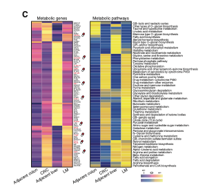

**Author(s)**: `r params$author`  
**Reviewer(s)**: `r params$reviewer`  
**Date**: `r Sys.Date()`  

# Academic Citation

如果您在工作或研究中使用了本代码，恳请您引用我们的出版物：

Xiaofan Lu, et al. (2025). FigureYa: A Standardized Visualization Framework for Enhancing Biomedical Data Interpretation and Research Efficiency. iMetaMed. https://doi.org/10.1002/imm3.70005

If you use this code in your work or research, we kindly request that you cite our publication:

Xiaofan Lu, et al. (2025). FigureYa: A Standardized Visualization Framework for Enhancing Biomedical Data Interpretation and Research Efficiency. iMetaMed. https://doi.org/10.1002/imm3.70005

```{r setup, include=FALSE}
knitr::opts_chunk$set(echo = TRUE)
```

# 需求描述
# Demand description

用scMetabolism实现单细胞RNA-seq数据的代谢分析，并画图。

Performing metabolic analysis and visualization of single-cell RNA-seq data using scMetabolism.



出自<https://aacrjournals.org/cancerdiscovery/article/12/1/134/675646/Spatiotemporal-Immune-Landscape-of-Colorectal>

图4. 转移性肿瘤中的MRC1+ CCL18+巨噬细胞表现出高代谢活性。
C图：MRC1+ CCL18+巨噬细胞的代谢基因平均表达量和代谢通路评分中位数的热图。红色标注的基因代表潜在的可成药基因（详见方法部分）。

Source: <https://aacrjournals.org/cancerdiscovery/article/12/1/134/675646/Spatiotemporal-Immune-Landscape-of-Colorectal>

Figure 4.  MRC1+ CCL18+ macrophages in metastatic tumors showed high metabolic activity. 
C, The heat map of average metabolic gene expression and median metabolic pathway score of MRC1+ CCL18+ macrophages. The genes highlighted with red represent the potential druggable genes (Methods). 

# 应用场景
# Application scenarios

Mining metabolic activity at single-cell resolution，为了方便使用，例文作者把整个pipeline写成了R包scMetabolism。还开发了在线版<http://www.cancerdiversity.asia/scMetabolism/>。

本文档带你跑通R版本的scMetabolism，适用于scRNA-seq数据，友好对接seurat。

Mining metabolic activity at single-cell resolution. For ease of use, the authors of the example have packaged the entire pipeline into an R package called scMetabolism. They also developed an online version available at <http://www.cancerdiversity.asia/scMetabolism/>.

This document guides you through running the R version of scMetabolism, which is suitable for scRNA-seq data and seamlessly integrates with Seurat.

# 环境设置
# Environment Setup

```{r}
source("install_dependencies.R")

library(Seurat)
library(SeuratData)
library(patchwork)
library(RColorBrewer)
library(pheatmap)
library(dplyr)
library(magrittr)
library(scMetabolism)
library(ggplot2)
library(rsvd)

# 显示英文报错信息
# Show English error messages
Sys.setenv(LANGUAGE = "en") 

# 禁止chr转成factor
# Prevent character-to-factor conversion
options(stringsAsFactors = FALSE) 
```

# 输入文件预处理
# Input File Preprocessing

跟FigureYa267scCellChat一样的处理，可以直接跳到“Metabolic genes”。

`ifnb` - A Seurat object with the PBMC control/IFNB-stimulated dataset。出自<https://pubmed.ncbi.nlm.nih.gov/29227470/>，已被打包到SeuratData里，我们直接安装、加载它。

示例数据ifnb有STIM和CTRL两组：

- 先拆分成两个seurat object，对两个数据集单独进行normalize并识别各自的高变异基因，使用高变异基因在两个基因集中分别执行PCA。
- 然后对两个数据集进行整合，进行常规数据预处理，存入immune.combined，以便进行后续分析。

The same processing as FigureYa267scCellChat, you can directly skip to "Metabolic genes".

`ifnb` - A Seurat object containing the PBMC control/IFNB-stimulated dataset. It originates from <https://pubmed.ncbi.nlm.nih.gov/29227470/> and has been packaged into SeuratData. We will directly install and load it.

The example dataset ifnb consists of two groups: STIM and CTRL:

- First, split it into two Seurat objects. Perform normalization and identify highly variable genes for each dataset separately. Use the highly variable genes to perform PCA on both gene sets individually.
- Then, integrate the two datasets and conduct standard data preprocessing, storing the result in immune.combined for subsequent analysis.

```{r eval = FALSE}
## 加载示例数据
## Load example dataset

# 下载数据集
# install dataset
InstallData("ifnb")

# 加载数据集并更新为最新Seurat对象结构
# Load dataset and update to latest Seurat object structure
(LoadData("ifnb"))
ifnb <- UpdateSeuratObject(ifnb)

# 查看数据集文档
# View dataset documentation
?ifnb

# ifnb数据集中包含两个样本数据，分别为CTRL和STIM
# The ifnb dataset contains two sample groups: CTRL and STIM
head(ifnb@meta.data)
table(ifnb@meta.data$stim)


## 数据拆分成两组(STIM和CTRL)
## Split data into two groups (STIM and CTRL)

# 使用splitobject将ifnb数据集分割成两个seurat对象的列表(STIM和CTRL)
# Use SplitObject to divide ifnb dataset into a list of two Seurat objects (STIM and CTRL)
ifnb.list <- SplitObject(ifnb, split.by = "stim")

# 对两个数据集单独进行normalize并识别各自的高变异基因
# Perform normalization and identify highly variable genes for each dataset separately
ifnb.list <- lapply(X = ifnb.list, FUN = function(x) {
  x <- NormalizeData(x)
  x <- FindVariableFeatures(x, selection.method = "vst", nfeatures = 2000)
})

# 计算两个数据中排完rank后top2000的高变异基因
# Select top 2000 highly variable genes after ranking from both datasets
features <- SelectIntegrationFeatures(object.list = ifnb.list, nfeatures = 2000)

# 使用上述高变异基因在两个基因集中分别执行PCA
# Perform PCA on both datasets using the selected highly variable genes
ifnb.list <- lapply(X = ifnb.list, FUN = function(x) {
  x <- ScaleData(x, features = features, verbose = T)
  x <- RunPCA(x, features = features, verbose = T)
})


## 对两个数据集进行整合
## Integrate the two datasets

# 首先使用findinintegrationanchors函数标识锚点，然后使用IntegrateData函数将两数据集整合在一起
# 可以通过调整k.anchor参数调整两个样本整合的强度，默认为5，数字越大整合强度越强
# First identify anchors using FindIntegrationAnchors function, then integrate datasets with IntegrateData
# Integration strength can be adjusted via k.anchor parameter (default=5, higher values mean stronger integration)
immune.anchors <- FindIntegrationAnchors(object.list = ifnb.list, anchor.features = features, reduction = "rpca", k.anchor = 20)
immune.combined <- IntegrateData(anchorset = immune.anchors)

# 对整合后的数据进行后续分析
# Perform downstream analysis on integrated data
DefaultAssay(immune.combined) <- "integrated"

# 常规流程：scale数据，跑PCA，使用前30个PC进行降维跑UMAP，计算Neighbors，分cluster
# Standard workflow: scale data, run PCA, reduce dimensions using first 30 PCs for UMAP, compute neighbors, and cluster
immune.combined <- ScaleData(immune.combined, verbose = FALSE)
immune.combined <- RunPCA(immune.combined, npcs = 30, verbose = FALSE)
immune.combined <- RunUMAP(immune.combined, reduction = "pca", dims = 1:30)
immune.combined <- FindNeighbors(immune.combined, reduction = "pca", dims = 1:30)
immune.combined <- FindClusters(immune.combined, resolution = 0.5)

# 切换回RNA assay进行差异分析
# Switch back to RNA assay for differential expression
DefaultAssay(immune.combined) <- "RNA"
Idents(immune.combined) <- "CellType"

# 创建分组UMAP图
# Create group-wise UMAP plots
p1 <- DimPlot(immune.combined, reduction = "umap", group.by = "stim")
p2 <- DimPlot(immune.combined, reduction = "umap", group.by = "seurat_annotations",label = TRUE,repel = TRUE)

# 保存合并可视化结果
# Save combined visualization
pdf("immune.combined.UMAP.pdf", height = 5,width = 12)
p1 + p2
dev.off()

# 保存完整分析结果（避免重复计算）
# Save complete analysis results (avoid recomputation)
saveRDS(immune.combined,"immune.combined.rds")
```

# 左图 - Metabolic genes
# Left Panel - Metabolic Genes

提取特定通路里的差异表达基因，用热图展示其表达变化。

这里用Guangchuang Yu的clusterProfiler读取scMetabolism包里整理的gmt文件，按照自己安装路径寻找，一般位于`安装目录/lib/R/library/scMetabolism/data/KEGG_metabolism_nc.gmt`。或者直接从msigdb下载gmt文件，<https://www.gsea-msigdb.org/gsea/msigdb/>

Extract differentially expressed genes from a specific pathway and visualize their expression changes using a heatmap.

Here, we use Y-shu's clusterProfiler to read the GMT file organized in the scMetabolism package. Locate the file based on your installation path, typically found at:
`installation_directory/lib/R/library/scMetabolism/data/KEGG_metabolism_nc.gmt`. Alternatively, you can directly download the GMT file from MSigDB: <https://www.gsea-msigdb.org/gsea/msigdb/>

```{r}
# 加载上面保存的immune.combined.rds文件
# Load the previously saved 'immune.combined.rds' file 
immune.combined <- readRDS("immune.combined.rds")

# 加载gmt文件
# Load the GMT file  
kegg_geneset <- clusterProfiler::read.gmt("KEGG_metabolism_nc.gmt")

# 提取目标通路基因，这里以Glycolysis / Gluconeogenesis为例
# Extract genes from the target pathway (here, "Glycolysis / Gluconeogenesis" as an example) 
pathway_gene <- subset(kegg_geneset, term=="Glycolysis / Gluconeogenesis") %>% .$gene %>% as.vector(.)

# 提取目标基因的表达量
# Extract expression levels of the target genes  
Idents(immune.combined) <- "stim"
ave_exp <- AverageExpression(immune.combined, 
                             features = pathway_gene, 
                             assays = "RNA") %>% .$RNA
```

这里把参与该通路的基因都画到图中。也可以结合自己数据的情况，筛选差异表达基因来画图。具体操作可参考右图的“计算差异显著的metabolism pathway”里的方法，或参考FigureYa177RNAvelocity里的s5_DEG.Rmd用DESeq2分析。

Here, all the genes involved in this pathway are plotted in the diagram. You can also filter differentially expressed genes based on your own data for plotting. For specific operations, please refer to the method in the "Calculate significantly different metabolism pathways" section of the figure on the right, or consult the s5_DEG.Rmd file in FigureYa177RNAvelocity for analysis using DESeq2.

```{r}
# 创建PDF输出文件
# Create PDF output file
pdf("select_pathway_gene_pheatmap.pdf",height = 12,width = 8)

# 绘制热图
# Generate Heatmap
pheatmap(ave_exp,
         cluster_row = T,
         treeheight_row = "0",
         cluster_col = F,
         show_rownames=T,
         cellwidth = 40,
         border_color = NA,
         color = colorRampPalette(colors = c("#31315d","#ee5fa1","#edec77"))(100),
         legend = T,
         scale="row")

# 关闭图形设备
# Close graphics device
dev.off()
```


# 右图 - Metabolism pathways
# Right panel - Metabolic pathways

## 运行scMetabolism
## Running scMetabolism

```{r}
# 设置参数，对 method 和 metabolism.type 做选择
# Set parameters and select method and metabolism.type
countexp.Seurat <- sc.metabolism.Seurat(
  obj = immune.combined, 
  
  # 支持VISION(默认)、AUCell、ssgsea和gsva
  # Supported methods: VISION(default), AUCell, ssgsea, gsva
  method = "AUCell",  
  
  # 是否进行数据填补（FALSE=直接使用原始数据）
  # Whether to perform data imputation (FALSE=use raw data)
  imputation = FALSE, 
  
  # 减少核心数避免内存问题
  # Reduce core count to avoid memory issues 
  ncores = 10,         
  
  # 支持KEGG(85条代谢通路)和REACTOME(82条) 
  # Supported types: KEGG(85 pathways), REACTOME(82)
  metabolism.type = "KEGG"   
  
)

# 保存分析结果（包含每个细胞的代谢通路活性评分）
# Save results (containing metabolic pathway activity scores per cell)
saveRDS(countexp.Seurat,"countexp.Seurat.rds")
```

## 计算差异显著的metabolism pathway
## Identifying significantly differential metabolic pathways

```{r}
# 从Seurat对象中提取代谢通路活性评分矩阵
# Extract metabolic pathway activity scores from Seurat object
signature_exp <- countexp.Seurat@assays$METABOLISM$score

# 提取样本分组和细胞类型注释信息
# Extract sample groups and cell type annotations
signature_meta <- countexp.Seurat@meta.data[,c("stim", "seurat_annotations")]

# 创建包含代谢活性和元数据的联合数据框
# Create combined dataframe with metabolic activity and metadata
signature_df <- data.frame(signature_meta, t(signature_exp))
colnames(signature_df)[3:nrow(signature_exp)] <- rownames(signature_exp)

# 提取两组数据
# Extract data for two groups
signature_df_ctrl <- subset(signature_df, stim%in%"CTRL")[3:nrow(signature_exp)]
signature_df_stim <- subset(signature_df, stim%in%"STIM")[3:nrow(signature_exp)]

# 进行差异检验
# Perform differential testing
df_pvalue <- c()
for (i in 1:ncol(signature_df_stim)) {
  pvalue <- wilcox.test(signature_df_ctrl[,i], signature_df_stim[,i]) %>% .$p.value
  df <- data.frame(Pathway = colnames(signature_df_stim)[i], p_val = pvalue)
  df_pvalue <- rbind(df_pvalue,df)
}

# p值校正
# p-value adjustment
p.adj <- p.adjust(df_pvalue$p_val,method = "BH") 
df_pvalue$p.adj <- p.adj

# 计算各组中位代谢活性水平
# Calculate median metabolic activity levels per group
ctrl_df <- apply(signature_df_ctrl, 2, median) %>% as.data.frame() 
colnames(ctrl_df) <- "CTRL"
ctrl_df$Pathway <- as.vector(rownames(ctrl_df))

stim_df <- apply(signature_df_stim, 2, median) %>% as.data.frame()
colnames(stim_df) <- "STIM"
stim_df$Pathway <- as.vector(rownames(stim_df))

# 合并统计检验结果和代谢活性数据
# Merge statistical results with metabolic activity data
combine_df <- full_join(ctrl_df, stim_df, by="Pathway")
pathway_df <- full_join(df_pvalue, combine_df, by="Pathway")
rownames(pathway_df) <- as.vector(pathway_df$Pathway)
pathway_df$Pathway <- NULL

# 筛选显著差异通路
# Filter significant pathways
significance_pathway <- subset(pathway_df, p.adj<0.05)

# 结果输出
# Output results
write.table(significance_pathway, "output_metabolic pathway score.txt", sep = "\t", quote = F)
```

## 开始画图
## Plotting

用pheatmap画图

Plotting with pheatmap

```{r}
# 创建用于绘图的数据副本（移除统计检验结果列）
# Create plotting dataframe copy (remove statistical test columns)
pathway_plot_df <- significance_pathway
pathway_plot_df$p_val <- NULL
pathway_plot_df$p.adj <- NULL

# 移除包含 NA/NaN/Inf 的行
# Remove rows containing NA/NaN/Inf
pathway_plot_df_clean <- pathway_plot_df[complete.cases(pathway_plot_df), ]
pathway_plot_df_clean <- pathway_plot_df_clean[!is.infinite(rowSums(pathway_plot_df_clean)), ]

# 检查并移除全零行（标准化会生成 NaN）
# Check and remove all-zero rows (normalization produces NaN)
zero_rows <- which(apply(pathway_plot_df_clean, 1, function(x) all(x == 0)))
if (length(zero_rows) > 0) {
  pathway_plot_df_clean <- pathway_plot_df_clean[-zero_rows, ]
}

# 创建PDF输出文件
# Create PDF output
pdf("significance_metabolism pathway_pheatmap.pdf",height = 12,width = 8)

# 绘制标准化热图
# Draw scaled heatmap
pheatmap(pathway_plot_df_clean,
         cluster_row = T,
         treeheight_row = "0",
         cluster_col = F,
         show_rownames=T,
         cellwidth = 40,
         border_color = NA,
         color = colorRampPalette(colors = c("#333189","#306faf","#efe92b"))(100),
         legend = T,
         scale="row") 

# 关闭图形设备
# Close graphics device
dev.off()
```


# Session Info

```{r}
sessionInfo()
```
