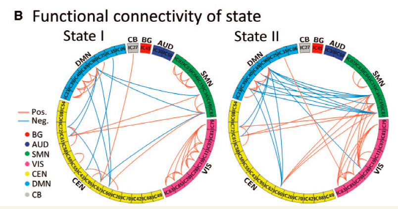

**Author(s)**: `r params$author`  
**Date**: `r Sys.Date()`  

# Academic Citation
If you use this code in your work or research, we kindly request that you cite our publication:

Xiaofan Lu, et al. (2025). FigureYa: A Standardized Visualization Framework for Enhancing Biomedical Data Interpretation and Research Efficiency. iMetaMed. https://doi.org/10.1002/imm3.70005

If you use circlize in published research, please cite:

Gu, Z. circlize implements and enhances circular visualization in R. Bioinformatics 2014.

```{r setup, include=FALSE}
knitr::opts_chunk$set(echo = TRUE)
```

## 需求描述
## Requirement description

用R代码画出paper里的图。

Use R code to draw the plot in paper.



**图2** 各状态的聚类分析结果。图中只显示了每个状态下功能连接矩阵的 5%，代表最强的连接（即绝对值最大的相关系数）。每个方块的颜色代表七个网络中的一个。红线表示**正功能连接**，蓝线表示**负功能连接**。BG = 基底神经节；AUD = 听觉；SMN = 感觉运动；VIS = 视觉；CEN = 认知执行；CB = 小脑网络。

**Figure 2** Results of the clustering analysis per state. Only 5% of the functional connectivity matrix in each state is shown, representing the strongest connections (i.e. the largest absolute value correlation coefficients). Each square colour represents one of the seven networks. Red lines represent **positive functional connectivity**, and blue lines represent **negative functional connectivity**. BG = basal ganglia; AUD = auditory; SMN = sensorimotor; VIS = visual; CEN = cognitive executive; CB = cerebellar network

出自<https://academic.oup.com/brain/article-lookup/doi/10.1093/brain/awx233>

From<https://academic.oup.com/brain/article-lookup/doi/10.1093/brain/awx233>

## 应用场景
## Application scenario

如果展示A-B-C之间的关系，用sankey图就够了，见FigureYa25sankey。

如果还要展示A-C的关系，直线排列的sankey图就不适合了。

本图用圆圈和连线展示多个亚组之间的关系，包括且不限于基因、基因片段、亚型。

- 场景一：展示基因融合（fusion），同一个基因的多个片段用同一种颜色，用线把不同基因间融合的片段连接起来。常见于肿瘤基因组DNA测序数据。

- 场景二：像例图那样，同一组基因用相同的颜色展示，基因间的正、负调控关系用两种颜色的线展示，组间的调控关系一目了然。

If the relationship among A-B-C is to be shown, a sankey diagram is sufficient, see FigureYa25sankey.

If the relationship between A and C needs to be shown, a straight-line Sankey diagram is not suitable.

This diagram uses circles and connecting lines to show relationships between multiple subgroups, including and not limited to genes, gene fragments, and subtypes.

- Scenario 1: Demonstrate gene fusion (fusion), where multiple fragments of the same gene are in the same color, and lines are used to connect the fused fragments between different genes. Commonly seen in tumor genome DNA sequencing data.

- Scenario 2: As in the example diagram, the same group of genes is displayed in the same color, and the positive and negative regulatory relationships between genes are displayed with lines of two colors, so that the regulatory relationships between groups can be seen at a glance.

## 环境设置
# Environment Setup

```{r}
source("install_dependencies.R") #自动识别缺哪些R包，自动安装
library(stringi)    # 字符串处理工具包，用于文本操作
library(circlize)   # 用于绘制环形图（circos plot）的核心包
library(graphics)   # R 基础绘图包，支持基本图形功能

# 显示英文报错信息
# Show English error messages
Sys.setenv(LANGUAGE = "en") 

# 禁止chr转成factor
# Prevent character-to-factor conversion
options(stringsAsFactors = FALSE) 
```

## 输入文件
## Input file

需要三个文件：

- Gene_ID.txt，组，此处一个Gene为一组；

- Gene_feature.txt，亚组，Gene内包含多个Subgroup；

- Links.txt，Subgroup之间的links。

如果你要突出显示某个基因或某条连线，在输入文件中找到相应的行，修改颜色或高度即可。

Three files are needed:

- Gene_ID.txt, groups, here a Gene is a group;

- Gene_feature.txt, subgroups, multiple Subgroups contained within a Gene;

- Links.txt, links between Subgroups.

If you want to highlight a gene or a link, find the corresponding line in the input file and change the color or height.

```{r}
#组ID、组的起止位置
#Group ID, start and end positions of the group
GeneID <- read.table("Gene_ID.txt", header = TRUE, sep = "\t")
head(GeneID)

#亚组的名字和起止位置，至少要有前四列
#最后一列颜色为可选项，可以在输入文件中写好，也可以在后面的代码中指定
#the name and starting and ending positions of the subgroups, at least the first four columns
#the last column color is optional and can be written in the input file or specified later in the code
GeneFe <- read.table("Gene_feature.txt", header = TRUE, sep = "\t")
head(GeneFe)

#哪两个亚组之间要画连线、线在亚组上的相对位置，至少要有前四列
#后两列颜色“link_col”和高度“link_height”为可选项，可以在输入文件中写好，也可以在后面的代码中指定
#which two subgroups should be connected with a line, and the relative position of the line on the subgroups, with at least the first four columns.
#the color “link_col” and the height “link_height” of the last two columns are optional, they can be written in the input file or specified in the code behind.
Links <- read.table("Links.txt", header = TRUE, sep = "\t")
head(Links)

# 把组ID转换成factor，因为后面画图需要factor
# convert the group ID to a factor, because you'll need the factor to draw the graph later
GeneID$GeneID <- factor(GeneID$GeneID, levels = GeneID$GeneID)
```

## 开始画图
## Start drawing

**注意：**如果你用复制粘贴代码的方式运行，需要从pdf到dev.off之间的语句要一次性全部复制。

**Note:** If you run it by copying and pasting the code, you need to copy all the statements between pdf and dev.off at once.

```{r,message=FALSE,warning=FALSE}
#### 绘图区设置
#### drawing area setting

pdf("circlize.pdf",width = 8,height = 6)
par(mar=rep(0,4))
circos.clear()
circos.par(start.degree = 90, #从哪里开始画，沿着逆时针顺序 start drawing from where, in a counterclockwise direction
           gap.degree = 2, #每两个sectors间的间隔大小，此处是每两个组间的间隔 the size of the interval between every two sectors, here refers to the interval between each pair of groups
           track.margin = c(0,0.15), #gap.degree规定了左右，track.margin规定上下 gap.degree specifies left and right, track.margin specifies top and bottom
           cell.padding = c(0,0,0,0) #？
           )


#### 根据"Gene_ID.txt"画组
#### Draw group according to “Gene_ID.txt”

#图是多个组围成的一个圈，其中每个组及其亚组都画在一个单独的坐标系里
#基因的方向作为x轴
#the diagram is a circle surrounded by multiple groups, where each group and its subgroups are plotted in a separate coordinate system
#the direction of the genes is used as the x-axis
circos.initialize(factors = GeneID$GeneID,
                  xlim = cbind(GeneID$Gene_Start, GeneID$Gene_End))

circos.trackPlotRegion(ylim = c(0, 1), factors = GeneID$GeneID, track.height=0.1,
                       
                       #每个部分的panel.fun
                       #panel.fun for each sector
                       panel.fun = function(x, y) {
                         #选择当前部分的详细信息
                         #select details of current sector
                         name = get.cell.meta.data("sector.index") 
                         i = get.cell.meta.data("sector.numeric.index") 
                         xlim = get.cell.meta.data("xlim")
                         ylim = get.cell.meta.data("ylim")
                         
                         #组ID文字的设置
                         #setting of group ID text
                         circos.text(x = mean(xlim), 
                                     y = 1,
                                     labels = name,
                                     cex = 1.5,   #组ID文字大小 group ID text size
                                     #col = "darkgrey", #组ID的颜色 group ID color
                                     adj = c(0.5,-0.8)
                                     #如果想让组ID呈放射状排列，就用下面三行代替上面那行
                                     #If you want the group ID to be radial, replace the top row with the following three rows  
                                     #niceFacing = TRUE, #组ID头朝上 group ID header up
                                     #facing = "reverse.clockwise",
                                     #adj = c(1.5, -0.8) #组ID的位置 location of group ID
                                     )
                         
                         #画组
                         #draw group
                         circos.rect(xleft = xlim[1], 
                                     ybottom = ylim[1],
                                     xright = xlim[2], 
                                     ytop = ylim[2],
                                     col = "white",
                                     border = NA)
                         })

#### 根据"Gene_feature.txt"画亚组
#### Draw subgroups according to “Gene_feature.txt”

#提需求的小伙伴还想让圆圈图中每个方块颜色不同，整体显示彩虹色，就像circlize_rainbow.pdf那样的效果，就把下面这个for循环里的“col = ...”行换成“col = bgcol[i], ”
#运行下面两行，设置彩虹色
#The requester also wants each square in the circle chart to have a different color, displaying a rainbow effect overall, similar to the effect in circlize_rainbow.pdf. Just replace the line "col = ..." in the for loop below with "col = bgcol[i], ".
#run the following two lines, set the rainbow color

bgcol <- rainbow(sum(GeneID$Gene_End), s = 1, v = 1, start = 0, end = max(1, sum(GeneID$Gene_End) - 1)/sum(GeneID$Gene_End), alpha = 1)

for (i in 1:nrow(GeneFe)){
  ylim = c(0, 1)
  circos.rect(sector.index = GeneFe$GeneID[i], 
              track.index = 1, 
              xleft = GeneFe$Feature_Start[i], # + 0.01, #让feature之间流出空隙 allow gaps between features
              ybottom = ylim[1], 
              xright = GeneFe$Feature_End[i], # - 0.01, #让feature之间流出空隙 allow gaps between features
              ytop = ylim[2],
              #如果想让每个方块颜色不同，用彩虹色画每一个Gene feature就运行下面这行
              #If you want each square to have a different color, use rainbow colors to draw each Gene feature by running the following line
              #col = bgcol[i], 
              #如果想让每个组用同一个颜色，调用输入文件中写好的颜色，就运行下面这行
              #If you want to use the same color for each group, call the color written in the input file and run the following line
              col = paste("#", GeneFe$bar_col[i], sep = ""), 
              border = "black")
}

# 亚组的文字
# text of the subgroup
for (i in 1:nrow(GeneFe)){
  ylim = c(0, 1)
  circos.text(GeneFe$Feature_Start[i] + 0.5,
              ylim[1] + 0.5,
              GeneFe$Subgroup[i],
              sector.index = GeneFe$GeneID[i], 
              facing = "inside",
              cex = 0.8)
}

#### 根据"Links.txt"画连线
#### Draw links from “Links.txt”
for(i in 1:nrow(Links)){
  circos.link(sector.index1 = Links$Gene_1[i], 
              point1 = Links[i, 2],
              sector.index2 = Links$Gene_2[i], 
              point2 = Links[i, 4],
              
              #在输入文件中已经写好了连线的颜色
              #the color of the connecting lines is already written in the input file
              col = paste("#", Links$link_col[i], sep = ""), 
              #如果不想在输入文件中写颜色，还可以运行下面这行，在这里指定颜色
              #If you don't want to write the color in the input file, you can also run the following line and specify the color here
              #col = "red", 
              
              border = FALSE, 
              lwd = 2, #连线的粗细 thickness of the connecting line
              rou = 0.7, #连线起始和终止点的y值（圆半径的百分比） y-value of the start and end points of the line (percentage of circle radius)
              h.ratio = 0.7 #连线的拱形高度，数值越大，拱形越低 the height of the arch of the connecting line, the higher the value, the lower the arch
              #h.ratio = Links$link_height[i] #在输入文件中指定拱形高度 specify the arch height in the input file
  )
}


#基因的图例
#Legend of gene
GeneCol<-data.frame(legendID=GeneFe$GeneID,legendCol=GeneFe$bar_col)
GeneCol_uniq<-base::unique(GeneCol) 
legend(1,0.6,
       bty = "n",#不要边框 no borders
       pch = 16,#画成正方形，圆点是16 draw it as a square and the dot is 16
       legend = GeneCol_uniq$legendID,
       col = paste0("#",GeneCol_uniq$legendCol),
       horiz = FALSE)

#连线的图例
#Legend of links
LinksCol<-data.frame(Links$link_col)
LinksCol_uniq<-base::unique(LinksCol) 
legend(1,0.8,
       bty = "n",
       lty = 1,#画线 draw lines
       lwd = 2,#线的粗细 thickness of the line
       legend = c("Pos.","Neg."),
       col = paste0("#",LinksCol_uniq$Links.link_col),
       horiz = FALSE)

dev.off()
```


```{r}
sessionInfo()
```
