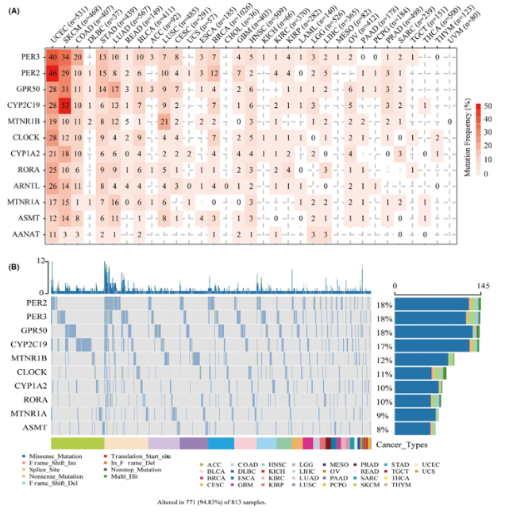

**Author(s)**: `r params$author`  
**Reviewer(s)**: `r params$reviewer`  
**Date**: `r Sys.Date()`  

# Academic Citation
If you use this code in your work or research, we kindly request that you cite our publication:

Xiaofan Lu, et al. (2025). FigureYa: A Standardized Visualization Framework for Enhancing Biomedical Data Interpretation and Research Efficiency. iMetaMed. https://doi.org/10.1002/imm3.70005

```{r setup, include=FALSE}
knitr::opts_chunk$set(echo = TRUE)
```

# 需求描述
# Demand description

我们希望复现pancancer SNV

We desired to reproduce pan-cancer SNV analysis



出自：<https://onlinelibrary.wiley.com/doi/10.1111/jpi.12758>

图2 褪黑素调节因子的单核苷酸变异(SNV)频率及变异类型。
(A) 褪黑素调节因子的突变频率。数值表示特定癌症中对应基因发生突变的样本数量。"0"表示该基因编码区未检测到突变，空白则表示该基因任何区域均未发现突变。
(B) SNV突变景观图。展示褪黑素调节因子突变分布及SNV类型分类的热图。

Source: <https://onlinelibrary.wiley.com/doi/10.1111/jpi.12758>

FIGURE 2 Single nucleotide variation(SNV) frequency and variant types of melatonergic regulators.
(A)Mutation frequency of melatonergic regulators. Numbers represent the number of samples that have the corresponding mutated gene for a given cancer. “0” indicates that there was no mutation in the gene coding region, and no number indicates there was no mutation in any region of the gene.
(B) SNV oncoplot. An oncoplot showing the mutation distribution of melatonergic regulators and a classification of SNV types.

# 应用场景
# Application scenarios

分析泛癌中特定通路基因的突变情况。

Analysis of mutation patterns in specific pathway genes across pan-cancer.

# 环境设置
# Environment Setup

```{r}
source("install_dependencies.R")

library(tidyverse)
library(magrittr)
library(readxl)
library(stringr)
library(ggplot2)
library(maftools)
library(dplyr)
library(reshape2)
library(RColorBrewer)

# 显示英文报错信息
# Show English error messages
Sys.setenv(LANGUAGE = "en") 

# 禁止chr转成factor
# Prevent character-to-factor conversion
options(stringsAsFactors = FALSE) 
```

# 输入文件
# Input Files

mc3.v0.2.8.PUBLIC.maf.gz，TCGA pancancer突变数据，下载自<https://gdc.cancer.gov/about-data/publications/pancanatlas> Mutations，下载地址<http://api.gdc.cancer.gov/data/1c8cfe5f-e52d-41ba-94da-f15ea1337efc>

merged_sample_quality_annotations.tsv，下载自<https://gdc.cancer.gov/about-data/publications/pancanatlas>，下载地址<http://api.gdc.cancer.gov/data/1a7d7be8-675d-4e60-a105-19d4121bdebf>。跟FigureYa263panDiff、FigureYa265panCNV、FigureYa268panCNVexpr使用的是同一套数据，已经下载的小伙伴就不用重复下载了。

mc3.v0.2.8.PUBLIC.maf.gz, TCGA 
pancancer mutation data, downloaded from <https://gdc.cancer.gov/about-data/publications/pancanatlas>.
Mutations, download link <http://api.gdc.cancer.gov/data/1c8cfe5f-e52d-41ba-94da-f15ea1337efc>.

merged_sample_quality_annotations.tsv, downloaded from <https://gdc.cancer.gov/about-data/publications/pancanatlas>, download link <http://api.gdc.cancer.gov/data/1a7d7be8-675d-4e60-a105-19d4121bdebf>. The same dataset is used in FigureYa263panDiff, FigureYa265panCNV, and FigureYa268panCNVexpr. Friends who have already downloaded it don't need to download again.

```{r}
# 修正TCGA名称
# Correcting TCGA names
rawAnno <- read.delim("merged_sample_quality_annotations.tsv",sep = "\t",row.names = NULL,check.names = F,stringsAsFactors = F,header = T)
rawAnno$simple_barcode <- substr(rawAnno$aliquot_barcode,1,15)

# 去重并过滤空值
# Remove duplicates and filter empty values
samAnno <- rawAnno[!duplicated(rawAnno$simple_barcode),c("cancer type", "simple_barcode")]
samAnno <- samAnno[which(samAnno$`cancer type` != ""),]

# 保存结果
# Save results
write.table(samAnno,"simple_sample_annotation.txt",sep = "\t",row.names = F,col.names = T,quote = F)

# 加载泛癌突变MAF文件
# Loading pan-cancer mutation MAF file
panmaf <- read_tsv("mc3.v0.2.8.PUBLIC.maf.gz", comment = "#")
unique(panmaf$Variant_Classification)

# 感兴趣基因列表
# List of genes of interest
genelist <- c("PER3","PER2","GPR50","CYP2C19","MTNR1B","CLOCK","CYP1A2","RORA","ARNTL","MTNR1A","ASMT","AANAT")
```

# 计算累积突变样本量
# Calculating cumulative mutation sample counts

```{r}
# 设置coding区域的突变以及非coding区域的突变
# Define coding and non-coding mutations

## Coding区域（个人认为是非沉默突变）
## Coding mutations (considered non-synonymous) 
vc_nonSyn <- c("Frame_Shift_Del",
               "Frame_Shift_Ins",
               "Splice_Site",
               "Translation_Start_Site",
               "Nonsense_Mutation",
               "Nonstop_Mutation",
               "In_Frame_Del",
               "In_Frame_Ins",
               "Missense_Mutation")

## 非coding区域（个人认为是沉默突变）
## Non-coding mutations (considered synonymous) 
vc_Syn <- c("3'UTR",
            "5'UTR",
            "3'Flank",
            "5'Flank",
            "IGR",
            "Intron",
            "Silent")

# 创建样本ID映射表
# Create sample ID mapping table
mafsam <- data.frame(samID = panmaf$Tumor_Sample_Barcode,
                     simple_barcode = substr(panmaf$Tumor_Sample_Barcode,1,15),
                     stringsAsFactors = F)

# 去重并合并临床注释
# Remove duplicates and merge clinical annotations
mafsam <- mafsam[!duplicated(mafsam$simple_barcode),]
mafsam <- merge(mafsam,samAnno, by = "simple_barcode", all.x = TRUE)
mafsam <- as.data.frame(na.omit(mafsam))

# 添加带样本数的癌症类型标签
# Add cancer type labels with sample counts
txt <- data.frame(label = paste0(names(table(mafsam$`cancer type`))," (n=", as.numeric(table(mafsam$`cancer type`)),")"),
                  "cancer type" = names(table(mafsam$`cancer type`)),
                  check.names = F) 

mafsam <- merge(mafsam, txt, by = "cancer type", all.x = TRUE)
rownames(mafsam) <- mafsam$simple_barcode

# 取感兴趣的突变子集
# Extract the subset of mutations of interest
# is.element(genelist, panmaf$Hugo_Symbol)
panmaf <- panmaf[which(panmaf$Hugo_Symbol %in% genelist),]
panmaf$Tumor_Sample_Barcode <- substr(panmaf$Tumor_Sample_Barcode,1,15)
write.table(panmaf, file = "maf of genes of interest.txt",sep = "\t",row.names = F,col.names = T,quote = F)

# 重新读取确保数据一致性
# Re-read to ensure data consistency
panmaf <- read_tsv("maf of genes of interest.txt", comment = "#")

# 初始化突变计数矩阵
# Initialize mutation count matrices
nonSyncount <- matrix(0, nrow = length(genelist), ncol = length(mafsam$simple_barcode),
                   dimnames = list(genelist, mafsam$simple_barcode))
Syncount <- matrix(0, nrow = length(genelist), ncol = length(mafsam$simple_barcode),
                   dimnames = list(genelist, mafsam$simple_barcode))

# 转置矩阵以便后续处理
# Transpose matrices for downstream processing
nonSyncount <- as.data.frame(t(nonSyncount))
Syncount <- as.data.frame(t(Syncount))

# 逐个基因填充突变矩阵
# Populate mutation matrices gene by gene
for (i in genelist) {
  message(i," starts...")
  
  # 取出当前基因的突变
  # Extract mutations for the current gene
  submaf <- panmaf[which(panmaf$Hugo_Symbol == i),] 
  for (j in 1:nrow(submaf)) { # 循环每一行
    tmp <- submaf[j,]
    
    # 获取当前突变的基因
    # Get the current mutated gene
    mutGene <- i 
    
    # 获取当前突变的样本
    # Get the current mutated sample
    mutSam <- tmp$Tumor_Sample_Barcode 
    
    if(is.element(tmp$Variant_Classification, vc_nonSyn)) { 
      # 如果突变类型为coding类，则coding计数矩阵设为1
      # If mutation type is coding, the coding count matrix is set to 1
      nonSyncount[mutSam, mutGene] <- 1 
    }
    if(is.element(tmp$Variant_Classification, vc_Syn)) { 
      # 如果突变类型为非coding类，则非coding计数矩阵设为1
      # If mutation type is non-coding, the non-coding count matrix is set to 1
      Syncount[mutSam, mutGene] <- 1  
    }
  }
}

# 根据癌种计算累积突变样本量
# Calculate cumulative mutation sample counts by cancer type
nonSyncount$tumor <- mafsam[rownames(nonSyncount),"label"]
Syncount$tumor <- mafsam[rownames(Syncount),"label"]

# 按癌症类型汇总非沉默突变
# Aggregate non-synonymous by cancer type
nonSyncount.tumor <- as.data.frame(apply(nonSyncount[,setdiff(colnames(nonSyncount), "tumor")], 2, function(x) tapply(x, INDEX=factor(nonSyncount$tumor), FUN=sum, na.rm=TRUE))) 

# 对同一种癌种的沉默突变求和
# Sum synonymous mutations for each cancer type
Syncount.tumor <- as.data.frame(apply(Syncount[,setdiff(colnames(Syncount), "tumor")], 2, function(x) tapply(x, INDEX=factor(Syncount$tumor), FUN=sum, na.rm=TRUE))) 

# 初始化结果矩阵
# Initialize result matrices
mutCount <- matrix(NA, nrow = length(genelist), ncol = length(unique(mafsam$label)),
                   dimnames = list(genelist, unique(mafsam$label)))
mutCount <- as.data.frame(mutCount)
mutFreq <- mutCount

# 填充最终结果矩阵
# Populate final result matrices
for (i in genelist) {
  for(j in unique(mafsam$label)) {
    tumor <- sapply(strsplit(j," (", fixed = T),"[",1)
    
    # 情况1：存在非沉默突变
    # Case 1: Non-synonymous mutations exist
    if(nonSyncount.tumor[j,i] > 0) { 
      
      # 记录该癌种的非沉默突变数
      # Record non-synonymous mutation count for this cancer type
      mutCount[i,j] <- nonSyncount.tumor[j,i] 
      
      # 根据该癌种的样本数计算突变频率（个人认为原文并没有如此计算，原文的颜色映射似乎是按照突变数目来的，而不是突变频率）
      # Calculate mutation frequency based on sample count (Note: The original paper may not have calculated this way; the color mapping seems based on mutation counts rather than frequency)
      mutFreq[i,j] <- nonSyncount.tumor[j,i]/as.numeric(table(mafsam$`cancer type`)[tumor]) * 100 
    }
    
    # 情况2：仅存在沉默突变
    # Case 2: Only synonymous mutations exist
    if(nonSyncount.tumor[j,i] == 0 & Syncount.tumor[j,i] > 0) { 
      # 若非沉默突变不存在，而沉默突变存在，则记录该癌种的突变数目为0，突变频率为0
      # If no non-synonymous mutations exist but synonymous mutations do, record mutation count as 0 and mutation frequency as 0 for this cancer type
      mutCount[i,j] <- 0  
      mutFreq[i,j] <- 0  
    }
    
    # 情况3：无任何突变
    # Case 3: No mutations detected
    if(nonSyncount.tumor[j,i] == 0 & Syncount.tumor[j,i] == 0) { 
      # 若非沉默突变不存在，沉默突变也不存在，则此单元为空值，突变频率为0
      # If neither non-synonymous nor synonymous mutations exist, mark this cell as NA and set mutation frequency to 0
      mutCount[i,j] <- NA  
      mutFreq[i,j] <- 0 
    }
  }
}
```

# 开始画图
# Plotting

## 图2A - 褪黑素调节因子的突变频率
## Figure 2A - Mutation frequency of melatonergic regulators

```{r}
# 数据重塑：将突变计数和频率矩阵转换为长格式
# Data reshaping: Convert mutation count and frequency matrices to long format
ggCount <- reshape2::melt(as.matrix(mutCount), varnames = c("Cancer", "Gene"), as.is = T) 
ggFreq <- reshape2::melt(as.matrix(mutFreq), varnames = c("Cancer", "Gene"), as.is = T) 

# 合并计数和频率数据
# Combine count and frequency data
ggData <- cbind.data.frame(ggCount, Freq = ggFreq$value)
colnames(ggData) <- c("Cancer","Gene","Count","Freq")

# 创建热图 
# Create heatmap
p <- 
  ggplot(data = ggData) +
  geom_tile(mapping = aes(Gene, Cancer, fill = Freq), col = "grey80") +
  geom_text(mapping = aes(Gene, Cancer, label = Count), size =3) +
  scale_fill_gradient(low = "white","high" = "red") + 
  scale_x_discrete(position = "top") +
  labs(fill = "Mutation Frequency (%)") + 
  theme_bw() + #theme(axis.text.x = element_text(angle = 45))
  theme(axis.title = element_blank(),
        axis.text.x = element_text(hjust = 0, size = 10, color = "black", angle = 45),
        axis.text.y = element_text(hjust = 1, size = 10, color = "black"),
        axis.ticks = element_line(size=0.2, color="black"),
        axis.ticks.length = unit(0.2, "cm"),
        panel.background = element_blank(),
        panel.grid = element_blank()) 

# 保存为PDF
# Save as PDF
ggsave(p, filename = "frequency heatmap.pdf", width = 10,height = 4)
```


## 图2B - SNV突变景观图
## Figure 2B - SNV oncoplot

```{r}
# 读取感兴趣的基因子集突变文件
# Read mutation file for genes of interest subset
panmaf <- read.maf(maf = "maf of genes of interest.txt",
                   removeDuplicatedVariants = TRUE,
                   isTCGA = FALSE,
                   vc_nonSyn = c("Frame_Shift_Del",
                                 "Frame_Shift_Ins",
                                 "Splice_Site",
                                 "Translation_Start_Site",
                                 "Nonsense_Mutation",
                                 "Nonstop_Mutation",
                                 "In_Frame_Del",
                                 "In_Frame_Ins",
                                 "Missense_Mutation"))

# 匹配样本注释信息
# Match sample annotation
mafAnno <- mafsam[which(mafsam$simple_barcode %in% panmaf@data$Tumor_Sample_Barcode),]
colnames(mafAnno)[1:2] <- c("Cancer","Tumor_Sample_Barcode")

# 设置突变颜色
# Set mutation colors
mutcol <- brewer.pal(n = 10, name = 'Paired')
names(mutcol) <- c('Frame_Shift_Del','Missense_Mutation', 'Nonsense_Mutation', 'Frame_Shift_Ins','In_Frame_Ins', 'Splice_Site', 'In_Frame_Del','Nonstop_Mutation','Translation_Start_Site','Multi_Hit')

# 设置癌症类型颜色
# Set cancer type colors
cancercolors <- NMF:::ccRamp(brewer.pal(n = 12,name = 'Paired'), length(unique(mafAnno$Cancer)))
names(cancercolors) <- unique(mafAnno$Cancer)

# 创建注释颜色列表
# Create annotation color list
annocolors = list(Cancer = cancercolors)

# 生成oncoprint图
# Generate oncoprint plot
pdf(file = "oncoprint.pdf", width = 10, height = 5)
oncoplot(maf = panmaf, 
         colors = mutcol, 
         minMut = 0.05 * nrow(mafAnno), 
         bgCol = "grey95", 
         borderCol = NA, 
         annotationDat = mafAnno, 
         annotationColor = annocolors,
         clinicalFeatures = "Cancer", 
         sortByAnnotation = T) 
invisible(dev.off())
```


# Session Info

```{r}
sessionInfo()
```
