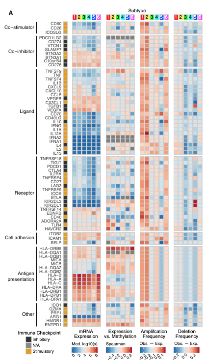

**Author(s)**: `r params$author`  
**Reviewer(s)**: `r params$reviewer`  
**Date**: `r Sys.Date()`  

# Academic Citation
If you use this code in your work or research, we kindly request that you cite our publication:

Xiaofan Lu, et al. (2025). FigureYa: A Standardized Visualization Framework for Enhancing Biomedical Data Interpretation and Research Efficiency. iMetaMed. https://doi.org/10.1002/imm3.70005

If you use circlize in published research, please cite:

Gu, Z. circlize implements and enhances circular visualization in R. Bioinformatics 2014.

If you use ComplexHeatmap in published research, please cite:

Zuguang Gu, et al., Complex heatmaps reveal patterns and correlations in multidimensional genomic data, Bioinformatics, 2016.

Zuguang Gu. Complex Heatmap Visualization, iMeta, 2022.

```{r setup, include=FALSE}
knitr::opts_chunk$set(echo = TRUE)
```

# 需求描述
# Demand description

在单个癌种中复现Figure 6A

亚型的个数可以随意更改更好啦，3类，4类或者6类这样

Reproduce Figure 6A in a single cancer type

The number of subtypes can be flexibly adjusted (e.g., 3, 4, or 6 classes) for better analysis



出自：<https://linkinghub.elsevier.com/retrieve/pii/S1074761318301213>

图6. 免疫调节因子的调控
(A) 从左至右依次为：
**mRNA表达**（中位数标准化表达水平）；
**表达与甲基化**（基因表达与DNA甲基化β值的相关性）；
**扩增频率**（某一亚型中免疫调节因子扩增的样本比例与所有样本中扩增比例的差异）；
**缺失频率**（计算方法与扩增频率相同）。
（针对75个免疫调节因子基因，按免疫亚型分组展示。）

Source: <https://linkinghub.elsevier.com/retrieve/pii/S1074761318301213>

Figure 6. Regulation of Immunomodulators
(A) From left to right: 
**mRNA expression** (median normalized expression levels); 
**expression versus methylation** (gene expression correlation with DNA-methylation beta-value); 
**amplification frequency** (the difference between the fraction of samples in which an IM is amplified in a particular subtype and the amplification fraction in all samples); 
and the **deletion frequency** (as amplifications) for 75 IM genes by immune subtype.

# 应用场景
# Application scenarios

在肿瘤亚型中研究表达、甲基化、拷贝数变异的关系与分布情况。

这里以乳腺癌为例，PAM50分型有5个。

Study the relationships and distributions of expression, methylation, and copy number variations across tumor subtypes.

Here, using breast cancer as an example, the PAM50 classification includes five subtypes.

# 环境设置
# Environment Setup

```{r}
source("install_dependencies.R")

# 用于绘制热图
# For generating heatmaps
library(ComplexHeatmap) 

# 用于热图颜色设置
# For configuring heatmap color schemes
library(circlize) 

# 用于提供甲基化注释文件
# Provides methylation annotation files
library(ChAMPdata)

# 用于读取大文件
# Efficiently reads large data files
library(data.table) 

# 用于获取乳腺癌PAM50分型
# Used for breast cancer PAM50 subtyping
library(genefu) 

# 加载内置数据集
# Load built-in datasets
data("pam50.robust")
data("probe.features")

# 显示英文报错信息
# Show English error messages
Sys.setenv(LANGUAGE = "en") 

# 禁止chr转成factor
# Prevent character-to-factor conversion
options(stringsAsFactors = FALSE) 
```

# 输入文件的准备
# Preparing Input Files

以乳腺癌PAM50分型为例，示例数据均下载来自XENA，包括：

- 表达谱：<https://xenabrowser.net/datapages/?dataset=TCGA.BRCA.sampleMap%2FHiSeqV2&host=https%3A%2F%2Ftcga.xenahubs.net&removeHub=https%3A%2F%2Fxena.treehouse.gi.ucsc.edu%3A443>
表达谱为行为基因，列为样本的矩阵，可使用FPKM，TPM，或者normalized count
- 拷贝数：<https://xenabrowser.net/datapages/?dataset=TCGA.BRCA.sampleMap%2FGistic2_CopyNumber_Gistic2_all_thresholded.by_genes&host=https%3A%2F%2Ftcga.xenahubs.net&removeHub=https%3A%2F%2Fxena.treehouse.gi.ucsc.edu%3A443>
用于绘制热图的拷贝数数据需是行为基因，列为样本，入值为基因拷贝数情况的矩阵。矩阵中1为扩增，-1为缺失，0为野生型，此类矩阵一般通过GISTIC分析获取（可参考FigureYa79CNV）
- 甲基化：<https://xenabrowser.net/datapages/?dataset=TCGA.BRCA.sampleMap%2FHumanMethylation450&host=https%3A%2F%2Ftcga.xenahubs.net&removeHub=https%3A%2F%2Fxena.treehouse.gi.ucsc.edu%3A443>
甲基化数据为行为探针，列为样本的beta矩阵，并且需有对应注释文件，以将探针映射到基因水平

Using breast cancer PAM50 subtyping as an example, the sample datasets were all downloaded from XENA, including:

- Expression profiles: <https://xenabrowser.net/datapages/?dataset=TCGA.BRCA.sampleMap%2FHiSeqV2&host=https%3A%2F%2Ftcga.xenahubs.net&removeHub=https%3A%2F%2Fxena.treehouse.gi.ucsc.edu%3A443>
The expression matrix should be formatted with genes as rows and samples as columns. Acceptable quantification methods include FPKM, TPM, or normalized counts.
- Copy number variation (CNV): <https://xenabrowser.net/datapages/?dataset=TCGA.BRCA.sampleMap%2FGistic2_CopyNumber_Gistic2_all_thresholded.by_genes&host=https%3A%2F%2Ftcga.xenahubs.net&removeHub=https%3A%2F%2Fxena.treehouse.gi.ucsc.edu%3A443>
For heatmap visualization, CNV data should be structured as a gene-by-sample matrix with numerical values indicating copy number status:
1 = Amplification
-1 = Deletion
0 = Wild-type
Such matrices are typically generated through GISTIC analysis (refer to FigureYa79CNV).
- DNA methylation: <https://xenabrowser.net/datapages/?dataset=TCGA.BRCA.sampleMap%2FHumanMethylation450&host=https%3A%2F%2Ftcga.xenahubs.net&removeHub=https%3A%2F%2Fxena.treehouse.gi.ucsc.edu%3A443>
Methylation data should be provided as a beta-value matrix with probes as rows and samples as columns. An annotation file is required to map probes to gene-level information.

```{r}
# 设置热图颜色
# Set heatmap color scheme
heatmap.BlWtRd <- c("#1F66AC", "#75AFD3", "grey90", "#FAB99B", "#B2192B")

# 设置免疫调节基因集
# Load immunomodulator gene set
immunomodulator <- read.table("immunomodulator.txt",sep = "\t",row.names = 1,check.names = F,stringsAsFactors = F,header = T)

# 数据处理 
# 该部分是为产生最终用于绘图的文件
# Data Processing 
# This section prepares final files for plotting

## 表达谱
## Expression data
expr <- read.table("TCGA.BRCA.sampleMap_HiSeqV2.gz",sep = "\t",row.names = 1,check.names = F,stringsAsFactors = F,header = T)

# 检查免疫基因是否在表达数据中 
# Check if immunomodulators are in expression data
is.element(rownames(immunomodulator),rownames(expr)) 

# PAM50分子分型
# Perform PAM50 molecular subtyping
pam50pred <- molecular.subtyping(sbt.model = "pam50",
                                 data = t(expr),
                                 annot = data.frame(Gene.Symbol = rownames(expr)),
                                 do.mapping = FALSE)

# 简化分型标签
# Simplify subtype labels
subtype <- as.character(pam50pred$subtype)
sinfo <- data.frame(row.names = colnames(expr),
                    pam50 = subtype,
                    subtype = sapply(subtype, switch,
                                     "Basal"  = "C1",
                                     "Her2"   = "C2",
                                     "LumB"   = "C3",
                                     "LumA"   = "C4",
                                     "Normal" = "C5"))

# 提取免疫相关基因表达数据
# Extract immunomodulator expression data
expr <- expr[rownames(immunomodulator),]

## 甲基化谱
## Methylation data
meth <- fread("TCGA.BRCA.sampleMap_HumanMethylation450.gz", sep = "\t",check.names = F,stringsAsFactors = F,header = T,data.table = F)
rownames(meth) <- meth$sample; meth <- meth[,-1]
meth <- as.data.frame(na.omit(meth))

# 筛选免疫基因相关甲基化探针 
# Filter methylation probes for immunomodulators
probeOfInterest <- probe.features[which(probe.features$gene %in% rownames(immunomodulator)),]
probeOfInterest <- probeOfInterest[intersect(rownames(probeOfInterest), rownames(meth)),]

# 检查基因是否有对应甲基化探针
# Check gene-probe mapping
is.element(rownames(immunomodulator), probeOfInterest$gene) 

# 按基因合并甲基化数据 (取中位数) 
# Aggregate methylation data by gene (median)
meth <- meth[rownames(probeOfInterest),]
meth$gene <- probeOfInterest$gene
meth <- as.data.frame(apply(meth[,setdiff(colnames(meth), "gene")], 2, function(x) tapply(x, INDEX=factor(meth$gene), FUN=median, na.rm=TRUE)))

## 拷贝数变异 (-2,-1,0,1,2: 2 copy del, 1 copy del, no change, amplification, high-amplification)
## Copy number alteration data (-2,-1,0,1,2: 2 copy del, 1 copy del, no change, amplification, high-amplification)
cna <- read.table("TCGA.BRCA.sampleMap_Gistic2_CopyNumber_Gistic2_all_thresholded.by_genes.gz",sep = "\t",row.names = 1,check.names = F,stringsAsFactors = F,header = T)
cna$gene <- sapply(strsplit(rownames(cna),"|",fixed = T),"[",1)
cna <- cna[!duplicated(cna$gene),]; cna <- cna[,setdiff(colnames(cna),"gene")]

# 检查免疫基因是否有CNA数据
# Check CNA data availability
is.element(rownames(immunomodulator),rownames(cna)) 

# 筛选免疫相关基因CNA数据
# Filter CNA data for immunomodulators
cna <- cna[intersect(rownames(cna),rownames(immunomodulator)),]

# 统一扩增
# Consolidate amplifications
cna[cna > 1] <- 1 

# 统一缺失
# Consolidate deletions
cna[cna < -1] <- -1 

## 提取共同样本
## Extract common samples across all datasets
comsam <- intersect(colnames(expr), colnames(meth))
comsam <- intersect(comsam, colnames(cna))

# 统一样本子集
# Subset all data to common samples
sinfo <- sinfo[comsam,,drop = F]
expr <- expr[,comsam]
meth <- meth[,comsam]
cna <- cna[,comsam]

# 保存预处理数据
# Save preprocessed data
write.table(sinfo[,"subtype",drop = F], file = "easy_input_subtype.txt",sep = "\t",row.names = T,col.names = NA,quote = F)
write.table(expr, file = "easy_input_expr.txt",sep = "\t",row.names = T,col.names = NA,quote = F)
write.table(meth, file = "easy_input_meth.txt",sep = "\t",row.names = T,col.names = NA,quote = F)
write.table(cna, file = "easy_input_cna.txt",sep = "\t",row.names = T,col.names = NA,quote = F)
```

# 绘图矩阵的准备
# Preparing Plotting Matrices

准备图中四个部分的数据：

- mRNA表达量（中位数标准化表达水平）；
- 表达与甲基化（基因表达与DNA甲基化β值的相关性分析）；
- 扩增频率（特定亚型中免疫调节因子（IM）的扩增样本比例与全样本扩增比例的差异）；
- 缺失频率（计算方法同扩增频率），按免疫亚型展示75个免疫调节因子基因的结果。

Prepare data for the four components of the figure:

- mRNA expression (median normalized expression levels); 
- expression versus methylation (gene expression correlation with DNA-methylation beta-value); 
- amplification frequency (the difference between the fraction of samples in which an IM is amplified in a particular subtype and the amplification fraction in all samples); 
- the deletion frequency (as amplifications) for 75 IM genes by immune subtype.

```{r}
# 读取数据
# Data Loading
sinfo <- read.table(file = "easy_input_subtype.txt",sep = "\t",row.names = 1,check.names = F,stringsAsFactors = F,header = T)
expr <- read.table(file = "easy_input_expr.txt",sep = "\t",row.names = 1,check.names = F,stringsAsFactors = F,header = T)
meth <- read.table(file = "easy_input_meth.txt",sep = "\t",row.names = 1,check.names = F,stringsAsFactors = F,header = T)
cna <- read.table(file = "easy_input_cna.txt",sep = "\t",row.names = 1,check.names = F,stringsAsFactors = F,header = T)

# 亚型数目（注意，亚型必须以C1，C2，C3...等命名）
# Subtype Configuration (Subtypes must be named as C1, C2, C3...)
(n.subt <- length(unique(sinfo$subtype))) 
subt <- unique(sinfo$subtype)

# 初始化绘图矩阵
# Initialize Plotting Matrices
expMat <- as.data.frame(t(expr[rownames(immunomodulator),]))
expMat$subtype <- sinfo[rownames(expMat), "subtype"]
expMat <- as.data.frame(t(apply(expMat[,setdiff(colnames(expMat), "subtype")], 2, 
                                function(x) 
                                  tapply(x, 
                                         INDEX = factor(expMat$subtype), 
                                         FUN = median, 
                                         na.rm = TRUE)))) 

# 创建空矩阵存储结果
# Create empty matrices for results
corExpMeth <- ampFreq <- delFreq <- 
  as.data.frame(matrix(NA,
                       nrow = nrow(immunomodulator),
                       ncol = n.subt, 
                       dimnames = list(rownames(immunomodulator), 
                                       unique(sinfo$subtype))))

## 表达谱与甲基化的相关性
## Expression-Methylation Correlation
for (i in rownames(immunomodulator)) {
  if(!is.element(i, rownames(expr)) | !is.element(i, rownames(meth))) {   # 如果存在任意一方有缺失的基因,则保持矩阵为NA
    # Maintain NA if gene missing in either dataset
    corExpMeth[i,] <- NA 
  } else { 
    # 否则取出亚型样本，做表达和甲基化的相关性
    # Otherwise, take out the subtype samples and conduct the correlation between expression and methylation
    for (j in subt) {
      sam <- rownames(sinfo[which(sinfo$subtype == j),,drop = F])
      expr.subset <- as.numeric(expr[i, sam])
      meth.subset <- as.numeric(meth[i, sam])
      ct <- cor.test(expr.subset, meth.subset, method = "spearman") 
      corExpMeth[i, j] <- ct$estimate
    }
  }
}

## 扩增/缺失频率
## Amplification/Deletion Frequency Calculation
for (i in rownames(immunomodulator)) {
  if(!is.element(i, rownames(cna))) { 
    # 如果存在拷贝数中缺失某基因，则保持NA
    # Maintain NA if gene missing in CNV data
    ampFreq[i,] <- NA 
    delFreq[i,] <- NA
  } else { 
    # 否则,计算i在总样本中的频率
    # Otherwise, calculate the frequency of i in the total sample
    ampFreqInAll <- sum(as.numeric(cna[i,]) == 1)/ncol(cna) 
    delFreqInAll <- sum(as.numeric(cna[i,]) == -1)/ncol(cna) 
    for (j in subt) {
      # 以及，计算i在亚型j中的频率
      # And, calculate subtype-specific frequencies
      sam <- rownames(sinfo[which(sinfo$subtype == j),,drop = F])
      cna.subset <- cna[, sam]
      ampFreqInSubt <- sum(as.numeric(cna.subset[i,]) == 1)/length(sam)
      delFreqInSubt <- sum(as.numeric(cna.subset[i,]) == -1)/length(sam) 
      
      ampFreqInDiff <- ampFreqInSubt - ampFreqInAll 
      delFreqInDiff <- delFreqInSubt - delFreqInAll 
      
      ampFreq[i, j] <- ampFreqInDiff
      delFreq[i, j] <- delFreqInDiff
    }
  }
}

# 保存结果文件
# Save result files
write.table(expMat,"expMat.txt",sep = "\t",row.names = T,col.names = NA,quote = F)
write.table(corExpMeth,"corExpMeth.txt",sep = "\t",row.names = T,col.names = NA,quote = F)
write.table(ampFreq,"ampFreq.txt",sep = "\t",row.names = T,col.names = NA,quote = F)
write.table(delFreq,"delFreq.txt",sep = "\t",row.names = T,col.names = NA,quote = F)
```

# 开始画图
# Plottingd

绘制综合热图

Generating Integrated Heatmap

```{r}
# 创建列注释
# Create Column Annotations
annCol <- data.frame(subtype = subt,
                     row.names = subt)

# 按照亚型排序
# Order by subtype
annCol <- annCol[order(annCol$subtype),,drop = F] 

# 初始化颜色列表
# Initialize color list
annColors <- list()

# 设置亚型颜色编码 
# Set subtype color scheme
annColors[["subtype"]] <- c("C1" = "red",
                            "C2" = "yellow",
                            "C3" = "green",
                            "C4" = "cyan",
                            "C5" = "blue")

# 创建顶部注释条 
# Create top annotation bar
top_anno <- HeatmapAnnotation(df                   = annCol,
                              col                  = annColors,
                              gp                   = gpar(col = "grey80"), 
                              simple_anno_size     = unit(3.5, "mm"), 
                              show_legend          = F, 
                              show_annotation_name = F, 
                              border               = FALSE) 

# 创建行注释
# Create Row Annotations
annRow <- immunomodulator

# 简化类别名称避免重叠
# Shorten category names to prevent overlap
annRow[which(annRow$Category == "Co-stimulator"),"Category"] <- "Co-stm" 
annRow[which(annRow$Category == "Co-inhibitor"),"Category"] <- "Co-ihb"
annRow[which(annRow$Category == "Cell adhesion"),"Category"] <- "Cell\nadhesion" 
annRow[which(annRow$Category == "Antigen presentation"),"Category"] <- "Antigen\npresentation"

# 定义因子顺序
# Define factor levels
annRow$Category <- factor(annRow$Category, levels = c("Co-stm","Co-ihb","Ligand","Receptor","Cell\nadhesion","Antigen\npresentation","Other")) 
annRow$ICI <- factor(annRow$ICI, levels = c("Inhibitory","N/A","Stimulatory"))

# 定义免疫检查点颜色
# Define ICI colors
annRowColors <- list("ICI" = c("Inhibitory" = "black","N/A" = "#888888","Stimulatory" = "#E59E02"))

# 创建左侧注释条 
# Create left annotation bar
left_anno <- HeatmapAnnotation(df                   = annRow[,"ICI",drop = F],
                               which                = "row", 
                               gp                   = gpar(col = "grey80"), 
                               col                  = annRowColors,
                               simple_anno_size     = unit(3.5, "mm"), 
                               show_annotation_name = F,
                               border               = F)

# 表达谱热图
# Expression Heatmap
col_expr <- colorRamp2(seq(min(na.omit(expMat)), max(na.omit(expMat)), length = 5), heatmap.BlWtRd)
hm.expr <- Heatmap(matrix             = as.matrix(expMat),
                   col                = col_expr,
                   border             = NA, 
                   rect_gp = gpar(col = "grey80"), 
                   cluster_rows       = F, 
                   cluster_columns    = F, 
                   show_row_names     = T, 
                   row_names_side     = "left", 
                   row_names_gp       = gpar(fontsize = 10), 
                   show_column_names  = F, 
                   column_names_side  = "top",
                   row_split          = annRow$Category, 
                   top_annotation     = top_anno, 
                   left_annotation    = left_anno, 
                   name               = "mRNA\nExpression", 
                   width              = ncol(expMat) * unit(4, "mm"), 
                   height             = nrow(expMat) * unit(3.5, "mm"))

# 表达-甲基化相关性热图
# Expression-Methylation correlation heatmap
col_corExprMeth <- colorRamp2(seq(min(na.omit(corExpMeth)), max(na.omit(corExpMeth)), length = 5), heatmap.BlWtRd)
hm.corExprMeth <- Heatmap(matrix             = as.matrix(corExpMeth),
                          col                = col_corExprMeth,
                          border             = NA,
                          rect_gp = gpar(col = "grey80"),
                          cluster_rows       = F,
                          cluster_columns    = F,
                          show_row_names     = F,
                          row_names_side     = "left",
                          row_names_gp       = gpar(fontsize = 10),
                          show_column_names  = F,
                          column_names_side  = "top",
                          row_split          = annRow$Category,
                          row_title          = NULL,
                          top_annotation     = top_anno,
                          name               = "Expression\nvs. Methylation",
                          width              = ncol(expMat) * unit(4, "mm"),
                          height             = nrow(expMat) * unit(3.5, "mm"))

# 扩增频率热图
# Amplification frequency heatmap
col_ampFreq <- colorRamp2(seq(min(na.omit(ampFreq)), max(na.omit(ampFreq)), length = 5), heatmap.BlWtRd)
hm.ampFreq <- Heatmap(matrix             = as.matrix(ampFreq),
                      col                = col_ampFreq,
                      border             = NA,
                      rect_gp = gpar(col = "grey80"),
                      cluster_rows       = F,
                      cluster_columns    = F,
                      show_row_names     = F,
                      row_names_side     = "left",
                      row_names_gp       = gpar(fontsize = 10),
                      show_column_names  = F,
                      column_names_side  = "top",
                      row_split          = annRow$Category,
                      row_title          = NULL,
                      top_annotation     = top_anno,
                      name               = "Amplification\nFrequency",
                      width              = ncol(expMat) * unit(4, "mm"),
                      height             = nrow(expMat) * unit(3.5, "mm"))

# 缺失频率热图 
# Deletion frequency heatmap
col_delFreq <- colorRamp2(seq(min(na.omit(delFreq)), max(na.omit(delFreq)), length = 5), heatmap.BlWtRd)
hm.delFreq <- Heatmap(matrix             = as.matrix(delFreq),
                      col                = col_delFreq,
                      border             = NA,
                      rect_gp = gpar(col = "grey70"),
                      cluster_rows       = F,
                      cluster_columns    = F,
                      show_row_names     = F,
                      row_names_side     = "left",
                      row_names_gp       = gpar(fontsize = 10),
                      show_column_names  = F,
                      column_names_side  = "top",
                      row_split          = annRow$Category,
                      row_title          = NULL,
                      top_annotation     = top_anno,
                      name               = "Deletion\nFrequency",
                      width              = ncol(expMat) * unit(4, "mm"),
                      height             = nrow(expMat) * unit(3.5, "mm"))

# 输出PDF文件
# Export PDF
pdf(file = "complexheatmap of immunomodulator.pdf", width = 8,height = 12)

# 绘制组合热图
# Draw combined heatmaps
draw(hm.expr + hm.corExprMeth + hm.ampFreq + hm.delFreq, 
     heatmap_legend_side = "bottom") 

# 关闭图形设备
# Close graphic device
invisible(dev.off())
```

# Session Info

```{r}
sessionInfo()
```
