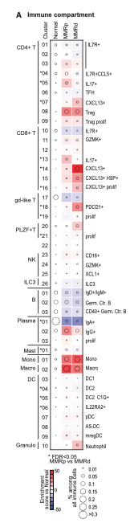
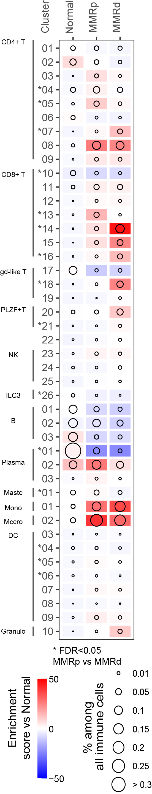
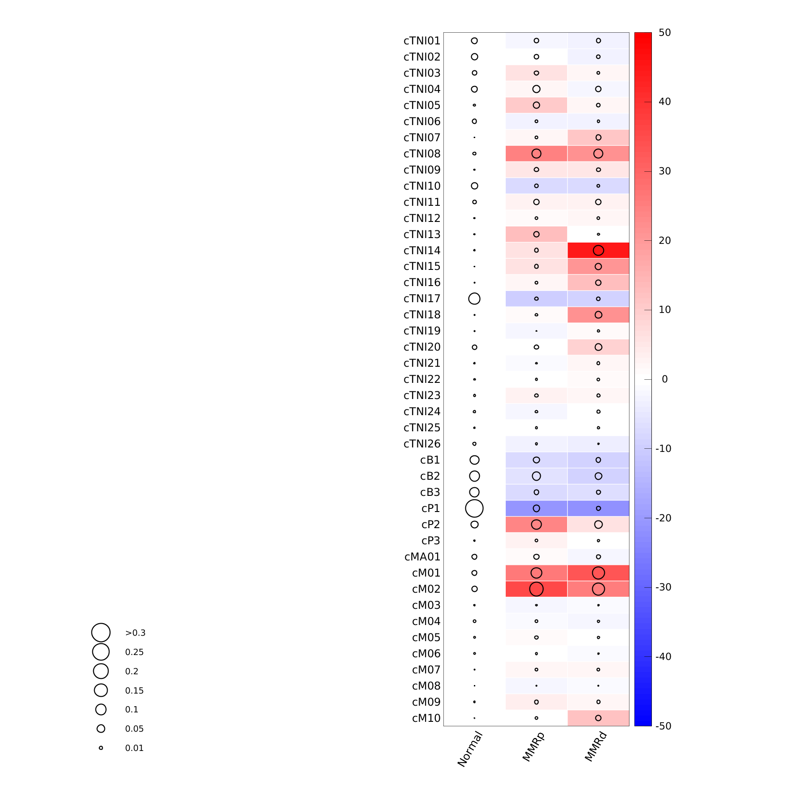

**Author(s)**: `r params$author`  
**Reviewer(s)**: `r params$reviewer`  
**Date**: `r Sys.Date()`  

# Academic Citation
If you use this code in your work or research, we kindly request that you cite our publication:

Xiaofan Lu, et al. (2025). FigureYa: A Standardized Visualization Framework for Enhancing Biomedical Data Interpretation and Research Efficiency. iMetaMed. https://doi.org/10.1002/imm3.70005

```{r setup, include=FALSE}
knitr::opts_chunk$set(echo = TRUE)
```

# 需求描述
# Requirements Description

Heatmap和Bubble plot叠加的图。

Heatmap和Bubble plot用的是两套数据。

Heatmap and Bubble plot overlay.

The Heatmap and Bubble plot use two different sets of data.



出自：<https://linkinghub.elsevier.com/retrieve/pii/S0092867421009454>

图2. MMRd与MMRp型结直肠癌的免疫细胞组成特征
(A) 相对于癌旁正常组织，MMRp和MMRd肿瘤中免疫细胞簇的成分变化。
MMRp与MMRd组间比较经Kruskal-Wallis检验校正后错误发现率(FDR)＜0.05的细胞类型以星号(*)标注。

Source: <https://linkinghub.elsevier.com/retrieve/pii/S0092867421009454>

Figure 2. The immune compartment in MMRd and MMRp CRC
(A) Compositional changes in immune cell clusters in MMRp and MMRd tumors relative to adjacent normal tissue. 
Kruskal-Wallis false discovery rate (FDR) < 0.05 for MMRp versus MMRd are marked with asterisks.

# 应用场景
# Application Scenario

Dr. Guangchuang Yu评价：上下三角的更好替代品。上下三角指的是这个图<https://mp.weixin.qq.com/s/34WRZRBVPHUNRLlzNH2nzw>

同时展示同一对象的两种特征，例如同时展示多个基因在多个样本中的表达量和DNA甲基化水平等等。

Dr. Guangchuang Yu's evaluation: A better alternative to upper and lower triangles. The upper and lower triangles refer to this figure <https://mp.weixin.qq.com/s/34WRZRBVPHUNRLlzNH2nzw>

Simultaneously displaying two characteristics of the same object, such as showing both the expression levels and DNA methylation levels of multiple genes across multiple samples, etc.

# 环境设置
# Environment Setup

```{r}
source("install_dependencies.R")

library(tidyverse)
library(ggplot2)

# 显示英文报错信息
# Show English error messages
Sys.setenv(LANGUAGE = "en")

# 禁止chr转成factor
# Prevent character-to-factor conversion
options(stringsAsFactors = FALSE) 
```

# 输入文件
# Input Files

这里为复现原文准备数据。先筛选patient，可忽略，直接跳到“求平均值和pvalue”。

首先查看原文excel表中的一些关于图表数据的说明：

> 按患者统计的细胞数量
- 该表格显示每位患者（列：Pid）中各免疫细胞类型（行）的细胞计数。仅总细胞数超过1000的样本被纳入分析。与图2A相关。

> 按患者统计的细胞富集情况
- 该表格显示每位患者（列：Pid）中各免疫细胞类型（行）相较于正常样本的富集程度（Pearson残差；详见方法部分）。仅总细胞数超过1000的样本被纳入分析。与图2A相关。

> 组成差异分析
- 该表格展示不同样本组（MMRd、MMRp、正常组）间免疫细胞组成的差异。采用Kruskal-Wallis检验判定显著性变化。与图2A相关。

我们可以看到是对病人进行了一定的筛选：细胞数目总共超过 1000 的病人才用于分析，那么我们在分析数据前就必须对数据进行一定的过滤

首先我们将两个相关的表格数据copy出来准备为两个文件：
1. A_Cell_count_by_patient.txt
2. B_Cell_enrichment_by_patient.txt

Here, data is prepared for the reproduction of the original text. First, filter the patients (this step can be ignored, proceed directly to "Calculating Averages and p-values").

Now, check some explanations about the chart data in the original excel table:

> Cell count by patient
- Table showing the immune cell type (rows) counts for each patient (Pid, columns). Only specimens with over 1000 total cells are included in the analysis. Related to Figure 2A.

> Cell enrichment by patient	
- Table showing the immune cell type (rows) enrichment (Pearson-Residual; see Methods) as compared to normals for each patient (Pid, columns). Only specimens with over 1000 total cells are included in the analysis. Related to Figure 2A.

> Compositional differences
- Table showing compositional differences within the immune compartment beteen samples (MMRd, MMRp, Normal). Kruskal-Wallis test was used to determine significant changes. Related to Figure 2A.

We can see that the patients underwent certain filtering: only patients with a total cell count exceeding 1,000 were included in the analysis. Therefore, before analyzing the data, we must perform some filtering on the dataset.

We will extract the two relevant tables of data and prepare them as two separate files:

1. A_Cell_count_by_patient.txt
2. B_Cell_enrichment_by_patient.txt

```{r}
# 读取细胞计数数据
# Read cell count data
A_Cell_count_by_patient <- read_table("A_Cell_count_by_patient.txt") %>%
  column_to_rownames("Row")

# 读取细胞富集分数数据 
# Read cell enrichment score data
B_Cell_enrichment_by_patient <- read_table("B_Cell_enrichment_by_patient.txt") %>%
  column_to_rownames("Row")

# 根据 A_Cell_count_by_patient 文件筛选出符合标准（细胞数目>1000）的病人
# Filter patients with >1000 cells based on A_Cell_count_by_patient
filter_patient_small_1000cell <- colSums(A_Cell_count_by_patient) >= 1000

# 根据筛选好的病人，提取表1和表2中对应的病人信息
# Based on the screened patients, extract the corresponding patient information in Table 1 and Table 2
filtered_dt_A <- A_Cell_count_by_patient[, filter_patient_small_1000cell]
filtered_dt_B <- B_Cell_enrichment_by_patient[, filter_patient_small_1000cell]

# 保存到文件，便于套用格式
write.csv(filtered_dt_A, "easy_input_A.csv", quote = F)
write.csv(filtered_dt_B, "easy_input_B.csv", quote = F)
```

# 求平均值和pvalue
# Calculate averages and p-values

图中圆圈大小和热图颜色都是同一分组内样本的平均值。

两个文件的行名、列名保持一致。行名为细胞ID；列名为patient ID，以分组名开头，patient有三个分组，分别是MMRp、MMRd和Normal。

easy_input_A.csv，用于画气泡图。气泡图表示的是 %among all all immune cells。先求出每个patient中每种细胞所占的比例，然后再求三个分组patient各种细胞所占比例的平均值。你的数据可能不需要计算比例，例如基因表达量，直接求基因在各样本中的表达量的平均值就好。

easy_input_B.csv，用于画热图。计算三种人群中每种细胞的 `Enrichment score vs Normal` 的平均值。

The circle sizes in the plot and heatmap colors both represent the mean values of samples within the same group.

The two files maintain consistent row and column names. Rows correspond to cell IDs; columns represent patient IDs, prefixed with group names. There are three patient groups: MMRp, MMRd, and Normal.

easy_input_A.csv is used for generating the bubble plot. The bubble plot displays the "% among all immune cells". First calculate the proportion of each cell type within every patient, then compute the average proportion across patients in each of the three groups. Note: Your data might not require proportion calculations - for example, with gene expression data, you can directly calculate the average expression values of genes across samples.

easy_input_B.csv is used for creating the heatmap. It calculates the average `Enrichment score vs Normal` for each cell type across the three population groups.

```{r}
# 加载数据，Cell counts by patient，用于画气泡图
# Load data for bubble plot (cell counts by patient)
filtered_dt_A <- read.csv("easy_input_A.csv", row.names = 1)

# 数据处理流程 
# Data processing pipeline
plot_data_A <- as.data.frame(apply(filtered_dt_A, 2, function(x) x/sum(x))) %>% 
  # 猜你可能不需要计算每种细胞所占的比例，就改用下面这行
  #filtered_dt_A %>%#
  #If it is not necessary to calculate the proportion of each type of cell, use the following line instead
  #filtered_dt_A %>%#
  rownames_to_column(var = "Cell") %>%
  rowwise() %>%
  
  # 计算各分组均值
  # Calculate group means
  transmute(
    Cell = factor(Cell, levels = rev(rownames(filtered_dt_A))),
    Normal = mean(c_across(starts_with("Normal"))),
    MMRp = mean(c_across(starts_with("MMRp"))),
    MMRd = mean(c_across(starts_with("MMRd")))
  ) %>%
  ungroup() %>%
  
  # 转换成长格式 
  # Convert to long format
  pivot_longer(
    cols = -Cell,
    names_to = "Patient_group",
    values_to = "mean_cell_number"
  ) %>%
  
  # 设置分组顺序
  # Set group order
  group_by(Patient_group) %>%
  mutate(
    Patient_group = factor(Patient_group, levels = c("Normal", "MMRp", "MMRd"))
  ) 

# 加载数据，Cell enrichment by patient，用于画热图
# Load data for heatmap (cell enrichment by patient)
filtered_dt_B <- read.csv("easy_input_B.csv", row.names = 1)

# 数据处理流程 
# Data processing pipeline
plot_data_B <- filtered_dt_B %>%
  rownames_to_column(var = "Cell") %>%
  rowwise() %>%
  
  # 计算各分组均值
  # Calculate group means
  transmute(
    Cell = factor(Cell, levels = rev(rownames(filtered_dt_A))),
    Normal = mean(c_across(starts_with("Normal"))),
    MMRp = mean(c_across(starts_with("MMRp"))),
    MMRd = mean(c_across(starts_with("MMRd")))
  ) %>%
  ungroup() %>%
  
  # 转换成长格式 
  # Convert to long format
  pivot_longer(
    cols = -Cell,
    names_to = "Patient_group",
    values_to = "mean_cell_number"
  ) %>%
  
  # 设置分组顺序
  # Set group order
  group_by(Patient_group) %>%
  mutate(
    Patient_group = factor(Patient_group, levels = c("Normal", "MMRp", "MMRd"))
  ) 
```

例文图中Y轴标出了 `MMRp vs MMRd` Kruskal-Wallis false discovery rate `FDR <- 0.5` 的细胞，因此需要计算pvalue。

根据自己的需要，也可以不做。

In the example figure, the cells with `MMRp vs MMRd` Kruskal-Wallis false discovery rate `FDR < -0.5` are marked on the Y-axis, so the p-value needs to be calculated.

You can choose not to do it according to your own needs.

```{r}
# 首先构建一个计算 `Pvalue` 的函数
# Kruskal-Wallis test function
ks <- function(Cell = Cell){
  MMRd <- as.numeric(MMRd_cell_data[Cell, ])
  MMRp <- as.numeric(MMRp_cell_data[Cell, ])
  data <- c(MMRd, MMRp) 
  group = rep(
    c("MMRd", "MMRp"), times = c(length(MMRd), length(MMRp))
  )
  kruskal.test(data, group)$p.value
}

# 准备MMRd组细胞数据 
# Prepare MMRd group cell data
MMRd_cell_data <- filtered_dt_A %>%
  select(starts_with("MMRd"))

# 准备MMRp组细胞数据
# Prepare MMRp group cell data
MMRp_cell_data <- filtered_dt_A %>%
  select(starts_with("MMRp"))

# 计算并处理P值 
# Calculate and process p-values
Pvalue <- data.frame(
  Cell = row.names(filtered_dt_B),
  Pvalue = sapply(row.names(filtered_dt_B), ks, simplify = T)
  ) %>%
  mutate(
    FDR = p.adjust(Pvalue, method = "fdr"),
    label = ifelse(FDR < 0.05, paste0("*", str_extract(Cell, "[0-9]+")), str_extract(Cell, "[0-9]+"))
      )

# 保存结果到CSV文件 
# Save results to CSV file
write.csv(Pvalue, "output_Pvalue.csv", row.names = F)
```

# 开始画图
# Start Plotting

图中是热图 + 圈图，如果圈图放在底层，会被热图覆盖。因此我们利用 ggplot2图层叠加的道理，先画热图再画圈图。

另外，这里存在两组不同的数据，我们很多人喜欢将数据集放在 `ggplot()` 函数中，那么就会产生一个全局数据集的概念，所以我们需要将数据集放在各自的绘图函数 `geom_tile` 和 `geom_point()` 中来作为局部数据集。

The figure combines a heatmap with bubble plot. If the bubble plot were placed in the bottom layer, it would be obscured by the heatmap. Therefore, we follow ggplot2's layer superposition principle by drawing the heatmap first, then adding the bubble plot.

Additionally, since we have two distinct datasets here, while many prefer to specify the dataset in the `ggplot()` function (creating a global dataset concept), we instead assign the datasets separately within their respective plotting functions - `geom_tile` and `geom_point()` to maintain them as local datasets.

```{r, fig.height= 10, fig.width=3}
# 创建基础图形对象 
# Create base plot object
p <- ggplot() +
  
  # 绘制热图部分 
  # Heatmap layer
  geom_tile(
    data = plot_data_B,
    aes(Patient_group, Cell, fill = mean_cell_number), 
    colour = "white", size = 1
  ) +
  
  # 设置热图颜色梯度 
  # Set heatmap color gradient
  scale_fill_gradientn(
    colours  = gplots::bluered(128),
    limit = c(-50, 50),
    breaks = c(-50, 0, 50),
    # breaks = seq(-50, 50, by = 10),
    labels = c("-50", "0", "50"),
    name = "Enrichment \nscore vs Normal"
    ) +
  
  # 绘制气泡图部分 
  # Bubble plot layer
  geom_point(
    data = plot_data_A,
    aes(Patient_group, Cell, size = mean_cell_number),
    shape = 1
  ) +
  
  # 设置气泡大小标度 
  # Set bubble size scale
  scale_size_area(
    breaks = c(0.01, 0.05, 0.1, 0.15, 0.2, 0.25, 0.3),
    labels = c(0.01, 0.05, 0.1, 0.15, 0.2, 0.25, "> 0.3"),
    name = "% among\nall immune cells"
  ) + 
  
  # 设置坐标轴和标签 
  # Axis and label settings
  labs(
    x = "",
    y = ""
  ) +
  scale_x_discrete(position = "top") +
  
  # 主题设置 
  # Theme settings
  theme_bw() +
  theme(
    panel.grid.major = element_blank(),
    axis.text.x = element_text(angle = 90),
    legend.position = "bottom", 
    legend.direction="vertical",
    legend.title = element_text(angle = 90),
    legend.title.align = 0.5,
    legend.box.just = "left"
    ) +
  
  # 图例细节调整 
  # Legend fine-tuning
  guides(
     fill = guide_colorbar(title.position = "left", order = 1),
     size = guide_legend(title.position = "left", order = 2)
     )

p
```

Y轴标星，采用 `Pvalue` 中的 `label` 替换原本的 yaixs 文本信息

Y-axis significance markers: Replace original axis labels with asterisk-tagged labels from the Pvalue$label column

```{r, fig.height= 10, fig.width=3}
# 在基础图形p上添加y轴标签设置 
# Add y-axis label settings to base plot p
p1 <- p +  scale_y_discrete(labels = rev(Pvalue$label), position = "left") 
p1
```

保存结果为 PDF 到本地，再通过 AI 等 PDF 编辑器进行后期的编辑。

Save the results as PDF, then perform post-processing using PDF editors like Adobe Illustrator (AI).

```{r}
# 保存PDF格式图形
# Save plot as PDF
ggsave("heatmap_bubble_plot_width3.pdf", p1, height = 10, width = 3, device = "pdf")

# 调整输出比例，就变成了方格
# By adjusting the output ratio, it becomes a grid
ggsave("heatmap_bubble_plot_width1.5.pdf", p1, height = 10, width = 1.5, device = "pdf")
```

AI 简单的编辑后的结果：

The result after simple editing by AI:

{height=800px}


最后给大家看看这篇文章作者用 `PYTHON` 版本的绘制的草图：

Finally, let's take a look at the sketches drawn by the author of this article in the 'PYTHON' version:

- [Figure_2.ipynb](https://github.com/matanhofree/crc-immune-hubs/blob/main/notebooks/Figure_2.ipynb)


# 会话信息
# Session Info

```{r}
# 显示会话信息
# Show session information
sessionInfo()
```
