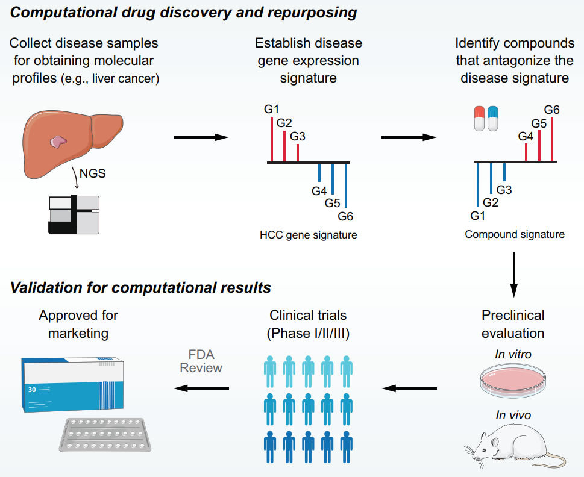

**Author(s)**: `r params$author`  
**Reviewer(s)**: `r params$reviewer`  
**Date**: `r Sys.Date()` 

# Academic Citation
If you use this code in your work or research, we kindly request that you cite our publication:

Xiaofan Lu, et al. (2025). FigureYa: A Standardized Visualization Framework for Enhancing Biomedical Data Interpretation and Research Efficiency. iMetaMed. https://doi.org/10.1002/imm3.70005

```{r setup, include=FALSE}
knitr::opts_chunk$set(echo = TRUE)
```

# 需求描述
# Demand description

有篇最近的文章可以替代一下FigureYa131cMAP，好像能用类似cmap的方法来进行药物预测，但这篇没有没有提供代码，。

I came across a recent article that also uses a CMAP-like method for drug prediction, but the authors didn’t provide the code. This could also serve as an alternative to FigureYa131cMAP.



出自：<https://elifesciences.org/articles/71880>

图1. LINCS数据驱动的治疗发现概述。基于"特征逆转"的计算方法工作原理。首先需要识别代表异常表达模式的疾病特征（G1、G2和G3表示疾病状态下上调的基因，而G4、G5和G6表示下调的基因）。利用这一特征，可以查询药理学扰动数据集，寻找能够逆转疾病表达模式的化合物（抑制G1、G2和G3的表达，同时诱导G4、G5和G6的表达）。确定候选化合物后，需要通过实验和临床验证将计算结果转化为临床应用。LINCS，集成网络细胞特征库。

Source: <https://elifesciences.org/articles/71880>

Figure 1. Overview of LINCS data-driven therapeutic discovery. The working principle of ‘signature reversion’-based computational approach. A disease signature representing discordant expression pattern needs first to be identified (G1, G2, and G3 stand for upregulated genes while G4, G5, and G6 stand for down-regulated genes in disease state). With this signature, pharmacologic perturbation data sets can be queried to find compounds with the ability to reverse disease expression pattern (suppress expression of G1, G2, and G3 and induce expression of G4, G5, and G6). After determining the candidate compounds, experimental and clinical validation are required to translate computational findings to clinical applications. LINCS, Library of Integrated Network-based Cellular Signatures.

# 应用场景
# Application scenarios

CMap分析主要涉及三个部分：

- 一是疾病的分子特征（disease signature）：以肿瘤为例，这个signature可以通过常规的癌与癌旁的差异分析得到。
- 二是药物的分子特征（druf signature）：这部分数据可以来自大家熟悉CMap数据库（包括了1309种药物在5个细胞系中的药物处理后的表达特征）。  
- 三是特征匹配算法（signature matching methods）：大家常用的网页版的CMap通常使用基于Kolmogorov-Smirnov (KS)的方法来计算CMap score，但这种方法经证明并不是最优的计算cmap分析方法 (Yang et al. Elife 2022)。
  
例文这项研究 (Yang et al. Elife 2022, https://elifesciences.org/articles/71880) 证明了使用 eXtreme Sum (XSum) 的方法来进行CMap分析最有可能得到有意义的结果（XSum的性能经该研究评估要比大家常用的网页工具中的KS要好很多）。此外，该研究也确定了进行 CMap 分析时最优的参数（以下演示中会提到）。虽然该研究并不是使用 CMap 数据库而主要使用了LINCS数据库（关于CMap和LINCS的区别大家可以自己看看原文），但方法在两个数据库之间是通用的。因此，以下演示仍将使用大家熟悉的CMap数据；且所有分析全部可用R完成，不需要再基于任何网页工具。  

如果大家使用了以下演示中的方法，记得引用例文文献（PMID: 35191375）。  

The CMap analysis primarily involves three components:

- Molecular signatures of diseases (disease signature): Taking cancer as an example, this signature can be obtained through conventional differential analysis between tumor and adjacent normal tissues.
- Molecular signatures of drugs (drug signature): This part of the data can be sourced from the well-known CMap database (which includes expression profiles of 1,309 drugs across five cell lines after drug treatment).
- Signature matching algorithms (signature matching methods): The commonly used web-based CMap tool typically employs the Kolmogorov-Smirnov (KS) method to calculate the CMap score. However, this approach has been proven suboptimal for CMap analysis (Yang et al. Elife 2022).

The referenced study (Yang et al. Elife 2022, https://elifesciences.org/articles/71880) demonstrated that using the eXtreme Sum (XSum) method for CMap analysis is most likely to yield meaningful results (XSum's performance was evaluated in this study to be significantly better than the KS method used in the popular web tool). Additionally, the study identified the optimal parameters for conducting CMap analysis (which will be mentioned in the following demonstration). Although this study primarily utilized the LINCS database rather than CMap (for differences between CMap and LINCS, readers may refer to the original paper), the methods are applicable across both databases. Therefore, the following demonstration will still use the familiar CMap data, and all analyses can be completed entirely in R without relying on any web-based tools.

If you use the methods described in the following demonstration, please cite the referenced paper (PMID: 35191375).

# 环境设置
# Environment Setup

```{r}
source("install_dependencies.R")

library(PharmacoGx)
library(parallel)
library(dplyr)
library(stringr)
library(tidyverse)
library(tibble)
library(clusterProfiler)
library(ggplot2)
library(ggrepel)
library(ggthemes)
library(gridExtra)

# 显示英文报错信息
# Show English error messages
Sys.setenv(LANGUAGE = "en")

# 禁止chr转成factor
# Prevent character-to-factor conversion
options(stringsAsFactors = FALSE) 
```

# CMap数据下载及预处理  
# Downloading and Preprocessing CMap Data

CMAP_gene_signatures.RData，处理好的CMap数据，下载地址<https://www.pmgenomics.ca/bhklab/sites/default/files/downloads/CMAP_gene_signatures.RData> 

camp_sig.rds，这里作演示的文件只包含了部分药物。实际应用时要用完整的cmap数据，请自行下载CMAP_gene_signatures.RData，并运行以下代码，即可得到**完整的 camp_sig.rds 文件**。

CMAP_gene_signatures.RData – Preprocessed CMap data, available for download at <https://www.pmgenomics.ca/bhklab/sites/default/files/downloads/CMAP_gene_signatures.RData> 

camp_sig.rds – This demo file contains only a subset of drugs. For practical applications, the full CMap dataset should be used. Please download CMAP_gene_signatures.RData and run the following code to generate **the complete camp_sig.rds file**.

```{r, eval=FALSE}
# 提取药物处理矩阵
# Extracting Drug Treatment Matrix
load("CMAP_gene_signatures.RData")
camp_sig <- CMAP.genePerturbations[,,c("tstat")] %>% data.frame()

# 基因名转换
# Gene ID Conversion
camp_sig$ENTREZID <- do.call(rbind, strsplit(rownames(camp_sig),'\\.'))[,2]

SYMBOL <- bitr(camp_sig$ENTREZID, fromType = "ENTREZID",
               toType = "SYMBOL", OrgDb = "org.Hs.eg.db")

camp_sig <- merge(SYMBOL, camp_sig, by = "ENTREZID")
camp_sig <- column_to_rownames(camp_sig, var = "SYMBOL"); camp_sig <- camp_sig[,-1]

# 保存数据
# Saving Data  
saveRDS(camp_sig, "camp_sig.rds")
```

# 疾病分子特征预处理  
# Preprocessing Disease Molecular Signatures

以下演示将以肝癌数据为例，通过癌与癌旁的差异分析得到疾病分子特征。 

当然通过差异分析得到疾病分子特征是camp分析最简单的一种应用方式，大家也可以开发更多的使用方式（如通过比较转移与非转移的肿瘤样本得到与转移相关的分子特征，基于这个分子特征进行cmap分析就有可能找到潜在对抗转移的药物）。

The following demonstration uses liver cancer data as an example, where disease molecular signatures are obtained through differential analysis between tumor and adjacent normal tissues.

Of course, obtaining disease signatures through differential analysis represents the simplest application of CMap analysis. Researchers can explore more sophisticated approaches (for example, by comparing metastatic versus non-metastatic tumor samples to derive metastasis-associated molecular signatures - conducting CMap analysis based on such signatures could potentially identify drugs that may counteract metastasis).

```{r}
# 以下生成signature基因的代码只适用于TCGA来源的数据
# The following code for generating signature genes is only applicable to TCGA-derived data
data <- read.table("LIHC_TPM.txt", sep="\t", check.names=F, header=T, row.names=1)

# 得到癌与癌旁比较的logfc
# Obtain logFC values for tumor vs. adjacent normal comparison
tumor <- data[, str_detect(colnames(data), "-01")]
normal <- data[, str_detect(colnames(data), "-11")]

dis_sig <- data.frame(id=rownames(data),
                      fc=log2(rowMeans(tumor)/rowMeans(normal)))
dis_sig <- dis_sig[dis_sig$fc != "Inf" & dis_sig$fc != "-Inf",]
dis_sig <- na.omit(dis_sig)

# 提取变化倍数最大的基因
# 例文（Yang et al）提到疾病分子特征数量选择100时可以获得较好的预测性能。但这篇研究是基于LINCS数据，cmap数据的维度与LINCS差别明显。这里我们建议疾病分子特征数量可以稍微多一点，以下演示使用top300基因进行XSum分析
# Extract genes with most significant fold changes
# The reference paper (Yang et al) suggests selecting 100 genes for disease signatures yields optimal predictive performance. However, this study was based on LINCS data, while CMap data has significantly different dimensions.Here we recommend using slightly more genes - this demo uses top 300 genes for XSum analysis
dis_sig <- rbind(top_n(dis_sig, 150, fc), top_n(dis_sig, -150, fc))

# 将logfc转成二分类变量（logfc>0的基因用1表示，logfc小于0的基因用-1表示）
# 使用XSum时不需要考虑差异基因的差异倍数，这步分析是为了让大家更好的理解，并不是并要的
# Convert logFC to binary classification (genes with logFC>0 as 1, logFC<0 as -1)
# Note: XSum analysis doesn't require actual fold change values - this step is for demonstration purposes only
dis_sig$fc[dis_sig$fc>0] <- 1; dis_sig$fc[dis_sig$fc<0] <- -1
rownames(dis_sig) <- NULL

# 保存结果
# Save results
write.table(dis_sig, "dis_sig.csv", sep=",", quote=F, row.names=F, col.names=T)

# dis_sig只要整理成以下格式都可以在后面的分析中使用
# The dis_sig file can be used in subsequent analyses as long as it follows this format
head(dis_sig)
```

# 计算CMap score  
# Calculating CMap Score

```{r}
# 读入drug signature
# Load drug signature data
camp_sig <- readRDS("camp_sig.rds")

# 读入disease signature
# Load disease signature data
dis_sig <- read.csv('dis_sig.csv', sep=',', header=TRUE)

# 读入XSum函数
# Load XSum function
source("Core_function.R")

# 选择XSum的topN（Yang et al的研究提到topN选择200效果可能比较好，但这个结论可能不适用与cmap的数据，这里我们选择topN = 500）
# Set topN parameter for XSum (Yang et al. suggested topN=200 may yield optimal results, but this may not apply to CMap data - here we use topN=500)
XLogFC <- eXtremeLogFC(camp_sig, N = 500)

up_gene <- dis_sig$id[dis_sig$fc == 1]
dn_gene <- dis_sig$id[dis_sig$fc == -1]

xsum <- data.frame(score=XSum(XLogFC, up_gene, dn_gene))
xsum <- rownames_to_column(xsum, var = "id")

# 把结果标准化至-1到1（这步也可不做）
# Normalize scores to range [-1,1] (optional step)
xsum_pos <- xsum[xsum$score>0,]
xsum_pos$score <- xsum_pos$score/max(xsum_pos$score)

xsum_neg <- xsum[xsum$score<0,]
xsum_neg$score <- xsum_neg$score/min(xsum_neg$score) * -1

xsum <- rbind(xsum_pos, xsum_neg)

# 将结果从低到高排序
# Sort results from lowest to highest score
xsum <- xsum[order(xsum$score),]
head(xsum)
```
  
> 结果解读：

> Interpretation of Results:

基于CMap的理论（已经被大量研究验证），这里我们得到的分数越低，这个药物越有可能逆转疾病的分子特征，理论上更有可能具有治疗该疾病的能力。该演示数据结果提示 X4.5.dianilinophthalimide 是最有可能治疗肝癌的药物。

According to the CMap theory (which has been extensively validated by numerous studies), the lower the score obtained here, the more likely the drug is to reverse the disease's molecular signature, and theoretically more likely to have therapeutic potential for that disease. The results from this demonstration dataset suggest that X4.5-dianilinophthalimide is the most promising candidate drug for treating liver cancer.

# 结果可视化  
# Visualization of Results

```{r, ig.align='center'}
xsum$number <- 1:nrow(xsum)

# 突出显示top5的药物，标出药物名
# Highlight top 5 drugs and label their names
select <- xsum[1:5,]

# 开始画图
# Plotting
ggplot(xsum, aes(number,score))+
  geom_point(size=3, color="grey50") + 
  geom_point(data = select, alpha = 1, 
             size = 5, color = "#5ec7dd") + 
  geom_label_repel(data = select, aes(label=id), 
                   color = "white",
                   alpha = 1, point.padding = 1, 
                   size = 5, fill = "#009bc7",
                   segment.size = 1, nudge_x=-0.5, 
                   segment.color = "grey50",
                   direction = "x",
                   hjust = 1) + 
  theme_classic()

ggsave("CMAP_XSum.pdf", width = 5, height = 7)
```

# Session Info

```{r}
sessionInfo()
```
