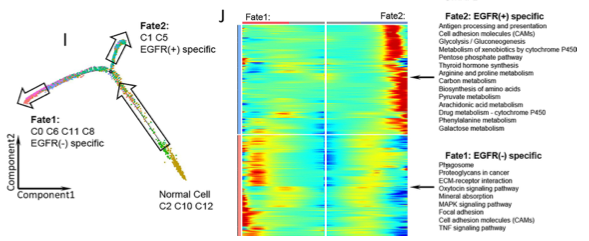

**Author(s)**: `r params$author`  
**Reviewer(s)**: `r params$reviewer`  
**Date**: `r Sys.Date()` 

# Academic Citation
If you use this code in your work or research, we kindly request that you cite our publication:

Xiaofan Lu, et al. (2025). FigureYa: A Standardized Visualization Framework for Enhancing Biomedical Data Interpretation and Research Efficiency. iMetaMed. https://doi.org/10.1002/imm3.70005

```{r setup, include=FALSE}
knitr::opts_chunk$set(echo = TRUE)
```

# 需求描述
# Demand description

画出右图J，拟时间轨迹。

Plot Figure J on the right, showing pseudotime trajectory.



出自<https://jitc.bmj.com/content/10/2/e003534>

Source: <https://jitc.bmj.com/content/10/2/e003534>

# 应用场景
# Application scenarios

展示如何在单细胞数据中使用monocle2包预测细胞发育轨迹。

Show how to use the monocle2 package in single-cell data to predict cell developmental trajectories.

# 环境设置
# Environment Setup

```{r}
source("install_dependencies.R")

library(Seurat)
library(SeuratData)
library(ggplot2)
library(RColorBrewer)
library(dplyr)
library(magrittr)
library(monocle)

# 显示英文报错信息
# Show English error messages
Sys.setenv(LANGUAGE = "en") 

# 禁止chr转成factor
# Prevent character-to-factor conversion
options(stringsAsFactors = FALSE) 
```

# 输入文件及预处理
# Input Files and Preprocessing

## 输入文件
## Input Files

使用最常用的SeuratData中的pbmc3k进行演示，如果自己的数据不是在seurat中分析的，只要有表达矩阵和细胞注释信息也可分析，可跳过下面seurat常规分析，直接运行“构建monocle对象”。

由于pbmc数据并不适合分析发育轨迹，本示例只展示如何计算，不探究具体科学问题。

建议对自己数据中**存在发育关系的细胞群**进行发育轨迹预测。

This demonstration uses the pbmc3k dataset from SeuratData. If your data was not analyzed in Seurat but you have an expression matrix and cell annotation information, you can skip the standard Seurat analysis steps below and directly proceed to "Constructing the monocle object".

Since the PBMC dataset is not ideal for studying developmental trajectories, this example only illustrates the computational steps rather than exploring specific biological questions.

For your own data, it is recommended to predict developmental trajectories only for **cell populations with potential developmental relationships**.

```{r}
# devtools::install_github("satijalab/seurat-data")

# InstallData("pbmc3k") 
# Or download and install manually，http://seurat.nygenome.org/src/contrib/pbmc3k.SeuratData_3.1.4.tar.gz
# install.packages("pbmc3k.SeuratData_3.1.4.tar.gz", repos = NULL, type = "source")

# 加载数据集
# load dataset
LoadData("pbmc3k")
pbmc <- UpdateSeuratObject(pbmc3k)
```

## 预处理
## Preprocessing

```{r}
# 进行质量控制（QC）
# 计算mitochondria基因比例
# Quality control (QC)  
# Calculate mitochondrial gene percentage
pbmc[["percent.mt"]] <- PercentageFeatureSet(pbmc, pattern = "^MT-")
pbmc <- subset(pbmc, subset = nFeature_RNA > 200 & nFeature_RNA < 2500 & percent.mt < 5)

# 数据预处理
# Data Preprocessing
pbmc <- NormalizeData(pbmc, normalization.method = "LogNormalize", scale.factor = 10000)
pbmc <- FindVariableFeatures(pbmc, selection.method = "vst", nfeatures = 2000)
all.genes <- rownames(pbmc)
pbmc <- ScaleData(pbmc, features = all.genes)
pbmc <- RunPCA(pbmc, features = VariableFeatures(object = pbmc))
pbmc <- FindNeighbors(pbmc, dims = 1:10)
pbmc <- FindClusters(pbmc, resolution = 0.5)
pbmc <- RunUMAP(pbmc, dims = 1:10)

# 该数据中已注释了细胞类型，在metadata中的'seurat_annotations'列
# The dataset already contains cell type annotations in the 'seurat_annotations' column of metadata
umap.plot <- DimPlot(pbmc, reduction = "umap", label=T, group.by = "seurat_annotations") + NoLegend()
ggsave("UMAP_cluster.pdf", plot = umap.plot, width = 6, height = 6)

saveRDS(pbmc, file = "pbmc3k.seurat.object.rds") 
```

# 构建monocle对象
# Constructing the monocle object

```{r}
# 构建monocle对象需要三个文件：表达矩阵、基因信息和meta信息
# monocle输入的是count矩阵（不建议使用data矩阵）
# Three files are required to build a monocle object: expression matrix, gene information, and metadata  
# monocle requires raw count matrix (not recommended to use normalized data matrix) 
exp.matrix <- pbmc@assays$RNA@counts %>% as.matrix(.) 

gene.df <- data.frame(gene_short_name=rownames(exp.matrix))
rownames(gene.df) <- gene.df$gene_short_name

meta.df <- pbmc@meta.data

# 构建CellDataSet（cds）对象
# Construct CellDataSet (cds) object
cds.object <- newCellDataSet(exp.matrix,
                             phenoData = new("AnnotatedDataFrame", data = meta.df),
                             featureData = new("AnnotatedDataFrame", data = gene.df),
                             lowerDetectionLimit = 0.5,
                             expressionFamily = negbinomial.size())

DelayedArray:::set_verbose_block_processing(TRUE)

# 数据标准化和方差估计
# normalisation and variance estimation
cds.object <- estimateSizeFactors(cds.object)
cds.object <- estimateDispersions(cds.object)

# 过滤数据：选择最低表达量为0.1和至少千分之5的细胞中表达的基因
# Filter data: select genes with minimum expression of 0.1 and expressed in at least 0.5% of cells
cds.object <- detectGenes(cds.object, min_expr = 0.1)
select_gene <- subset(fData(cds.object),num_cells_expressed>=ceiling(nrow(pData(cds.object))*0.005))$gene_short_name %>% as.vector()
cds.object <- cds.object[select_gene,]
```

# 确定用于轨迹排序的基因
# Determining Genes for Trajectory Ordering

用于轨迹排序的基因的本质细胞类型特异的特征性基因，可用两种方法来获得：

- 一种是用monocle里面的differentialGeneTest函数计算
- 另外一种是用Seurat包里面的FindAllMarkers函数计算
- 当然也可自定义(即下面的 deg.order)

The genes used for trajectory ordering are essentially cell-type-specific marker genes. There are two main approaches to obtain these genes:

- Using the differentialGeneTest function from the monocle package
- Using the FindAllMarkers function from the Seurat package
- Alternatively, you can manually specify genes (as shown in deg.order below)

```{r warning=FALSE}
# monocle中的differentialGeneTest函数差异分析
# ~后面是为做差异分析的变量，选择pData(cds.object)中注释细胞类型的列名
# Differential gene analysis using differentialGeneTest function in monocle
# The variable after ~ is for differential analysis, select the column name in pData(cds.object) that annotates cell types  
deg.celltype <- differentialGeneTest(cds.object, fullModelFormulaStr="~seurat_annotations",cores=20) 
head(deg.celltype)
deg.celltype <- subset(deg.celltype, qval < 0.01) 
deg.order.monocle <- deg.celltype$gene_short_name[order(deg.celltype$qval)][1:1500]
head(deg.order.monocle)

# Seurat中的FindAllMarkers函数计算
# Differential gene analysis using FindAllMarkers function in Seurat
Idents(pbmc) <- "seurat_annotations"
deg.celltype <- FindAllMarkers(pbmc, group.by = "seurat_annotations", )
deg.celltype %<>% subset(.,p_val_adj<0.05 & avg_log2FC > 0.5)
deg.order.seurat <- deg.celltype$gene

# 后续分析选用differentialGeneTest计算结果，具体根据自己数据决定，也可同时运行比较
# Subsequent analysis uses differentialGeneTest results by default, can be determined based on your data or compare both methods

# 降维聚类和对细胞进行排序
# Dimension reduction, clustering and cell ordering
cds.object <- setOrderingFilter(cds.object, ordering_genes = deg.order.monocle)
cds.object <- reduceDimension(cds.object, method = "DDRTree")
cds.object <- orderCells(cds.object)

# 可视化
# Visualization
p <- plot_cell_trajectory(cds.object, color_by = "Pseudotime")+
  theme(legend.position = "right")
p
# plot_cell_trajectory为ggplot语法，下面代码可改颜色：
# plot_cell_trajectory follows ggplot syntax, colors can be modified with: 
# p <- p +  scale_color_gradientn(colours = rev(c("grey80", "yellow", "red")))

ggsave("trajectory_pseudotime.pdf", plot = p, width = 7, height = 5)


p <- plot_cell_trajectory(cds.object, color_by = "State")+
  theme(legend.position = "right")
ggsave("trajectory_state.pdf", plot = p, width = 7, height = 5)

# root_state可自定义拟时间轴的根，按照state分布设置根起点。默认情况下伪时间值为0时在state 1, 也可更改为state 2。
# root_state can customize the root of pseudotime axis, set root position based on state distribution. By default pseudotime=0 at state 1, can be changed to state 2.

# 下面这个函数用于计算自定义的根细胞类型所处的state值， 由root_celltype变量指定，对应具体细胞类型名：
# The following function calculates the state value for custom root cell type specified by root_celltype variable: 
# root_celltype = "XXX"
# state <- function(cds.object){
#   if (length(unique(pData(cds.object)$State)) > 1){
#     T0_counts <- table(pData(cds.object)$State, pData(cds.object)$seurat_annotations)[,root_celltype]
#     return(as.numeric(names(T0_counts)[which(T0_counts == max(T0_counts))]))
#   } else {
#     return (1)
#   }
# }

# cds.object <- orderCells(cds.object, root_state = 2) #把State2设成拟时间轴的起始点
# Set State 2 as pseudotime starting point

# 按细胞类型着色
# Color by cell type
celltype.col <- colorRampPalette(colors = brewer.pal(9, "Set1"))(9)
p <- plot_cell_trajectory(cds.object, color_by = "seurat_annotations", ) + 
  scale_color_manual(values = celltype.col)+
  theme(legend.position = "right")
p
ggsave("trajectory_celltype.pdf", plot = p, width = 7, height = 5)

saveRDS(cds.object, "monocle.cds.object.rds")
```

# 开始画图
# Plotting

```{r}
# 鉴定分支点依赖的基因，BEAM函数
# branch_point为要研究的分支点，改示例中只有一个分支点1，后续分析选择branch1，
# 具体分支点和自己数据结合确定
# Identify branch-dependent genes using BEAM function
# branch_point specifies the branch point to study. This example has only branch point 1 (branch1)
# The specific branch point should be determined based on your own data

# 要研究的分支点编号
# Branch point number to study
branch_point = 1 

# 调用5个核进行并行计算(按计算资源调整)
# Use 5 cores for parallel computing (adjust based on computing resources) 
cores = 5 

BEAM_res <- BEAM(cds.object, branch_point = branch_point, cores = cores,
                 progenitor_method = "duplicate") %>% .[order(.$qval),]
write.csv(BEAM_res, "BEAM_res_data.csv")

BEAM_res <- BEAM_res[,c("gene_short_name", "pval", "qval")]

table(BEAM_res$qval < 1e-4)

# 选择q值小于0.0001的基因用于热图展示(阈值可自定义)
# Select genes with q-value < 0.0001 for heatmap display (threshold can be adjusted)
beam.deg <- subset(BEAM_res, qval < 1e-4) %>% .$gene_short_name

# num_clusters确定基因聚类数量(可多次尝试，本示例用4类)
# num_clusters determines how many clusters to divide these genes into (can try different values, demo uses 4)
num_clusters = 4

#pdf("branched_heatmap.pdf", height = 6, width = 5)
my_branched_heatmap <- plot_genes_branched_heatmap(cds.object[beam.deg,],
                                                   branch_point = branch_point,
                                                   num_clusters = num_clusters,
                                                   cores = cores,
                                                   use_gene_short_name = TRUE,
                                                   show_rownames = FALSE,
                                                   return_heatmap = TRUE)
#dev.off()
```

获取上述热图中各个聚类中的对应基因，保存到文件。

Extract the corresponding genes in each cluster from the aforementioned heatmap and save them to a file.

```{r}
cluster_df <- cutree(my_branched_heatmap$ph_res$tree_row, k = num_clusters) %>% data.frame(.)
colnames(cluster_df) <- "Gene_Clusters"
cluster_df$Gene <- rownames(cluster_df)
cluster_df <- cluster_df[order(cluster_df$Gene_Clusters,decreasing = F),]
head(cluster_df)

table(cluster_df$Gene_Clusters)

write.csv(cluster_df,"branch_pseudotime_gene_list.csv", row.names = F)
```

后续使用这些基因做富集分析，将term标注到对应cluster的热图位置即可。

Subsequently, use these genes for enrichment analysis and annotate the terms to the corresponding cluster positions on the heatmap.

# 确定热图中Cell fate 1和2对应的轨迹
# Determining the Trajectories Corresponding to Cell Fate 1 and 2 in the Heatmap

即BEAM试图从分支点上的细胞一直向后遍历到根细胞(伪时间为0的细胞)，并将所有这些细胞作为前分支

细胞命运1对应state ID小的细胞，而细胞命运2对应 state ID大的细胞

具体可参考github主页对此问题的回复 <https://github.com/cole-trapnell-lab/monocle-release/issues/219>

所以此示例数据中：

- Pre−branch为 state1 细胞群
- Cell fate 1 为 state2 细胞群
- Cell fate 2 为 state3 细胞群

That is, BEAM attempts to traverse from the cells at the branch point all the way back to the root cells (cells with pseudotime 0) and considers all these cells as the pre-branch.

Cell fate 1 corresponds to cells with smaller state IDs, while cell fate 2 corresponds to cells with larger state IDs.

For specific details, refer to the response to this issue on the GitHub homepage <https://github.com/cole-trapnell-lab/monocle-release/issues/219>

Thus, in this example dataset:

- Pre-branch corresponds to the state1 cell population
- Cell fate 1 corresponds to the state2 cell population
- Cell fate 2 corresponds to the state3 cell population

# Session Info

```{r}
sessionInfo()
```
