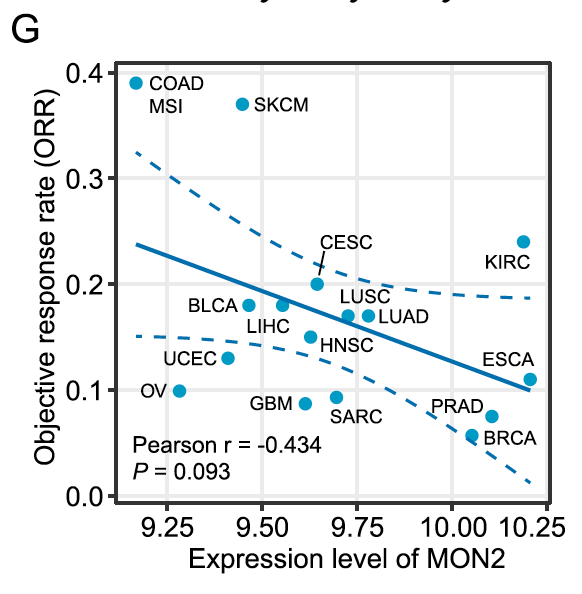

**Author(s)**: `r params$author`  
**Reviewer(s)**: `r params$reviewer`  
**Date**: `r Sys.Date()` 

# Academic Citation
If you use this code in your work or research, we kindly request that you cite our publication:

Xiaofan Lu, et al. (2025). FigureYa: A Standardized Visualization Framework for Enhancing Biomedical Data Interpretation and Research Efficiency. iMetaMed. https://doi.org/10.1002/imm3.70005

```{r setup, include=FALSE}
knitr::opts_chunk$set(echo = TRUE)
```

# 需求描述
# Demand description

Fig. 4G这个是基因表达量和肿瘤客观缓解率orr相关性分析的图，主要难点是数据的来源问题及下载问题，纵坐标不会算。

Fig. 4G is a graph showing the correlation analysis between gene expression levels and the objective response rate (ORR) of tumors. The main challenges are the source and download of the data, as well as the calculation of the vertical axis coordinates.



出自<https://molecular-cancer.biomedcentral.com/articles/10.1186/s12943-021-01462-z>

Fig. 4 确定MON2作为新型免疫肿瘤治疗靶点。
G MON2表达水平与免疫检查点抑制剂（ICB）客观缓解率（ORR）的Pearson相关性分析。仅纳入非零数据。

Source: <https://molecular-cancer.biomedcentral.com/articles/10.1186/s12943-021-01462-z>

Fig. 4 Determination of MON2 as novel immuno-oncology target.
G Pearson correlation between MON2 expression and objective response rate (ORR) for ICB. Only non-zero data was included.

# 应用场景
# Application scenarios

绘制某感兴趣变量与肿瘤客观缓解率ORR的相关性图。

不包括计算ORR的过程，21种TCGA当中的癌症的ORR已经算好，直接拿来用。

Plot the correlation between a variable of interest and the objective response rate (ORR) in tumors.

The ORR calculation process is not included; precomputed ORR values for 21 TCGA cancer types are used directly.

# 环境设置
# Environment Setup

```{r}
source("install_dependencies.R")

library(ggplot2)
library(data.table)
library(ggrepel)

# 显示英文报错信息
# Show English error messages
Sys.setenv(LANGUAGE = "en") 

# 禁止chr转成factor
# Prevent character-to-factor conversion
options(stringsAsFactors = FALSE) 
```

# 输入文件
# Input Files

ORR.txt，TCGA 21种癌症的ORR客观缓解率数据。源自这篇文章（**记得引用**）补充材料cbr190007supp1_prod.pdf的eTable的前两行（中间还有一行肿瘤）：Lee JS, Ruppin E. Multiomics Prediction of Response Rates to Therapies to Inhibit Programmed Cell Death 1 and Programmed Cell Death 1 Ligand 1. JAMA Oncol. 2019 Nov 1;5(11):1614-1618.

merged_sample_quality_annotations.tsv，肿瘤注释文件。下载自<https://gdc.cancer.gov/about-data/publications/pancanatlas>，下载地址<http://api.gdc.cancer.gov/data/1a7d7be8-675d-4e60-a105-19d4121bdebf>。

EBPlusPlusAdjustPANCAN_IlluminaHiSeq_RNASeqV2.geneExp.tsv，表达矩阵，第一列是基因，之后是其在每个样本中的表达量。下载自<http://api.gdc.cancer.gov/data/3586c0da-64d0-4b74-a449-5ff4d9136611>

ORR.txt, ORR (Objective Response Rate) data for 21 TCGA cancer types. Sourced from the first two rows (with one tumor row in between) of eTable in the supplementary material cbr190007supp1_prod.pdf of this paper (**remember to cite**): Lee JS, Ruppin E. Multiomics Prediction of Response Rates to Therapies to Inhibit Programmed Cell Death 1 and Programmed Cell Death 1 Ligand 1. JAMA Oncol. 2019 Nov 1;5(11):1614-1618.

merged_sample_quality_annotations.tsv, tumor annotation file. Downloaded from <https://gdc.cancer.gov/about-data/publications/pancanatlas>, download link <http://api.gdc.cancer.gov/data/1a7d7be8-675d-4e60-a105-19d4121bdebf>.

EBPlusPlusAdjustPANCAN_IlluminaHiSeq_RNASeqV2.geneExp.tsv, expression matrix, with the first column being genes and subsequent columns showing their expression levels in each sample. Downloaded from<http://api.gdc.cancer.gov/data/3586c0da-64d0-4b74-a449-5ff4d9136611>

```{r}
# 设置感兴趣基因
# Set gene of interest
geneOfInterest <- "MON2"

# 加载ORR数据
# Load ORR data
orr <- read.table("ORR.txt",sep = "\t",row.names = 1,check.names = F,stringsAsFactors = F,header = T)

# 读取肿瘤注释文件
# Read tumor annotation file
rawAnno <- read.delim("merged_sample_quality_annotations.tsv",sep = "\t",row.names = NULL,check.names = F,stringsAsFactors = F,header = T) 
rawAnno$simple_barcode <- substr(rawAnno$aliquot_barcode,1,15)
samAnno <- rawAnno[!duplicated(rawAnno$simple_barcode),c("cancer type", "simple_barcode")]
samAnno <- samAnno[which(samAnno$`cancer type` != ""),]

# 快速读取表达谱数据并做数据预处理
# Quickly read expression matrix and preprocess data
expr <- fread("EBPlusPlusAdjustPANCAN_IlluminaHiSeq_RNASeqV2.geneExp.tsv",sep = "\t",stringsAsFactors = F,check.names = F,header = T) 
expr <- as.data.frame(expr); rownames(expr) <- expr[,1]; expr <- expr[,-1]
gene <- sapply(strsplit(rownames(expr),"|",fixed = T), "[",1)
expr$gene <- gene
expr <- expr[!duplicated(expr$gene),]
rownames(expr) <- expr$gene; expr <- expr[,-ncol(expr)]

# 对于这份泛癌数据，将略小于0的数值拉到0，否则不能取log（其他途径下载的泛癌数据可能不需要此操作）
# For this pan-cancer dataset, set values slightly below 0 to 0 to enable log transformation (may not be needed for other pan-cancer datasets)
expr[expr < 0] <- 0 

colnames(expr) <- substr(colnames(expr),1,15)
gc()
is.element(geneOfInterest,rownames(expr))

# 由于原文包含了肠癌微卫星不稳定性的分类，这里直接加载通过TCGAbiolinks处理过的临床数据
# Since the original study included MSI classification for colorectal cancer, directly load clinical data processed by TCGAbiolinks
(load("msi_results.rda"))
head(msi_results)

# 取出肿瘤样本
# Extract tumor samples
samAnno <- samAnno[which(substr(samAnno$simple_barcode,14,14) == "0"),]

# 截断TCGA barcode中的四位index
# Extract 4-digit index from TCGA barcode
samAnno$index <- substr(samAnno$simple_barcode,9,12) 

# 截断MSI信息中barcode的四位index
# Extract 4-digit index from MSI data barcode
msi_results$index <- substr(msi_results$sample,9,12) 

# 数据合并
# Merge data
samAnno <- merge(samAnno, msi_results, by = "index", all.x = TRUE)

samAnno$MSI <- as.character(samAnno$MSI)

# 这里认为设定不属于MSS的均为MSI
# Define all non-MSS as MSI
samAnno[which(samAnno$MSI %in% c("Indeterminate","MSI-H","MSI-L")),"MSI"] <- "MSI" 

samAnno[which(is.na(samAnno$MSI)),"MSI"] <- "" 

# 按照肿瘤排序
# Sort by cancer type
samAnno <- samAnno[order(samAnno$`cancer type`),] 

# 将COAD以及READ与MSI合并
# Combine COAD and READ with MSI status
samAnno$`cancer type` <- ifelse(samAnno$MSI == "", samAnno$`cancer type`, paste0(samAnno$`cancer type`,"_",samAnno$MSI)) 

# 去掉无法找到MSI状态的COAD或READ
# Remove COAD or READ samples without MSI status
samAnno <- samAnno[-which(samAnno$`cancer type` %in% c("COAD","READ")),] 
# 保存到文件
# Save to file
write.table(samAnno,"simple_sample_annotation.txt",sep = "\t",row.names = F,col.names = T,quote = F)
table(samAnno$`cancer type`)

# 21种肿瘤全部匹配
# All 21 tumors matched
tumors <- intersect(unique(samAnno$`cancer type`), rownames(orr)) 

corTab <- NULL
for (i in tumors) {
  message("--",i,"...")
  tumsam <- samAnno[which(samAnno$`cancer type` == i),"simple_barcode"]
  tumsam <- intersect(tumsam,colnames(expr))
  
  # 取出感兴趣基因和当前肿瘤样本的表达谱子集
  # Extract expression subset for gene of interest and current tumor samples
  es <- as.numeric(expr[geneOfInterest,tumsam]) 
  
  # 表达量取对数
  # Log-transform expression values
  es <- log2(es + 1) 
  
  corTab <- rbind.data.frame(corTab,
                             data.frame(tumor = i, 
                                        size = length(tumsam), 
                                        gene = geneOfInterest, 
                                        AVG_EXPR = mean(es), 
                                        ORR = orr[i,"ORR",drop = F], 
                                        stringsAsFactors = F),
                             stringsAsFactors = F)
}
write.table(corTab, file = paste0("summary of ", geneOfInterest," and ORR in 21 tumors.txt"),sep = "\t",row.names = F,col.names = T,quote = F)
```

# 表达量与ORR的相关性分析
# Correlation analysis between expression levels and ORR

```{r}
tmp <- corTab[which(corTab$size > 100 & corTab$ORR > 0),] 

# 单侧检验渐进显著性
# One-tailed test for asymptotic significance
cor.res <- cor.test(tmp$AVG_EXPR, tmp$ORR, alternative = "less", method = "pearson") 

# 创建相关性结果的标签
# Create label for correlation results
txt <- paste0("Pearson r = ", round(cor.res$estimate,3),"\n","P = ", round(cor.res$p.value,3)) 
```

# 开始画图
# Plotting

```{r, fig.width=4.5, fig.height=4.5}
ggplot(tmp, aes(AVG_EXPR, ORR)) + 
  geom_point(color = "#009BC7", size = 2) + 
  geom_smooth(span = 2, method = glm, color = "#0070B2") +
  geom_text_repel(aes(label = tumor)) + 
  xlab(paste0("Expression level of ", geneOfInterest)) + 
  ylab("Objective response rate (ORR)") +
  theme_bw() +
  theme(axis.ticks = element_line(size = 0.2, color = "black"),
        axis.ticks.length = unit(0.2, "cm"),
        axis.text = element_text(size = 10, color = "black"),
        axis.title = element_text(size = 10, color = "black")) +
  annotate("text", x = min(tmp$AVG_EXPR), y = 0.03, 
           hjust = 0, fontface = 4, 
           label = txt)

ggsave(filename = paste0("correlation of ", geneOfInterest," and ORR in 21 tumors.pdf"), width = 4.5,height = 4.5)
```

这里我不会修改置信区间的边界颜色，原文作者表示是AI修饰的。

Here, I won't modify the boundary color of the confidence interval. The original author indicates that it is AI-modified.

# Session Info

```{r}
sessionInfo()
```
