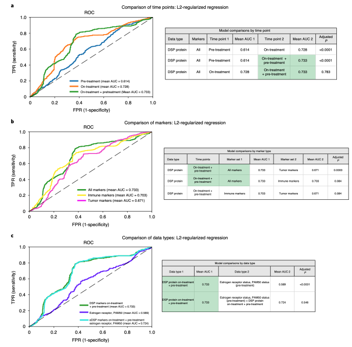

**Author(s)**: `r params$author`  
**Reviewer(s)**: `r params$reviewer`  
**Date**: `r Sys.Date()` 

# Academic Citation
If you use this code in your work or research, we kindly request that you cite our publication:

Xiaofan Lu, et al. (2025). FigureYa: A Standardized Visualization Framework for Enhancing Biomedical Data Interpretation and Research Efficiency. iMetaMed. https://doi.org/10.1002/imm3.70005

```{r setup, include=FALSE}
knitr::opts_chunk$set(echo = TRUE)
```

# 需求描述
# Requirements Description

这篇文章Fig4的a，b，c；实现以下关键词：nested cross-validation； Holm–Bonferroni correction for multiple hypotheses； L2-regularized classifiers

This study's Figure 4 panels a, b, and c demonstrate the implementation of the following key methodologies: Nested cross-validation, Holm-Bonferroni correction for multiple hypothesis testing, L2-regularized classifiers



出自<https://www.nature.com/articles/s43018-021-00190-z>

图4 | 在发现队列中，全角蛋白富集配对的治疗前和治疗中活检组织的数字空间分析(DSP)与病理完全缓解相关，且优于现有标志物。通过嵌套交叉验证(基于双侧t检验)和Holm-Bonferroni多重假设检验校正，比较了不同模型的AUROC性能(发现/训练队列，n=23例具有两个时间点配对数据的患者)。a-c，使用具有治疗前和治疗中DSP全角蛋白富集数据的病例(共23个生物学独立病例)生成ROC曲线。

a，使用治疗前、治疗中以及治疗前+治疗中('on-treatment + pre-treatment')DSP蛋白标志物平均值(跨感兴趣区域平均)训练的L2正则化分类器的ROC曲线及统计学比较。AUC表示曲线下面积。

b，使用全部标志物、肿瘤标志物和免疫标志物平均值训练的治疗前+治疗中DSP蛋白L2正则化分类器的ROC曲线及统计学比较。本分析使用了两个时间点跨区域平均的标志物值。

c，治疗前+治疗中DSP蛋白L2正则化分类器与基于雌激素受体和PAM50状态训练的模型的ROC曲线及统计学比较。这两个模型进一步与整合了治疗前+治疗中DSP蛋白数据、雌激素受体和PAM50状态的模型进行比较。

Source: <https://www.nature.com/articles/s43018-021-00190-z>

Fig. 4 | DSP of pan-CK-enriched paired pre- and on-treatment biopsies is associated with pathological complete response in the discovery cohort and outperforms established markers. The AUrOC performance of various models was compared using nested cross-validation (based on a two-sided t-test) with Holm–Bonferroni correction for multiple hypotheses in the discovery (training) cohort (n = 23 patients with paired data for both time points). a–c, ROC curves were generated using cases with DSP pan-CK-enriched data from both the pre-treatment and on-treatment time points (23 biologically independent cases were used in these analyses). 

a, ROC curves and statistical comparison of L2-regularized classifiers trained using DSP protein marker mean values (averaged across rOIs) pre-treatment, on-treatment and the combination of pre-treatment and on-treatment (‘on-treatment + pre-treatment’). AUC, area under the curve. 

b, ROC curves and statistical comparison of DSP protein on-treatment + pre-treatment L2-regularized classifiers trained using all marker, tumor marker and immune marker mean values. Cross-region mean marker values from both the pre-treatment and on-treatment time points were used in this analysis. 

c, ROC curves and statistical comparison of the on-treatment + pre-treatment DSP protein L2-regularized classifier to a model trained using estrogen receptor and PAM50 status. These two models were compared to a model that incorporates on-treatment + pre-treatment DSP protein data, estrogen receptor and PAM50 status. 

# 应用场景
# Application Scenario

实现nested cross-validation, holm-bonferroni correction for multiple hypotheses, 以及L2-regularized classifiers

Implements nested cross-validation, Holm-Bonferroni correction, and L2-regularized classifiers

> 重要：请先阅读当前文件夹下的README.txt文件，了解各函数的用法，参数，注意事项。

> Important: Please read README.txt first to understand function usage, parameters and notes.

# 环境设置
# Environment Setup

```{r}
source("install_dependencies.R")

library(rms)
library(pROC)
library(ggplot2)
library(glmnet)

# 显示英文报错信息
# Show English error messages
Sys.setenv(LANGUAGE = "en") 

# 禁止chr转成factor
# Prevent character to factor conversion
options(stringsAsFactors = FALSE) 
```

# 自定义函数
# Custom Functions

```{r}
# 构建一个函数Calculate01()，该函数可以计算一个向量中0，1的数目并返回一个计数向量
# Build a function Calculate01() that can count the number of 0s and 1s in a vector and return a count vector
Calculate01<-function(ob){
  Negative=0
  Positive=0
  for (i in 1:length(ob)){
    if (ob[i] == 0){Negative = Negative +1}
    if (ob[i] == 1){Positive = Positive +1}
  }
  result<-c(Positive,Negative)
  names(result)<-c("Positive","Negative")
  return(result)
}

# 构建一个函数str_sample(),用于进行分层抽样
# Build a function str_sample() for stratified sampling
str_sample<-function(data,strataname,size){
  sample_vec<-data[,strataname]
  select0_amount<-size[1]
  select1_amount<-size[2]
  select0_id<-sample(which(sample_vec==0),size=select0_amount,replace=F)
  select1_id<-sample(which(sample_vec==1),size=select1_amount,replace=F)
  result<-data.frame(select=c(select0_id,select1_id))
  return(result)
}


# 构建一个函数strata_nfolds()，用于分层抽样来构建交叉验证中每一折的样本，保证每一折都包含至少两种不同类型的样本,每折所包含的样本的编号用列表形式进行返回
# data为包含各建模特征，且二分类outcome列名为“outcome”并处于最后一列的数据框,注意：二分类outcome要以0，1表示
# nfolds为分层折叠的折叠数
# Create a strata_nfolds() function for stratified sampling to construct cross-validation folds, ensuring each fold contains at least two different sample types. Returns fold sample indices as a list.
# data: Dataframe containing modeling features with binary "outcome" column (values 0/1) as last column
# nfolds: Number of stratified folds
strata_nfolds<-function(data,nfolds){
  lst<-list()
  nsamples_everyfold<-round(nrow(data)/nfolds)
  pandn_numbers<-Calculate01(data[,ncol(data)])
  if (nfolds > min(pandn_numbers)) {stop("请合理设置折叠数（折叠数不能超过二分类变量中最少类别的样本数）")}
  if (pandn_numbers[1] >= pandn_numbers[2]){
    # 计算出每一折中不同类别的样本个数，这样可以保证每一折中都会存在而分类中的小群体样本
    # Calculate the number of samples for each class in every fold to ensure the minority class samples are represented in all folds
    nnegative_everyfold <<- round(pandn_numbers[2]/nfolds)
    npositive_everyfold <<- nsamples_everyfold - nnegative_everyfold
  }
  if(pandn_numbers[1] < pandn_numbers[2]){
    npositive_everyfold <<- round(pandn_numbers[1]/nfolds)
    nnegative_everyfold <<- nsamples_everyfold - npositive_everyfold
  }
  mydata<-data
  mydata_backup<-data
  
  # 稍后用来构建已经抽选出来的所有样本的编号，从而得到最后一折的样本编号
  # Later used to compile indices of all selected samples to obtain the indices for the final fold
  id_vec_already<-c()

  for (i in 1:nfolds){
    if (i != nfolds){
      mystrata<-str_sample(mydata,strataname="outcome",size=c(nnegative_everyfold,npositive_everyfold))
      
      # 获取抽样的样本编号向量，但注意此处的id_vec为字符串形式的
      # Get the sampled index vector (note: id_vec is in string format)
      id_vec<-rownames(mydata)[mystrata[,1]]
      id_vec<-as.numeric(id_vec)
      
      # 除去已经被抽选出来的样本
      # Exclude samples that have already been selected
      mydata<-mydata[-mystrata[,1],]
      id_vec_already<-c(id_vec_already,id_vec)
      lst[[i]]<-id_vec
    }
    if (i == nfolds){
      id_vec<-rownames(mydata_backup[-id_vec_already,])
      id_vec<-as.numeric(id_vec)
      lst[[i]]<-id_vec}}
  return(lst)
}

#构建一个函数logis_cal(),用于计算线性outcome的对应归一化outcome
# Build a function logis_cal() to calculate normalized outcomes corresponding to linear outcomes
logis_cal<-function(x){
  m<-1/(1+exp(-x))
  return(m)
}

# 构建一个函数logis_straCV()，可进行分层交叉验证，得出最佳lambda
# Build a function logis_straCV() to perform stratified cross-validation and determine the optimal lambda
logis_straCV<-function(li,data,nfolds,formula){
  
  #构建误判率向量
  # Build a misclassification rate vector
  miserror<-c()
  
  # 所有尝试的正则项系数lambda的向量，以0.03为步长，从0.03到9.99
  # A vector of all attempted regularization coefficients lambda, ranging from 0.03 to 9.99 with a step size of 0.03
  lambda_vec<-seq(from=0.03,to=9.99,by=0.03)
  for (i in 1:nfolds){#开始内层交叉验证
    validation<-data[li[[i]],]
    train<-data[-li[[i]],]
    for (mylambda in lambda_vec){
      model<-lrm(formula = formula,
                 train,
                 x = T,
                 y = T,
                 penalty = mylambda)
      
      # 计算验证集得分
      # Calculate validation set scores
      coe<-model$coefficients
      for (n in 1:length(coe)){
        if (n == 1) {Score = rep(coe[n],nrow(validation))}
        if (n != 1) {
          
          # name11是为了防止与数据中有名字为“name”的列撞名
          # name11 is used to prevent naming conflicts with columns named "name" in the data
          name11 = names(coe)[n]
          Score = Score + coe[n]*validation[,name11]}
      }
      probs<-apply(matrix(Score,ncol = 1),MARGIN = 1,FUN = logis_cal)
      pred_result<-ifelse(probs>0.5,1,0)
      misclasserror <- mean(pred_result != data[,("outcome")])
      miserror<-c(miserror,misclasserror)
    }
  }
  
  # 找出对应误分类率最低的最大lambda
  # Find the maximum lambda corresponding to the lowest misclassification rate
  miserror_matrix<-matrix(miserror,nrow = nfolds,byrow = T)
  mean_miserror<-apply(miserror_matrix,MARGIN=2,FUN=mean)
  min_error<-min(mean_miserror)
  perfect_lambda_address<-max(which(mean_miserror == min_error))
  perfect_lambda<-lambda_vec[perfect_lambda_address]
  return_list<-list()
  return_list[[1]]<-perfect_lambda
  return_list[[2]]<-miserror_matrix
  return_list[[3]]<-mean_miserror
  return(return_list)
}

# 构建一个函数add1000(),其可以把一个取值在01之间的升序向量sensity根据1-specificity的值扩展至1000个元素，拟合连续型变量,vect是roc曲线横轴从0至1变化时最高点的坐标
# Create an add1000() function that expands an ascending vector 'sensity' (with values between 0-1) to 1000 elements based on 1-specificity values, fitting continuous variables. 'vect' represents the coordinates of the highest point when the ROC curve's horizontal axis changes from 0 to 1.
add1000<-function(vec_sen,vec_spe){
  vect<-rep(0,1001)
  vec<-round(vec_spe,3)
  spe_min<-c()
  spe_max<-c()
  sen_min<-c()
  sen_max<-c()
  spe_min_ad<-c()
  spe_max_ad<-c()
  for (i in 2:length(vec_sen)){
    
    # 检测1-specificity和sensitivity同时变化的转折点
    # Detect inflection points where both 1-specificity and sensitivity change
    if (vec_sen[i] != vec_sen[i-1] & vec_spe[i] != vec_spe[i-1]){
      
      # spe_min存储变化点前的1-specificity值（较小值）
      # spe_min stores the pre-change 1-specificity value (smaller value)
      
      spe_min<-c(spe_min,vec_spe[i-1])
      # spe_max stores the post-change 1-specificity value (larger value)
      # spe_max存储变化点后的1-specificity值（较大值）
      spe_max<-c(spe_max,vec_spe[i])
      sen_min<-c(sen_min,vec_sen[i-1])
      sen_max<-c(sen_max,vec_sen[i])
    }
  }
  vect[vec*1000+1]<-vec_sen
  for (i in 1:1001){
    if (vect[i] == 0) vect[i] = max(vect[1:i])
  }
  if (length(sen_min) != 0 ){
    spe_min_ad<-round(spe_min,3)*1000+1
    spe_max_ad<-round(spe_max,3)*1000+1
    if (length(sen_min) != 1){
      for (i in 1:length(spe_min)){
        if (i == 1){
          for (j in spe_min_ad[i]:spe_max_ad[i]){
            vect[j] = vect[spe_min_ad[i]] +(sen_max[i]-sen_min[i])/(spe_max_ad[i]/1000-spe_min_ad[i]/1000)*(j-spe_min_ad[i])/1000
          }
        }
        if (i != 1){
          vect[spe_min_ad[i]] = sen_min[i]
          for (j in spe_min_ad[i]:spe_max_ad[i]){
            vect[j] = vect[spe_min_ad[i]] +(sen_max[i]-sen_min[i])/(spe_max_ad[i]/1000-spe_min_ad[i]/1000)*(j-spe_min_ad[i])/1000
          }
        }
      }
    }
    if (length(sen_min) == 1){
      for (i in 1:length(spe_min)){
        for (j in spe_min_ad[i]:spe_max_ad[i]){
          vect[j] = vect[spe_min_ad[i]] +(sen_max[i]-sen_min[i])/(spe_max_ad[i]/1000-spe_min_ad[i]/1000)*(j-spe_min_ad[i])/1000
        }
      }
    }
  }
  return(vect)
}

# 构建一个函数Ncv，用于构建嵌套交叉验证模型并记录单次嵌套交叉验证的平均roc曲线
# data为包含建模数据的数据框
# outer_fold为外层折叠数
# inter_fold为内层折叠数
# biresult_col为二分类outcome所在列
# model_col为模型纳入的变量所在的列
# formula为模型公式，如：outcome~年龄+健康状况
# Build a function Ncv to construct nested cross-validation models and record the average ROC curve from a single nested cross-validation
# data: Dataframe containing modeling data
# outer_fold: Number of outer folds
# inner_fold: Number of inner folds  
# biresult_col: Column name of binary outcome
# model_col: Columns of variables included in model
# formula: Model formula (e.g. outcome~age+health_status)
Ncv<-function(data,outer_fold,inter_fold,biresult_col,model_col,formula){
  f<-formula
  nsamples<-nrow(data)
  auc_vec<-c()
  sensity_vec<-c()
  specificity_vec<-c()
  roc_vec<-c()
  
  #对所有样本进行编号
  # Assign unique numeric IDs to each sample in the dataset
  rownames(data)<-c(1:nsamples)
  data_for_model<-data[,c(model_col,biresult_col)]
  
  # 让data_for_model的最后一列的列名为"outcome"
  # Set the last column name of data_for_model to "outcome"
  colnames(data_for_model)[ncol(data_for_model)]<-"outcome"
  
  # Step 1:利用分层抽样将验证集和剩余（N-1）折的训练集抽取出来，保证验证集有两个来自不同二分类outcome的样本，并进行内层的分层交叉验证
  # Step 1: Use stratified sampling to extract the validation set and remaining (N-1)-fold training set, ensuring the validation set contains samples from both binary outcome classes, and perform inner-layer stratified cross-validation
  outerfolds_list<<-strata_nfolds(data_for_model,nfolds = outer_fold)
  for (i in 1:outer_fold){#进行外层嵌套
    data_test<<-data_for_model[outerfolds_list[[i]],]
    data_train<-data_for_model[-outerfolds_list[[i]],]
    
    #为了方便strata_nfolds()根据行名的样本抽取，行名再次改为从1顺序排列到最后
    # For strata_nfolds() to easily sample based on row names, reset row names to sequential numbering from 1 to the end
    rownames(data_train)<-c(1:nrow(data_train))
    
    #构建包含内部分层交叉验证各折数据编号的列表
    # Create list containing fold indices for inner stratified cross-validation
    interfolds_list<-strata_nfolds(data_train,nfolds = inter_fold)
    
    #进行内层分层交叉验证，返回该组训练集筛选出的最佳lambda
    # Perform inner stratified CV, returns optimal lambda for this training set
    str_CV<-logis_straCV(interfolds_list,data_train,inter_fold,f)
    
    #提取最佳lambda
    # Extract the optimal lambda value
    best_lambda<-str_CV[[1]][1]
    
    #使用最佳lambda对测试集进行建模
    # Build model on test set using optimal lambda
    mod<-lrm(formula = f,
             data_test,
             x = T,
             y = T,
             penalty = best_lambda)
    
    # 提取模型中线性部分计算outcome
    # Extract linear predictors from model to calculate outcome
    linear_pred<<-mod[["linear.predictors"]]
    mod_prob<<- apply(matrix(linear_pred,nrow=1,byrow=T),MARGIN=2,FUN=logis_cal)
    mod_pred<-ifelse(linear_pred>0,1,0)#生成模型的预测outcome（0 or 1）
    datatestr<<-data_test$outcome
    
    # 绘制外层测试集中模型的roc曲线并得出auc面积以及"sensities"和“specificities”的各数值，用于之后的平均化处理
    # Plot the ROC curve of the model on the outer test set and calculate the AUC area along with the values of "sensitivities" and "specificities" for subsequent averaging processing
    if (i == 1){
      LR_test <- plot.roc(data_test$outcome,mod_prob,ylim=c(0,1),xlim=c(1,0),
                          smooth=F, 
                          ci=TRUE,
                          main="",
                          col=1, 
                          lwd=2,
                          legacy.axes=T,
                          print.auc=F)
      
      # 得出auc面积
      # Calculate AUC value
      mod_auc<-LR_test[["auc"]]
      auc_vec<-c(auc_vec,mod_auc)
      mod_specificity<-rev(1-LR_test[["specificities"]])
      mod_sensity<-rev(LR_test[["sensitivities"]])
      
      # specificity和sensity的坐标个数容易受roc曲线中斜线部分影响，所以接下来要对坐标进行填充，保证长度一致
      # The number of specificity and sensitivity coordinates can be affected by the diagonal portions of the ROC curve, so we will now fill in the coordinates to ensure consistent length
      if (length(mod_specificity) < (nrow(data)/outer_fold+1)) mod_specificity<-c(mod_specificity,rep(1,((nrow(data)/outer_fold+1)-length(mod_specificity))))
      if (length(mod_sensity) < (nrow(data)/outer_fold+1)) mod_sensity<-c(mod_sensity,rep(1,((nrow(data)/outer_fold+1)-length(mod_sensity))))
      sensity_vec<-c(sensity_vec,mod_sensity)
      specificity_vec<-c(specificity_vec,mod_specificity)
      mod_roc<-add1000(vec_sen=mod_sensity,vec_spe=mod_specificity)
      roc_vec<-c(roc_vec,mod_roc)
    }else{
      LR_test <- plot.roc(data_test$outcome,mod_prob,ylim=c(0,1),xlim=c(1,0),
                          smooth=F, 
                          ci=TRUE,
                          main="",
                          col=1, 
                          lwd=2, 
                          legacy.axes=T,
                          print.auc=F,
                          add=T)
      
      # 得出auc面积
      # Calculate AUC value
      mod_auc<-LR_test[["auc"]]
      auc_vec<-c(auc_vec,mod_auc)
      mod_specificity<-rev(1-LR_test[["specificities"]])
      mod_sensity<-rev(LR_test[["sensitivities"]])
      if (length(mod_specificity) < (nrow(data)/outer_fold+1)) mod_specificity<-c(mod_specificity,rep(1,((nrow(data)/outer_fold+1)-length(mod_specificity))))
      if (length(mod_sensity) < (nrow(data)/outer_fold+1)) mod_sensity<-c(mod_sensity,rep(1,((nrow(data)/outer_fold+1)-length(mod_sensity))))
      sensity_vec<-c(sensity_vec,mod_sensity)
      specificity_vec<-c(specificity_vec,mod_specificity)
      mod_roc<-add1000(vec_sen=mod_sensity,vec_spe=mod_specificity)
      roc_vec<-c(roc_vec,mod_roc)
    }
    
    # Step2: 计算每次嵌套交叉验证的平均roc曲线的散点坐标
    # Step 2: Calculate scatter plot coordinates for the average ROC curve across each nested cross-validation
    sensity_matrix<-matrix(sensity_vec,nrow=outer_fold,byrow=T)
    specificity_matrix<-matrix(specificity_vec,nrow=outer_fold,byrow=T)
    roc_matrix<-matrix(roc_vec,nrow=outer_fold,byrow=T)
    
    # 计算出每次嵌套交叉验证的平均sensitity序列
    # Compute mean sensitivity sequence across all nested CV folds
    mean_sensity<-apply(sensity_matrix,MARGIN=2,FUN=mean)
    
    # 计算出每次嵌套交叉验证的平均specificity序列
    # Compute mean specificity sequence across all nested CV folds
    mean_specificity<-apply(specificity_matrix,MARGIN=2,FUN=mean)
    
    # 计算出每次嵌套交叉验证的平均ROC值
    # Compute mean ROC values across all nested CV folds
    mean_roc<-apply(roc_matrix,MARGIN=2,FUN=mean)
  }
  return_list<-list()
  return_list[["mean_sensity"]]<-mean_sensity
  return_list[["mean_specificity"]]<-mean_specificity
  return_list[["mean_roc"]]<-mean_roc
  return_list[["mean_auc"]]<-mean(auc_vec)
  return_list[["roc_mat"]]<-roc_matrix
  return_list[["sensity_mat"]]<-sensity_matrix
  return_list[["specificity_mat"]]<-specificity_matrix
  return(return_list)
}

# 构建一个函数repeat_ncv(),用于将Ncv()函数重复n次，并获得平均roc曲线，默认n为100次（根据文献）
# data为包含建模数据的数据框
# outer_fold为外层折叠数
# inter_fold为内层折叠数
# biresult_col为二分类outcome所在列
# model_col为模型纳入的变量所在的列
# formula为模型公式，如：outcome~年龄+健康状况
# n_repeat为嵌套交叉验证重复的次数，默认为100次
# 返回列表中包含以下value
# mean_sensity:roc曲线sensity向量在n_repeat次重复的平均值
# mean_specificity:roc曲线1-specificity向量在n_repeat次重复的平均值
# sensity_mat：roc曲线sensity向量在n_repeat次重复中每一次的取值，纵轴代表循环次数，横轴对应每一次的向量
# specificity_mat：roc曲线1-specificity向量在n_repeat次重复中每一次的取值，纵轴代表循环次数，横轴对应每一次的向量
# mean_roc:n_repeat次重复中roc曲线的平均值
# mean_AUROC:每一次嵌套验证的平均auc面积的向量
# mean_auc:mean_AUROC的平均值，即所有n_repeat次嵌套交叉验证中所有外层测试集的auc平均值
# Build a function repeat_ncv() to execute the Ncv() function n times and obtain average ROC curves (default n=100 per literature)
# data: Dataframe containing modeling data
# outer_fold: Number of outer CV folds
# inner_fold: Number of inner CV folds
# biresult_col: Column containing binary outcome
# model_col: Columns of predictor variables
# formula: Model formula (e.g. outcome~age+health_status)
# n_repeat: Times to repeat nested CV (default=100)
# Returns list containing:
# mean_sensity: Average sensitivity vector across n_repeat iterations
# mean_specificity: Average 1-specificity vector across n_repeat iterations
# sensity_mat: Matrix of sensitivity vectors (rows=iterations, columns=values)
# specificity_mat: Matrix of 1-specificity vectors (rows=iterations, columns=values)
# mean_roc: Average ROC curve across all iterations
# mean_AUROC: Vector of average AUCs per CV iteration
# mean_auc: Grand mean AUC across all test sets
repeat_ncv<-function(data,outer_fold,inter_fold,biresult_col,model_col,formula,n_repeat=100){
  all_sensity_vec<-c()
  all_specificity_vec<-c()
  all_roc_vec<-c()
  mean_AUROC<-c()
  for (i in 1:n_repeat){
    Ncv_result<-Ncv(data = data,
                    outer_fold = outer_fold,
                    inter_fold =inter_fold,
                    biresult_col = biresult_col,
                    model_col = model_col,
                    formula = formula)
    all_sensity_vec<-c(all_sensity_vec,Ncv_result[["mean_sensity"]])
    all_specificity_vec<-c(all_specificity_vec,Ncv_result[["mean_specificity"]])
    all_roc_vec<-c(all_roc_vec,Ncv_result[["mean_roc"]])
    mean_AUROC<-c(mean_AUROC,Ncv_result[["mean_auc"]])
    print(paste0("Completed ", i, "th nested validation"))
  }
  
  # 将sensity向量折叠成按行排列的矩阵
  # Reshape sensitivity vector into row-wise matrix
  sensity_mat<-matrix(all_sensity_vec,nrow=n_repeat,byrow = T)
  
  # 将specificity向量折叠成按行排列的矩阵
  # Reshape specificity vector into row-wise matrix
  specificity_mat<-matrix(all_specificity_vec,nrow=n_repeat,byrow = T)
  
  # 将ROC值折叠成按行排列的矩阵
  # Reshape ROC values into row-wise matrix
  roc_mat<-matrix(all_roc_vec,nrow=n_repeat,byrow = T)
  
  # 利用sensity矩阵计算100次循环后sensity的均值向量
  # Calculate mean sensitivity vector across 100 iterations
  mean_sensity<-apply(sensity_mat,MARGIN=2,FUN=mean)
  
  # 利用specificity矩阵计算100次循环后specificity的均值向量
  # Calculate mean specificity vector across 100 iterations
  mean_specificity<-apply(specificity_mat,MARGIN=2,FUN=mean)
  
  mean_roc<-apply(roc_mat,MARGIN=2,FUN=mean)
  mean_auc<-mean(mean_AUROC)
  result_list<-list()
  result_list[["mean_sensity"]]<-mean_sensity
  result_list[["mean_specificity"]]<-mean_specificity
  result_list[["sensity_mat"]]<-sensity_mat
  result_list[["specificity_mat"]]<-specificity_mat
  result_list[["mean_roc"]]<-mean_roc
  result_list[["mean_AUROC"]]<-mean_AUROC
  result_list[["mean_auc"]]<-mean_auc
  return(result_list)
  print("Outcome has been generated, task completed")
}

# 构建一个函数roc.plot(),用于绘制多个模型的ROC曲线
# model_list为多个repeat_ncv的outcome构成的列表
# roc_color为人为为模型选定的颜色向量
# model_name为必填选项，为人为指定的模型名称
# Build a function roc.plot() to plot ROC curves for multiple models
# model_list: List containing outcomes from multiple repeat_ncv runs
# roc_color: User-specified color vector for the models (optional)
# model_name: Required parameter specifying model names
roc.plot<-function(model_list,roc_color=NULL,model_name=NULL){
  if (is.null(model_name)) stop("Please provide the model name vector")
  bb<-roc_color
  n_model<-length(model_list)
  x_vec<-c()
  y_vec<-c()
  mean_auc<-c()
  group_vec<-c()
  color_vec<-c()
  if (is.null(bb)){
    for (i in 1:n_model){
      mean_auc<-c(mean_auc,model_list[[i]][["mean_auc"]])
    }
    mean_auc<-round(mean_auc,3)
    
    # 将模型名称改变为“模型名称（mean_auc=xxx）”的形式
    # Format model names to "ModelName (mean_auc=xxx)" style
    model_name<-paste(model_name,"(mean_auc=")
    model_name<-paste(model_name,mean_auc)
    model_name<-paste(model_name,")")
    for (i in 1:n_model){
      x_vec<-c(x_vec,c(0,seq(from=0,to=1,by=0.001)))#
      y_vec<-c(y_vec,c(0,model_list[[i]][["mean_roc"]]))
      n_rocpoint<-length(c(0,model_list[[i]][["mean_roc"]]))
      group_vec<-c(group_vec,rep(model_name[i],n_rocpoint))
    }
    rocs_data<-data.frame(x_vec,y_vec,group_vec)
    graph<-ggplot(rocs_data, aes(x=x_vec, y=y_vec, colour=group_vec,group=group_vec)) + 
      geom_line(size=1)+
      labs(title="ROC", x="1-Specificity", y="Sensity")+
      theme(plot.title = element_text(hjust = 0))+
      guides(color=guide_legend(title = "Model"))+
      theme_bw()
  }
  if (length(roc_color) == length(model_list)){
    for (i in 1:n_model){
      mean_auc<-c(mean_auc,model_list[[i]][["mean_auc"]])
    }
    mean_auc<-round(mean_auc,3)   
    model_name<-paste(model_name,"(mean_auc=")
    model_name<-paste(model_name,mean_auc)
    model_name<-paste(model_name,")")
    for (i in 1:n_model){
      x_vec<-c(x_vec,c(0,seq(from=0,to=1,by=0.001)))#
      y_vec<-c(y_vec,c(0,model_list[[i]][["mean_roc"]]))
      n_rocpoint<-length(c(0,model_list[[i]][["mean_roc"]]))
      group_vec<-c(group_vec,rep(model_name[i],n_rocpoint))
      color_vec<-c(color_vec,rep(roc_color[i],n_rocpoint))
    }
    rocs_data<-data.frame(x_vec,y_vec,group_vec,color_vec)
    group_name<-c()
    for (i in 1:length(group_vec)){
      if (i == 1){
        group_name<-c(group_name,group_vec[i])
      }
      if (i != 1){
        if (group_vec[i] != group_name[length(group_name)]) group_name<-c(group_name,group_vec[i])
      }
    }
    color_deal<-roc_color
    names(color_deal)<-group_name
    graph<-ggplot(rocs_data, aes(x=x_vec, y=y_vec, group = group_vec,color = group_vec)) + 
      geom_line(size=1)+
      labs(title="ROC", x="1-Specificity", y="Sensity")+
      theme(plot.title = element_text(hjust = 0.5))+
      guides(color=guide_legend(title = "Model"))+
      scale_color_manual(values=color_deal)+
      theme_bw()
  }
  if (length(roc_color) != length(model_list) & !is.null(bb)){
    stop("The number of colors in the color vector does not match the number of models")}
  return(graph)
}


# 构建一个函数ttest_HB(),来对不同模型的mean_AUROC进行Holm–Bonferroni校正的非配对双尾t检验
# model_list为数个repeat_ncv()函数outcome的列表(同roc.plot()函数中的model_list),model_name为列表中每个模型的名称向量，按model_list顺序一一对应
# 函数ttest_HB()的返回值为一个数据框，model列为进行t检验的两个模型的名称；Pvalue列为检验P值，带"*"代表显著；order为Pvalue的降序排列的序号
# Build a function ttest_HB() to perform Holm-Bonferroni corrected unpaired two-tailed t-tests on mean_AUROC between different models
# model_list is a list of outcomes from multiple repeat_ncv() functions (same as model_list in roc.plot() function), model_name is a vector of model names corresponding to each element in model_list (in the same order)
# The return value of function ttest_HB() is a dataframe, where model column contains names of the two models being compared; Pvalue column contains test p-values ("*" indicates significance); order column contains descending rank of Pvalues
ttest_HB<-function(model_list,model_name){
  model_name<-as.character(model_name)
  mean_AUROC_list<-list()
  for (i in 1:length(model_list)){
    mean_AUROC_list[[i]]<-model_list[[i]][["mean_AUROC"]]
  }
  
  # 模型个数
  # Number of Models
  model_number<-length(model_list)
  name_vec<-c()
  P_value<-c()
  for (i in 1:(model_number-1)){
    for (j in (i+1):model_number){
      name_vec<-c(name_vec,paste0(model_name[i],"and",model_name[j]))
      p_ttest<-t.test(x=model_list[[i]][["mean_AUROC"]],
                      y=model_list[[j]][["mean_AUROC"]],
                      paired =F,
                      alternative="two.sided")
      
      # 构建每次双尾t检验的P值向量
      # Build vector of p-values from each two-tailed t-test
      P_value<-c(P_value,p_ttest$p.value)
    }
  }
  
  # 获得P值的降序排列序数向量,ceiling()为向上取整
  # Create descending order index vector of p-values (ceiling() rounds up)
  order_vec<-rev(ceiling(rank(P_value)))
  
  #构建显著性
  # Set significance level
  alpha = 0.05
  alpha_vec<-c()
  star_vec<-c()
  for (i in 1:length(P_value)){
    
    # 计算每个模型对应的Holm–Bonferroni显著性
    # Calculate Holm-Bonferroni significance for each model
    alpha_vec<-c(alpha_vec,alpha/order_vec[i])
    if (P_value[i] <= alpha_vec[i]) star_vec<-c(star_vec,"*")
    if (P_value[i] > alpha_vec[i]) star_vec<-c(star_vec,"")
  }
  
  # 为P值小于显著性的P值添加*号
  # Add asterisk (*) to P-values smaller than the significance level
  P_value<-paste(P_value,star_vec)
  data_return<-data.frame(model = name_vec,
                          Pvalue = P_value,
                          order = order_vec,
                          alpha = alpha_vec)
  return(data_return)
}

# 构建一个岭回归（L2逻辑回归）函数L2log()
# x为数据框中自变量切片
# y为数据框中因变量的切片
# nfolds为交叉检验折叠数
# 返回值：lambda取lambda.min和lambda.1se两个值时的模型系数,lambda取lambda.min模型准确率更高,lambda取lambda.1se模型更精简，但牺牲准确率
# Build a ridge regression (L2 logistic regression) function L2log()
# x: Dataframe slice containing independent variables
# y: Dataframe slice containing dependent variable
# nfolds: Number of cross-validation folds
# Returns: Model coefficients at both lambda.min and lambda.1se values. lambda.min yields higher model accuracy. lambda.1se produces a more parsimonious model at the cost of reduced accuracy.
L2log<-function(x,y,nfolds){
  myx<-data.matrix(x)
  myy<-y
  model <- cv.glmnet(x = myx, y =myy,
                     type.measure = "mse",
                     ## K = 10 is the default.
                     nfold = nfolds,
                     ## ‘alpha = 1’ is the lasso penalty, and ‘alpha = 0’ the ridge penalty.
                     alpha = 0)
  
  #使用最小预测误差的lambda值计算特征系数
  # Calculate feature coefficients using lambda value with minimum prediction error
  coef_lambda.min<- coef(model,s="lambda.min") 
  
  #使用距离最小预测误差一个标准差之内的最大lambda值计算特征系数
  # Calculate feature coefficients using largest lambda value within one standard error of minimum prediction error
  coef_lambda.1se<- coef(model,s="lambda.1se") 
  
  list_return<-list()
  list_return[["coef_lambda.min"]]<-coef_lambda.min
  list_return[["coef_lambda.1se"]]<-coef_lambda.1se
  return(list_return)
}
```

# 输入文件
# Input Files

easy_input.txt，保证最后一列的列名为outcome，且为二分类变量。

easy_input.txt, ensure the last column is named "outcome" and is a binary categorical variable.

```{r eval=FALSE}
# 生成输入文件
# Generate input file
age <- c(10,20,30,40,50,60,70,80,90,100,110,120,130,140,150)
health <- c(1,5,1,11,23,3,11,3,1,3,80,3,1,3,4)
weight <- c(1,3,2,5,2,7,7,7,5,8,4,5,8,7,3)
outcome <- c(1,0,1,1,0,1,0,0,0,0,0,0,0,1,1)
dat <- data.frame(age, health, weight, outcome)
write.table(dat, "easy_input.txt",sep = "\t",row.names = F,col.names = T,quote = F)
```


```{r}
# 加载输入文件
# Load input file
dat <- read.table(file = "easy_input.txt", sep = "\t", row.names = NULL, header = T, check.names = F, stringsAsFactors = F)
head(dat) 
```

# 模型验证模块
# Model Validation Module

对目标数据进行n_reapeat次的嵌套交叉验证

Perform nested cross-validation on target data for n_repeat times

```{r}
res1 <- repeat_ncv(data = dat,
                  outer_fold = 3,
                  inter_fold = 2,
                  biresult_col = c(4),
                  model_col = c(1,2),
                  formula = outcome ~ age + health,
                  n_repeat = 3)
res2 <- repeat_ncv(data = dat,
                   outer_fold = 3,
                   inter_fold = 2,
                   biresult_col = c(4),
                   model_col = c(2,3),
                   formula = outcome ~ health + weight,
                   n_repeat = 3)
res3 <- repeat_ncv(data = dat,
                   outer_fold = 3,
                   inter_fold = 2,
                   biresult_col = c(4),
                   model_col = c(1,2,3),
                   formula = outcome ~ age + health + weight,
                   n_repeat = 3)

# 构建3个模型的列表
# Create list containing all three models
modelList <- list(res1, res2, res3)
```

# 绘图模块
# Plotting Module

分别测试指定颜色和不指定颜色

对多个模型经过repeat_ncv()函数返回值制成的列表进行多个模型平均roc曲线的绘制

Test with and without specified colors respectively

Plot average ROC curves across multiple models using the list returned by repeat_ncv() function

```{r}
roc.plot(model_list = modelList, model_name = c("health + age","health + weight","age + health + weight"), roc_color = c("#C51B7D","#4D9221","#CCFFFF"))
ggsave(filename = "roc with customized color.pdf", width = 8,height = 5)
roc.plot(model_list = modelList, model_name = c("health + age","health + weight","age + health + weight"))
ggsave(filename = "roc with default color.pdf", width = 8,height = 5)
```

# 多重检验模块
# Multiple Testing Module

对model_list中包含的模型进行两两n_repeat个mean_AUROC的Holm–Bonferroni校正的非配对双尾t检验

Performs pairwise Holm-Bonferroni corrected unpaired two-tailed t-tests on mean_AUROC values (n_repeat times) for models contained in model_list

```{r}
hbres <- ttest_HB(model_list = modelList, model_name = c("health + age","health + weight","age + health + weight")) 

# 输出制作表格的结果
# Print formatted test results
print(hbres) 

write.table(hbres, file = "Holm-Bonferroni test result.txt",sep = "\t", row.names = F, col.names = T, quote = F)
```

# L2逻辑回归建模模块
# L2 Logistic Regression Modeling Module

```{r}
#使用L2log()函数构建L2逻辑回归模型（岭回归）
# Build L2 logistic regression model (ridge regression) using L2log() function
model <- L2log(x = dat[,c(1,2)], y = dat[,4],nfolds = 3)

# 输出制作表格的结果
# Print model results in table format
print(model) 

write.table(as.matrix(model$coef_lambda.min), 
            file = "L2-regularized classifiers using lambda.1se.txt",sep = "\t", row.names = T, col.names = NA, quote = F)
write.table(as.matrix(model$coef_lambda.min), 
            file = "L2-regularized classifiers using lambda.min.txt",sep = "\t", row.names = T, col.names = NA, quote = F)
```

# Session Info

```{r}
sessionInfo()
```
