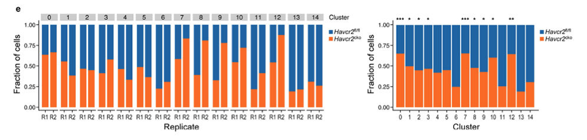

**Author(s)**: `r params$author`  
**Reviewer(s)**: `r params$reviewer`  
**Date**: `r Sys.Date()` 

# Academic Citation
If you use this code in your work or research, we kindly request that you cite our publication:

Xiaofan Lu, et al. (2025). FigureYa: A Standardized Visualization Framework for Enhancing Biomedical Data Interpretation and Research Efficiency. iMetaMed. https://doi.org/10.1002/imm3.70005

```{r setup, include=FALSE}
knitr::opts_chunk$set(echo = TRUE)
```

# 需求描述
# Demand description

想实现这两个柱状图，重点是不知道一个柱子的不同百分比是怎么做的统计检验。

We want to reproduce these bar graphs, particularly focusing on statistical tests for different percentages within each bar



出自<https://www.ncbi.nlm.nih.gov/pmc/articles/PMC8627694>

扩展数据图4 | Havcr2fl/fl和Havcr2cko CD45+细胞的单细胞RNA测序。(e) 显示每个cluster中Havcr2fl/fl(蓝)和Havcr2cko(橙)细胞比例的柱状图。

Source: <https://www.ncbi.nlm.nih.gov/pmc/articles/PMC8627694>

Extended Data Fig. 4 |. scRNA-seq of Havcr2fl/fl and Havcr2cko total CD45+ cells. (e) Bar graph showing frequency of Havcr2fl/fl (blue) and Havcr2cko (orange) cells in each cluster.

# 应用场景
# Application scenarios

对单细胞数据进行处理和分型，绘制细胞比例柱状图并做富集检验。

The single-cell data were processed and typed, the cell proportion bar chart was drawn and enrichment tests were conducted.

# 环境设置
# Environment Setup

```{r}
source("install_dependencies.R")

library(ggplot2)
library(rstatix)
library(Seurat)
library(SeuratDisk)
library(Matrix)

# 显示英文报错信息
# Show English error messages
Sys.setenv(LANGUAGE = "en") 

# 禁止chr转成factor
# Prevent character-to-factor conversion
options(stringsAsFactors = FALSE) 
```

# 输入文件
# Input Files

例文数据已上传至GEO（GSE151914），下载地址：<https://www.ncbi.nlm.nih.gov/geo/query/acc.cgi?acc=GSE151914>

Data available on GEO (GSE151914), download from: <https://www.ncbi.nlm.nih.gov/geo/query/acc.cgi?acc=GSE151914>

```{r}
# 读取count矩阵、细胞Barcode、基因名和细胞对应的样本信息
# Read count matrix, cell barcodes, gene names and sample metadata
mtx <- readMM("GSE151914_expression_matrix.mtx.gz")
cellID <- read.table("GSE151914_cellIDs.txt.gz")
geneID <- read.table("GSE151914_genes.txt.gz")
metadata <- read.table("GSE151914_metadata.txt.gz", header = T, sep = ",")

# 检查count矩阵大小是否与细胞Barcode/基因名一致
# Check matrix dimensions match cell barcode/gene identifiers
dim(mtx)
all(metadata$Index == cellID$V1)

# 修改count行列名
# Modify matrix row/column names
rownames(mtx) <- geneID$V1; colnames(mtx) = cellID$V1
summary(rowSums(mtx>0))
summary(colSums(mtx>0))

# 制作seurat对象，根据原文该分析只用到肿瘤样本(使用原文的参数 nfeatures = 1000, dim.to.use = 1:12)
# To create the seurat object, according to the original text, this analysis only uses tumor samples (using the original text parameters nfeatures = 1000, dim.to.use = 1:12).
seu <- CreateSeuratObject(mtx)
seu$Sample = metadata$Sample
seu <- subset(seu, Sample %in% c("Tum_963_WT", "Tum_650_KO", "Tum_877_WT", "Tum_685_KO"))
seu <- NormalizeData(seu)   

# 寻找高变异基因
# Find HVGs
seu <- FindVariableFeatures(seu, nfeatures = 1000)  

# 可视化高变异基因
# Visualize HVGs 
VariableFeaturePlot(seu)

# 标准化
# Standardization 
seu <- ScaleData(seu)         

# 降维
# Dimensionality reduction
seu <- RunPCA(seu)                                    
dim.to.use = 1:12
seu <- RunUMAP(seu, dims = dim.to.use)               
DimPlot(seu)
```

# 非监督聚类
# Unsupervised Clustering

```{r}
# 进行非监督聚类
# Perform unsupervised clustering
seu <- FindNeighbors(seu, dims = dim.to.use)          
seu <- FindClusters(seu)                              
DimPlot(seu)
saveRDS(seu, "seu.rds")

# 提取细胞分类信息
# Sample：由GSE151914_metadata.txt.gz提供的样本信息
# 规律为：样本组织来源_样本测序时使用通道_样本分组，如Tum_963_WT
# GSE151914 Series Matrix File(s)显示963对应R1，650对应R2
# 使用正则表达式(gsub)进行将Sample列进行分割
# 使用按位置替换(substr)或字符切割(strsplit)也可起到类似结果
# Extract cell classification information
# Sample: Provided by GSE151914_metadata.txt.gz
# Pattern: TissueSource_SequencingLane_ExperimentalGroup, e.g. Tum_963_WT
# GSE151914 Series Matrix File(s) shows 963 corresponds to R1, 650 to R2
# Using regular expressions (gsub) to split the Sample column
# Using position-based replacement (substr) or string splitting (strsplit) can achieve similar results
cellinfo <- FetchData(seu, vars = c("Sample", "seurat_clusters"))
cellinfo$Run <- gsub("(\\w+)(_)(\\d+)(_)(\\w+)", "\\3", cellinfo$Sample)
cellinfo$Run <- ifelse(test = cellinfo$Run %in% c("963", "650"),
                       yes = "R1", no = "R2")
cellinfo$Group <- gsub("(\\w+)(_)(\\d+)(_)(\\w+)", "\\5", cellinfo$Sample)
str(cellinfo)

write.table(cellinfo, "cellinfo.txt", row.names = F, col.names = T, quote = F, sep = "\t")
```

# 开始画图
# Plotting

```{r}
# cellinfo <- Seurat::FetchData(seu, vars = c("Sample", "seurat_clusters", "Run", "Group"))
cellinfo <- read.table("cellinfo.txt", header = T, stringsAsFactors = T)
str(cellinfo)

# 设置分组颜色
# Set group colors
cell.col <- setNames(object = c("#1A63A8", "#FC6910"),
                     nm = c("WT", "KO"))
```

## 绘制堆叠柱状图
## Stacked Bar Plot

```{r, fig.width=12, fig.height=4}
# 制作列联表
# Create contingency table
plot.data <- as.data.frame(table(cellinfo$seurat_clusters, cellinfo$Run, cellinfo$Group))

p1 <- ggplot(plot.data, aes(x = Var2, y = Freq, fill = Var3)) +
  
  # 绘制堆叠比例柱状图
  # Stacked proportion plot
  geom_bar(stat = "identity", position = position_fill(reverse = T)) + 
  
  # 设置分组颜色
  # Set group colors
  scale_fill_manual(values = cell.col) +   
  
  facet_wrap(~Var1, nrow = 1) +                                                           
  theme_classic() +                                                                       
  xlab("Replicate") +                                                                     
  ylab("Fraction of Cells") +                           
  theme(strip.background = element_rect(fill="grey", color = "white", size = 1),         
        strip.text = element_text(size = 12, colour="black"),                             
        legend.title = element_blank(),                                                   
        axis.title = element_text(size = 15))                                             
p1

ggsave("p1.pdf", width = 12, height = 4)
```

## 绘制带有显著性符号的柱状图
## Bar Plot with Significance

```{r fig.width=8, fig.height=4}
# 构建seurat_clusters和Group的列联表
# Build contingency table of seurat_clusters vs Group
tbl <- table(cellinfo$seurat_clusters, cellinfo$Group)
tbl

# 进行fisher精确检验和post hoc检验
# post hoc检验：对各组样本进行 one vs other的fisher检验，进行多重性校正，得到各组的p-adj
# Perform Fisher's exact test and post hoc test
# Post hoc test: Conducts Fisher's exact test for each group (one vs others) with multiple testing correction to obtain adjusted p-values (p-adj)
fisher.test(tbl, simulate.p.value = T) 
post.hoc <- row_wise_fisher_test(tbl) 

# 调整显著性显示标签
# Adjust significance display labels
post.hoc$sig.label <- ifelse(test = post.hoc$p.adj.signif == "ns", 
                             yes = "", no = post.hoc$p.adj.signif) 
str(post.hoc)
head(post.hoc)

# 准备绘图数据
# Prepare plot data
plot.data <- as.data.frame(tbl)
head(plot.data)

p2 <- ggplot(plot.data, aes(x = Var1, y = Freq, fill = Var2)) + 
  geom_bar(stat = "identity", position = position_fill(reverse = T)) +  
  scale_fill_manual(values = cell.col) +                                
  scale_y_continuous(breaks = seq(0, 1, by = 0.25)) +                   
  geom_text(data = post.hoc,                                           
            aes(x = group, y = 1.1, label = sig.label),                 
            inherit.aes = F) +                                          
  xlab("Cluster") +                                                    
  ylab("Fraction of Cells") +
  theme_classic() +                                                     
  theme(legend.title = element_blank(),                                
        axis.text = element_text(size = 10),                            
        axis.title = element_text(size = 15))                          
p2

ggsave(filename = "p2.pdf", width = 8, height = 4)
```

# Session Info

```{r}
sessionInfo()
```
