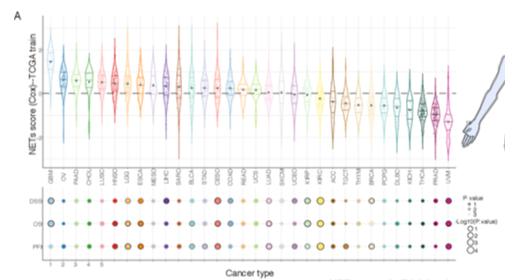

**Author(s)**: `r params$author`  
**Reviewer(s)**: `r params$reviewer`  
**Date**: `r Sys.Date()` 

# Academic Citation
If you use this code in your work or research, we kindly request that you cite our publication:

Xiaofan Lu, et al. (2025). FigureYa: A Standardized Visualization Framework for Enhancing Biomedical Data Interpretation and Research Efficiency. iMetaMed. https://doi.org/10.1002/imm3.70005

```{r setup, include=FALSE}
knitr::opts_chunk$set(echo = TRUE)
```

# 需求描述
# Demand description

来自这篇A signature for pan-cancer prognosis based on neutrophil extracellular traps，输入数据是Table S1中基因在pan-cancer的表达，使用lasso回归输出Training set和Testing set中的这张Figure 2A在不同癌症中的signature的risk score同时生成Figure2B中的HR和CI值。

From the article "A signature for pan-cancer prognosis based on neutrophil extracellular traps," the input data is the expression of genes in Table S1 across pan-cancer. Using LASSO regression, the output includes the risk scores of the signature in different cancers for the Training set and Testing set as shown in Figure 2A, while also generating the HR and CI values in Figure 2B.



出自<https://jitc.bmj.com/content/10/6/e004210.long>

图2 基于19个基因的NETs评分的预后预测效果。

Source: <https://jitc.bmj.com/content/10/6/e004210.long>

Figure 2 Prognostic performance of the 19-gene NETs score. 

# 应用场景
# Application scenarios

在泛癌中计算某感兴趣得分并计算该得分与预后的相关性；绘制得分分布于预后散点图。

更多泛癌FigureYa看这里 

可以用FigureYa实现例文多个Figure，例如：

- Figure 1A，可参考FigureYa31lasso
- Figure 2CDE、3、6BCDE，可参考FigureYa35batch_bestSeparation
- Figure 4AB，可参考FigureYa30
- Figure 4C，可参考FigureYa85timeROC
- Figure 4D，可参考FigureYa33DCA

Pan-cancer analysis: Calculate a score of interest and evaluate its correlation with prognosis; generate scatter plots showing the distribution of the score against prognostic outcomes.

FigureYa can be used to reproduce multiple figures from the example article, such as:

- Figure 1A → Refer to FigureYa31lasso
- Figures 2CDE, 3, 6BCDE → Refer to FigureYa35batch_bestSeparation
- Figures 4AB → Refer to FigureYa30
- Figure 4C → Refer to FigureYa85timeROC
- Figure 4D → Refer to FigureYa33DCA

# 环境设置
# Environment Setup

```{r}
source("install_dependencies.R")

library(ggplot2)
library(data.table)
library(survival)
library(cowplot)
library(ggpubr)

# 显示英文报错信息
# Show English error messages
Sys.setenv(LANGUAGE = "en") 

# 禁止chr转成factor
# Prevent character-to-factor conversion
options(stringsAsFactors = FALSE) 
```

# 输入文件
# Input Files

table s6 risk coefficients.txt，风险基因以及对应系数，来自原文补充材料表格Table S6。

merged_sample_quality_annotations.tsv，肿瘤注释文件。下载自<https://gdc.cancer.gov/about-data/publications/pancanatlas>，下载地址<http://api.gdc.cancer.gov/data/1a7d7be8-675d-4e60-a105-19d4121bdebf>。

EBPlusPlusAdjustPANCAN_IlluminaHiSeq_RNASeqV2.geneExp.tsv，表达矩阵，第一列是基因，之后是其在每个样本中的表达量。下载自<http://api.gdc.cancer.gov/data/3586c0da-64d0-4b74-a449-5ff4d9136611>。跟FigureYa286ExprCorORR所用的是同一个文件，不用重复下载。

Survival_SupplementalTable_S1_20171025_xena_sp，生存数据。来自<https://xenabrowser.net/datapages/?dataset=Survival_SupplementalTable_S1_20171025_xena_sp&host=https%3A%2F%2Fpancanatlas.xenahubs.net&removeHub=https%3A%2F%2Fxena.treehouse.gi.ucsc.edu%3A443>。

table s6 risk coefficients.txt - Risk genes and their corresponding coefficients, sourced from Supplementary Table S6 of the original publication.

merged_sample_quality_annotations.tsv - Tumor annotation file. Downloaded from <https://gdc.cancer.gov/about-data/publications/pancanatlas>, direct download link: <http://api.gdc.cancer.gov/data/1a7d7be8-675d-4e60-a105-19d4121bdebf>.

EBPlusPlusAdjustPANCAN_IlluminaHiSeq_RNASeqV2.geneExp.tsv - Expression matrix where the first column contains gene names followed by their expression values in each sample. Downloaded from <http://api.gdc.cancer.gov/data/3586c0da-64d0-4b74-a449-5ff4d9136611>. This is the same file used in FigureYa286ExprCorORR, so no need to download it again.

Survival_SupplementalTable_S1_20171025_xena_sp - Survival data. Obtained from <https://xenabrowser.net/datapages/?dataset=Survival_SupplementalTable_S1_20171025_xena_sp&host=https%3A%2F%2Fpancanatlas.xenahubs.net&removeHub=https%3A%2F%2Fxena.treehouse.gi.ucsc.edu%3A443>.

```{r}
# 读取风险基因以及对应系数
# Read risk genes and their corresponding coefficients
risk.coeff <- read.table("table s6 risk coefficients.txt",sep = "\t", row.names = NULL,check.names = F,stringsAsFactors = F,header = T)

# 读取肿瘤注释文件
# 数据来自http://api.gdc.cancer.gov/data/1a7d7be8-675d-4e60-a105-19d4121bdebf
# Read tumor annotation file
# Data source: http://api.gdc.cancer.gov/data/1a7d7be8-675d-4e60-a105-19d4121bdebf
rawAnno <- read.delim("merged_sample_quality_annotations.tsv",sep = "\t",row.names = NULL,check.names = F,stringsAsFactors = F,header = T) 
rawAnno$simple_barcode <- substr(rawAnno$aliquot_barcode,1,15)
samAnno <- rawAnno[!duplicated(rawAnno$simple_barcode),c("cancer type", "simple_barcode")]
samAnno <- samAnno[which(samAnno$`cancer type` != ""),]
write.table(samAnno,"output_simple_sample_annotation.txt",sep = "\t",row.names = F,col.names = T,quote = F)

# 快速读取表达谱数据并做数据预处理
# Quickly read expression profile data and perform data preprocessing
expr <- fread("EBPlusPlusAdjustPANCAN_IlluminaHiSeq_RNASeqV2.geneExp.tsv",sep = "\t",stringsAsFactors = F,check.names = F,header = T) 
expr <- as.data.frame(expr); rownames(expr) <- expr[,1]; expr <- expr[,-1]
gene <- sapply(strsplit(rownames(expr),"|",fixed = T), "[",1)
expr$gene <- gene
expr <- expr[!duplicated(expr$gene),]
rownames(expr) <- expr$gene; expr <- expr[,-ncol(expr)]

# 对于这份泛癌数据，将略小于0的数值拉到0，否则不能取log（其他途径下载的泛癌数据可能不需要此操作）
# For this pan-cancer dataset, set values slightly below 0 to 0, otherwise log transformation cannot be applied (this step may not be necessary for pan-cancer data downloaded from other sources)
expr[expr < 0] <- 0 

colnames(expr) <- substr(colnames(expr),1,15)
gc()

# 去掉对于风险基因存在NA值的样本
# Remove samples with NA values for risk genes
expr.sub <- expr[risk.coeff$Gene, ] 
expr.sub <- as.data.frame(t(na.omit(t(expr.sub)))) 
keepSam <- colnames(expr.sub) 
expr <- expr[,keepSam] 

# 读取生存数据
# Read survival data
surv <- read.delim("Survival_SupplementalTable_S1_20171025_xena_sp", sep = "\t",row.names = 1,check.names = F,stringsAsFactors = F,header = T) 

# 确定肿瘤样本以及对应肿瘤类型
# Identify tumor samples and their corresponding cancer types
sam <- samAnno[which(samAnno$`cancer type` != "LAML"),"simple_barcode"] 
comsam <- intersect(intersect(colnames(expr), sam), rownames(surv)) 
tumsam <- comsam[substr(comsam,14,14) == "0"] 
tumAnno <- samAnno[which(samAnno$simple_barcode %in% tumsam),] 
tumAnno <- tumAnno[order(tumAnno$`cancer type`),] 
tumors <- unique(tumAnno$`cancer type`) 
```

# 样本分层
# Sample Stratification

由于原文没有提供训练集和测试集的具体样本，仅提到70%和30%的随机分配，因此这里采用分层抽样随机确定训练集。

Since the original text did not provide specific samples for the training and test sets, only mentioning a random 70%/30% split, we use stratified sampling here to randomly determine the training set.

```{r}
trainsam <- testsam <- list()
outTab <- NULL
for (i in tumors) {
  
  # 提取当前肿瘤类型下的肿瘤样本
  # Extract tumor samples of the current cancer type
  sam <- tumAnno[which(tumAnno$`cancer type` == i),"simple_barcode"] 
  
  # 设置一个种子使得抽样可重复
  # Set a seed to ensure reproducibility of sampling
  set.seed(20000112) 
  
  # 根据原文提取70%的样本作为训练集
  # Extract 70% of samples as the training set, following the original text 
  trainsam[[i]] <- sample(sam, size = 0.7 * length(sam)) 
  
  # 剩下的样本作为测试集
  # The remaining samples serve as the test set
  testsam[[i]] <- setdiff(sam, trainsam[[i]]) 
  
  outTab <- rbind.data.frame(outTab, 
                             data.frame(tumor = i, 
                                        size = length(sam), 
                                        n.train = length(trainsam[[i]]), 
                                        n.test = length(testsam[[i]]), 
                                        trainID = paste(trainsam[[i]], collapse = " | "), 
                                        testID = paste(testsam[[i]], collapse = " | "), 
                                        stringsAsFactors = F),
                             stringsAsFactors = F)
}

write.table(outTab, file = "output_tumor sample stratification across 32 tumor types.txt",sep = "\t",row.names = F,col.names = T,quote = F)
```

# 计算训练集NETs得分
# Calculating NETs Scores for Training Set

```{r}
# 初始化列表
# Initialize list
nets.score <- list() 

# 初始化得分均值向量
# Initialize vector for mean scores
nets.mean <- c() 

outTab <- NULL
for (i in tumors) {
  
  # 提取当前肿瘤类型的肿瘤样本
  # Extract tumor samples of the current cancer type
  sam <- trainsam[[i]] 
  
  # 提取表达谱子集并进行log2转化
  # Extract expression subset and apply log2 transformation
  expr.sub <- log2(expr[risk.coeff$Gene,sam] + 1) 
  
  # 计算NETs得分
  # Calculate NETs scores  
  nets <- apply(expr.sub,2,function(x) {x %*% risk.coeff$Coefficient}) 
  nets.score[[i]] <- nets
  nets.mean <- c(nets.mean, mean(nets))
  outTab <- rbind.data.frame(outTab, 
                             data.frame(tumor = i, 
                                        class = "train", 
                                        samID = sam, 
                                        NETs = as.numeric(nets), 
                                        stringsAsFactors = F),
                             stringsAsFactors = F)
}
sapply(nets.score, range) 

write.table(outTab, file = "output_nets score of traning tumor sample across 32 tumor types.txt",sep = "\t",row.names = F,col.names = T,quote = F)
names(nets.mean) <- tumors

# 根据均值对肿瘤进行排序
# Sort tumors by mean score
nets.mean <- sort(nets.mean, decreasing = T) 

# 将排序结果作为肿瘤因子的等级
# Use the sorted results as factor levels for tumor types
tumor.level <- names(nets.mean) 
```

# 单变量Cox模型计算风险
# Calculating Risk Using Univariate Cox Model

我没有看懂原文Figure1A下半部分圈图的意义，图例中两个P值在我看来毫无意义，原文也没有提到相关的描述。因此这里我把图形的输入结果替换成HR和P值。

I didn't understand the meaning of the lower half circle plot in Figure 1A of the original text. The two P-values in the legend seemed meaningless to me, and the original text didn't provide any relevant explanation. Therefore, I replaced the graphical input results with HR and P-values here.

```{r}
outTab <- NULL
for(i in tumors) {
  nets <- data.frame(nets = nets.score[[i]],
                     row.names = trainsam[[i]],
                     group = ifelse(nets.score[[i]] > median(nets.score[[i]]),"High","Low"), 
                     stringsAsFactors = F)
  nets <- cbind.data.frame(nets, surv[rownames(nets),c("OS","OS.time","DSS","DSS.time","PFI","PFI.time")])

  ## OS
  coxres <- summary(coxph(Surv(OS.time, OS) ~ group, data = nets))
  outTab <- rbind.data.frame(outTab,
                             data.frame(tumor = i, 
                                        event = "OS", 
                                        beta = coxres$coefficients[1,1], 
                                        hr = coxres$coefficients[1,2], 
                                        lower = coxres$conf.int[1,3], 
                                        upper = coxres$conf.int[1,4],
                                        p = coxres$coefficients[1,5], 
                                        stringsAsFactors = F),
                             stringsAsFactors = F)
  
  ## DSS
  coxres <- summary(coxph(Surv(DSS.time, DSS) ~ group, data = nets))
  outTab <- rbind.data.frame(outTab,
                             data.frame(tumor = i,
                                        event = "DSS",
                                        beta = coxres$coefficients[1,1],
                                        hr = coxres$coefficients[1,2],
                                        lower = coxres$conf.int[1,3], 
                                        upper = coxres$conf.int[1,4], 
                                        p = coxres$coefficients[1,5],
                                        stringsAsFactors = F),
                             stringsAsFactors = F)
  
  ## PFI
  coxres <- summary(coxph(Surv(PFI.time, PFI) ~ group, data = nets))
  outTab <- rbind.data.frame(outTab,
                             data.frame(tumor = i,
                                        event = "PFI",
                                        beta = coxres$coefficients[1,1],
                                        hr = coxres$coefficients[1,2],
                                        lower = coxres$conf.int[1,3], 
                                        upper = coxres$conf.int[1,4], 
                                        p = coxres$coefficients[1,5],
                                        stringsAsFactors = F),
                             stringsAsFactors = F)
}
outTab[which(outTab$tumor == "TGCT"),]
# tumor event       beta      hr     lower     upper         p
# 79  TGCT    OS         NA      NA 0.0000000        NA        NA
# 80  TGCT   DSS         NA      NA 0.0000000        NA        NA
# 81  TGCT   PFI 0.06247737 1.06447 0.3932578 0.8737703 0.8737703
# 由于TGCT无患者达到全局死亡或疾病特异性死亡结局，调整对应OS和DSS的数值
# Since no TGCT patients reached overall survival or disease-specific survival endpoints, adjust corresponding OS and DSS values

# 系数调为0，HR及区间都改为1，P值改为1，表明无意义
# Set coefficient to 0, HR and intervals to 1, P-value to 1, indicating no significance
outTab[79,c(3,4,5,6,7)] <- c(0,1,1,1,1) 

# 系数调为0，HR及区间都改为1，P值改为1，表明无意义
# Set coefficient to 0, HR and intervals to 1, P-value to 1, indicating no significance
outTab[80,c(3,4,5,6,7)] <- c(0,1,1,1,1) 

write.table(outTab, file = "output_prognostic summary of binary nets score of traning tumor sample across 32 tumor types.txt",sep = "\t",row.names = F,col.names = T,quote = F)
```

# 开始画图
# Plotting

```{r}
# 设置颜色
# Set colors
mycol <- c("#A6CEE3",
           "#1F78B4",
           "#B2DF8A",
           "#33A02C",
           "#FB9A99",
           "#E31A1C",
           "#FDBF6F",
           "#FF7F00",
           "#CAB2D6",
           "#6A3D9A",
           "#B15928",
           "#8DD3C7",
           "#BEBADA",
           "#FB8072",
           "#80B1D3",
           "#FDB462",
           "#B3DE69",
           "#FCCDE5",
           "#D9D9D9",
           "#BC80BD",
           "#CCEBC5",
           "#FFED6F",
           "#8C510A",
           "#BF812D",
           "#DFC27D",
           "#F6E8C3",
           "#80CDC1",
           "#35978F",
           "#01665E",
           "#003C30",
           "#8E0152",
           "#C51B7D")

# 顶部图形
# Top plot
topdf <- read.table("output_nets score of traning tumor sample across 32 tumor types.txt",sep = "\t",row.names = NULL,check.names = F,stringsAsFactors = F,header = T)
topdf$tumor <- factor(topdf$tumor, levels = tumor.level)

# 对整体范围内的NETs得分进行标准化
# Standardize NETs scores across the entire range
topdf$NETs <- scale(topdf$NETs) 

p.top <- ggplot(data = topdf,aes(x = tumor, y = NETs, fill = tumor))+ 
  
  # 先添加0值水平线以免遮挡小提琴图
  # Add zero reference line first to avoid being obscured by violin plot
  geom_hline(yintercept = 0, color="black",
             linetype="longdash", lwd = 0.6) +
  
  # 添加散点
  # Add scatter points
  geom_jitter(shape=16, position=position_jitter(0.2),aes(color=tumor), size = 0.2) +
  
  # 添加小提琴图并加上分位数结果
  # Add violin plot with quantile lines
  geom_violin(aes(color=tumor), draw_quantiles = c(0.25, 0.5, 0.75), fill = NA, size = 0.6) + 
  
  # 添加均值点
  # Add mean points
  stat_summary(fun = "mean", 
               geom = "point",
               color = "black") +
  
  scale_fill_manual(values = alpha(mycol, 0.8)) +   scale_color_manual(values = alpha(mycol, 0.8)) + 
  ylab("NETs score (Cox)--TCGA train") + xlab("") +
  theme_bw() +
  theme(axis.ticks = element_line(size = 0.2, color = "black"),
        axis.ticks.length = unit(0.2, "cm"),
        axis.text.y = element_text(size = 10, color = "black"),
        axis.title = element_text(size = 12, color = "black"),
        axis.line = element_line(colour = "black"),
        axis.text.x = element_text(hjust = 1, vjust = 0.5, size = 10, color = "black", angle = 90),
        panel.border = element_blank(),
        panel.background = element_blank(),
        legend.position = "none")
p.top
#ggsave(filename = "top.pdf", width = 8,height = 6)

# 底部图形
# bottom plot
botdf <- read.table("output_prognostic summary of binary nets score of traning tumor sample across 32 tumor types.txt",sep = "\t",row.names = NULL,check.names = F,stringsAsFactors = F,header = T)
botdf$tumor <- factor(botdf$tumor, levels = tumor.level)
botdf$dirct <- factor(ifelse(botdf$hr > 1,"Risky","Protective"), levels = c("Risky","Protective"))
botdf$event <- factor(botdf$event, levels = c("PFI","OS","DSS"))
p.bot <- ggplot(botdf,aes(x = tumor, y = event,size = -log10(p))) +
  geom_point(shape = 21, aes(size=-log10(p), col = dirct, fill = tumor), position = position_dodge(0), stroke = 1) +
  scale_fill_manual(values = mycol) +
  scale_color_manual(values = c("black","grey80")) +
  xlab(NULL) + ylab(NULL) +
  labs(size = "-log10(P-value)", col = "HR") +
  scale_size_continuous(range = c(2,6)) + 
  guides(fill = FALSE) + 
  theme_bw() + 
  theme(axis.ticks = element_line(size = 0.2, color = "black"),
        axis.ticks.length = unit(0.2, "cm"),
        axis.ticks.x = element_blank(),
        axis.text.y = element_text(size = 10, color = "black"),
        axis.title = element_text(size = 12, color = "black"),
        axis.line = element_line(colour = "black"),
        axis.text.x = element_blank(),
        panel.border = element_blank(),
        panel.background = element_blank(),
        legend.position = "bottom",
        legend.margin=margin(t= 0, unit='cm'),
        legend.spacing = unit(0.1,"in"))
p.bot
#ggsave(filename = "bottom.pdf", width = 8,height = 6)

# 组合图形
# Combine plots
#p <- plot_grid(p.top, p.bot, nrow = 2, rel_heights = c(0.7,0.3)) # 不能对齐的样子
p <- ggarrange(p.top,
               p.bot, 
               nrow = 2, ncol = 1,
               align = "v",
               heights = c(7,3),
               common.legend = F)
p

ggsave(filename = "combined.pdf", width = 8,height = 6)
```

# Session Info

```{r}
sessionInfo()
```
