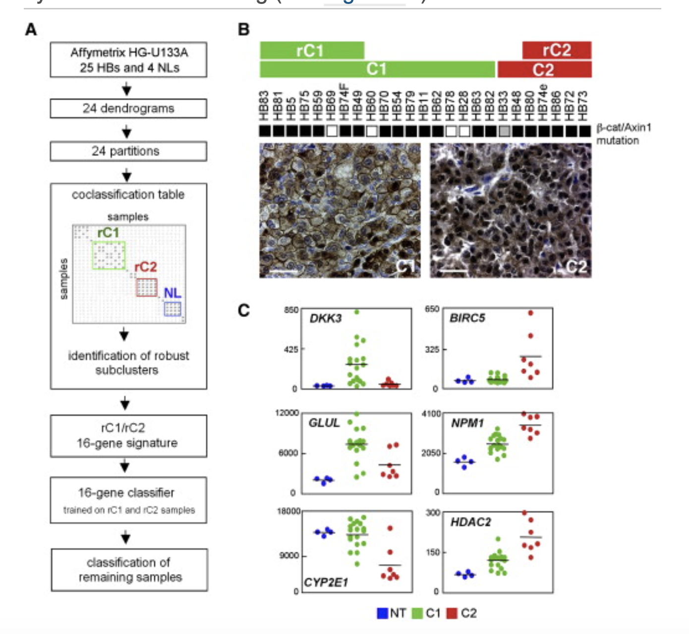

**Author(s)**: `r params$author`  
**Reviewer(s)**: `r params$reviewer`  
**Date**: `r params$date` 

# Academic Citation
If you use this code in your work or research, we kindly request that you cite our publication:
  
Xiaofan Lu, et al. (2025). FigureYa: A Standardized Visualization Framework for Enhancing Biomedical Data Interpretation and Research Efficiency. iMetaMed. https://doi.org/10.1002/imm3.70005

If you use ComplexHeatmap in published research, please cite:

Zuguang Gu, et al., Complex heatmaps reveal patterns and correlations in multidimensional genomic data, Bioinformatics, 2016.

Zuguang Gu. Complex Heatmap Visualization, iMeta, 2022.

```{r setup, include=FALSE}
knitr::opts_chunk$set(echo = TRUE)
```

# 需求描述
# Demand description

想实现一个聚类分析的方法，主要是重现本文的方法，然后在自己的数据中进行分组，方法可能比较麻烦，但是个人感觉这种聚类的方法更加的新颖，可以适用于更多的疾病。最主要的是在第一篇文章的基础上衍生出的第二篇文章的分组（C1，C2A，C2B）。

We want a clustering analysis method, mainly to reproduce the approach described in this paper, and then apply it to group my own data. The method might be a bit complex, but I personally feel this clustering approach is more innovative and can be applied to a wider range of diseases. The most important aspect is the grouping (C1, C2A, C2B) derived from the second article, which builds upon the foundation of the first article.



出自<https://europepmc.org/article/med/19061838>
  
图1. 通过表达谱分析鉴定肝母细胞瘤的两个亚型。
(A) 方法流程图：用于识别稳健样本聚类（包括两个肿瘤亚群 rC1 和 rC2 以及一个非肿瘤组 NL），并采用六种不同算法（CCP、LDA、1NN、3NN、NC 和 SVM）结合留一法交叉验证对肝母细胞瘤（HB）样本进行分类。
(B) 上：25 例 HB 样本的分子分型及 CTNNB1 基因状态。黑色和灰色方块分别表示 CTNNB1 和 AXIN1 基因突变。下：代表性 C1 和 C2 病例的 β-catenin 免疫组化分析。比例尺 = 50 μm。
(C) HB 亚型与非肿瘤肝组织（NT）中 Wnt 通路相关基因及 β-catenin 靶基因的表达情况（p < 0.005）。水平线表示平均值。

Source: <https://europepmc.org/article/med/19061838>
  
Figure 1. Identification of Two Hepatoblas- toma Subclasses by Expression Profiling.
(A) Schematic overview of the approach used to identify robust clusters of samples, including two tumor clusters (rC1 and rC2) and one nontumor cluster (NL), and to classify hepatoblastoma (HB) samples using six different algorithms (CCP, LDA, 1NN, 3NN, NC, and SVM) and leave-one- out cross-validation.
(B) Top: molecular classification of 25 HB samples and CTNNB1 gene status. Black and gray squares indicate mutations of the CTNNB1 and AXIN1 genes. Bottom: immunohistochemical analysis of b-catenin for representative C1 and C2 cases. Scale bars = 50 mm.
(C) Expression of representative Wnt-related and b-catenin target genes (p < 0.005) in HB sub- classes and nontumor livers (NT). Horizontal bars indicate mean values.

# 应用场景
# Application scenarios

类似一种共识聚类吧，只是太复杂了。算法流程写在`Readme.md`文件里，这是我和一个计算机专业的师弟写的，非常偏统计+计算机。

It's somewhat like consensus clustering, just overly complex. The algorithmic workflow is documented in the `Readme.txt` file—this was written by me and a computer science junior student, heavily leaning toward statistics + computing.

# 环境设置
# Requirements Description

```{r}
source("install_dependencies.R")
source("classPredict.R") # from classpredict package, an R version of BRB ArrayTools software

library(cluster)
library(phangorn) 
library(ape)
library(reshape2)
library(ComplexHeatmap)
library(limma)
library(classpredict) 

# 显示英文报错信息
# Show English error messages
Sys.setenv(LANGUAGE = "en") 

# 禁止chr转成factor
# Prevent character-to-factor conversion
options(stringsAsFactors = FALSE) 
```

# 输入文件
# Input Files

HB-29samples-RMA-renormData19k.txt，表达矩阵。放在InputData文件夹里。

HB-29samples-RMA-renormData19k.txt, expression matrix. Place in the InputData folder.

```{r}
work.path <- "."

# 输入文件所在文件夹
# Input data folder path
data.path <- file.path(work.path, "InputData") 

# 结果文件所在文件夹
# Results output folder path
res.path <- file.path(work.path, "Results") 

invisible(lapply(ls()[grep("path", ls())], function(x){
  if (!dir.exists(get(x))) dir.create(get(x))
}))

# 加载表达矩阵
# Load expression matrix
mtx <- read.table(file.path(data.path, "HB-29samples-RMA-renormData19k.txt"), 
                  header = T, row.names = 1, sep = "\t")
mtx <- mtx[-1, ]
tmp <- rownames(mtx)
mtx <- data.frame(lapply(mtx, as.numeric))
rownames(mtx) <- tmp
mtx <- as.matrix(mtx)
```

# 聚类分析

```{r}

probe.stat <- list()
probe.stat$probe <- rownames(mtx)
nsample <- ncol(mtx)

## 1: 方差检验
## 1: Variance test  
## -----------------------------------------------------------------

# 计算每个探针的方差
# calculate variance for each probe
probe.stat$var <- apply(mtx, 1, var) 

# 计算卡方统计量
# calculate chi statistic
probe.stat$statistic <- (nsample-1)*probe.stat$var/median(probe.stat$var) 

# 计算单尾p值
# calculate single tail p value
probe.stat$pvalue <- 1-pchisq(probe.stat$statistic, df = nsample-1) 

### 稳健变异系数(rCV)
### Robust coefficient of variation (rCV)
probe.stat$rCV <- apply(mtx, 1, function(x){
  x = sort(x)
  x = x[2:(ncol(mtx)-1)]
  sd(x)/mean(x)
})

### 无监督探针集筛选
### Unsupervised probe sets selection 
thresholds <- c(0.6, 0.7, 0.8, 0.9, 0.95, 0.975, 0.99, 0.995)

# 按阈值筛选探针集
# filter probe set for each threshold
probe.stat$sets <- lapply(thresholds, function(threshold){ 
  probe.stat$probe[probe.stat$pvalue < 0.01 & 
                     probe.stat$rCV < 10 & 
                     probe.stat$rCV > quantile(probe.stat$rCV, threshold)]
})
names(probe.stat$sets) <- thresholds

# 列出探针集数量
# list the number of probe set
unlist(lapply(probe.stat$sets, length)) 

# 探针集p值总结
# summary the pvalue of the probe set
lapply(probe.stat$sets, function(x) summary(probe.stat$pvalue[x])) 

# 探针集rCV总结
# summary the rCV of the probe set
lapply(probe.stat$sets, function(x) summary(probe.stat$rCV[x])) 


## 2: 生成24个树状图系列
## 2: Generation of a series of 24 dendrograms 
## -----------------------------------------------------

linkages <- c("average", "complete", "ward")
Dends <- list()

for (linkage in linkages){ # for three linkages
  for (threshold in thresholds){ # for 8 thresholds
    cat("Parameter: linkage =", linkage, "; threshold =", threshold, "; ")
    
    # 提取探针集
    # extract probe set
    probeset <- probe.stat$sets[[as.character(threshold)]] 
    
    cat("Number of Probes :", length(probeset), "\n")
    
    # 计算距离矩阵
    # calculate distance
    d = as.dist(1-cor(mtx[probeset, ], method = "pearson")) 
    
    Dends[[paste0(linkage, "_", threshold)]] = as.hclust(agnes(x = d, diss = T, method = linkage)) # clutering
  }
}

pdf(file.path(res.path, "Dendrograms.pdf"))
lapply(Dends, plot)
invisible(dev.off())

## 3: 稳定性评估
## 3: Stability assessment
## -----------------------------------------------------------------

### 内在稳定性
### intrinsic stability 

#### 扰动
#### perturbation
noise <- matrix(rnorm(n = nrow(mtx)*ncol(mtx), mean = 0, sd = sqrt(1.5 * median(probe.stat$var))),
                nrow = nrow(mtx), ncol = ncol(mtx))

#### 重采样
#### resampleing
newsample <- sample(1:ncol(mtx), size = 5, replace = T)
newsample <- (mtx + noise)[, newsample]
colnames(newsample) <- paste0("test", 1:ncol(newsample))
# mtx <- cbind(mtx, newsample)

### 树状图间相似性评分
### Similarity Score between dendrograms

#### 树分割距离(又称对称差异度量或Robinson-Foulds距离)
#### tree partition distance (also called symmetric difference metric and Robinson-Foulds distance)
phylos <- lapply(Dends, as.phylo) 
class(phylos) <- "multiPhylo"
RF.dist(phylos) 

## 4: 稳健聚类识别
## 4: Identification of robust cluster  
## -----------------------------------------------------------------

#### 判断两个样本在树状图中是否共分类
#### group.size: 如果包含样本A和B的组规模较小，则忽略
#### judge whether two sample is co-classfied in a dendrogram
#### group.size: if the size of the group including sample A and B is smaller, ignore it
IsCoClass <- function(dend, sampleA, sampleB, k, group.size = 4){
  coclass = F
  tmp = cutree(dend, k)
  if (tmp[sampleA] == tmp[sampleB] & sum(tmp == tmp[sampleA]) >= group.size)
    coclass = T
  return(coclass)
}

mat.list <- lapply(2:8, function(k){ 
  CoClassification <- lapply(Dends, function(dend){
    Coc <- lapply(colnames(mtx), function(A){
      sapply(colnames(mtx), function(B) IsCoClass(dend, A, B, k = k, group.size = 4))
    })
    Coc <- do.call(rbind, Coc)
    rownames(Coc) <- colnames(mtx)
    return(Coc)
  })
  Reduce(`+`, CoClassification)
})
names(mat.list) <- 2:8
# lapply(mat.list, function(x) table(as.vector(x)))

#### 通过共识热图确定k值
#### determine k by Consensus Heatmap
pdf(file.path(res.path, "ConsensusMatrix.pdf"))
for (tk in as.character(2:8)) {
  cat(tk, "\t")
  pheatmap(24-mat.list[[tk]], 
           clustering_method = "complete", 
           color = rev(ConsensusClusterPlus:::myPal()), 
           border_color = NA,
           cellheight = 12, cellwidth = 12,
           main = paste("consensus matrix k=", tk, sep = ""),
           legend = F,
           run_draw = T)
}
invisible(dev.off())

#### 设置k=3
#### 用h=24-22切割树状图
#### 识别在24个分区中至少有22次共分类的样本对组
#### set k as 3
#### cut the dendrogrom using h=24-22
#### identified groups in which any pair of samples was co-classified in at least 22 of the 24 partitions
k = "3"; 
sampleInfo <- data.frame("Sample" = colnames(mtx))
mat = mat.list[[k]]
hcl = hclust(as.dist(24-mat))
gp <- cutree(tree = hcl, h = 24-22)
sampleInfo$PrimaryCluster = as.factor(gp[match(sampleInfo$Sample, names(gp))])

#### 合并平均共分类分数大于20的聚类
#### 用h=24-18切割hcl2
#### merge clusters whose mean co-classification score is more than 20
#### cut the hcl2 using h=24-18
num.gps = length(levels(sampleInfo$PrimaryCluster))
gps.coc.mat <- matrix(nrow = num.gps, ncol = num.gps)
rownames(gps.coc.mat) = colnames(gps.coc.mat) = levels(sampleInfo$PrimaryCluster)
for (i in levels(sampleInfo$PrimaryCluster)){
  for (j in 1:num.gps){
    sampleA = names(gp)[gp == i]
    sampleB = names(gp)[gp == j]
    
    # 计算每对组的平均共分类分数
    # compute mean co-classification score for each group pair
    gps.coc.mat[i, j] = mean(mat[sampleA, sampleB]) 
  }
}
hcl2 <- hclust(as.dist(gps.coc.mat))
gp2 <- cutree(hclust(as.dist(24-gps.coc.mat)), h = 24-18)

#### 将PrimaryCluster标签转为最终标签
#### switch the PrimaryCluster label to final label
sampleInfo$FinalCluster <- plyr::mapvalues(x = sampleInfo$PrimaryCluster,
                                           from = names(gp2),
                                           to = gp2)
table(sampleInfo$FinalCluster)
split(sampleInfo$Sample, sampleInfo$FinalCluster)
write.table(sampleInfo, file.path(res.path, "output_sampleInfo.txt"), 
            row.names = F, col.names = T, quote = F, sep = "\t")


## 5: 16基因特征
## 5: 16 gene signature  
## -----------------------------------------------------------------

### 使用limma寻找特征基因
### 以文献中的分组标签为例
### use limma to find signature
### take the group label from article as example

group <- setNames(object = c(rep("rC1", 8), rep("rC2", 5)), 
                  nm = c("HB83", "HB81", "HB5", "HB75", "HB59", "HB69", "HB74F", "HB49",
                         "HB80", "HB74e", "HB86", "HB72", "HB73"))
design <- model.matrix(~0+factor(group))
colnames(design) = levels(factor(group))
rownames(design) = names(group)
design

contrast.matrix <- makeContrasts(paste0(unique(group),collapse = "-"), levels = design)
fit <- lmFit(mtx[, names(group)], design)
fit2 <- contrasts.fit(fit, contrast.matrix)
fit2 <- eBayes(fit2) 
DEGs = topTable(fit2, coef=1, n=Inf)
sig = rownames(DEGs)[DEGs$adj.P.Val<1e-3]

## 16基因分类器
## 16 gene classifier

### 使用classpredict (R版BRB ArrayTools软件)
### use classpredict (an R version of BRB ArrayTools software)

## 6: 聚类预测
## 6: cluster prediction 
## -----------------------------------------------------------------

all.data <- mtx[sig, ]

# 训练集
# train set
train.data <- all.data[, names(group)] 

# 训练集标签
# label of train set
train.label <- as.factor(group) 

# train.data$Group <- as.factor(group)

test.data <- all.data[, setdiff(colnames(all.data), names(group))] # test set
geneId <- data.frame("UniqueID" = rownames(train.data))

resList <- classPredict(exprTrain = train.data, exprTest = test.data, isPaired = FALSE,
                        pairVar.train = NULL, pairVar.test = NULL, geneId = geneId, 
                        cls = as.character(train.label), projectPath = res.path,
                        pmethod = c("ccp", "bcc", "dlda", "knn", "nc", "svm"),
                        geneSelect = "igenes.univAlpha",
                        univAlpha = 0.001, univMcr = 0, foldDiff = 0, rvm = TRUE,
                        filter = rep(1, length(geneId)), ngenePairs = 25, nfrvm = 10, cvMethod = 1,
                        kfoldValue = 10, bccPrior = 1, bccThresh = 0.8, nperm = 0,
                        svmCost = 1, svmWeight =1, fixseed = 1, prevalence = NULL, 
                        outputName = "ClassPrediction", generateHTML = T)
View(resList$predNewSamples)
View(resList$performClass)
write.table(resList$predNewSamples, file.path(res.path, "output_ClassPrediction.txt"),
            row.names = F, col.names = T, sep = "\t", quote = F)
```

# Session Info

```{r}
sessionInfo()
```
