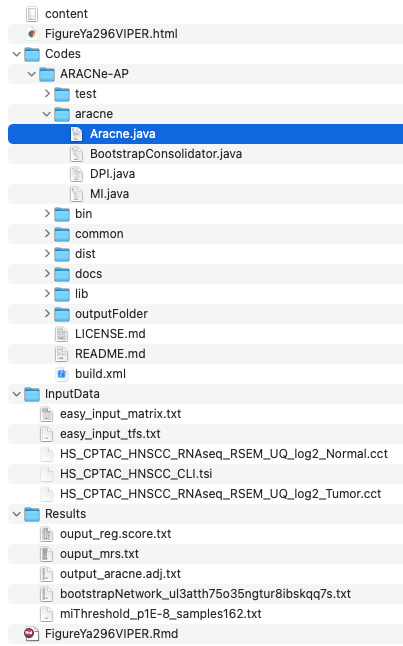

**Author(s)**: `r params$author`  
**Reviewer(s)**: `r params$reviewer`  
**Date**: `r Sys.Date()` 

# Academic Citation
If you use this code in your work or research, we kindly request that you cite our publication:

Xiaofan Lu, et al. (2025). FigureYa: A Standardized Visualization Framework for Enhancing Biomedical Data Interpretation and Research Efficiency. iMetaMed. https://doi.org/10.1002/imm3.70005

```{r setup, include=FALSE}
knitr::opts_chunk$set(echo = TRUE)
```

# 需求描述
# Demand description

转录因子活性计算方法。

**转录因子活性推断**

每个样本的转录因子活性通过VIPER软件包（Alvarez et al., 2016）基于z-score标准化的RNA数据进行计算。转录因子的靶基因来源于DoRothEA数据库（Garcia-Alonso et al., 2019），分析时采用中等置信度的靶基因集合。肿瘤样本与正常样本的活性评分通过Student t检验进行比较，并使用Benjamini-Hochberg方法校正p值。校正后p值 < 0.05的转录因子被视为具有显著差异。

我们还利用VIPER中的ARACNe算法（Lachmann et al., 2016）构建基因调控网络，并根据转录因子蛋白丰度的相关性推断其靶基因，从而解析癌症特异的转录因子调控机制。此外，我们将标准化富集的蛋白活性评分与免疫评分进行了相关性分析。

出自：<https://linkinghub.elsevier.com/retrieve/pii/S1535610820306553>

Calculation methods for transcription factor activity.

**Transcription factor activity inference**

Transcription factor activity for each sample was inferred using the VIPER package (Alvarez et al., 2016) on z-score transformed RNA data. The transcription factor targets were collected from DoRothEA (Garcia-Alonso et al., 2019) and the medium confidence targets were used for analysis. Activity scores for tumor and normal samples were compared using Student’s t-test and the p values were adjusted using the Benjamini-Hochberg method. Transcription factors with an adjusted p value < 0.05 were considered significant.

We also used the ARACNe algorithm (Lachmann et al., 2016) in VIPER to construct gene regulatory networks and infer transcription factor targets based on correlation to the transcription factor protein abundance. This allows for cancer-specific transcription factor gene regulation. We correlated the normalized enrichment protein activity scores with immune scores.

Source: <https://linkinghub.elsevier.com/retrieve/pii/S1535610820306553>

# 应用场景
# Application scenarios

将转录组表达矩阵转换为调控因子活性矩阵，并画图。

这里用VIPER包计算转录因子活性（Protein-activity by Enriched Regulon analysis）。另外，如果要分析**转录调控网络regulon的活性**（注意：并非转录因子活性），可参考FigureYa249Regulon。

例文METHOD DETAILS的Integrated analysis部分描述了挖掘生物学意义时用到的整合分析方法，我们曾实现过其中一些算法：

- ESTIMATE：可参考FigureYa211multiCohortImmSubtype
- ssGSEA：可参考FigureYa71ssGSEA
- NMF：可参考FigureYa110mutationSignature，FigureYa158MutationPattern，FigureYa169sigHeatmap。

Convert the transcriptomic expression matrix into a regulator activity matrix and visualize the results.

Here, the VIPER package is used to calculate transcription factor activity (Protein-activity by Enriched Regulon analysis). Alternatively, if **analyzing regulon activity** (note: not transcription factor activity), refer to FigureYa249Regulon.

The METHOD DETAILS section under Integrated analysis describes the computational methods used for biological interpretation, some of which were previously crowdsourced in our studies:

- ESTIMATE: Refer to FigureYa211multiCohortImmSubtype
- ssGSEA: Refer to FigureYa71ssGSEA
- NMF: Refer to FigureYa110mutationSignature, FigureYa158MutationPattern, and FigureYa169sigHeatmap

# 环境设置
# Environment Setup

```{r}
source("install_dependencies.R")

library(mixtools)
library(dorothea)
library(viper)

# 显示英文报错信息
# Show English error messages
Sys.setenv(LANGUAGE = "en") 

# 禁止chr转成factor
# Prevent character-to-factor conversion
options(stringsAsFactors = FALSE) 
```

# 输入文件
# Input Files

viper/ARACNe需要TXT格式的转录因子列表和表达矩阵作为输入数据，输入文件保存在"InputData"文件夹中。

- tfs.txt，转录因子列表，这里是从dorothea包中提取的。
- HS_CPTAC_HNSCC_RNAseq_RSEM_UQ_log2_Normal.cct，HS_CPTAC_HNSCC_RNAseq_RSEM_UQ_log2_Tumor.cct，表达矩阵，下载自<http://linkedomics.org/data_download/CPTAC-HNSCC>。整理成easy_input_matrix.txt。

VIPER/ARACNe requires input data in TXT format, including a transcription factor list and an expression matrix, stored in the "InputData" folder.

- tfs.txt: Transcription factor list, extracted from the DoRothEA package.
- HS_CPTAC_HNSCC_RNAseq_RSEM_UQ_log2_Normal.cct，HS_CPTAC_HNSCC_RNAseq_RSEM_UQ_log2_Tumor.cct: Expression matrices downloaded from <http://linkedomics.org/data_download/CPTAC-HNSCC> and reformatted into easy_input_matrix.txt.




```{r}
work.path <- "."
data.path <- file.path(work.path, "InputData")
res.path <- file.path(work.path, "Results")
code.path <- file.path(work.path, "Codes")
fig.path <- file.path(work.path, "Figures")

if (!dir.exists(data.path)) dir.create(data.path)
if (!dir.exists(res.path)) dir.create(res.path)
if (!dir.exists(code.path)) dir.create(code.path)
if (!dir.exists(fig.path)) dir.create(fig.path)

# 从dorothea包中提取转录因子列表
# Extract transcription factor list from dorothea package
net <- dorothea::dorothea_hs
tfs <- unique(net$tf)
write.table(tfs, file.path(data.path, "easy_input_tfs.txt"), row.names = F, col.names = F, quote = F)

# 读取原文提供的转录组数据，并保存到InputData/matrix.txt中
# Read original transcriptomic data and save to InputData/matrix.txt
tmp1 <- read.table(file.path(data.path, "HS_CPTAC_HNSCC_RNAseq_RSEM_UQ_log2_Normal.cct"), 
                   header = T, row.names = 1, check.names = F)
colnames(tmp1) <- paste0("Normal", "_", colnames(tmp1))

tmp2 <- read.table(file.path(data.path, "HS_CPTAC_HNSCC_RNAseq_RSEM_UQ_log2_Tumor.cct"), 
                   header = T, row.names = 1, check.names = F)
colnames(tmp2) <- paste0("Tumor", "_", colnames(tmp2))
expr <- cbind(tmp1, tmp2)

## 去除在过多样本(>10%)中表达值为0的基因，以避免在bootstrap过程中出现报错
## Remove genes with zero expression in >10% samples to avoid bootstrap errors
expr <- expr[rowSums(expr>0) >= 0.1*ncol(expr), ]

## 整理样本分组信息
## Prepare sample grouping information
clin <- data.frame(
  row.names = colnames(expr),
  "IsTumor" = c(rep("Normal", ncol(tmp1)), rep("Tumor", ncol(tmp2))),
  "Patient" = gsub("Tumor_|Normal_", "", colnames(expr))
)
# 也可以直接读取样本分组信息文件：
# Alternatively read sample grouping info directly from file:
# clin <- read.delim(file.path(data.path, "HS_CPTAC_HNSCC_CLI.tsi"))
# clin <- clin[-1, ]; rownames(clin) <- clin$case_id
# expr <- expr[, c("Idx", clin$case_id)]

write.table(data.frame("gene" = rownames(expr), expr), file.path(data.path, "easy_input_matrix.txt"), 
            row.names = F, col.names = T, quote = F, sep = "\t")
```

# 重建基因调控网络 - ARACNe-AP
# Reconstructing Gene Regulatory Networks - ARACNe-AP

ARACNe-AP是基于java的程序，需要安装1.8以上的java。java下载地址<https://www.java.com/>

ARACNe-AP可以从GitHub上下载后自行编译，存放在`Code/ARACNe-AP`文件夹里。具体过程参考GitHub指南。git clone <https://github.com/califano-lab/ARACNe-AP.git>，或者使用已经编译好的可执行文件：dist/aracne.jar。

ARACNe-AP is a Java-based program that requires Java 1.8 or higher to be installed. Java can be downloaded from: <https://www.java.com/>

ARACNe-AP can be downloaded from GitHub and compiled locally, then stored in the `Code/ARACNe-AP` directory. For detailed instructions, please refer to the GitHub guide: git clone <https://github.com/califano-lab/ARACNe-AP.git>. Alternatively, you may directly use the pre-compiled executable located at: dist/aracne.jar.

```{r}
## 在R中调用java需要确定java位置
## 在Windows中直接为java，在linux系统中需要通过"which java"命令查询java位置
## Setting Java path for R integration
## On Windows systems simply use "java", on Linux systems query Java location via "which java" command
java.path <- ifelse(test = Sys.info()['sysname'] == "Windows",
                    yes = "java",
                    no = system("which java", intern = T))
aracne.path <- file.path(code.path, "ARACNe-AP")
# fs::dir_tree(aracne.path)

## 编写调用ARACNe的语句
## Constructing ARACNe execution command

aracne.cmd <- paste(java.path, "-Xmx5G",      
                    
                    # ARACNe可执行文件位置
                    # ARACNe executable location
                    "-jar", file.path(aracne.path, "dist/aracne.jar"), 
                    
                    # 表达矩阵位置
                    # Expression matrix path
                    "-e", file.path(data.path, "easy_input_matrix.txt"), 
                    
                    # 转录因子列表位置
                    # Transcription factor list path
                    "--tfs", file.path(data.path, "easy_input_tfs.txt"), 
                    
                    # ARACNe结果输出位置
                    # Output directory for ARACNe results
                    "-o", file.path(res.path),     
                    
                    # 指定显著性阈值和随机种子
                    # Significance threshold and random seed
                    "--pvalue 1E-8 --seed 1",  
                    
                    # 指定所用线程
                    # Number of threads to use
                    "--threads 2")                                     

## ARACNe需要运行两次，第一次计算阈值，第二次计算邻接权重
## ARACNe requires two runs: first for threshold calculation, second for adjacency weights
system(paste(aracne.cmd, "--calculateThreshold"))
system(aracne.cmd)
```

# 计算转录因子活性 - VIPER
# Calculating Transcription Factor Activity - VIPER

输入转录因子列表和表达矩阵，推断主要调控因子，获得各转录因子的主要调控靶标，寻找调控网络间的阴影对，预测调控子间的协同作用。

参考VIPER的文档<https://www.bioconductor.org/packages/release/bioc/vignettes/viper/inst/doc/viper.pdf>

Input a list of transcription factors and an expression matrix to infer key regulatory factors, identify the main regulatory targets of each transcription factor, detect shadow pairs within regulatory networks, and predict synergistic interactions among regulators.

Refer to the VIPER documentation <https://www.bioconductor.org/packages/release/bioc/vignettes/viper/inst/doc/viper.pdf>

```{r}
## 从ARACNe-AP生成regulon对象
## Generate the regulon object from ARACNe-AP
## --------------------------------------------------

### 使用aracne2regulon函数读取ARACNe的输出文件，生成regulon对象
### 需要ARACNE生成的邻接权重文件，和一个储存原始表达矩阵的ExpressionSet对象
### 需要删除ARACNe输出文件（'bootstrap'开头的文件）的列名
### Use aracne2regulon function to read ARACNe output files and generate regulon object
### Requires ARACNe-generated adjacency weight file and an ExpressionSet object containing the original expression matrix
### Need to remove column names from ARACNe output files (files starting with 'bootstrap')
adjfile <- list.files(res.path, pattern = "^bootstrap", full.names = T)
adj <- read.table(adjfile, header = T)
write.table(adj, file.path(res.path, "output_aracne.adj.txt"), sep = "\t", row.names = F, col.names = F, quote = F)

### 新建ExpressionSet对象
### Create new ExpressionSet object
eset <- ExpressionSet(assayData = as.matrix(expr), 
                      phenoData = new("AnnotatedDataFrame", data = clin)) 
regulon <- aracne2regulon(afile = file.path(res.path, "output_aracne.adj.txt"),  
                          eset = eset,                              
                          verbose = T, format = "3col")    

### regulon的读取需要大量时间，读完可以保存在Result/文件夹下
### Reading regulon takes significant time, can be saved in Result/ folder after reading
#saveRDS(regulon, file.path(res.path, "regulon.rds"))


## 使用msVIPER进行主调控因子分析
## Master Regulator Analysis performed by msVIPER 
## ----------------------------------------------

## 主要调控因子分析
## 使用T检验，提取不同分组间的差异基因
## group1可以设置为多个组别，如 c("Tumor1", "Tumor2")
## Master regulator analysis
## Use t-test to extract differentially expressed genes between groups
## group1 can be set to multiple groups, e.g. c("Tumor1", "Tumor2")
signature <- rowTtest(x = eset,                              
                      pheno = "IsTumor",                        
                      group1 = c("Tumor"), group2 = "Normal")    
signature <- (qnorm(signature$p.value/2, lower.tail = FALSE) *
                sign(signature$statistic))[, 1]

## 通过permutation构建零假设
## Construct null hypothesis through permutation
nullmodel <- ttestNull(eset, "IsTumor", c("Tumor"), "Normal", per = 1000,
                       repos = TRUE, verbose = T)
regulon

## msVIPER (多样本版本)
## 推断主要调控因子
## msVIPER (a multiple sample version)
## Infer master regulators
mrs <- msviper(ges = signature, 
               regulon = regulon, 
               nullmodel = nullmodel, 
               verbose = TRUE)
summary(mrs)

# VIPER图展示每个转录因子的正负调控靶标
# VIPER plot showing the projection of the negative and positive targets for each TF.
pdf(file.path(fig.path, "Target for each TF.pdf"))
plot(mrs, cex = .7)
invisible(dev.off())


## Leading-edge分析
## Leading-edge analysis

### 获得各转录因子的主要调控靶标
### Obtain leading regulatory targets for each transcription factor
mrs <- ledge(mrs)
summary(mrs)
mrs.tab <- as.data.frame(mrs$es[c("nes", "size", "p.value")])
mrs.tab <- mrs.tab[order(mrs.tab$p.value), ]
mrs.tab$p.adj <- p.adjust(mrs.tab$p.value, method = "BH")

# mrs.tab$leadingEdge <- mrs$ledge 
# 主要调控靶标无法写入txt中，可选择xlsx或rds格式
# Leading targets cannot be written to txt, can choose xlsx or rds format
write.table(mrs.tab, file = file.path(res.path, "ouput_mrs.txt"), quote = F)


## msVIPER扩展分析 
## Beyond msVIPER  
## ------------------------------------------------------------------

### msVIPER自举分析
### Bootstrap msVIPER
signature <- bootstrapTtest(eset, "IsTumor", c("Tumor"), "Normal", verbose = TRUE)
mrs.boot <- msviper(signature, regulon, nullmodel, verbose = TRUE)
mrs.boot <- bootstrapmsviper(mrs.boot, "mode")

# msVIPER图展示使用100次自举迭代的生发中心反应基因表达特征中转录因子regulons的富集情况
# msVIPER plot showing the enrichment of transcription factor regulons on the germinal center reaction gene expression signature using 100 bootstrap iterations.
pdf(file.path(fig.path, "Target for each TF (bootstap).pdf"))
plot(mrs.boot, cex = .7)
invisible(dev.off())


### Shadow analysis
### 寻找调控网络间的阴影对
### 阴影对MR1−>MR2，表示计算的MR2转录因子活性部分由于MR1的共调控作用
### Shadow分析
### Identify shadow pairs in regulatory network
### Shadow pair MR1−>MR2 indicates MR2's calculated activity is partly due to MR1's co-regulation

# 选取最显著的25个转录因子
# Select top 25 significant transcription factors
mrs.shadow <- shadow(mrs, regulators = 25, verbose = TRUE) 

summary(mrs.shadow)
mrs.shadow$shadow

### 协同作用分析
### 预测调控子间的协同作用
### 如果两个调控因子的共调控活性明显高于简单的活性加和，则认为这两个调控子可能协同调控一个基因的表达
### Synergy analysis
### Predict synergistic effects between regulators
### If two regulators' co-regulatory activity is significantly higher than simple additive effect, they may synergistically regulate gene expression

# 选取最显著的25个转录因子
# Select top 25 significant transcription factors
mrs.synergy <- msviperCombinatorial(mrs, regulators = 25, verbose = TRUE)

mrs.synergy <- msviperSynergy(mrs.synergy, verbose = TRUE)
summary(mrs.synergy)
mrs.synergy$es$synergy


# msVIPER图展示共调控regulon在生发中心反应基因表达特征中的富集结果
# msVIPER plot showing the results for the enrichment of co-regulons on the germinal center reaction gene expression signature
pdf(file.path(fig.path, "Target for each TF(Co-regulon).pdf"))
plot(mrs.synergy, mrs = 25, cex = .7)
invisible(dev.off())


## 活性分数分析
## Activity Score 
## ------------------------------------------------------------------

### 将转录组表达矩阵转换为调控因子活性矩阵
### Convert transcriptome expression matrix to regulator activity matrix
vpsig <- viperSignature(eset, "IsTumor", "Normal", verbose = TRUE)
vpres <- viper(vpsig, regulon, verbose = TRUE)
reg.score <- exprs(vpres)
#saveRDS(reg.score, file.path(res.path, "reg.score.rds"))
write.table(reg.score, file = file.path(res.path,"ouput_reg.score.txt"),sep = "\t",row.names = T,col.names = NA,quote = F)
```

# Session Info

```{r}
sessionInfo()
```
