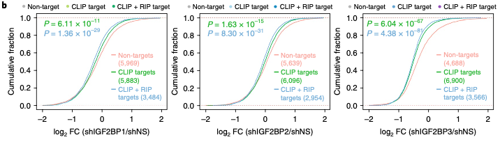
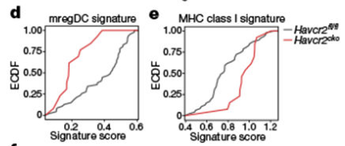

**Author(s)**: `r params$author`  
**Reviewer(s)**: `r params$reviewer`  
**Date**: `r Sys.Date()` 

# Academic Citation
If you use this code in your work or research, we kindly request that you cite our publication:

Xiaofan Lu, et al. (2025). FigureYa: A Standardized Visualization Framework for Enhancing Biomedical Data Interpretation and Research Efficiency. iMetaMed. https://doi.org/10.1002/imm3.70005

```{r setup, include=FALSE}
knitr::opts_chunk$set(echo = TRUE)
```

# 需求描述
# Requirements Description

重点是p值如何算出来的

Focus on how p-values are calculated



出自：<https://www.nature.com/articles/s41556-018-0045-z>

图2 | IGF2BPs调控全转录组mRNA水平。
(b) IGF2BP基因沉默后，非靶标基因、CLIP靶标基因及CLIP+RIP靶标基因的mRNA log2倍数变化累积频率分布。P值采用**双尾Wilcoxon与Mann–Whitney检验**计算。

Source: <https://www.nature.com/articles/s41556-018-0045-z>

Fig. 2 | IGF2BPs regulate transcriptome-wide mRNA levels.
(b) Cumulative frequency of mRNA log2 FC in non-target, CLIP target and CLIP + RIP target genes upon IGF2BP silencing. P values were calculated using **two-sided Wilcoxon and Mann–Whitney test**. 

FigureYa290BarGraph所在的文章里也用到了类似的图：

The article where the FigureYa290BarGraph is located also uses a similar graph: 



出自：<https://www.nature.com/articles/s41586-021-03626-9>

图3 | TIM-3缺陷增强树突细胞功能并促进抗原特异性抗肿瘤免疫。
(d) Havcr2fl/fl(灰色)与Havcr2cko(红色)迁移性树突细胞中mregDC特征基因集富集分数的经验累积分布(ECDF)图(P=9.4×10⁻⁴)
(e) MHC I类抗原呈递特征基因集的ECDF图(P=1.01×10⁻³)
Havcr2fl/fl与Havcr2cko组间基因特征活性水平的差异采用Wilcoxon秩和检验分析，并通过小提琴图或ECDF图可视化

Source: <https://www.nature.com/articles/s41586-021-03626-9>

Fig. 3 | TIM-3 deficiency promotes DC functionality and enhances antigen-specific anti-tumour immunity.
(d) Empirical cumulative distribution function (ECDF) plot of enrichment score for mregDC signature in Havcr2fl/fl (grey) or Havcr2cko (red) migDCs, (P = 9.4 × 10−4). (e) ECDF plot of MHC class I presentation signature (P = 1.01 × 10−3).
The difference in gene signature score activity levels between Havcr2fl/fl and Havcr2cko was examined using **Wilcoxon rank-sum test** and visualized using violin or ECDF plots.

以上两篇文章用到的检验方法`two-sided Wilcoxon and Mann–Whitney test`和`Wilcoxon rank-sum test`是一回事。

The two testing methods mentioned in the above articles, `two-sided Wilcoxon and Mann–Whitney test` and `Wilcoxon rank-sum test`, refer to the same thing.

# 应用场景
# Application Scenario

用经验累积分布函数empirical cumulative distribution function(ECDF)对比分布，并计算两种分布的p value。

ECDF图具有两大核心优势：

- 与直方图或核密度估计不同，它直接呈现每个数据点。这意味着无需考虑分组区间宽度或平滑参数的选择。
- 由于曲线具有单调递增特性，这种图表特别适合进行多组分布的比较。

出自：<https://seaborn.pydata.org/tutorial/distributions.html#tutorial-ecdf>，里面有关于其他分布的介绍，推荐扩展阅读。

我们在FigureYa278heatmapPoints中也有类似的一个需求，用的是 `kruskal.test`，这种统计方法也可用来计算两种分布的P值.

Compare distributions using the empirical cumulative distribution function (ECDF) and calculate the p-value between the two distributions.

The ECDF plot has two key advantages.

- Unlike the histogram or KDE, it directly represents each datapoint. That means there is no bin size or smoothing parameter to consider. 
- Additionally, because the curve is monotonically increasing, it is well-suited for comparing multiple distributions.

This is from <https://seaborn.pydata.org/tutorial/distributions.html#tutorial-ecdf>, which includes an introduction to other distributions—recommended for further reading.

We had a similar requirement in FigureYa278heatmapPoints , where we used the `kruskal.test`. This statistical method can also be used to compute the p-value between two distributions.

# 环境设置
# Environment Setup

```{r}
source("install_dependencies.R")

library(tidyverse)
library(rstatix) 
library(glue)
library(ggtext) 

# 显示英文报错信息
# Show English error messages
Sys.setenv(LANGUAGE = "en") 

# 禁止chr转成factor
# Prevent character-to-factor conversion
options(stringsAsFactors = FALSE) 
```

# 输入文件
# Input Files

easy_input.csv，包含两列，第一列是数值，第二列是分组信息（a、b、c三组）。

The file easy_input.csv contains two columns: the first column stores numerical values, and the second column contains group labels (with three categories: a, b, and c).

```{r}
# 生成输入文件
# 设置随机数种子，以便我们都能复现结果
# 在所有涉及到随机数据的产生，大家一定都要记得设置随机数种子
# Generate input file
# Set random seed for reproducible results
# Always remember to set random seed when generating any random data
set.seed(2022)

df <- data.frame(
  x = c(rnorm(100, 0, 3), rnorm(100, 0, 10), rnorm(100, 0, 10)),
  g = gl(3, 100, labels = c("a", "b", "c"))
)

write.csv(df, "easy_input.csv", quote = F, row.names = F)
```


```{r}
# 加载输入文件
# Load input file
df <- read.csv("easy_input.csv")

# 指定线条颜色
# Specify line colors
cols = c("red", 
         "forestgreen", 
         "darkblue")

# 图中文字都是带有颜色的，而且与所对应的组别颜色都是一致的，这里我们利用 Y 叔的 ggtext 巧妙的构建组别：
# All text elements in the plot are color-coded to match their corresponding group colors. Here we cleverly construct the groups using Dr.Y's ggtext package
df1 <- df %>%
  mutate(
    col = rep(cols, each = 100),
    Group = glue("<i style='color:{col}'>{g}</i>"),
    Group = factor(
      Group, 
      
      levels = c(
        "<i style='color:red'>a</i>", 
        "<i style='color:forestgreen'>b</i>", 
        "<i style='color:darkblue'>c</i>"),
      
      labels = c(
        "<i style='color:red'>Non-targets\n(100)\n</i>", 
        "<i style='color:forestgreen'>CLIP targets\n(100)\n</i>", 
        "<i style='color:darkblue'>CLIP + RIP targets\n(100)\n</i>"
        )
      )
  )

head(df1)
```

# 计算P值
# P-value Calculation

这里用的是two-sided Wilcoxon and Mann–Whitney test。

这里大家有兴趣一定要去get到统计包 `rstatix` 的精髓<https://rdrr.io/cran/rstatix/man/>，对于批量进行统计分析太方便了。

The two-sided Wilcoxon and Mann-Whitney tests are used here.

If you're interested, I highly recommend mastering the essence of the statistics package rstatix <https://rdrr.io/cran/rstatix/man/>—it makes batch statistical analysis incredibly convenient.

```{r}
Pvalue_data <- df %>% 
  rstatix::wilcox_test(x ~ g, alternative = "two.sided") 

(CLIP_P <- Pvalue_data$p[1])
(CLIP.RIP_P <- Pvalue_data$p[2])
```

## kruskal-wallis rank sum statistic

我们在 `FigureYa278heatmapPoints` 中也有类似的一个需求，用的是 `kruskal.test`，这种统计方法也可用来计算两种分布的P值。

We had a similar requirement in `FigureYa278heatmapPoints` where we used `kruskal.test`. This statistical method can also be employed to calculate p-values between two distributions.

```{r}
# 采用kruskal-wallis rank sum statistic计算p值
# kruskal-wallis rank sum statistic used to compute the p-value
kruskal_Pvalue_data <- df %>% 
  filter(g %in% c("a", "b")) %>%
  kruskal_test(x ~ g) 
(CLIP_P <- kruskal_Pvalue_data$p)

kruskal_Pvalue_data <- df %>% 
  filter(g %in% c("a", "c")) %>%
  kruskal_test(x ~ g)
(CLIP.RIP_P <- kruskal_Pvalue_data$p)
```

两种方法得到的 p value 都是一样的。

Both methods yield identical p-values.

# 开始画图
# Plotting

首先绘制不标 `P` 值的图

First, generate the plot without displaying P-values.

```{r}
p1 <- ggplot(df1, aes(x, color = Group)) +
  stat_ecdf(geom = "step", size = 1) + # or geom = "point"
  scale_color_manual(
    values = cols,
    # labels = c("Non-targets\n(100)\n", "CLIP targets\n(100)\n", "CLIP + RIP targets\n(100)\n"),
    name = ""
  ) +
  labs(
    x = expression(~log[2]~FC (shIGF2BP1/shNS)),
    y = "Cumulative fraction"
  ) +
  theme_bw() +
  theme(
    legend.position = c(0.8, 0.4),
    legend.background = element_blank(),
    panel.grid = element_blank(),
    legend.text = element_markdown()
  )

p1
```

在图中标注 `P` 值，用 `annotate()` 函数实现

Annotate P-values on the plot using the annotate() function

```{r}
p2 <- p1 +
  annotate(
    geom = "text",
    x = -20, y = 0.7,
    label = sprintf("P = %.3f", CLIP_P),
    color = cols[2],
    size = 6
  ) +
  annotate(
    geom = "text",
    x = -20, y = 0.6,
    label = sprintf("P = %.3f", CLIP.RIP_P),
#    parse = TRUE,
    color = cols[3],
    size = 6
  )
p2

# 保存图片
# Save plot 
ggsave("ecdf_add_Pvalue.pdf", p2, height = 7, width = 7, device = "pdf")
```

# Session Info

```{r}
sessionInfo()
```
