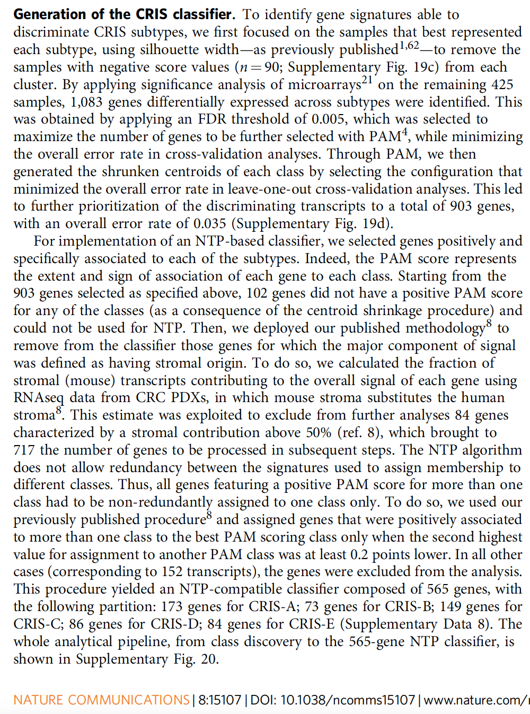
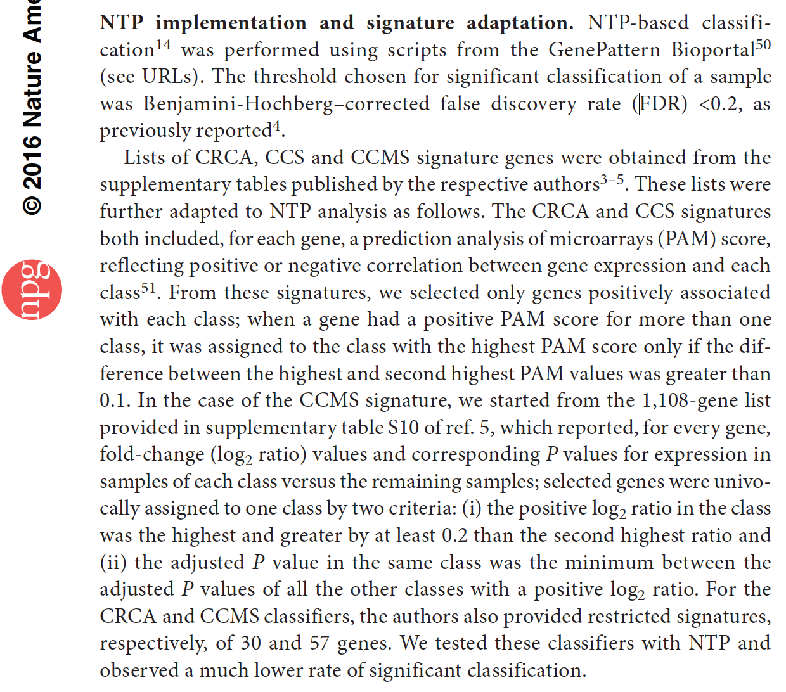
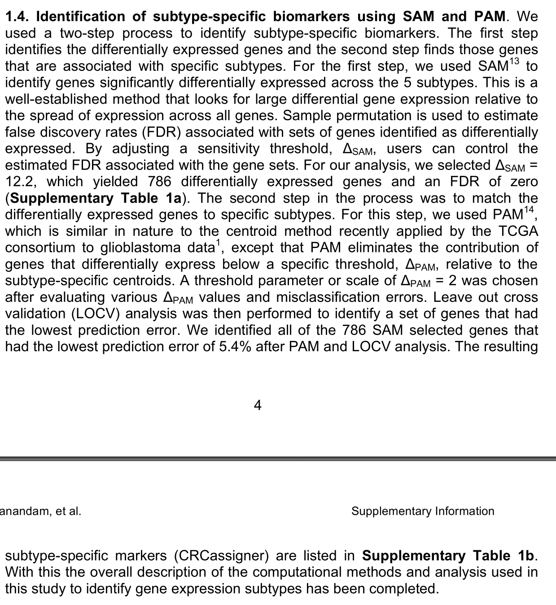

**Author(s)**: `r params$author`  
**Reviewer(s)**: `r params$reviewer`  
**Date**: `r params$date` 

# Academic Citation
If you use this code in your work or research, we kindly request that you cite our publication:
  
Xiaofan Lu, et al. (2025). FigureYa: A Standardized Visualization Framework for Enhancing Biomedical Data Interpretation and Research Efficiency. iMetaMed. https://doi.org/10.1002/imm3.70005


```{r setup, include=FALSE}
knitr::opts_chunk$set(echo = TRUE)
```

# 需求描述
# Demand description

我想实现个找出分子亚型中的特异marker并用NTP预测外部数据亚型的，分别是这两篇文章中的方法，作者是同一个人。

I want to identify specific markers in molecular subtypes and use NTP to predict the subtypes of external data, following the methods described in these two papers, which are authored by the same person.



出自：<https://www.nature.com/articles/ncomms15107>
  
Source: <https://www.nature.com/articles/ncomms15107>
  


出自：<https://www.nature.com/articles/ng.3224>
  
就是从表达谱数据已知样本分型情况下，找出每个亚型特异的marker，再用NTP预测亚型，其中的PAM过程不懂。

这篇文章也是差不多的方法，方法写在文章附件里：

Source: <https://www.nature.com/articles/ng.3224>
  
It involves identifying subtype-specific markers from expression profile data with known sample classifications, then using NTP (Nearest Template Prediction) to predict subtypes—though I don’t fully understand the PAM (Prediction Analysis of Microarrays) step.

This paper uses a similar approach, with the methods detailed in the supplementary materials:
  


出自：<https://www.nature.com/articles/nm.3175>
  
MOVICS包其实有NTP预测亚型的，但是他是直接选亚型特异表达的靠前的基因，没有用PAM这些筛选方法。这里将实现用PAM筛选。

Source: <https://www.nature.com/articles/nm.3175>
  
The MOVICS package actually includes NTP-based subtype prediction, but it directly selects the top differentially expressed genes (DEGs) for each subtype without using filtering methods like PAM. Here, we will implement PAM-based gene selection.

# 应用场景
# Application scenarios

利用PAM算法根据某感兴趣分类筛选特异性marker，生成模版后利用NTP算法进行分类预测。

问题挺好的，用模型的方式找marker再预测，而不是直接定义前多少位高表达或低表达来构建marker。

参考资料见Literatures文件夹。

Using the PAM algorithm to screen for specific markers based on a classification of interest, then generating a template for NTP-based classification prediction.

This is a solid approach—using a model-based method to identify markers before prediction, rather than simply defining markers based on the top/bottom differentially expressed genes.

References available in the "Literatures" folder.

# 环境设置
# Environment Setup

使用国内镜像安装包。

Using domestic mirrors for package installation.

```{r}
source("install_dependencies.R")
source("CMScaller.R") # From CMScaller package, https://github.com/peterawe/CMScaller
source("replaceGeneId.R") # From CMScaller package, https://github.com/peterawe/CMScaller
library(CMScaller)
library(pamr)
library(cluster)

# 显示英文报错信息
# Show English error messages
Sys.setenv(LANGUAGE = "en") 

# 禁止chr转成factor
# Prevent character-to-factor conversion
options(stringsAsFactors = FALSE) 
```

# 输入文件
# Input Files

gse17536.expr.txt - GEO结直肠癌表达谱文件。/ A GEO colorectal cancer expression profile file.

```{r}
# 读取GEO结直肠癌表达谱文件
# Read GEO colorectal cancer expression profile file
expr <- read.delim(file = "gse17536.expr.txt",sep = "\t",row.names = 1,check.names = F,stringsAsFactors = F,header = T)

# 对行名进行标准化，重复基因取均值
# Standardize row names - take mean for duplicate genes
expr$gene <- sapply(strsplit(rownames(expr)," /// "), "[",1)
expr <- apply(expr[,setdiff(colnames(expr), "gene")], 2, function(x) tapply(x, INDEX=factor(expr$gene), FUN=mean, na.rm=TRUE))
expr <- as.data.frame(expr)
```

# 利用PAM算法筛选特异性marker
# Using PAM algorithm to identify specific markers

```{r}
# 先使用CMScaller算法内置的模版来确定该结直肠癌的分型（默认为金标准）
# First use the built-in template from CMScaller algorithm to determine colorectal cancer subtypes (default as gold standard)
cms.true <- CMScaller(
  emat = t(scale(t(expr), center = T, scale = T)), 
  templates = CMScaller::templates.CMS, 
  rowNames = "symbol", 
  RNAseq = FALSE, 
  nPerm = 1000, 
  seed = 123456, 
  FDR = 1, 
  doPlot = TRUE,
  verbose = TRUE
)
cms.df <- data.frame(samID = colnames(expr),
                     CMS.true = as.character(cms.true$prediction),
                     row.names = colnames(expr))

# 构建PAM算法所需要的输入
# Prepare input data structure for PAM algorithm
mydata <- list(x = as.matrix(expr),     
               y = cms.df$CMS,          
               geneid = rownames(expr)) 

# 生成pam score
# Generate pam scores

# 训练模型
# Train model
pam.res <- pamr.train(mydata) 

# 交叉验证选择最优阈值
# Cross-validation to select optimal threshold
pam.res.cv <- pamr.cv(fit = pam.res, data = mydata)  

# 计算各特征的pam score
# Calculate pam scores for features
pam.score <- pamr.listgenes(fit = pam.res, data = mydata,  
                            threshold = pam.res.cv$threshold[which.min(pam.res.cv$error)])

# 保存到文件
# Save results to file
write.table(pam.score, "output_pam.score.txt", row.names = F, sep = "\t", quote = F)
```

# 利用NTP算法进行分类预测
# Performing classification prediction using NTP algorithm

自定义函数以读取pam矩阵，生成NTP模板。

Custom function to process PAM matrix and generate NTP template.

```{r fig.width=7, fig.height=7}
FilterPAM <- function(pam.df, probeCol = "id"){ 
  # pam.df：pamr生成的pam数据框,应当只保留特征名列和各类的pam得分
  # probeCol：pam.df中表征特征名称的列
  # pam.df: PAM-generated dataframe containing only feature names and PAM scores for each class
  # probeCol: Column name in pam.df representing feature identifiers
  pamCol <- match(setdiff(colnames(pam.df), probeCol), colnames(pam.df)) 
  
  # 基因的筛选标准
  # Gene filtering criteria
  keepGene <- apply(pam.df[, pamCol], 1, function(x){  
    x = sort(x, decreasing = T)
    
    # 保留只在一个类里pam得分为正的特征
    # Keep features with positive PAM score in only one class
    if (sum(x>0) == 1) return(T)
    
    # 保留即使有在多个类别里pam得分为正，但是最大值比第二大的值多超过0.1的特征
    # Keep features where maximum score exceeds second highest by >0.1
    else if (sum(x>0) > 1 & (x[1]-x[2])>0.1) return(T)    
    
    # 除此之外剔除
    # Otherwise discard
    else return(F)                                       
  })
  message(sum(keepGene), " genes are identified as predictors")
  
  # 剔除不保留的特征
  # Remove filtered-out features
  pam.df <- pam.df[keepGene, ]      
  
  # 重整为基因-特征-pam得分列表
  # Reshape to gene-feature-score format
  pam.df <- reshape2::melt(pam.df, id.vars = probeCol)   
  
  pam.df <- dplyr::arrange(pam.df, -pam.df$value)
  
  # 保留各基因pam得分最高的类别
  # Retain highest-scoring class per gene
  pam.df <- pam.df[!duplicated(pam.df[[probeCol[1]]]), -ncol(pam.df)] 
  
  colnames(pam.df) <- c("probe", "class")
  return(pam.df)
}
```

使用FilterPAM函数将pam score转化为NTP模板

Convert PAM scores to NTP templates using FilterPAM function

```{r}
# 读取pam.score（不读取可能导致数据存在双引号，运行函数会报错）
# Read PAM scores (must read with header=T to avoid quotation mark issues that may cause function errors)
pam.score <- read.table("output_pam.score.txt", sep = "\t", header = T) 

# 将pam score转化为NTP模板
# Transform PAM scores into NTP templates
templates <- FilterPAM(pam.df = pam.score, probeCol = c("id"))
table(templates$class)
```

应用此时构建的模版，再次利用NTP进行预测

Apply the constructed template to perform NTP prediction again

```{r fig.width=7, fig.height=7}
# emat的行名，应当与模板的probe列为同一类型
# Row names of emat should match the probe column in templates
cms.pred <- ntp(emat = t(scale(t(expr), center = T, scale = T)), 
                templates = templates, 
                nPerm = 1000,
                seed = 123456,
                doPlot = TRUE,
                verbose = TRUE
)
dev.copy2pdf(file = "ntpheatmap using pam selected template.pdf", width = 5,height = 5)

cms.df$CMS.pred <- as.character(cms.pred$prediction)

 # 基因完美预测
# Perfect gene prediction
table(cms.df$CMS.true, cms.df$CMS.pred)
```

# Session Info

```{r}
sessionInfo()
```
