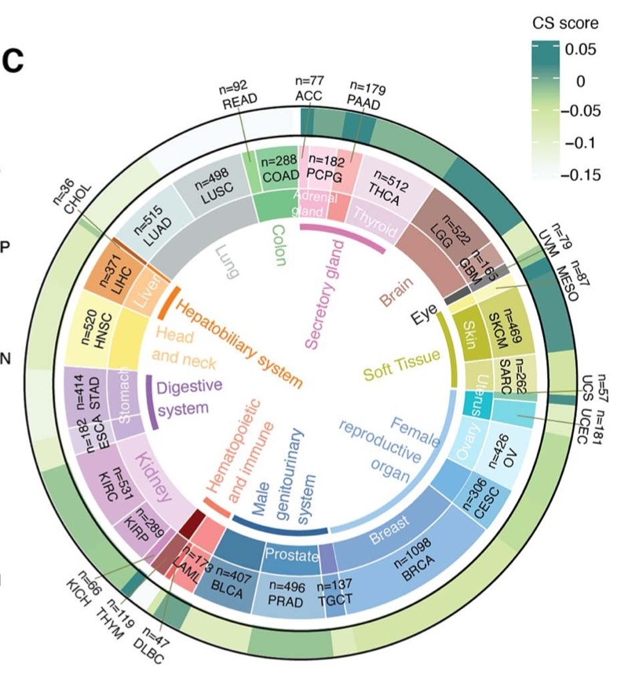

**Author(s)**: `r params$author`  
**Reviewer(s)**: `r params$reviewer`  
**Date**: `r Sys.Date()` 

# Academic Citation
If you use this code in your work or research, we kindly request that you cite our publication:

Xiaofan Lu, et al. (2025). FigureYa: A Standardized Visualization Framework for Enhancing Biomedical Data Interpretation and Research Efficiency. iMetaMed. https://doi.org/10.1002/imm3.70005

If you use circlize in published research, please cite:

Gu, Z. circlize implements and enhances circular visualization in R. Bioinformatics 2014.

If you use ComplexHeatmap in published research, please cite:

Zuguang Gu, et al., Complex heatmaps reveal patterns and correlations in multidimensional genomic data, Bioinformatics, 2016.

Zuguang Gu. Complex Heatmap Visualization, iMeta, 2022.

```{r setup, include=FALSE}
knitr::opts_chunk$set(echo = TRUE)
```

# 需求描述
# Demand description

绘制下图。

Draw the following figure.



出自：<https://academic.oup.com/bib/article/23/3/bbac118/6567704?login=true>

图1. 癌症与组织中衰老水平的综合量化分析。
（C）各癌症类型的平均细胞衰老（CS）评分。从内圈到外圈依次展示组织类型、癌症类型以及平均细胞衰老（CS）评分。

Source: <https://academic.oup.com/bib/article/23/3/bbac118/6567704?login=true>

Figure1. Comprehensive quantification of senescence levels in cancers and tissues.
(C) Average CS scores in individual cancer types. Tissue types, cancer types and average CS scores are shown from the inner circle to the outer circle.

# 应用场景
# Application Scenarios

在泛癌中根据组织类别、特定评分，绘制弦图。

- Figure 4F ligand–receptorinteractions，可参考FigureYa178ReceptorLigand
- Figure 6B，可参考FigureYa35批量bestSeparation
- Figure 6E Consensus clustering，可参考FigureYa202consensusGene
- FigureYa 6G Sankey diagram，可参考FigureYa25sankey
- FigureYa 6H Hierarchical clustering of GSEA scores，可参考FigureYa71ssGSEA

Draw chord diagrams in pan-cancer based on tissue categories and specific scores.

- Figure 4F ligand–receptor interactions, see FigureYa178ReceptorLigand
- Figure 6B, see FigureYa35 batch bestSeparation
- Figure 6E Consensus clustering, see FigureYa202consensusGene
- FigureYa 6G Sankey diagram, see FigureYa25sankey
- FigureYa 6H Hierarchical clustering of GSEA scores, see FigureYa71ssGSEA

# 环境设置
# Environment Setup

```{r}
# 加载依赖安装脚本
# Load dependency installation script
source("install_dependencies.R")

# 加载所需的R包
# Load required R packages
library(circlize)        # 用于绘制环形图 # For creating circular plots
library(ComplexHeatmap)  # 用于绘制复杂热图 # For creating complex heatmaps

# 设置环境变量
# Set environment variables
Sys.setenv(LANGUAGE = "en") # 显示英文报错信息 # Show English error messages

# 禁止字符型数据自动转换为因子型
# Prevent automatic conversion of character data to factors
options(stringsAsFactors = FALSE)
```

# 输入文件的生成
# Generate Input Files

easy_input.xlsx:
Here, the CS.score values in the figure are randomly generated and can be replaced with any other values you are interested in.
If you still want to draw a pancancer plot, keep all the preceding columns unchanged and only modify the values in the last column (CS.score).
This is not limited to displaying pancancer data. Once you understand the code for plotting, you can use it flexibly.

easy_input.xlsx: 这里随机生成图中的得分CS.score，可替换成你自己感兴趣的其他数值。
如果还是画pancancer图，前面各列可以保持不变，只改变最后一列CS.score里的数值。
不限于展示pancancer数据，读懂画图部分的代码，就可以灵活运用。

```{r eval=FALSE}
## 输入队列信息（队列名称、各队列样本数、需要绘制的得分）
## Input cohort information (cohort name, number of samples per cohort, scores to be plotted)
CohortInfo <- data.frame(
  "Cohort" = c("ACC", "PCPG", "PAAD", "THCA", "LGG", "GBM", "UVM", "MESO",
               "SKCM", "SARC", "UCS", "UCEC", "OV", "CESC", "BRCA", "TGCT",
               "PRAD", "BLCA", "LAML", "DLBC", "THYM", "KICH", "KIRP", "KIRC",
               "ESCA", "STAD", "HNSC", "LIHC", "CHOL", "LUAD", "LUSC", "READ", "COAD"),
  "Number" = c(77, 182, 179, 512, 522, 165, 79, 87,
               469, 262, 57, 181, 426, 306, 1098, 137,
               496, 407, 173, 47, 119, 66, 289, 531,
               182, 414, 520, 371, 36, 515, 498, 92, 288),
  "CS.score" = runif(33) 
)
Class1 <- c("ACC" = "Secretory gland", "PCPG" = "Secretory gland", "PAAD" = "Secretory gland", "THCA" = "Secretory gland",
            "MESO" = "Soft Tissue", "SKCM" = "Soft Tissue", "SARC" = "Soft Tissue", 
            "UCS" = "Female\nreproductive\norgan", "UCEC" = "Female\nreproductive\norgan",
            "OV" = "Female\nreproductive\norgan", "CESC" = "Female reproductive\norgan",
            "BRCA" = "Female\nreproductive organ", "TGCT" = "Male genitourinary system",
            "PRAD" = "Male genitourinary system", "BLCA" = "Male genitourinary system",
            "LAML" = "Hematopoietic\nand immune", "DLBC" = "Hematopoietic\nand immune", 
            "THYM" = "Hematopoietic\nand immune", "ESCA" = "Digestive\nsystem", 
            "STAD" = "Digestive\nsystem", "HNSC" = "Head and neck", "LIHC" = "Hepatobiliary system")
Class2 <- c("ACC" = "Adrenal\ngland", "PCPG" = "Adrenal\ngland", "THCA" = "Thyroid",
            "LGG" = "Brain", "GBM" = "Brain", "UVM" = "Eye", "SKCM" = "Skin", 
            "UCS" = "Uterus", "UCEC" = "Uterus", "OV" = "Ovary", 
            "BRCA" = "Breast", "PRAD" = "Prostate", "KIRP" = "Kidney", "KIRC" = "Kidney",
            "ESCA" = "Stomach", "STAD" = "Stomach", "HNSC" = "Head\nand neck", "LIHC" = "Liver",
            "LUAD" = "Lung", "LUSC" = "Lung", "READ" = "Colon", "COAD" = "Colon")

## 转换为样本信息（每个样本为一行）
## 注意安排好队列顺序，保证同类队列相邻
## Cohort、Class1和Class2用于区分不同分区
## CohortLabel、Class1Label和Class2Label用于绘制标识文字
## Convert to sample-level information (one row per sample)
## Note: Arrange cohorts properly to ensure cohorts of the same type are adjacent
## Cohort, Class1 and Class2 are used for partitioning different groups
## CohortLabel, Class1Label and Class2Label are used for plotting annotation text
SampleInfo <- data.frame("Cohort" = rep(CohortInfo$Cohort, CohortInfo$Number))
rownames(SampleInfo) = paste0("Sample", 1:nrow(SampleInfo))
SampleInfo$Class1 <- plyr::mapvalues(x = SampleInfo$Cohort, from = names(Class1), to = Class1)
SampleInfo$Class1 <- ifelse(test = SampleInfo$Class1%in%Class1, yes = SampleInfo$Class1, no = NA)
SampleInfo$Class2 <- plyr::mapvalues(x = SampleInfo$Cohort, from = names(Class2), to = Class2)
SampleInfo$CohortLabel <- paste0("n=", CohortInfo$Number[match(SampleInfo$Cohort, CohortInfo$Cohort)], "\n", SampleInfo$Cohort)
SampleInfo$Class1Label <- ifelse(test = SampleInfo$Class1%in%Class1, yes = SampleInfo$Class1, no = NA)
SampleInfo$Class2Label <- ifelse(test = SampleInfo$Class2%in%Class2, yes = SampleInfo$Class2, no = NA)
SampleInfo$CS.score <- CohortInfo$CS.score[match(SampleInfo$Cohort, CohortInfo$Cohort)]
openxlsx::write.xlsx(SampleInfo, "easy_input.xlsx")
```

读取输入文件

Load input files

```{r}
SampleInfo <- openxlsx::read.xlsx("easy_input.xlsx")
head(SampleInfo)
```

# 开始画图
# Plotting

颜色配置

Color configuration

```{r}
## 指示各环对应颜色
## Colors corresponding to each cohort (ring)
Cohort.Col <- c("ACC" = "#F5CCDC", "PCPG" = "#FED9EA", "PAAD" = "#F6B5B6", "THCA" = "#EEDEED",
                "LGG" = "#AE8780", "GBM" = "#C59B95", "UVM" = "#7B7C75", "MESO" = "#F7F7BC",
                "SKCM" = "#D0D36F", "SARC" = "#E5E6AB", "UCS" = "#88C4A8", "UCEC" = "#79D9E4",
                "OV" = "#D8F3FA", "CESC" = "#83C3E4", "BRCA" = "#91BBE5", "TGCT" = "#71A5D0",
                "PRAD" = "#76A3CC", "BLCA" = "#A0C2DD", "LAML" = "#F7908F", "DLBC" = "#ED5C64", 
                "THYM" = "#A55A5E", "KICH" = "#CE8BC0", "KIRP" = "#D2ACD1", "KIRC" = "#D8B4D5",
                "ESCA" = "#DECEE8", "STAD" = "#CAB4D8", "HNSC" = "#FBF7B8", "LIHC" = "#F0A363",
                "CHOL" = "#AA5F39", "LUAD" = "#D7E7E7", "LUSC" = "#CCD4D6", "READ" = "#98D38F",
                "COAD" = "#8BCF9D")

Class1.Col <- c("Secretory gland" = "#D079AB",
                "Soft Tissue" = "#B4B350",
                "Female\nreproductive\norgan" = "#A3C4E3",
                "Male genitourinary system" = "#38679A",
                "Hematopoietic\nand immune" = "#EA7C67",
                "Digestive\nsystem" = "#8F65A9",
                "Hepatobiliary system" = "#EC7F29")

Class2.Col <- c("Adrenal\ngland" = "#F6B7D0", "Thyroid" = "#E6CEE0",
                "Brain" = "#C28C83", "Eye" = "#585D5B",
                "Skin" = "#BCBD30", "Uterus" = "#21C2CE",
                "Ovary" = "#B6EDF9", "Breast" = "#7FA7D4",
                "Prostate" = "#5193BF", "Kidney" = "#EDD5EB",
                "Stomach" = "#C6B0D6", "Head\nand neck" = "#FDEA7E",
                "Liver" = '#FCC88F', "Lung" = "#BBC0C3",
                "Colon" = "#76C48A")

Col = c(Cohort.Col, Class1.Col, Class2.Col)

#连续变量所使用的颜色
# Gradient colors for continuous values
CS.Col = colorRamp2(breaks = c(0, 0.5, 1), c("#F7FBFC", "#CFE5A4", "#358988"))
```

自定义函数，用于批量标注颜色和标签

Custom function for batch annotation of colors and labels

```{r}
## 用于批量标注颜色和标签的函数
## Function for batch labeling of colors and labels
SectorColor <- function(sector, col, track.index, sampleInfo, currentCol, standardCol = "Cohort", ...){
  
  ## sector：需要绘制的区域（可为多个区域）
  ## col：区域所绘制的颜色
  ## track.index：在第几环（从外向内数）绘制
  ## sampleInfo：样本信息
  ## currentCol：绘制区域（sector）使用的哪一列的分类方法
  ## standardCol：样本最基础的分类列（通常即为队列来源）
  ## sector: The regions to be colored (can be multiple regions)
  ## col: The color to fill the regions
  ## track.index: The ring number (counting from outside to inside) where the coloring is applied
  ## sampleInfo: Sample information data frame
  ## currentCol: The classification column used for the current sectors being colored
  ## standardCol: The most basic classification column for samples (usually the cohort source)
  cohorts.to.plot = unique(SampleInfo[[standardCol]][SampleInfo[[currentCol]] %in% sector])
  st.degree = max(unlist(lapply(cohorts.to.plot, get.cell.meta.data, name = "cell.start.degree")))
  ed.degree = min(unlist(lapply(cohorts.to.plot, get.cell.meta.data, name = "cell.end.degree")))
  
  draw.sector(start.degree = st.degree, end.degree = ed.degree,
              rou1 = get.cell.meta.data("cell.top.radius", track.index = track.index),
              rou2 = get.cell.meta.data("cell.bottom.radius", track.index = track.index),
              col = col[sector], ...)
}

SectorLabel <- function(sector, col, track.index, sampleInfo, currentCol, standardCol = "Cohort", niceFacing = T, ...){
  
  ## sector：需要绘制的区域（可为多个区域）
  ## col：区域所绘制的颜色
  ## track.index：在第几环（从外向内数）绘制
  ## sampleInfo：样本信息
  ## currentCol：绘制区域（sector）使用的哪一列的分类方法
  ## standardCol：样本最基础的分类列（通常即为队列来源）
  ## niceFacing：是否自动调整样本角度
  ## sector: The regions to be labeled (can be multiple regions)
  ## col: The color of the labels
  ## track.index: The ring number (counting from outside to inside) where the labels are placed
  ## sampleInfo: Sample information data frame
  ## currentCol: The classification column used for the current sectors being labeled
  ## standardCol: The most basic classification column for samples (usually the cohort source)
  ## niceFacing: Whether to automatically adjust label orientation
  plot.data = sampleInfo[sampleInfo[[currentCol]] %in% sector, ]
  plot.data = plot.data[round(0.5*nrow(plot.data)), ]
  circos.text(x = plot.data$ID, y = 0.5, labels = sector, sector.index = plot.data$Cohort, track.index = track.index, col = col, niceFacing = niceFacing, ...)
}
```

绘制图

Plot the diagram

```{r fig.width=10, fig.height=10}
# 将Cohort转为因子变量，保证顺序不乱
# Convert Cohort to a factor to maintain the order of categories
SampleInfo$Cohort <- factor(SampleInfo$Cohort, levels = unique(SampleInfo$Cohort)) 

# 手动编序号，以便后续打标签时确定位置
# Manually assign sequential IDs for each sample to facilitate label positioning later
SampleInfo$ID <- 1:nrow(SampleInfo) 

### 初始化
### Initialization
circos.par("cell.padding" = c(0.02, 0.00, 0.02, 0.00), "start.degree" = 90) 
circos.initialize(sectors = SampleInfo$Cohort, x = SampleInfo$ID) 

### 第一环：连续变量，对每一个样本分别绘制热图，通过col参数调整所绘制的列和需要的配色
### First ring: Continuous variable. For each sample, draw a heatmap individually, adjusting columns and colors via the col paramete.
circos.trackPlotRegion(ylim = c(0, 1), track.height = 0.05, cell.padding = c(0, 1))
for (i in 1:nrow(SampleInfo)) circos.rect(xleft = SampleInfo$ID[i], xright = SampleInfo$ID[i]+1, ybottom = 0, ytop = 1, 
                                          sector.index = SampleInfo$Cohort[i], track.index = 1, border = NA, col = CS.Col(SampleInfo$CS.score[i]))

### 第二环：分类变量，为最基础的队列信息，所使用的颜色存储在Col中
### Second ring: Categorical variable. The most basic cohort information is displayed here, using colors stored in Col.
circos.trackPlotRegion(ylim = c(0, 1), track.height = 0.2)
circos.trackPlotRegion(ylim = c(0, 1), track.height = 0.2)
for (i in unique(SampleInfo$Cohort)) SectorColor(sector = i, col = Col, track.index = 2, sampleInfo = SampleInfo, currentCol = "Cohort") 
for (i in unique(SampleInfo$CohortLabel)) SectorLabel(sector = i, col = "black", track.index = 2, sampleInfo = SampleInfo, currentCol = "CohortLabel") 

### 第三环：分类变量，所使用的颜色存储在Col中
### Third ring: Categorical variable. Colors are also retrieved from Col.
circos.trackPlotRegion(ylim = c(0, 1), track.height = 0.2)
for (i in unique(SampleInfo$Class2)) SectorColor(sector = i, col = Col, track.index = 3, sampleInfo = SampleInfo, currentCol = "Class2") 
for (i in unique(SampleInfo$Class2Label)) SectorLabel(sector = i, col = "white", track.index = 3, sampleInfo = SampleInfo, currentCol = "Class2Label")

### 第四环：分类变量，所使用的颜色存储在Col中
#### 此处仿照原图对文字进行了调整
#### niceFacing = F：不自动调整文字角度（自动调整会使得部分文字向环外延申）
#### facing = "clockwise"：使文字垂直于环形
#### pos = 2：文字右对齐
### Fourth ring: Categorical variable.Colors are also retrieved from Col
#### Adjustments were made to the text similar to the original figure
#### niceFacing = F: Do not automatically adjust text angle (automatic adjustment may cause some text to extend outward)
#### facing = "clockwise": Align text vertically with the ring
#### pos = 2: Right-align the text
circos.trackPlotRegion(ylim = c(0, 1), track.height = 0.05, bg.lty = "blank")
for (i in unique(SampleInfo$Class1)) SectorColor(sector = i, col = Col, track.index = 4, sampleInfo = SampleInfo, currentCol = "Class1", lty = "blank") 
for (i in unique(SampleInfo$Class1Label)) SectorLabel(sector = i, col = "black", track.index = 4, sampleInfo = SampleInfo, currentCol = "Class1Label", niceFacing = F, facing = "clockwise", pos = 2) 
circos.clear()

#### 添加连续变量的图例
#### Add legend for the continuous variable
lgd = Legend(col_fun = CS.Col, title = "CS.score")
draw(lgd, x = unit(0.9, "npc"), y = unit(0.1, "npc"))
dev.copy2pdf(file = "pancircos.pdf", width = 10, height = 10)
```

# 后期加工
# Post-processing

有些type的样本量较少，文字会重叠，可参考例文的方式调整。输出的pdf文件是矢量图，可以用Illustrator等矢量图编辑器打开，编辑文字的位置，增加指示线。

For some types of samples with a small sample size, the text may overlap. You can refer to the example text for adjustment. The output PDF file is a vector graphic, which can be opened with vector graphic editors such as Adobe Illustrator. You can edit the position of the text and add guide lines.

# Session Info

```{r}
sessionInfo()
```
