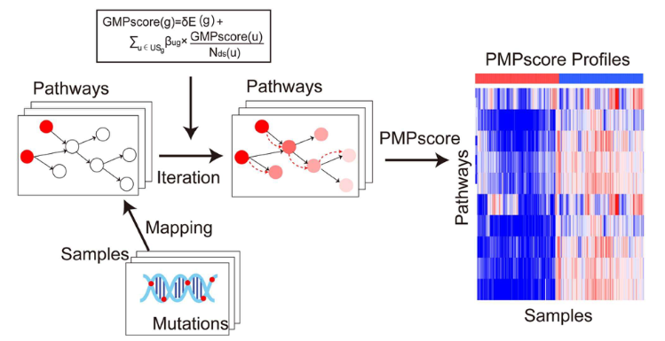

**Author(s)**: `r params$author`  
**Reviewer(s)**: `r params$reviewer`  
**Date**: `r Sys.Date()` 

# Academic Citation
If you use this code in your work or research, we kindly request that you cite our publication:

Xiaofan Lu, et al. (2025). FigureYa: A Standardized Visualization Framework for Enhancing Biomedical Data Interpretation and Research Efficiency. iMetaMed. https://doi.org/10.1002/imm3.70005

```{r setup, include=FALSE}
knitr::opts_chunk$set(echo = TRUE)
```

# 需求描述
# Demand description

计算PMAPscore。这篇文章只计算了120+个信号通路，如果用全外数据，代谢等相关的基因也可能是会有突变的，所以能否把KEGG的所有通路都包含进去，这样用WES的话，能计算的信号通路就会增加到200+。

Calculate PMAP score. This article only calculated 120+ signaling pathways. If whole-exome sequencing (WES) data is used, genes related to metabolism and other functions may also have mutations. Therefore, could all KEGG pathways be included? This way, when using WES, the number of calculable signaling pathways would increase to 200+.



出自：<https://academic.oup.com/bib/article-abstract/23/5/bbac360/6691915?redirectedFrom=fulltext&login=false>

图1. iPMP方法流程图。

Source: <https://academic.oup.com/bib/article-abstract/23/5/bbac360/6691915?redirectedFrom=fulltext&login=false>

Figure 1. Flowchart of iPMP method.

# 应用场景
# Application scenarios

计算PMAP得分，增加了全部KEGG通路到这个计算中。

他计算的时候只关心有哪些基因出现了突变，将发生突变的基因数，根据他们在KEGG通路网上的位置，进行加权求和。

这个PMAPscore需要的通路信息格式得是kgml，所以msigdb的基因集是不能直接用在这上面的。所以增加了批量下载kgml文件，并读取为R对象，以及应用到PMAP计算的代码。

Calculate PMAP score, added all KEGG pathways to this calculation.

It only cares which genes have mutations during calculation, weights and sums the number of mutated genes based on their positions in the KEGG pathway network.

The PMAPscore requires pathway information in kgml format, so MSigDB gene sets cannot be directly used here. Therefore, added code to batch download kgml files, read them as R objects, and apply them to PMAP calculations.

# 环境设置
# Environment Setup

```{r}
source("install_dependencies.R")

library(PMAPscore)
library(ComplexHeatmap)
library(KEGGREST)
library(SPIA)

# 修正的源代码
# Corrected source code
source("utils.R") 

options(timeout=500)

# 显示英文报错信息
# Show English error messages
Sys.setenv(LANGUAGE = "en") 

# 禁止chr转成factor
# Prevent character-to-factor conversion
options(stringsAsFactors = FALSE) 
```

# 输入文件
# Input Files

以PMAPscore自带数据为例：

- maffile：一个存储队列突变信息的maf对象
- gene_Ucox_res：各基因单变量cox回归结果，包括HR和置信区间
- sur：患者的生存情况，行名应与maf_data的样本名称一致，包括STATUS和TIME两列
- gene_symbol_Entrez：Gene SYMBOL和EntrezID的对应表
- roc_data：存放样本分组信息，至少需要sample、response两列

Taking the built-in data of PMAPscore as an example:

- maffile: A MAF object storing mutation information of the cohort
- gene_Ucox_res: Univariate Cox regression results for each gene, including HR and confidence intervals
- sur: Patient survival data (row names should match sample names in maf_data), containing STATUS and TIME columns
- gene_symbol_Entrez: Mapping table between Gene SYMBOL and Entrez ID
- roc_data: Sample grouping information, requiring at least sample and response columns

```{r}
# 加载数据
# Load data
data("maffile", "gene_Ucox_res", "sur", "gene_symbol_Entrez", "roc_data")

# 清理数据
# Clean data
maf_data <- maffile@data[, c("Hugo_Symbol", "Variant_Classification", "Tumor_Sample_Barcode")]
# maf_data <- maf_data[maf_data$Hugo_Symbol %in% intersect(rownames(gene_Ucox_res), gene_symbol_Entrez$Hugo_Symbol), ]
patient <- intersect(rownames(sur), unique(maf_data$Tumor_Sample_Barcode))
maf_data <- maf_data[maf_data$Tumor_Sample_Barcode %in% patient, ]
# gene_Ucox_res <- gene_Ucox_res[, "HR"]
sur <- sur[patient, ]
roc_data <- as.data.frame(roc_data[, c("sample", "response")])
```

# 下载并生成KEGG通路基因集，只需运行一次
# Download and generate KEGG pathway gene sets (only need to run once)

```{r eval=FALSE}
id <- unique(keggLink("pathway", "hsa"))
id <- gsub("path:", "", id)
for (x in id){
  if (!file.exists(file.path("Inputdata", "KEGG", paste0(x, ".xml")))){
    download.file(url = file.path("https://rest.kegg.jp/get", x, "kgml"),
                  destfile = file.path("Inputdata", "KEGG", paste0(x, ".xml")), quiet = T)
  }
  
  # 避免下载次数过多导致服务器拒绝访问
  # Avoid server access denial due to excessive download requests
  Sys.sleep(0.2) 
}

## 将kgml格式的通路文件转换为Rdata
## Convert kgml format pathway files to Rdata
makeSPIAdata(kgml.path = "InputData/KEGG", organism = "hsa", out.path = "InputData")
```

# 计算签名
# Calculate signature

```{r}
# 设置所用基因集为自定义基因集
# Set custom gene sets as the gene sets to be used
data.dir = "InputData/"

## 整理突变信息，转换为基因×样本的矩阵
## Organize mutation information and convert to gene×sample matrix
mut_status <- get_mut_status(maf_data = maf_data,  
                             nonsynonymous = TRUE) 

## 计算各通路的突变相关评分
## Calculate mutation-associated scores for each pathway
pfs_score <- get_pfs_score(mut_status = mut_status,                 
                           percent = 0.03,                          
                           gene_Ucox_res = gene_Ucox_res,           
                           gene_symbol_Entrez = gene_symbol_Entrez, 
                           verbose = F,
                           data.dir = data.dir)                    

## 生成预后相关的签名
## Generate prognostic signature
final_signature <- get_final_signature(pfs_score = pfs_score,  
                                       sur = sur)              

## 计算风险得分（multiple_score列）
## Calculate risk score (multiple_score column)s
km_data <- neo_get_km_data(mut_sam = mut_status,               
                           gene_Ucox = gene_Ucox_res,           
                           symbol_Entrez = gene_symbol_Entrez,  
                           sur = sur,                           
                           path_Ucox_mul = NULL,                
                           sig = final_signature,               
                           TRAIN = T,                           
                           data.dir = data.dir)                           

## 划分高低分组
## Divide into high/low risk groups
cls <- neo_get_sam_cla(km_data = km_data,    
                       cut_off = -0.986)      
```

# 开始画图
# Plotting

```{r}
## 绘制KM曲线图
## Plot KM survival curve
get_km_survival_curve(km_data = km_data, TRAIN = TRUE, risk.table=TRUE) 
dev.copy2pdf(file = "km_curve.pdf", width = 5, height = 5)

## 绘制ROC曲线图
## Plot ROC curve
roc_data$risk_score <- km_data$multiple_score
get_roc_curve(roc_data, print.auc = TRUE, main = "Objective Response") 
dev.copy2pdf(file = "roc_curve.pdf", width = 5, height = 5)

## 绘制OncoPlot
## Generate OncoPlot
load(file = file.path(system.file("extdata", package = "PMAPscore"), "hsaSPIA.RData"))   
load(file = file.path(data.dir, "hsaSPIA.RData"))                                       
path_gene <- getPathGene(path.info = path.info, gene_symbol_Entrez = gene_symbol_Entrez) 
risk_score <- km_data$multiple_score
names(risk_score) <- rownames(km_data)
cut_off <- median(risk_score)
get_Oncoplots(maffile = maffile,                 
              path_gene = path_gene,            
              mut_status = mut_status,            
              risk_score = risk_score,            
              cut_off = cut_off,                  
              final_signature = final_signature,  
              pathway_name = "Gap junction")      
dev.copy2pdf(file = "Oncoplots.pdf", width = 8, height = 6)

## 绘制风险得分热图
## Generate risk score heatmap
plot.data <- km_data

# 按照风险评分升序排列
# Sort by risk score (ascending) 
plot.data <- dplyr::arrange(plot.data, plot.data$multiple_score)                  
# 制作列注释信息
# Prepare column annotations
annCol <- plot.data[, c("event", "survival", "multiple_score")]                 
plot.data <- plot.data[, setdiff(colnames(plot.data), colnames(annCol))]   

# 从绘图数据剔除列注释信息
# Remove annotation columns from plot data
annCol$survival = NULL
annColor <- list()                                                              

# 指定列注释颜色
# Define annotation colors
annColor[["event"]] = setNames(object = c("white", "black"), nm = c("0", "1"))
annColor[["multiple_score"]] = colorRampPalette(c("#F7FBFF", "#2171B5"))(100)

plot.data <- t((plot.data))
range = min(apply(plot.data, 1, max))   

# 作为热图主矩阵的上限
# Set as upper limit for heatmap
plot.data[plot.data>range] = range      

pheatmap(mat = plot.data, 
         color = colorRampPalette(c("#440259","#345F8C","#228C8A","#78CE51","#FAE71F"))(100), 
         show_rownames = T, show_colnames = F,       
         cluster_cols = F, cluster_rows = T,        
         annotation_col = annCol, 
         annotation_colors = annColor,
         name = "PFS score")
dev.copy2pdf(file = "PFSscore.Heatmap.pdf", width = 10, height = 6)
```

# Session Info

```{r}
sessionInfo()
```
