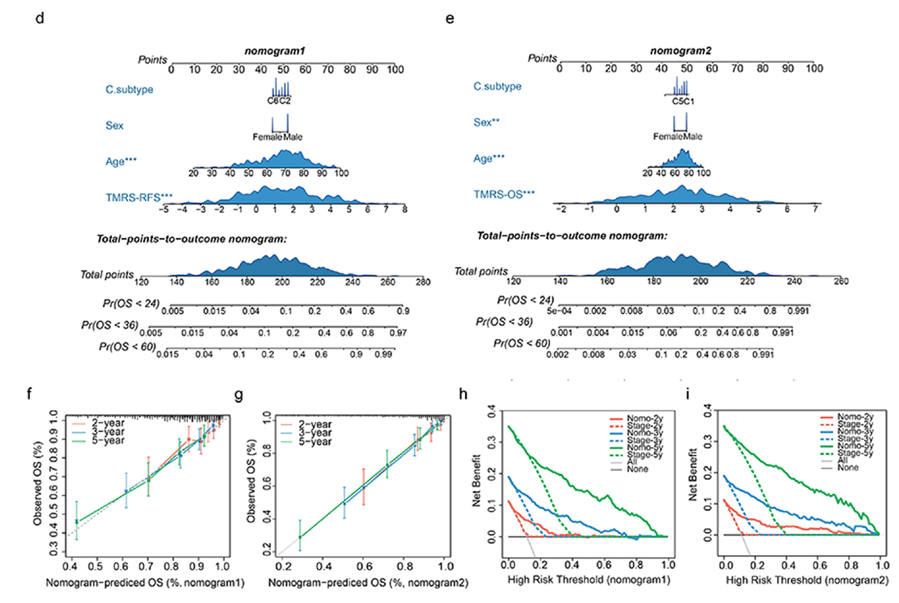

**Author(s)**: `r params$author`  
**Date**: `r Sys.Date()`  


# Academic Citation
If you use this code in your work or research, we kindly request that you cite our publication:

Xiaofan Lu, et al. (2025). FigureYa: A Standardized Visualization Framework for Enhancing Biomedical Data Interpretation and Research Efficiency. iMetaMed. https://doi.org/10.1002/imm3.70005

```{r setup, include=FALSE}
knitr::opts_chunk$set(echo = TRUE)
```

# 需求描述
# Requirement description

画出新型nomogram图（d）和对比曲线（f、g）

Draw the new nomogram (d) and comparison curves (f, g)



出自<https://linkinghub.elsevier.com/retrieve/pii/S2352396419301884>

图 3. (d-e) 基于 TMRS-RFS (d)、TMRS-OS (e) 和临床变量预测患者死亡率概率的列线图；(f-g) 图形描述了基于 TMRS-RFS (f) 和 TMRS-OS (g) 的列线图的校准情况，即预测结果与观察到的2年、3年和5年结果之间的一致性。相对于代表理想预测的45度线的曲线图显示了列线图的性能；（h-i）基于 TMRS-RFS（h）和 TMRS-OS （i）的列线图对2年、3年和5年风险的决策曲线分析。ADJC，辅助化疗；TMRS，肿瘤微环境风险评分；RFS，无复发生存率；OS，总生存率；Pr，概率；Nomo，列线图。

c森林图的画法可参考`FigureYa90subgroup`来画，h和i图可参考`FigureYa33DCA_update`。

from<https://linkinghub.elsevier.com/retrieve/pii/S2352396419301884>

Fig. 3. (d–e) Nomograms for predicting the probability of patient mortality based on TMRS-RFS (d), TMRS-OS (e) and clinical variables; (f–g) Plots depict the calibration of nomograms based on TMRS-RFS (f) and TMRS-OS (g) in terms of agreement between predicted and observed 2-year, 3-year, and 5-year outcomes. Nomogram performance is shown by the plot, relative to the 45-degree line, which represents the ideal prediction; (h–i) Decision curve analyses of the nomograms based on TMRS-RFS (h) and TMRS-OS (i) for 2-year, 3-year, and 5-year risk. ADJC, adjuvant chemotherapy; TMRS, tumour microenvironment risk score; RFS, relapse-free survival; OS, overall survival; Pr, probability; Nomo, nomogram.

The c forest plot can be drawn by referring to `FigureYa90subgroup`, and the h and i plots can be drawn by referring to `FigureYa33DCA_update`.

# 应用场景
# Application scenario

列线图（nomogram，诺莫图）是在平面直角坐标系中用一簇互不相交的线段表示多个独立变量之间函数关系的图。

将Logistic回归或Cox回归的结果进行可视化呈现，给出其发病风险或比例风险。

A nomogram is a graph that represents a functional relationship between multiple independent variables in a plane rectangular coordinate system using a cluster of disjointed line segments.

It visualizes the results of a Logistic regression or Cox regression, giving the risk or proportional risk of developing a disease.

# 环境设置
# Environment setting

```{r}
source("install_dependencies.R")

library(survival)
library(regplot)
library(rms)
library(nomogramEx)
Sys.setenv(LANGUAGE = "en") #显示英文报错信息 display English error messages
options(stringsAsFactors = FALSE) #禁止chr转成factor prohibit the conversion of chr to factor
```

# 输入文件
# Input file

至少要有临床信息`easy_input.csv`，还可以把`FigureYa31lasso`输出的`lasso_output.txt`作为一列添加进来。

At least include the clinical information `easy_input.csv`, and also add the `FigureYa31lasso` output `lasso_output.txt` as a column.

```{r}
pbc <- read.table("easy_input.txt")

pbc$catbili <- cut(pbc$bili, breaks = c(-Inf, 2, 4, Inf),
                   labels=c("low", "medium", "high"))
pbc$died <- pbc$status == 2

head(pbc)
```

# 画nomogram
# Draw nomogram

这里提供两种风格的nomogram画法，用到不同的包

Here are two styles of nomogram drawing, using different packages

## 经典版
## Classic Edition

```{r,message=FALSE,warning=FALSE,fig.width=10,fig.height=6}
dd <- datadist(pbc)
options(datadist="dd")
options(na.action="na.delete")
summary(pbc$time)
coxpbc <- cph(formula = Surv(time,died) ~  age + catbili + sex + copper + stage + trt ,data=pbc,x=T,y=T,surv = T,na.action=na.delete)  #,time.inc =2920

print(coxpbc)
surv <- Survival(coxpbc) 
surv3 <- function(x) surv(1825,x)
surv4 <- function(x) surv(2920,x)

x <- nomogram(coxpbc,fun = list(surv3,surv4),lp=T,
            funlabel = c('5-year survival Probability','8-year survival Probability'),
            maxscale = 100,fun.at = c(0.95,0.9,0.8,0.7,0.6,0.5,0.4,0.3,0.2,0.1))

pdf("nomogram_classical.pdf",width = 12,height = 10)
plot(x, lplabel="Linear Predictor",
     xfrac=.35,varname.label=TRUE, varname.label.sep="=", ia.space=.2, 
     tck=NA, tcl=-0.20, lmgp=0.3,
     points.label='Points', total.points.label='Total Points',
     total.sep.page=FALSE, 
     cap.labels=FALSE,cex.var = 1.6,cex.axis = 1.05,lwd=5,
     label.every = 1,col.grid = gray(c(0.8, 0.95)))
dev.off()
```


输出公式

output formula

```{r}
#print(x)
nomogramEx(nomo=x,np=2,digit = 9)
```

# 画新型nomogram
# Draw new nomogram

`regplot`可以交互式调整nomogram，代码更简单，输出的图形更漂亮。

把`regplot`那段代码粘贴到Console里，回车，就会在Plots窗口出现可以交互的图。

鼠标点击Esc或按键盘上的Esc可以退出交互模式。

**怎样保存图片？**

点击Export右侧的小三角形，Save as PDF...，保存为PDF文件。

`regplot` can interactively adjust the nomogram, the code is simpler, the output graph is more beautiful.

Paste the code `regplot` into Console, enter, then the interactive plot will appear in the Plots window.

You can exit the interactive mode by clicking Esc or pressing Esc on the keyboard.

**How do I save a picture? **

Click on the small triangle on the right side of Export, Save as PDF... The image will be saved as a PDF file.

```{r}
pbccox <- coxph(formula = Surv(time,died) ~  age + catbili + sex + 
                   copper + stage + trt , data = pbc)

regplot(pbccox,
        observation=pbc[2,], #对观测2的六个指标在列线图上进行计分展示，也可以不展示 the six indicators for Observation 2 can be scored and displayed on the nomogram, or they may not be displayed.
        points = TRUE, #如果为FALSE，则显示每个βx贡献的回归分数。否则，贡献将以 0-100 的“点数”刻度表示 If FALSE the regression scores of each βx contribution are shown. Otherwise contributions are represented by a 0-100 "points" scale.
        plots = c("density", #可选"no plot" "density" "boxes" "ecdf" "bars" "boxplot" "violin" "bean" "spikes" optional "no plot" "density" "boxes" "ecdf" "bars" "boxplot" "violin" "bean" "spikes"
                  "boxes"), #可选"no plot" "boxes" "bars" "spikes" optional "no plot" "boxes" "bars" "spikes"
        failtime = c(1095,1825), #预测3年和5年的死亡风险，此处单位是day predict the risk of death over 3 and 5 years, with the unit being days.
        subticks = TRUE, 
        #clickable=TRUE, #可以用鼠标点击 use the mouse to click
        prfail = TRUE, #cox回归中需要TRUE TRUE is required in cox regression
        showP = T, #是否展示统计学差异 whether to demonstrate statistical differences
        droplines = F,#观测2示例计分是否画线 Observation 2 example scoring whether or not to draw a line
        rank="range", #rank=“range ”表示βx的范围，rank=“sd ”表示βx的标准差 rank="range" is by the range of the βx's, and rank="sd" is by the standard deviation of the βx's. 
        interval="confidence") #展示观测的可信区间 demonstrate confidence intervals for observations
```

展示逻辑回归，支持"lm", "glm", "coxph", "survreg" "negbin"

可参考上图调参数

Demonstrate logistic regression, support "lm", "glm", "coxph", "survreg" "negbin"

You can refer to the above figure to adjust the parameters

```{r}
## 绘制逻辑回归图，显示几率表和置信区间
## Plot a logistic regression, showing odds scale and confidence interval
pbcglm <- glm(died ~  age + catbili + sex + copper, family = "binomial", data=pbc )

regplot(pbcglm, 
        observation=pbc[1,], 
        points = TRUE, 
        subticks = TRUE, 
        clickable=TRUE,
        odds=TRUE, 
        interval="confidence")
```

# 绘制calibration curve进行验证
# Plot calibration curve for validation

采用和nomogram一样的变量进行多因素cox回归

Perform multivariable Cox regression using the same variables as the nomogram

## 5年
## 5 years

```{r}
f5 <- cph(formula = Surv(time,died) ~  age + catbili + sex + copper +stage + trt,data=pbc,x=T,y=T,surv = T,na.action=na.delete,time.inc = 1825) 

#参数m=50表示每组50个样本进行重复计算
#the parameter m=50 means 50 samples in each group for repeated calculations
cal5 <- calibrate(f5, cmethod="KM", method="boot",u=1825,m=50,B=1000) 

pdf("calibration_5y.pdf",width = 8,height = 8)
plot(cal5,
     lwd = 2,#error bar的粗细 thickness of the error bar
     lty = 1,#error bar的类型，可以是0-6 type of the error bar, which can be 0-6.
     errbar.col = c("#2166AC"),#error bar的颜色 color of the error bar
     xlim = c(0,1),ylim= c(0,1),
     xlab = "Nomogram-prediced OS (%)",ylab = "Observed OS (%)",
     cex.lab=1.2, cex.axis=1, cex.main=1.2, cex.sub=0.6) #字的大小 font size
lines(cal5[,c('mean.predicted',"KM")], 
      type = 'b', #连线的类型，可以是"p","b","o" type of line, which can be “p”, “b”, “o”.
      lwd = 2, #连线的粗细 thickness of the line
      pch = 16, #点的形状，可以是0-20 shape of the point, which can be 0-20
      col = c("#2166AC")) #连线的颜色 color of the line
mtext("")
box(lwd = 1) #边框粗细 border thickness
abline(0,1,lty = 3, #对角线为虚线 diagonal lines are dashed
       lwd = 2, #对角线的粗细 diagonal thickness
       col = c("#224444")#对角线的颜色 diagonal color
       ) 
dev.off()
```


## 8年
## 8 years

```{r, fig.width=8,highlight=8}
f8 <- cph(formula = Surv(time,died) ~  age + catbili + sex + copper +stage + trt,data=pbc,x=T,y=T,surv = T,na.action=na.delete,time.inc = 2920) 
cal8 <- calibrate(f8, cmethod="KM", method="boot",u=2920,m=50,B=1000)

plot(cal8,
     lwd = 2,
     lty = 1,
     errbar.col = c("#B2182B"),
     xlim = c(0,1),ylim= c(0,1),
     xlab = "Nomogram-prediced OS (%)",ylab = "Observed OS (%)",
     col = c("#B2182B"),
     cex.lab=1.2,cex.axis=1, cex.main=1.2, cex.sub=0.6)
lines(cal8[,c('mean.predicted',"KM")],
      type= 'b',
      lwd = 2,
      col = c("#B2182B"),
      pch = 16)
mtext("")
box(lwd = 1)
abline(0,1,lty= 3,
       lwd = 2,
       col =c("#224444"))
```

## 同时展示两条curve
## Show two curves at the same time

```{r}
pdf("calibration_compare.pdf",width = 8,height = 8)
plot(cal5,lwd = 2,lty = 0,errbar.col = c("#2166AC"),
     bty = "l", #只画左边和下边框 draw only the left and lower borders
     xlim = c(0,1),ylim= c(0,1),
     xlab = "Nomogram-prediced OS (%)",ylab = "Observed OS (%)",
     col = c("#2166AC"),
     cex.lab=1.2,cex.axis=1, cex.main=1.2, cex.sub=0.6)
lines(cal5[,c('mean.predicted',"KM")],
      type = 'b', lwd = 1, col = c("#2166AC"), pch = 16)
mtext("")

plot(cal8,lwd = 2,lty = 0,errbar.col = c("#B2182B"),
     xlim = c(0,1),ylim= c(0,1),col = c("#B2182B"),add = T)
lines(cal8[,c('mean.predicted',"KM")],
      type = 'b', lwd = 1, col = c("#B2182B"), pch = 16)

abline(0,1, lwd = 2, lty = 3, col = c("#224444"))

legend("topleft", #图例的位置 location of the legend
       legend = c("5-year","8-year"), #图例文字 legend text
       col =c("#2166AC","#B2182B"), #图例线的颜色，与文字对应 color of the legend line, corresponding to the text
       lwd = 2,#图例中线的粗细 thickness of lines in the legend
       cex = 1.2,#图例字体大小 legend font size
       bty = "n")#不显示图例边框 legend border not displayed
dev.off()
```


# Session Info

```{r}
sessionInfo()
```