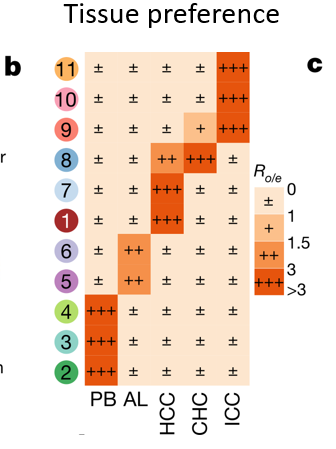
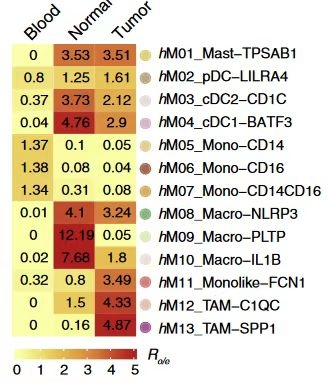

**Author(s)**: `r params$author`  
**Reviewer(s)**: `r params$reviewer`  
**Date**: `r Sys.Date()` 

# Academic Citation
If you use this code in your work or research, we kindly request that you cite our publication:

Xiaofan Lu, et al. (2025). FigureYa: A Standardized Visualization Framework for Enhancing Biomedical Data Interpretation and Research Efficiency. iMetaMed. https://doi.org/10.1002/imm3.70005

If you use ComplexHeatmap in published research, please cite:

Zuguang Gu, et al., Complex heatmaps reveal patterns and correlations in multidimensional genomic data, Bioinformatics, 2016.

Zuguang Gu. Complex Heatmap Visualization, iMeta, 2022.

```{r setup, include=FALSE}
knitr::opts_chunk$set(echo = TRUE)
```

# 需求描述
# Demand description

想复现算这个preference的值，复现图Fig3c

We want to reproduce the calculation of preference values and recreate Fig3c.



出自：<https://www.nature.com/articles/s41586-022-05400-x>

图3. 人类中性粒细胞的异质性及功能验证
b. 通过**Ro/e值(观察细胞数与期望细胞数的比值)**揭示的人类中性粒细胞簇组织偏好性

Source: <https://www.nature.com/articles/s41586-022-05400-x>

Fig. 3 | Neutrophil heterogeneity and functional validation in humans.
b, Tissue preference of neutrophil clusters in humans, revealed by
**Ro/e (ratio of observed cell number to expected cell number)**.

类似的图：

Similar figure:



出自：<https://www.cell.com/cell/fulltext/S0092-8674(20)30341-X?_returnURL=https%3A%2F%2Flinkinghub.elsevier.com%2Fretrieve%2Fpii%2FS009286742030341X%3Fshowall%3Dtrue>

图2. 通过单细胞RNA测序技术对人类结直肠癌中肿瘤浸润性髓系细胞的表征
(C) 采用Ro/e评分(103个单细胞RNA测序样本)估算的组织分布情况(STAR方法部分)。

Source: <https://www.cell.com/cell/fulltext/S0092-8674(20)30341-X?_returnURL=https%3A%2F%2Flinkinghub.elsevier.com%2Fretrieve%2Fpii%2FS009286742030341X%3Fshowall%3Dtrue>

Figure 2. Characterization of Tumor-Infiltrating Myeloid Cells by scRNA-seq in Human CRC
(C) Tissue prevalence estimated by Ro/e score (103 scRNA-seq) (STAR Methods).

# 应用场景
# Application scenarios

计算各细胞类型（Celltypes）在各组织（Tissue）的偏好性/富集程度，并绘制热图。

Ro/e (ratio of observed cell number to expected cell number)

偏好性计算方法：实际细胞数目/期望细胞数目，期望细胞数为各组织中各细胞类型均匀分布下的细胞数目

Calculate the preference/enrichment level of each cell type (Celltypes) across different tissues (Tissue), and visualize the results with a heatmap.

Ro/e (ratio of observed cell number to expected cell number)

Calculation method: Actual cell count / Expected cell count, where the expected cell count represents the uniformly distributed cell number for each cell type across tissues.

# 环境设置
# Requirements Description

```{r}
source("install_dependencies.R")

library(epitools)
library(ComplexHeatmap)

# 显示英文报错信息
# Show English error messages
Sys.setenv(LANGUAGE = "en") 

# 禁止chr转成factor
# Prevent character-to-factor conversion
options(stringsAsFactors = FALSE) 
```

# 输入文件
# Input Files

neu-CountBySample.csv和neu-CountByTissue.csv，频数统计表，为例文作者提供的注释数据。每一行为各细胞类型，每一列为各组织。

对于自己的单细胞测序数据，这样得到observe.data：

```{r eval=FALSE}
as.matrix(as.data.frame.matrix(table(seu.obj$Tissue, seu.obj$Celltypes)))
```

```{r}
# 这里读取例文作者提供的注释数据
# 数值为特定组织中特定细胞类型的实际细胞数目
# Here we read the annotation data provided by the example paper authors
# The values are actual cell counts of specific cell types in specific tissues
data1 <- read.csv("neu-CountBySample.csv", row.names = 1)
data1 <- split(data1, substr(rownames(data1), 6, 8))
data1 <- data1[c("HCC", "ICC", "CHC")]
data1 <- lapply(data1, colSums)
data1 <- as.data.frame(do.call(rbind, data1))

data2 <- read.csv("neu-CountByTissue.csv", row.names = 1)
data2 <- data2[c("AL", "PB"), ]

observe.data <- t(rbind(data2, data1)) 
```

# 生成细胞数目分布频数统计表observe.data
# Generate Cell Count Frequency Table observe.data

```{r}
# 生成期望频数表
# Generate expected frequency table
expected.data <- expected(observe.data) 

# 计算实际细胞数目与期望细胞数目的比值
# Calculate ratio of actual to expected cell counts
plot.data <- observe.data/expected.data
```

# 开始画图
# Plotting

```{r}
plot.data[plot.data>3] = 3

# 绘图数据的列顺序
# Column order for plotting data
col.order <- c("PB", "AL", "HCC", "CHC", "ICC") 

# 对绘图数据列进行排序
# Sort plotting data columns
plot.data <- plot.data[, col.order] 

# 对绘图数据行进行排序
# Sort plotting data rows
plot.data <- plot.data[order(apply(plot.data, 1, which.max), decreasing = T), ] 
# 如果想深色色块在主对角线使用which.min，在副对角线则使用which.max
# If you want darker blocks on main diagonal use which.min, for secondary diagonal use which.max

rownames(plot.data) <- substr(rownames(plot.data), 5, 6)

# 热图颜色设定
# Heatmap color settings
cols <- setNames(object = c("#FEE6CE", "#FDC08C", "#F5904B", "#E6550D"),
                 nm = c("1", "1.5", "3", ">5"))

cell_fun = function(j, i, x, y, width, height, fill) {
  if(plot.data[i,j] < as.numeric(names(cols)[1])) {
    grid.rect(x = x, y = y, width = width, height = height, gp = gpar(col = cols[1], fill = cols[1]))
    grid.text("\u00B1", x = x, y = y)
  } else if(plot.data[i,j] < as.numeric(names(cols)[2])) {
    grid.rect(x = x, y = y, width = width, height = height, gp = gpar(col = cols[2], fill = cols[2]))
    grid.text("+", x = x, y = y)
  } else if(plot.data[i,j] < as.numeric(names(cols)[3])) {
    grid.rect(x = x, y = y, width = width, height = height, gp = gpar(col = cols[3], fill = cols[3]))
    grid.text("++", x = x, y = y)
  } else {
    grid.rect(x = x, y = y, width = width, height = height, gp = gpar(col = cols[4], fill = cols[4]))
    grid.text("+++", x = x, y = y)
  }
}

# 生成热图
# Generate heatmap
hm = Heatmap(plot.data, cell_fun = cell_fun,
             cluster_rows = F, cluster_columns = F,
             width = unit(5, "cm"), height = unit(11, "cm"), 
             show_heatmap_legend = F)

# 生成图例
# Generate legend
lgd = Legend(labels = names(cols), title = expression(R[o/e]), legend_gp = gpar(fill = cols))

draw(hm, annotation_legend_list = lgd)

# 输出到文件
# Output to file
pdf("RatioHeatmap.pdf", width = 8, height = 6)
draw(hm, annotation_legend_list = lgd)
invisible(dev.off())
```

# Session Info

```{r}
sessionInfo()
```
