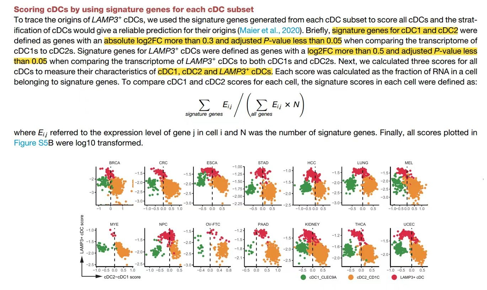
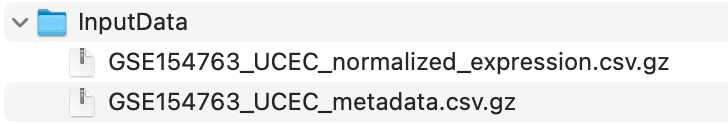

**Author(s)**: `r params$author`  
**Reviewer(s)**: `r params$reviewer`  
**Date**: `r Sys.Date()` 

# Academic Citation
If you use this code in your work or research, we kindly request that you cite our publication:

Xiaofan Lu, et al. (2025). FigureYa: A Standardized Visualization Framework for Enhancing Biomedical Data Interpretation and Research Efficiency. iMetaMed. https://doi.org/10.1002/imm3.70005


```{r setup, include=FALSE}
knitr::opts_chunk$set(echo = TRUE)
```

# 需求描述
# Demand description

FigureS5B是怎么实现的？这个计算公式要如何实现？

How is FigureS5B implemented? How to implement this calculation formula?



出自：<https://www.cell.com/cell/fulltext/S0092-8674(21)00010-6?_returnURL=https%3A%2F%2Flinkinghub.elsevier.com%2Fretrieve%2Fpii%2FS0092867421000106%3Fshowall%3Dtrue>

图S5. LAMP3+ cDC的起源与调控，与图4相关。
(B) 基于**三个cDC亚群特征基因评分**的树突状细胞转录组分层。

Source: <https://www.cell.com/cell/fulltext/S0092-8674(21)00010-6?_returnURL=https%3A%2F%2Flinkinghub.elsevier.com%2Fretrieve%2Fpii%2FS0092867421000106%3Fshowall%3Dtrue>

Figure S5. Origins and regulation of LAMP3+ cDCs, related to Figure 4
(B) Stratification of cDC transcriptomes by **scores generated from signature genes of three cDC subsets**.
  
# 应用场景
# Application scenarios

近期研究表明，LAMP3+ cDCs可能具有同时从cDC1和cDC2分化而来的潜力（Maier et al., 2020; Zhang et al., 2019）。

为了证实这个假设，原文作者用了如下计算方法：

通过多种计算方法，包括Monocle2（图4A）、CytoTRACE（图S5A）、LAMP3+ cDCs的**直接分层分析（图S5B，本文档）**以及SingleR（图S5C），我们在多种癌症类型中证实了LAMP3+ cDCs的这两种潜在起源。

Recent studies have suggested that LAMP3+ cDCs had the **potential to develop from both cDC1s and cDC2s** (Maier et al., 2020; Zhang et al., 2019). 

To validate this hypothesis, the authors employed the following computational approaches:

Using multiple computational methods, including Monocle2 (Figures 4A), CytoTRACE (Figures S5A), the **direct stratification of LAMP3+ cDCs (Figures S5B，this document)** and SingleR (Figures S5C), we confirmed the two potential origins of the LAMP3+ cDCs among various cancer types.

# 环境设置
# Environment Setup


Using domestic mirrors for package installation.

```{r}
source("install_dependencies.R")
```

```{r eval=FALSE}
install.packages("Matrix")
```

# 加载包
# Loading packages

```{r}
library(Matrix)
library(Seurat)
library(ggplot2)

# 显示英文报错信息
# Show English error messages
Sys.setenv(LANGUAGE = "en") 

# 禁止chr转成factor
# Prevent character-to-factor conversion
options(stringsAsFactors = FALSE) 
```

# 输入文件
# Input Files

原文作者已把数据上传到GEO数据库 <https://www.ncbi.nlm.nih.gov/geo/query/acc.cgi?acc=GSE154763>。我们从Supplementary file表格里下载csv.gz文件，放到当前目录下的InputData文件夹。

可以把所有癌症文件放进去合并起来跑，也可以每次只跑一种癌症类型，这里以UCEC为例：

The original authors have uploaded the data to the GEO database <https://www.ncbi.nlm.nih.gov/geo/query/acc.cgi?acc=GSE154763>. We downloaded the csv.gz files from the Supplementary files table and placed them in the InputData folder under the current directory.

You can either combine all cancer files to run them together or process one cancer type at a time. Here we use UCEC as an example:



```{r}
data.path <- file.path("InputData")

# 读取表达矩阵
# Read expression matrices
emats <- lapply(list.files(data.path, pattern = "expression", full.names = T), function(x){
  emat = data.table::fread(x, data.table = F, sep = ",")
  rownames(emat) = emat$index; emat$index = NULL
  emat = as(as.matrix(t(emat)), "dgCMatrix")
  return(emat)
})

# 读取元数据文件
# Read metadata files
einfos <- lapply(list.files(data.path, pattern = "metadata", full.names = T), function(x){
  einfo = read.csv(x)
  rownames(einfo) = einfo$index
  return(einfo)
})

# 创建Seurat对象
# Create Seurat objects
seu.objs <- mapply(function(x, y){
  seu = CreateSeuratObject(x, meta.data = y)
}, emats, einfos)

# 注意：当InputData文件夹包含多个癌症类型数据时，使用merge合并所有对象
# Note: When InputData contains multiple cancer type files, use merge to combine all objects
# seu <- merge(seu.objs[[1]], seu.objs[-1]) 

seu <- seu.objs[[1]]

# 筛选特定细胞亚群以降低计算量
# Subset specific cell clusters to reduce computation load
seu <- subset(seu, MajorCluster %in% c("M03_cDC1_CLEC9A", "M04_cDC2_CD1C", "M05_cDC3_LAMP3")) 
```

# 鉴定signature genes（下一步会用它计算得分）
# Identify signature genes (will be used for scoring in next step)

三个细胞群：在cDC中发现了三个不同的亚群，包括两个经典的cDC亚群（**CLEC9A+ cDC1s**和**CD1C+ cDC2s**）和一个成熟的cDC亚群（**LAMP3+ cDC**）。

筛选条件：定义cDC1和cDC2的特征基因筛选标准：比较cDC1与cDC2转录组时，**|log2FC|>0.3且校正P值<0.05**的基因。

Three cell groups：Three distinct subsets in cDCs were identified, including two classical cDC subsets (**CLEC9A+ cDC1s** and **CD1C+ cDC2s**) and a mature cDC subset (**LAMP3+ cDC**) recently characterized.

Filtering criteria：signature genes for **cDC1 and cDC2** were defined as genes with an **absolute log2FC more than 0.3 and adjusted P-value less than 0.05** when comparing the transcriptome of cDC1s to cDC2s. 

```{r}
Idents(seu) <- seu$MajorCluster

# 在进行"一对多"差异分析前，再次确认Seurat对象包含的细胞亚群
# Subset specific cDC populations before one-vs-other differential analysis
seu <- subset(seu, MajorCluster %in% c("M03_cDC1_CLEC9A", "M04_cDC2_CD1C", "M05_cDC3_LAMP3")) 

# 数据标准化（生成"data"层供差异分析使用）
# Normalize data for differential analysis (generates "data" slot)
seu <- NormalizeData(seu)  

# 显式设置默认assay为RNA
# Explicitly set default assay to RNA
DefaultAssay(seu) <- "RNA"  

# 运行差异分析（显式指定参数）
# differential analysis with explicit parameters
sig.gene <- FindAllMarkers(
  seu,
  assay = "RNA",          
  slot = "data",        
  min.pct = 0.1,          
  logfc.threshold = 0.25   
)

# 筛选显著差异基因
# Filter significant genes 
sig.gene <- subset(sig.gene, avg_log2FC > 0.3 & p_val_adj < 0.05)

sig.gene <- split(sig.gene$gene, sig.gene$cluster)
```

# 计算基因集得分
# Calculate gene set scores

这里提供两种打分策略，自选其一即可：

- 策略一：自定义函数，实现原文的计算公式
- 策略二：用AUCell的函数

Here we provide two scoring strategies, choose either one:

- Method 1: Custom function implementing the original paper's formula
- Method 2: Using AUCell functions

```{r}
## 打分策略一：原文的计算公式
## Scoring Method 1: Original paper's formula

# emat：行为基因，列为细胞的表达矩阵
# gsets：基因签名列表
# emat: gene-by-cell expression matrix (genes in rows)
# gsets: gene signature list
CalScore <- function(emat, gsets){
  scores = lapply(sig.gene, function(sig){
    colSums(emat[sig, ])/colSums(emat)/length(sig)
  })
  as.data.frame(do.call(cbind, scores))
}

# 用自定义函数计算基因集得分
# Calculate gene set scores using custom function
plot.data <- CalScore(GetAssayData(seu, layer = "data"), sig.gene)
# 如果emat使用对数化之后的数据，则计算的得分无需对数化
# 如果emat使用原始表达矩阵，则得分宜用对数化
# If using log-normalized data, scores don't need log-transformation
# If using raw counts, scores should be log-transformed


## 打分策略二：AUCell
## Scoring Method 2: AUCell
# score <- AUCell_run(seu@assays$RNA@data, sig.gene)
# plot.data <- as.data.frame(t(score@assays@data$AUC))

# 添加细胞类型信息 
# Add cell type information
plot.data$celltype <- seu$MajorCluster
# 注意：这里用的是对数归一化的表达谱，因为GEO只给了对数归一化的数据，而原文用的是count，所以图片有数值上的出入，但趋势类似
# 为了使得坐标轴出现0的参考点，这里对数据做了以下scale，原文并未提及，可不做
# Note: Using log-normalized data (as GEO provides) vs original paper's raw counts causes value differences but similar trends
# Data scaling (not mentioned in paper) adds zero reference point on axis (optional)

plot.data$M04_cDC2_CD1C <- scale(plot.data$M04_cDC2_CD1C)
plot.data$M03_cDC1_CLEC9A <- scale(plot.data$M03_cDC1_CLEC9A)
plot.data$M05_cDC3_LAMP3 <- scale(plot.data$M05_cDC3_LAMP3)
```

# 开始画图
# Plotting

```{r fig.width=6, fig.height=6}
# 绘制散点图
# Draw a scatter plot
ggplot(plot.data, aes(x = M04_cDC2_CD1C - M03_cDC1_CLEC9A, 
                      y = M05_cDC3_LAMP3, 
                      color = celltype)) +
  geom_point() + 
  scale_color_manual(values = c("#DC2C44","#EC8D37","#45924F")) + 
  geom_vline(xintercept = 0, color="black", 
             linetype="longdash", lwd = 0.6) + 
  theme_classic() + 
  labs(x = "cDC2-cDC1 score", y = "LAMP3+cDC score") +
  theme(axis.text.x = element_text(hjust = 0.5, size = 12, color = "black"),
        axis.title.y = element_text(hjust = 0.5, size = 12, color = "black"),
        axis.text.y = element_text(hjust = 0.5, size = 12, color = "black"),
        axis.ticks = element_line(size=0.2, color="black"),
        axis.ticks.length = unit(0.2, "cm"),
        panel.background = element_blank(),
        panel.grid = element_blank(),
        legend.position = "top",
        axis.title = element_text(size = 10),
        axis.text = element_text(size = 10))

ggsave("ScoreVisual.pdf", width = 6, height = 6)
```

# Session Info

```{r}
sessionInfo()
```
