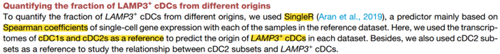
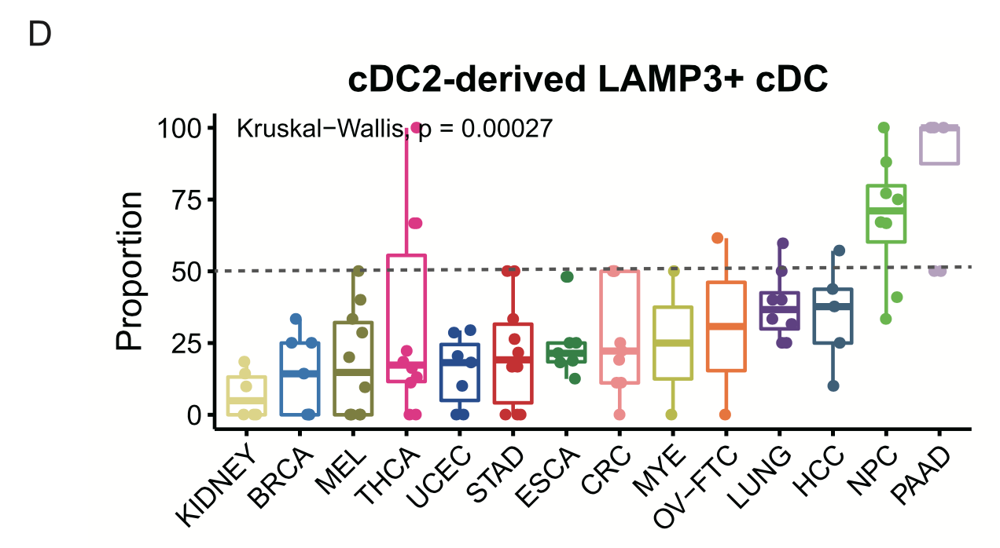
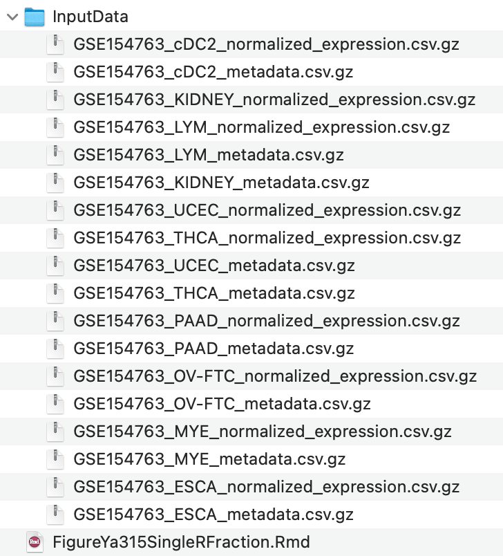

**Author(s)**: `r params$author`  
**Reviewer(s)**: `r params$reviewer`  
**Date**: `r Sys.Date()` 

# Academic Citation
If you use this code in your work or research, we kindly request that you cite our publication:

Xiaofan Lu, et al. (2025). FigureYa: A Standardized Visualization Framework for Enhancing Biomedical Data Interpretation and Research Efficiency. iMetaMed. https://doi.org/10.1002/imm3.70005

```{r setup, include=FALSE}
knitr::opts_chunk$set(echo = TRUE)
```

# 需求描述
# Demand description

在单细胞数据中，怎么用singleR预测不同细胞亚群之间的相关性。

In single-cell data, how to use SingleR to predict the correlations between different cell subpopulations.





出自：<https://www.cell.com/cell/fulltext/S0092-8674(21)00010-6?_returnURL=https%3A%2F%2Flinkinghub.elsevier.com%2Fretrieve%2Fpii%2FS0092867421000106%3Fshowall%3Dtrue>

图S5. LAMP3+ cDC细胞的起源与调控（与图4相关）。
(D) 箱线图展示不同癌症类型中，cDC2来源的LAMP3+ cDC细胞占所有LAMP3+ cDC细胞的比例。Kruskal-Wallis检验。

Source: <https://www.cell.com/cell/fulltext/S0092-8674(21)00010-6?_returnURL=https%3A%2F%2Flinkinghub.elsevier.com%2Fretrieve%2Fpii%2FS0092867421000106%3Fshowall%3Dtrue>

Figure S5. Origins and regulation of LAMP3+ cDCs, related to Figure 4.
(D) Boxplot showing the fractions of cDC2-derived LAMP3+ cDCs in all LAMP3+ cDCs across different cancer types. Kruskal-Wallis test.

# 应用场景
# Application scenarios

例文针对`origins of the LAMP3+ cDCs`的问题做了多个角度的探讨，可以灵活运用到自己感兴趣的细胞类型中。

本文档使用SingleR计算cDC3_LAMP3来源于cDC2的占比，实现Figure S5D。

同一篇文章的Figure S5B（Stratification of cDC transcriptomes by scores generated from signature genes of three cDC subsets）可以用FigureYa314SingleRScore来计算和画图。

The example text explores the question of `origins of the LAMP3+ cDCs` from multiple perspectives, which can be flexibly applied to other cell types of interest.

This document uses SingleR to calculate the proportion of cDC3_LAMP3 derived from cDC2, reproducing Figure S5D.

For Figure S5B of the same paper (Stratification of cDC transcriptomes by scores generated from signature genes of three cDC subsets), the FigureYa314SingleRScore can be used for calculation and plotting.

# 环境设置
# Environment Setup

```{r}
source("install_dependencies.R")

library(Matrix)
library(Seurat)

# 基于参考数据集对新细胞进行类型标注
#labels new cells from a test dataset based on similarity to the reference
library(SingleR) 

library(ggplot2) 

# 用于实现Kruskal-Wallis test
# Provides Kruskal-Wallis test
library(ggpubr) 

# 显示英文报错信息
# Show English error messages
Sys.setenv(LANGUAGE = "en") 

# 禁止chr转成factor
# Prevent character-to-factor conversion
options(stringsAsFactors = FALSE) 
```

# 输入文件
# Input Files

原文图中有14个cohort，作者上传到GEO数据库的只有9个，<https://www.ncbi.nlm.nih.gov/geo/query/acc.cgi?acc=GSE154763>。我们从Supplementary file表格里下载csv.gz文件，放到当前目录下的InputData文件夹。

The original figure included data from 14 cohorts, but only 9 cohorts were uploaded by the authors to the GEO database, <https://www.ncbi.nlm.nih.gov/geo/query/acc.cgi?acc=GSE154763>. We downloaded the csv.gz files from the Supplementary file table and saved them in the **InputData** folder under the current directory.



实际应用中，直接跳到下一步“SingleR”，加载自己的seurat对象。

In practice, you can directly proceed to the next step "SingleR" and load your own Seurat object.

```{r}
data.path <- file.path("InputData")

# 读取表达谱
# Read expression matrices
emats <- lapply(list.files(data.path, pattern = "expression", full.names = T), function(x){
  emat = data.table::fread(x, data.table = F, sep = ",")
  rownames(emat) = emat$index; emat$index = NULL
  emat = as(as.matrix(t(emat)), "dgCMatrix")
  return(emat)
})

einfos <- lapply(list.files(data.path, pattern = "metadata", full.names = T), function(x){
  einfo = read.csv(x)
  rownames(einfo) = einfo$index
  return(einfo)
})

seu.objs <- mapply(function(x, y){
  seu = CreateSeuratObject(x, meta.data = y)
}, emats, einfos)
seu <- merge(seu.objs[[1]], seu.objs[-1])
# 目的是看cDC3中cDC2来源的占比，如果队列里没有cDC3细胞的话，画图时不会出现这个队列
# 运行这句就可以看到哪些队列里有cDC3了
# Purpose: To check the proportion of cDC2-derived cells in cDC3. Cohorts without cDC3 cells will be automatically excluded in plotting.
# Run this to identify cohorts containing cDC3 cells
table(seu$cancer[seu$MajorCluster=="M04_cDC2_CD1C"])

# 取子集来降低计算量
# Subset data to reduce computational load
seu <- subset(seu, MajorCluster %in% c("M03_cDC1_CLEC9A", "M04_cDC2_CD1C", "M05_cDC3_LAMP3")) 
```

# SingleR评估cDC3（LAMP3+ cDCs）的cDC2来源占比
# Using SingleR to evaluate the proportion of cDC2-derived cDC3 (LAMP3+ cDCs)

原文：我们以**cDC1和cDC2的转录组作为参考**，预测**各数据集中LAMP3+ cDCs的细胞来源**。

Original Text：Here, we used the **transcriptomes of cDC1s and cDC2s as a reference** to predict the **origin of LAMP3+ cDCs in each dataset**. 

```{r}
# 由单细胞转录组数据生成cDC1、cDC2参考集
# Generate cDC1 and cDC2 reference sets from single-cell RNA-seq data 
train <- AverageExpression(seu, group.by = "MajorCluster", layer = "counts")[[1]]
train <- train[, c("M03-cDC1-CLEC9A", "M04-cDC2-CD1C")]

# 检查RNA assay中是否存在counts数据层  
# Check if counts layers exist in RNA assay 
counts_layers <- Layers(seu, assay = "RNA", search = "counts")
if (length(counts_layers) == 0) {
  stop("No counts layers found in the RNA assay!")
}

# 获取所有counts层的基因名  
# Get gene names from all counts layers
all_genes <- lapply(counts_layers, function(layer) {
  rownames(LayerData(seu, assay = "RNA", layer = layer))
})

# 取交集（共同）基因  
# Get intersecting (common) genes  
common_genes <- Reduce(intersect, all_genes)

# 仅提取共同基因的表达矩阵  
# Extract expression matrix with common genes only  
all_counts <- do.call(cbind, lapply(counts_layers, function(layer) {
  mat <- LayerData(seu, assay = "RNA", layer = layer)
  mat[common_genes, ] 
}))

# 评估cDC3（LAMP3+ cDCs）的cDC2来源占比
# Evaluate the proportion of cDC2-derived cells in cDC3 (LAMP3+ cDCs)  
cell_idx <- colnames(all_counts) %in% rownames(seu@meta.data[seu$MajorCluster == "M05_cDC3_LAMP3", ])
test <- all_counts[, cell_idx]

# 使用SingleR进行细胞来源预测  
# Predict cell origin using SingleR 
test.label <- as.data.frame(SingleR(test = test, #M05-cDC3-LAMP3
                                    ref = train, #M03-cDC1-CLEC9A and M04-cDC2-CD1C
                                    labels = colnames(train)))

# 添加队列和患者信息  
# Add cohort and patient information  
test.label$cohort <- seu$cancer[match(rownames(test.label), colnames(seu))]
test.label$patient <- seu$patient[match(rownames(test.label), colnames(seu))]

# 按队列分组计算cDC2来源比例  
# Calculate cDC2-derived proportion by cohort
plot.data <- split(test.label, test.label$cohort)
plot.data <- lapply(plot.data, function(x) {
  tbl <- table(x$patient, x$pruned.labels)
  df <- as.data.frame.matrix(tbl)
  prop <- df[["M04-cDC2-CD1C"]] / rowSums(df)
  data.frame(patient = rownames(df), prop = prop)
})

# 合并所有队列数据并整理格式  
# Combine all cohort data and reformat
plot.data <- do.call(rbind, plot.data)
plot.data$cohort <- gsub("(.+)\\.(.+)", "\\1", rownames(plot.data))
```

# 开始画图
# Plotting

## 基础版
## Basic version

```{r fig.width=5, fig.height=4}
ggplot(plot.data, aes(x = cohort, y = prop*100, color = cohort)) + 
  geom_boxplot() + 
  geom_point(shape = 16, 
             position = position_jitterdodge()) +
  scale_colour_brewer(palette = "Paired") + 
  geom_hline(yintercept = 50, color="black",
             linetype="longdash", lwd = 0.5) + 
  theme_classic() + 
  guides(colour = "none") + 
  labs(x = "", y = "Proportion") + 
  ggtitle("cDC2-derived LAMP3+ CDC") +
  theme(axis.text.x = element_text(angle = 45, vjust = 1, hjust=1, 
                                   color = "black"),
        axis.title.y = element_text(hjust = 0.5, color = "black"),
        axis.text.y = element_text(hjust = 0.5, color = "black"),
        axis.ticks = element_line(color="black"),
        axis.ticks.length = unit(0.2, "cm"),
        panel.background = element_blank(),
        panel.grid = element_blank(),
        legend.position = "top",
        axis.title = element_text(size = 10),
        axis.text = element_text(size = 10)) +
  stat_compare_means(method = "kruskal.test")

ggsave("Proption.pdf", width = 5, height = 4)
```

## 升级版
## Enhanced version

```{r fig.width=5, fig.height=4}
ggplot(plot.data, aes(x = cohort, y = prop*100, fill = cohort)) + 
  geom_violin(alpha = 0.4, position = position_dodge(width = .75), 
              size = 0.8, color="white") + 
  geom_boxplot(notch = F, outlier.size = -1, 
               color="black", lwd = 0.6, alpha = 0.7) + 
  geom_boxplot() + 
  geom_point(shape = 21, size=1.2, 
             position = position_jitterdodge(), alpha = 0.6) + 
  scale_fill_brewer(palette = "Paired") + 
  geom_hline(yintercept = 50, color="black",
             linetype="longdash", lwd = 0.5) + 
  theme_classic() + 
  guides(fill = "none") + 
  labs(x = "", y = "Proportion") + 
  ggtitle("cDC2-derived LAMP3+ CDC") +
  theme(axis.text.x = element_text(angle = 45, vjust = 1, hjust=1, 
                                   color = "black"),
        axis.title.y = element_text(hjust = 0.5, color = "black"),
        axis.text.y = element_text(hjust = 0.5, color = "black"),
        axis.ticks = element_line(color="black"),
        axis.ticks.length = unit(0.2, "cm"),
        panel.background = element_blank(),
        panel.grid = element_blank(),
        legend.position = "top",
        axis.title = element_text(size = 10),
        axis.text = element_text(size = 10)) +
  stat_compare_means(method = "kruskal.test")

ggsave("Proption_plus.pdf", width = 5, height = 4)
```

# Session Info

```{r}
sessionInfo()
```
