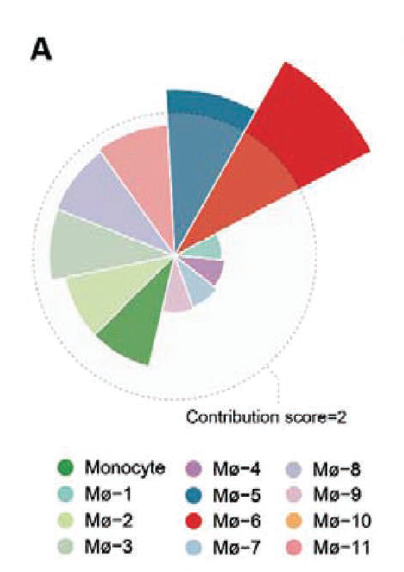
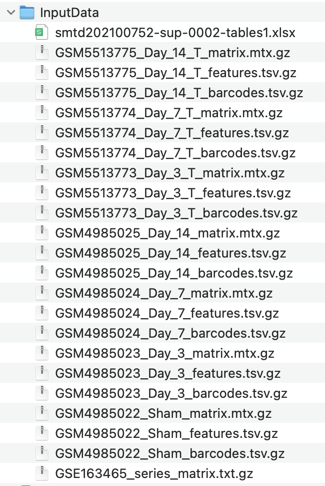

**Author(s)**: `r params$author`  
**Date**: `r Sys.Date()`  


# Academic Citation
If you use this code in your work or research, we kindly request that you cite our publication:

Xiaofan Lu, et al. (2025). FigureYa: A Standardized Visualization Framework for Enhancing Biomedical Data Interpretation and Research Efficiency. iMetaMed. https://doi.org/10.1002/imm3.70005

```{r setup, include=FALSE}
knitr::opts_chunk$set(echo = TRUE)
```

# 需求描述
# Requirements Description

想实现这个a图，怎么去算单细胞某个细胞亚群对疾病贡献度，知道哪些细胞亚群最重要。

We want to draw this panel A figure, how to calculate the disease contribution score of single cell subsets and identify the most important ones.



出自<https://onlinelibrary.wiley.com/doi/10.1002/smtd.202100752>

Figure 6. Tanshinone IIA treatment validates the effectiveness of early infiltrated macrophage subsets suppression in attenuating pathological MI progression.
A) Disease contributions of distinct macrophage subsets. The radius is proportional to the contribution score. Detailed information is described in the Experimental Section.

# 应用场景

# Application Scenario

根据单细胞数据，计算细胞亚群对疾病贡献度ContributionScore，绘制环形柱状图（Fig. 6A）

Calculate cell subset contribution scores from scRNA-seq data and plot circular barplot (Fig. 6A)

- Figure 2B，refer to FigureYa235scDEG
- Figure 3D，refer to FigureYa285scRNA_monocle
- Figure 5F，refer to FigureYa178ReceptorLigand

# 环境设置
# Environment Setup

```{r}
source("install_dependencies.R")

library(Seurat)
library(magrittr)
library(GEOquery)
library(SingleR)
library(plyr)
library(openxlsx)
library(GSVA)
library(dplyr)
library(reshape2)
library(ggplot2)

# 显示英文报错信息
# Show English error messages
Sys.setenv(LANGUAGE = "en") 

# 禁止chr转成factor
# Prevent character-to-factor conversion
options(stringsAsFactors = FALSE) 
```

# 输入文件
# Input Files

Seurat对象：具有细胞亚型注释（subtype）和分组信息（time）。从GEO下载输入数据，<https://www.ncbi.nlm.nih.gov/geo/query/acc.cgi?acc=GSE163465>，下载Supplementary file表格里的`GSE163465_RAW.tar`，和Download family里的`Series Matrix File(s)`，下载后存放在InputData文件夹里。

smtd202100752-sup-0002-tables1.xlsx，原文提供的marker，用于髓系细胞亚型注释。下载地址：<https://onlinelibrary.wiley.com/action/downloadSupplement?doi=10.1002%2Fsmtd.202100752&file=smtd202100752-sup-0002-TableS1.xlsx>

The Seurat object contains annotated cell subtypes (subtype) and grouping information (time). Input data should be downloaded from GEO at https://www.ncbi.nlm.nih.gov/geo/query/acc.cgi?acc=GSE163465, which includes the GSE163465_RAW.tar file from Supplementary files and the Series Matrix File(s) from Download family. After downloading, please store all files in the InputData folder.

smtd202100752-sup-0002-tables1.xlsx contains the marker genes provided in the original publication for annotating myeloid cell subtypes. Download link: https://onlinelibrary.wiley.com/action/downloadSupplement?doi=10.1002%2Fsmtd.202100752&file=smtd202100752-sup-0002-TableS1.xlsx



```{r}
# 设置存放输入数据的路径
# Set data path
data.path <- file.path("InputData") 

# 读取样本信息
# Read sample information
sample.info <- getGEO(filename = file.path(data.path,"GSE163465_series_matrix.txt.gz"))
sample.info <- as.data.frame(sample.info)

# 清理样本名称
# Clean sample names
sample.info$title <- gsub("CD45\\+\\ |Cd45\\+\\ |_T", "", sample.info$title)
sample.info <- data.frame(
  "geo" = sample.info$geo_accession,
  "time" = sample.info$title
)

# 读取原文提供的marker，用于髓系细胞亚型注释
# Load marker genes from original publication for myeloid cell subtype annotation
marker <- read.xlsx(xlsxFile = file.path(data.path,"smtd202100752-sup-0002-tables1.xlsx"), 
                    sheet = "Mø and Monocyte")
marker <- subset(marker, avg_logFC > 0.5 & p_val_adj < 0.05)
marker <- split(marker$gene, marker$cluster)

# 读取表达矩阵
# Read expression matrices
samples <- list.files(data.path, pattern = "mtx.gz$", full.names = T)
mtx.list <- lapply(samples, function(sample){
  mtx = ReadMtx(mtx = sample, 
                cells = gsub("matrix.mtx.gz", "barcodes.tsv.gz", sample), 
                features = gsub("matrix.mtx.gz", "features.tsv.gz", sample),
                cell.column = 1, feature.column = 2)
  colnames(mtx) = paste0(substr(basename(sample), 1, 10), colnames(mtx))
  return(mtx)
})

# 合并矩阵
# Merge matrices
mtx <- do.call(cbind, mtx.list)

# 生成Seurat对象
# Create Seurat object
seu <- CreateSeuratObject(mtx, min.cells = 3, min.features = 200)

# 添加样本信息
# Add sample information
seu$Sample <- substr(colnames(seu), 1, 10)
seu$Time <- sample.info$time[match(seu$Sample, sample.info$geo)]

# 标准预处理流程
# Standard preprocessing
seu <- FindVariableFeatures(seu) %>% NormalizeData() %>% ScaleData()
seu <- RunPCA(seu)
seu <- RunUMAP(seu, dims = 1:50)
seu <- FindNeighbors(seu, dims = 1:50) %>% FindClusters()

# 可视化聚类
# Visualize clustering
DimPlot(seu, group.by = "seurat_clusters", label = T)

# 注释细胞类型
# Cell type annotation
SingleR.ref <- MouseRNAseqData()

# 其他的参考集可以通过celldex包获取: http://bioconductor.org/packages/release/data/experiment/html/celldex.html
# Additional reference datasets available via celldex package: http://bioconductor.org/packages/release/data/experiment/html/celldex.html

anno <- SingleR(
    test = LayerData(seu, assay = "RNA", layer = "data"),  
    clusters = seu$seurat_clusters,
    ref = SingleR.ref,
    labels = SingleR.ref$label.main
)
anno <- as.data.frame(anno)

# 添加注释结果
# Add annotation results
seu$Celltypes <- mapvalues(x = seu$seurat_clusters,
                           from = rownames(anno),
                           to = anno$pruned.labels)

# 提取髓系细胞
# Subset myeloid cells
seu <- subset(seu, Celltypes %in% c("Macrophages", "Monocytes"))

# 重新聚类
# Re-clustering
seu <- FindVariableFeatures(seu) %>% NormalizeData() %>% ScaleData()
seu <- RunPCA(seu)
seu <- FindNeighbors(seu, dims = 1:50) %>% FindClusters()
DimPlot(seu, group.by = "seurat_clusters", label = T)

# GSVA分析
# GSVA analysis
expr.mat <- as.matrix(AverageExpression(seu, assays = "RNA", layer = "data")[[1]])

param <- gsvaParam(
  exprData = expr.mat,
  geneSets = marker,
  minSize = 5,     
  maxSize = 500,   
  kcdf = "Gaussian" 
)
marker.score <- gsva(param, verbose = FALSE)

anno <- apply(marker.score, 2, which.max)
anno <- data.frame(clusters = levels(Idents(seu)), label = names(marker)[anno])
seu$Subtypes <- mapvalues(seu$seurat_clusters, 
                          from = anno$clusters, to = anno$label)
DimPlot(seu, group.by = "Subtypes")

# 保存seu对象
# Save seu object
saveRDS(seu, "seu.rds") 
```

# 进行ContributionScore计算

# Contribution Score Calculation

```{r}
# 计算流程如下：
# ①：在髓系细胞中计算Day3组相对于Sham组的前100个高表达基因
# ②：在各亚型中计算Day3相对于Sham组各基因的表达量FCexp和表达占比FCprop
# ③：计算FCexp和FCprop的平方根，作为ContributionScore

# Calculation workflow:
# ①: Calculate top 100 highly expressed genes in Day3 group compared to Sham group in myeloid cells
# ②: For each subtype, calculate expression fold change (FCexp) and expression proportion (FCprop) of Day3 vs Sham for each gene
# ③: Calculate square root of FCexp and FCprop as ContributionScore

# 读取seu对象
# Load seu object
seu <- readRDS("seu.rds") 

# 找差异基因
# Find DEGs
Bulk.DEGs <- FindMarkers(seu, group.by = "Time", ident.1 = "Day_3", ident.2 = "Sham")

Bulk.DEGs$symbol <- rownames(Bulk.DEGs)
Bulk.DEGs <- arrange(Bulk.DEGs, Bulk.DEGs$p_val_adj, -Bulk.DEGs$avg_log2FC)
Bulk.DEGs <- Bulk.DEGs[1:100, ]

# 按亚型分析
# Analyze by subtype
subset.DEGs <- lapply(SplitObject(seu, split.by = "Subtypes"), function(subset){
  deg = FindMarkers(subset, 
                    features = Bulk.DEGs$symbol, min.pct = 0, logfc.threshold = 0,
                    group.by = "Time", ident.1 = "Day_3", ident.2 = "Sham")
  deg$symbol = rownames(deg)
  deg$subtypes = unique(subset$Subtypes)
  return(deg)
})

# 合并结果
# Merge results
subset.DEGs <- do.call(rbind, subset.DEGs)

# 计算贡献分数
# Calculate contribution scores
subset.DEGs$FCexp <- 2^subset.DEGs$avg_log2FC
subset.DEGs$FCprop <- subset.DEGs$pct.1/subset.DEGs$pct.2
subset.DEGs$FCscore <- sqrt(subset.DEGs$FCexp*subset.DEGs$FCprop)
subset.DEGs$FCscore[is.infinite(subset.DEGs$FCscore)] <- NA
FCscore <- dcast(subset.DEGs, symbol~subtypes, measure.var = "FCscore")

# 输出ContributionScore得分表（基因×细胞类型，FC score.txt）
# Output ContributionScore table (genes × cell types, FC score.txt)
write.table(FCscore, "output_FCscore.txt", 
            sep = "\t", row.names = F, col.names = T, quote = F)
```

# 开始画图 - Fig. 6A

# Plotting - Fig. 6A

绘制环形柱状图

Plot circular barplot

```{r}
# 定义颜色
# Define colors
color = c("Monocyte" = "#359948", "Mø.1" = "#83C9BE",
          "Mø.2" = "#C4DB98", "Mø.3" = "#BBD2B2", 
          "Mø.4" = "#AE7EAD", "Mø.5" = "#356A80", 
          "Mø.6" = "#A6C6D9", "Mø.7" = "#DD2326", 
          "Mø.8" = "#BBB6C8", "Mø.9" = "#DAB7C6", 
          "Mø.10" = "#F6B060", "Mø.11" = "#E89093")

# 准备绘图数据
# Prepare plot data
plot.data <- read.table("output_FCscore.txt", row.names = 1, header = T)
plot.data <- data.frame(
  "subtypes" = colnames(plot.data),
  "FCscore" = colMeans(plot.data, na.rm = T)
)
plot.data <- arrange(plot.data, plot.data$FCscore)
plot.data$subtypes <- factor(plot.data$subtypes, levels = plot.data$subtypes)

# 绘制环形柱状图
# Plot circular barplot
ggplot(plot.data, aes(x = subtypes, y = FCscore, fill = subtypes)) + 
  geom_bar(stat = "identity") + 
  scale_fill_manual(values = color) + 
  geom_hline(yintercept = 1, 
             color = "grey", linetype="dashed") + 
  coord_polar() + 
  theme_classic() + 
  theme(axis.text = element_blank(), axis.title = element_blank(),
        axis.line = element_blank(), axis.ticks = element_blank())

# 保存图像
# Save plot
ggsave("ContributionScore.pdf", width = 6, height = 4) 
```

# Session Info

```{r}
sessionInfo()
```