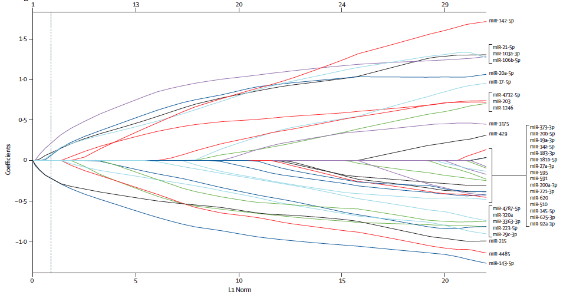

**Author(s)**: `r params$author`  
**Date**: `r Sys.Date()`  


# Academic Citation
If you use this code in your work or research, we kindly request that you cite our publication:

Xiaofan Lu, et al. (2025). FigureYa: A Standardized Visualization Framework for Enhancing Biomedical Data Interpretation and Research Efficiency. iMetaMed. https://doi.org/10.1002/imm3.70005


```{r setup, include=FALSE}
knitr::opts_chunk$set(echo = TRUE)
```

# 需求描述
# Requirement description

画出paper中的lasso回归图，给出图中线所对应的基因顺序。

将纳入signature的变量拟合成一个变量，作为nomogram的输入。

Draw the lasso regression plot from the paper, giving the order of the genes corresponding to the lines in the plot.

Fit the variables that are included in the signature to a variable that is used as input to the nomogram.



出自<https://linkinghub.elsevier.com/retrieve/pii/S1470-2045(13)70491-1>

lasso结果怎么解读？看这篇：<https://mp.weixin.qq.com/s/Odf3zYOu77DvN-ph4gHPJQ>

from<https://linkinghub.elsevier.com/retrieve/pii/S1470-2045(13)70491-1>

How to interpret lasso results? Read this: <https://mp.weixin.qq.com/s/Odf3zYOu77DvN-ph4gHPJQ>

# 应用场景
# Application scenario

筛选差异基因之后，进一步筛选有预后意义的基因，组成基因表达signature。

LASSO对于高维度、强相关、小样本的生存资料数据较为适用。

After screening for differential genes, genes with prognostic significance are further screened to compose the gene expression signature.

LASSO is more suitable for high-dimensional, strongly correlated, and small-sample survival data.

# 环境设置
# Environment setting

采用R包`glmnet`，它是目前最好用的拟合广义线性模型的R包，由`LASSO` 回归的发明人，斯坦福统计学家 Trevor Hastie 领衔开发。 

The R package `glmnet` is used, which is the best R package available for fitting generalized linear models, lead by Trevor Hastie, the Stanford statistician who invented `LASSO` regression. 

```{r,fig.width=8, fig.height=6}
source("install_dependencies.R")
#install.packages("glmnet")
#install.packages("survival")
library("glmnet")
library("survival")
source("nonzeroCoef.R")
Sys.setenv(LANGUAGE = "en") #显示英文报错信息 display English error messages
options(stringsAsFactors = FALSE) #禁止chr转成factor prohibit the conversion of chr to factor
```

# 输入数据
# Input data

输入文件有两个，一个是生存信息`easy_input_suv.csv`，一个是基因表达矩阵`easy_input_exp.csv`。

`easy_input_suv.csv`，生存信息，至少包含三列，分别为patient IDs、follow up time、life status

`easy_input_exp.csv`，基因表达矩阵，每行一个基因，每列一个patient，跟`suv.csv`里的`patient ID`一致。

There are two input files: one is the survival information file `easy_input_suv.csv`, and the other is the gene expression matrix file `easy_input_exp.csv`.

`easy_input_suv.csv`, the survival information, contains at least three columns for patient IDs, follow up time, life status

`easy_input_exp.csv`, gene expression matrix, one gene per row, one patient per column, consistent with the `patient ID` in `suv.csv`.

```{r}
myexpr <- read.csv("easy_input_exp.csv", header = T,row.names = 1)
myexpr[1:3,1:4]
mysurv <- read.csv("easy_input_suv.csv", header = T,row.names = 1)
head(mysurv)

#检查样品信息跟表达量矩阵的样品是否一致
#check that the sample information is consistent with the samples in the expression matrix
if (all(colnames(myexpr) %in% rownames(mysurv))){
  warning("两个文件的patient ID是一致的")
} else{
  warning("两个文件的patient ID不一致")
}
```

# 开始画图
# Start drawing

## 算出lambda值
## Calculate the lambda value

```{r}
cvfit = cv.glmnet(t(myexpr), Surv(mysurv$months,mysurv$status), 
                  #10倍交叉验证，非必须限定条件，这篇文献有，其他文献大多没提
                  #10-fold cross-validation, non-required qualification, available in this paper, mostly unmentioned in others
                  #nfold=10,
                  family = "cox"
                  ) 
plot(cvfit)

#两个lambda值均可采用，具体lambda选值要根据自己实验设计而定。
#此处使用`lambda min`
#Both lambda values can be used, the exact lambda selection depends on your own experimental design.
#Here we use `lambda min`.
cvfit$lambda.min #最佳lambda值 best lambda value
cvfit$lambda.1se #一倍SE内的更简洁的模型 a more concise model in double SE

fit <- glmnet(t(myexpr), Surv(mysurv$months,mysurv$status), 
               family = "cox") 

#用包自带的函数画图
#use the built-in functions of the package to plot the graph
plot(fit, label = TRUE)
```

## 修改画图函数
## Modify the plotting function

原函数打印序号，需要修改画图函数，改为打印基因名

如果基因太多，打印基因名也看不清。在右侧列出图例，这样看起来更清晰。

The original function prints the serial number, you need to modify the plotting function to print the gene name instead.

If there are too many genes, it is hard to see the gene names. List the legend on the right side, so that it looks clearer.

```{r}
#自定义颜色
#custom colors
mycol <- rep(c("#223D6C","#D20A13","#FFD121","#088247","#11AA4D","#58CDD9","#7A142C","#5D90BA","#431A3D","#91612D","#6E568C","#E0367A","#D8D155","#64495D","#7CC767"),2)

#设置x轴最大值
#set the x-axis maximum value
xmax <- 3.6

plotCoef_plus <- function (beta, norm, lambda, df, dev, label = FALSE, legend = FALSE, xvar = c("norm", 
    "lambda", "dev"), xlab = iname, ylab = "Coefficients", ...) 
{
    which = nonzeroCoef(beta)
    nwhich = length(which)
    switch(nwhich + 1, `0` = {
        warning("No plot produced since all coefficients zero")
        return()
    }, `1` = warning("1 or less nonzero coefficients; glmnet plot is not meaningful"))
    beta = as.matrix(beta[which, , drop = FALSE])
    xvar = match.arg(xvar)
    switch(xvar, norm = {
        index = if (missing(norm)) apply(abs(beta), 2, sum) else norm
        iname = "L1 Norm"
        approx.f = 1
    }, lambda = {
        index = log(lambda)
        iname = "Log Lambda"
        approx.f = 0
    }, dev = {
        index = dev
        iname = "Fraction Deviance Explained"
        approx.f = 1
    })
    dotlist = list(...)
    type = dotlist$type
    
    if (legend){
      #在右侧留出画图例的地方
      #leave space on the right hand side for drawing the legend
      par(xpd = T, mar = par()$mar + c(0,0,0,6))
    }
    
    #修改bty，换个更好看的边框，还可以改成，o / n / 7 / l / c / u / ]
    #modify the bty for a better looking border and also change it to, o / n / 7 / l / c / u / ]
    if (is.null(type)) 
        matplot(index, t(beta), lty = 1, lwd = 2,
                xlab = xlab, ylab = ylab, 
                xlim = c(0, xmax), #设置x轴最大值 set the x-axis maximum value
                col = mycol,#线的颜色 color of the line
                type = "l", cex.lab=1.2, cex.axis=1,
                bty="n", ...)#不画右边框 no right-hand border
    else matplot(index, t(beta), lty = 1, lwd = 2,
                 xlab = xlab, ylab = ylab, 
                 xlim = c(0, xmax), 
                 col = mycol,
                 type = "l", cex.lab=1.2, cex.axis=1,
                 bty="n", ...)
    atdf = pretty(index)
    prettydf = approx(x = index, y = df, xout = atdf, rule = 2, 
        method = "constant", f = approx.f)$y
    axis(3, at = atdf, labels = prettydf, tcl = NA)
    
    if (label) {
        nnz = length(which)
        xpos = max(index)
        pos = 4
        if (xvar == "lambda") {
            xpos = min(index)
            pos = 2
        }
        xpos = rep(xpos, nnz)
        ypos = beta[, ncol(beta)]
        
        #原函数打印序号，修改为打印基因名
        #the original function prints the serial number, modified to print the gene name
        text(xpos, ypos, paste(rownames(myexpr)[which]),
             cex = 0.8, #基因名字体大小 gene name font size
             #基因名的颜色跟线一样
             #gene names are the same color as the lines
             col = mycol,
             #如果你不想要彩色的字，就用下面这行
             #if you don't want colored words, use the following line
             #col = "black",
             pos = pos)
    }
    if (legend) {
      #画图例
      #draw legend
      legend("topright",
           inset=c(-0.12,0),#图例画到图外面 legend drawn outside the figure
           legend = rownames(myexpr), #图例文字 legend text
           col = mycol, #图例线的颜色，与文字对应 color of the legend line, corresponding to the text 
           lwd = 3, #图例中线的粗细 thickness of lines in the legend
           cex = 1, #图例字体大小 legend font size
           bty = "n") #不显示图例边框 legend border not displayed
    }
    par(xpd=FALSE)
}

plot.glmnet_plus <- function (x, xvar = c("norm", "lambda", "dev"), label = FALSE, legend = FALSE,
    ...) 
{
    xvar = match.arg(xvar)
    plotCoef_plus(x$beta, lambda = x$lambda, df = x$df, dev = x$dev.ratio, 
        label = label, legend = legend, xvar = xvar, ...)
}
```

## 在线的旁边显示基因名
## Display the gene name next to the line

用修改后的函数画图

Draw a graph with the modified function

```{r,fig.width=10,fig.height=8}
pdf("lasso_name.pdf",width = 10,height = 8)
plot.glmnet_plus(fit, label = TRUE, #打印基因名 print gene name
                 legend = FALSE) #不显示图例 legend not displayed

#在图上画虚线
#你想用哪个cutoff，就在“v = ”写上相应的数字
#此处以lambda.min作为cutoff
#draw dotted lines on the graph
#write the corresponding number in “v =” for whichever cutoff you want to use
#use lambda.min as the cutoff
abline(v = cvfit$lambda.min, lty = 3, #线的类型，可以改成0, 1, 2, 3, 4, 5, 6 type of line, can be changed to 0, 1, 2, 3, 4, 5, 6
       lwd = 2, #线的粗细 thickness of line
       col = "black") #线的颜色 color of line
dev.off()
```


## 以图例的形式展示基因名
## Show gene names in legend form

如果筛出来的基因太多，图上太挤，就把基因名用图例的形式标注。

If there are too many genes screened out and the graph is too crowded, label the gene names with a legend.

```{r}
pdf("lasso_legend.pdf",width = 10,height = 8)
plot.glmnet_plus(fit, label = FALSE, #不打印基因名 do not print gene names
                 legend = TRUE) #显示图例 show legend
abline(v = cvfit$lambda.min, lty=3, 
       lwd = 2, 
       col = "black")
dev.off()
```


# 输出选中的基因
# Output selected genes

输出选中的基因及其coefficient，这个coefficient跟lasso图中的纵坐标是一致的

Output the selected genes and their coefficient, which is the same as the vertical coordinate in the lasso plot

```{r}
#在参数“s =”后面写cutoff
#此处选用lambda.min
#write cutoff after the parameter "s ="
#here, lambda.min is used
coef.min = coef(cvfit, s = "lambda.min") 
coef.min

#提取选中的基因名
#extract selected gene names
active.min = which(coef.min != 0)
geneids <- rownames(myexpr)[active.min]
geneids

#提取选中的基因对应的coefficient
#extract the coefficient corresponding to the selected genes
index.min = coef.min[active.min]
index.min

#输出到文件
#output to file
combine <- cbind(geneids, index.min)
write.csv(combine,"gene_index.csv")
```

# 输出用于nomogram作图的文件
# Output files for nomogram graphing

将纳入signature的变量拟合成一个变量，可作为nomogram的输入，对接FigureYa30nomogram，作为easy_input.txt文件的一列。

Fit the variables to be included in the signature into a single variable, which can serve as an input for the nomogram, interfacing with FigureYa30nomogram, as a column in the easy_input.txt file.

```{r}
signature <- as.matrix(t(myexpr[geneids,])) %*% as.matrix(index.min) 
summary(signature)
colnames(signature)[1] <- "lasso"
row.names = row.names(myexpr)
write.table(signature,"lasso_output.txt",row.names = T, quote = F)
```

```{r}
sessionInfo()
```