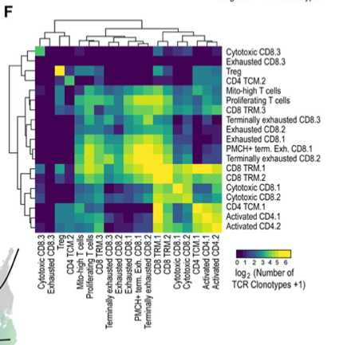

**Author(s)**: `r params$author`  
**Reviewer(s)**: `r params$reviewer`  
**Date**: `r Sys.Date()` 

# Academic Citation
If you use this code in your work or research, we kindly request that you cite our publication:

Xiaofan Lu, et al. (2025). FigureYa: A Standardized Visualization Framework for Enhancing Biomedical Data Interpretation and Research Efficiency. iMetaMed. https://doi.org/10.1002/imm3.70005

```{r setup, include=FALSE}
knitr::opts_chunk$set(echo = TRUE)
```

# 需求描述
# Requirements Description

不同细胞类型间的共享克隆热图。

Heatmap showing shared clonotypes between different cell types.



出自：<https://www.cell.com/cancer-cell/fulltext/S1535-6108(21)00115-X>

图4. TCR分析揭示终末耗竭T细胞的克隆多样性降低。(F) 热图显示表型"同质"克隆型（主要存在于单一细胞亚群中的克隆型）与表型"异质"克隆型（主要分布于多个细胞亚群中的克隆型）的相对数量。

Source: <https://www.cell.com/cancer-cell/fulltext/S1535-6108(21)00115-X>

Figure 4. TCR analysis reveals lower diversity in terminally exhausted T cells. 
(F) Heatmap displaying the relative numbers of phenotypically “homogeneous” clonotypes (i.e. clonotypes found predominantly in 1 cluster) and phenotypically “heterogeneous” clonotypes (i.e. clonotypes predominantly distributed across multiple clusters). 

# 应用场景
# Application Scenario

评估克隆型在各细胞类型间分布情况，并绘制热图，颜色表示各细胞类型间共享克隆型的对数值。

Evaluate the distribution of clonotypes across different cell types and plot a heatmap where color represents the logarithmic value of shared clonotypes between cell types.

# 环境设置
# Environment Setup

```{r}
source("install_dependencies.R")

library(openxlsx)
library(ComplexHeatmap)

# 显示英文报错信息
# Show English error messages
Sys.setenv(LANGUAGE = "en")

# 禁止chr转成factor
# Prevent character-to-factor conversion
options(stringsAsFactors = FALSE) 
```

# 输入文件
# Input Files

cell.info.txt，应当包含barcode列(barcode)，细胞类型列(celltype)，克隆型列(clonaltype)。

- 细胞类型的获得需要识别细胞簇并进行细胞类型注释。由于目前对细胞亚型的注释未有通用工具，且注释结果受个人影响差异较大，因此本部分假设使用者已经完成了细胞分群和细胞注释。
- 克隆型可由cellranger VDJ分析模块生成，一般储存在*all_contig_annotations.csv中，克隆型根据使用者的偏好也可由其他软件进行再校准，有较高的自由度，因此本部分假设使用者已从cellranger或其他软件中获得克隆型数据。

cell.info.txt should contain barcode column (barcode), cell type column (celltype), and clonotype column (clonaltype).

- Obtaining cell types requires identifying cell clusters and performing cell type annotation. Since there is currently no universal tool for cell subtype annotation and the results vary significantly between individuals, this section assumes that the user has completed cell clustering and annotation.
- Clonotypes can be generated by the cellranger VDJ analysis module, usually stored in *all_contig_annotations.csv. Clonotypes can also be recalibrated using other software according to user preferences, offering high flexibility. Therefore, this section assumes that the user has obtained clonotype data from cellranger or other software. 

```{r}
# 读取细胞信息文件
# Read cell information file
cell.info <- read.table("cell.info.txt", sep = "\t", header = T)

# 移除定义不明确的类
# Remove poorly defined classes
cell.info <- cell.info[-which(cell.info$celltype == "-1"),] 
cell.info <- cell.info[-which(cell.info$celltype == ""),] 
cell.info <- cell.info[-which(cell.info$celltype == "Cyto"),]

# 获取所有细胞类型
# Get all cell types
celltypes <- unique(cell.info$celltype)

# 计算各细胞类型间共享的克隆型数量
# Calculate the number of shared clonotypes between cell types
count <- lapply(celltypes, function(A){
  sapply(celltypes, function(B){
    length(intersect(
      cell.info[["clonaltype"]][cell.info[["celltype"]] == A],
      cell.info[["clonaltype"]][cell.info[["celltype"]] == B]
    ))
  })
})

# 将列表转换为矩阵
# Convert list to matrix
count <- do.call(rbind, count)
rownames(count) = colnames(count) = celltypes

# 输出各细胞类型共享的克隆型数目
# Output the number of shared clonotypes
write.table(count, "output_count.txt", row.names = T, col.names = T, sep = "\t", quote = F)
```

# 开始画图
# Plotting

```{r fig.width=8, fig.height=8}
# 设置热图数值上限
# Set upper limit for heatmap values
upper <- 6 

# 设置行列顺序
# Set row and column order
plot.order <- c("Cytotoxic CD8.3", 
                "Treg",
                "CD4 TCM.2", 
                "Mito-high T cells", 
                "Proliferating T cells",
                "CD8 TRM.3", 
                "Terminally exhausted CD8.3",
                "Exhausted CD8.2", "Exhausted CD8.1", 
                "PMCH+ terminally Exhausted CD8.1",
                "Terminally exhausted CD8.2",
                "CD8 TRM.1",
                "CD8 TRM.2",
                "Cytotoxic CD8.1",
                "Cytotoxic CD8.2",
                "CD4 TCM.1",
                "Activated CD4.1",
                "Activated CD4.2") 

# 读取计算结果
# Read calculation results
count <- read.table("output_count.txt", header = T, sep = "\t", check.names = F)

# 对数值进行对数转换
# Perform logarithmic transformation on values
count <- log(1 + count)

# 设置上限
# Set upper limit
count[count > upper] = upper

# 按指定顺序排列
# Arrange according to specified order
count <- count[plot.order, plot.order]

# 绘制热图
# Draw heatmap
hm <- pheatmap(as.matrix(count), 
         color = colorRampPalette(c("#440052", "#259290", "#F8E725"))(100),
         border_color = NA,
         #cluster_rows = F, 
         #cluster_cols = F,
         show_colnames = T, 
         show_rownames = T,
         cellwidth = 12, 
         cellheight = 12,
         name = "log(1+Number of\nTCR clonaltypes)")
hm

# 保存为PDF
# Save as PDF
pdf(file = "count_heatmap.pdf", width = 8, height = 8)
draw(hm)
invisible(dev.off())
```

# Session Info

```{r}
sessionInfo()
```
