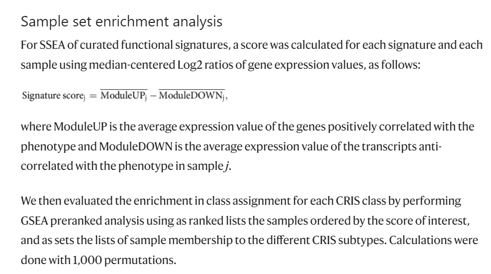

**Author(s)**: `r params$author`  
**Reviewer(s)**: `r params$reviewer`  
**Date**: `r Sys.Date()` 

# Academic Citation
If you use this code in your work or research, we kindly request that you cite our publication:

Xiaofan Lu, et al. (2025). FigureYa: A Standardized Visualization Framework for Enhancing Biomedical Data Interpretation and Research Efficiency. iMetaMed. https://doi.org/10.1002/imm3.70005

```{r setup, include=FALSE}
knitr::opts_chunk$set(echo = TRUE)
```

# 需求描述
# Demand description

这篇文章中SSEA算法可否复现？数据没有限制，想学习一下这个计算流程。

Can the SSEA algorithm in this paper be reproduced? There are no data restrictions, and I'd like to learn this computational workflow.



出自：<https://www.nature.com/articles/ncomms15107>

Source: <https://www.nature.com/articles/ncomms15107>

# 应用场景
# Application scenarios

计算通路的亚型富集得分(SSEA)，并绘制各亚型SSEA得分雷达图。

如果只想画雷达图，可以套用easy_input_SSEA.txt的格式调整自己的数据，直接前往“开始画图”。

适合同时展示多组数据的多个特征。

一组数据多个特征或多组数据一个特征，可参考FigureYa8radar ，画成花瓣雷达图。

Calculate the subtype enrichment scores (SSEA) for pathways and plot radar charts of SSEA scores for each subtype.

If you only want to draw the radar chart, you can format your data according to the structure of easy_input_SSEA.txt and go directly to the "Start plotting" section.

Suitable for simultaneously displaying multiple features across multiple datasets.

A single dataset with multiple features or multiple datasets with a single feature, you can refer to FigureYa8radar  to create petal-style radar charts.

# 环境设置
# Environment Setup

```{r}
source("install_dependencies.R")

library(openxlsx)
library(GSVA)
library(org.Hs.eg.db)
library(ggplot2)
library(fmsb)
library(fgsea)
library(dplyr)

# 显示英文报错信息
# Show English error messages
Sys.setenv(LANGUAGE = "en") 

# 禁止chr转成factor
# Prevent character-to-factor conversion
options(stringsAsFactors = FALSE) 
```

自定义函数

Custom Functions

```{r}
### 计算样本通路得分
### Calculate pathway scores for samples

# 注：其中样本通路得分也可用GSVA代替
# Note: GSVA can be used as an alternative method for calculating sample pathway scores
ModuleScore <- function(expr, geneset){
  if (max(expr)>50) expr = log2(1+expr)
  base = apply(expr, 1, median)
  base = matrix(base, nrow = length(base), ncol = ncol(expr), byrow = FALSE)
  expr = expr-base
  score = lapply(geneset, function(gene){
    apply(expr[gene, ], 2, mean, na.rm = T)
  })
  return(do.call(rbind, score))
}

### 样本集富集分析 (SSEA)
### Sample set enrichment analysis (SSEA)
EnrichScore <- function(scores, group){
  group = split(names(scores), group)
  scores = sort(scores, decreasing = T)
  setNames(fgsea(pathways = group, stats = scores)$NES, names(group))
}
```

# 输入文件
# Input Files

TCGA-READ.htseq_counts.tsv.gz，TCGA-COAD.htseq_counts.tsv.gz，表达谱eset。TCGA其他癌症类型表达数据可以到XENA下载<https://xenabrowser.net/datapages/>

41467_2017_BFncomms15107_MOESM425_ESM.xlsx，样本分组信息subtype。

signature.xlsx，基因集signature【包含up和down两个列表】

TCGA-READ.htseq_counts.tsv.gz, TCGA-COAD.htseq_counts.tsv.gz - Expression profiles (eset). For other TCGA cancer type expression data, visit XENA: <https://xenabrowser.net/datapages/>

41467_2017_BFncomms15107_MOESM425_ESM.xlsx - Sample subtype classification information.

signature.xlsx - Gene signatures [contains both UP and DOWN lists]

```{r}
## 读取基因集，表达谱和亚型信息
## Read gene signatures, expression profiles and subtype information

### 读取基因集
### Read gene signatures
signature <- read.xlsx("signature.xlsx", sheet = "clean")
signature <- split(signature, signature$Type)
signature <- lapply(signature, function(sig){
  geneList = strsplit(sig$Gene, " ")
  names(geneList) = sig$Pathway
  return(geneList)
})

### 读取表达谱
### Read expression profiles
eset <- lapply(list.files(pattern = "tsv.gz"), read.table, 
               row.names = 1, header = T, check.names = F)
eset <- do.call(cbind, eset)
eset <- eset[, substr(colnames(eset), 14, 16) == "01A"]
colnames(eset) <- substr(colnames(eset), 1, 12)
rownames(eset) <- gsub("(.+)\\.(.+)", "\\1", rownames(eset))
tmp <- AnnotationDbi::select(org.Hs.eg.db, rownames(eset),
                             columns = "SYMBOL", keytype = "ENSEMBL")
SYMBOL <- tmp$SYMBOL[match(rownames(eset), tmp$ENSEMBL)]
eset <- eset[!duplicated(SYMBOL) & !is.na(SYMBOL), ]
rownames(eset) <- SYMBOL[!duplicated(SYMBOL) & !is.na(SYMBOL)]

### 读取亚型信息
### Read subtype information
subtype <- read.xlsx("41467_2017_BFncomms15107_MOESM425_ESM.xlsx",
                     startRow = 3)
subtype <- subtype[subtype$Dataset.ID == "TCGA", ]
rownames(subtype) <- subtype$Sample.ID

### 整理样本信息
### Process sample information
comsam <- intersect(colnames(eset), subtype$Sample.ID)
eset <- eset[, comsam]
subtype <- subtype[comsam, "CRIS.Assignment"]
```

# 计算通路得分
# Calculate pathway scores

```{r}
### 计算各样本的通路得分
### Compute pathway scores for each sample
pathway <- Reduce(union, lapply(signature, names))
score <- lapply(signature, function(sig){
  s = as.data.frame(ModuleScore(eset, sig))
  s = s[pathway, ]
  s[is.na(s)] = 0
  return(s)
})
score <- score$UP - score$DOWN

### 计算SSEA
### Compute SSEA (Single Sample Enrichment Analysis)
score <- apply(score, 1, EnrichScore, group = subtype)
colnames(score) <- pathway

# 输出各亚型SSEA得分
# Output SSEA scores for each subtype
write.table(score, "easy_input_SSEA.txt", 
            row.names = T, col.names = NA, sep = "\t", quote = F)
```

# 开始画图
# Plotting

绘制雷达图

Draw radar chart

```{r}
### 设置颜色
### Set colors
color = setNames(c("#EF4A2B", "#D52026", "#1C265B", "#008646", "#00AB9B"),
                 c("CRISA", "CRISB", "CRISC", "CRISD", "CRISE"))

### 准备绘图数据
### Prepare plot data
plot.data <- read.table("easy_input_SSEA.txt", sep = "\t", header = T, row.names = 1)
# plot.data <- plot.data + min(plot.data)

#### 对通路顺序进行排序，保证富集在同一亚型的通路在相近的位置
#### Sort pathway order to ensure pathways enriched in same subtype are adjacent
set.order <- data.frame( 
  row.names = colnames(plot.data),
  "maxcol" = apply(plot.data, 2, which.max),
  "maxprop" = apply(plot.data, 2, max)/colSums(plot.data)
)
set.order <- arrange(set.order, set.order$maxcol, -set.order$maxprop)
plot.data <- plot.data[, rownames(set.order)]

plot.data <- rbind(
  min = min(plot.data), max = max(plot.data), plot.data
)

## 绘制雷达图
## Draw radar chart

# 雷达图和图例的比例
# Radar chart and legend ratio
width = c(3, 1) 
layout(cbind(matrix(1, nrow = 2, ncol = width[1], byrow = TRUE),
             matrix(2, nrow = 2, ncol = width[2], byrow = TRUE)))
radarchart(plot.data, 
           pcol = color, plty = "solid", plwd = 3)  
plot.new()
legend(x = "center", legend = names(color),
       bty = "n", pch = 20 , col = color,
       text.col = "black", cex = 1, pt.cex = 1.5
) 
dev.copy2pdf(file = file.path("SSEA.radar.pdf"),
             width = 8, height = 8)
```

# Session Info

```{r}
sessionInfo()
```
