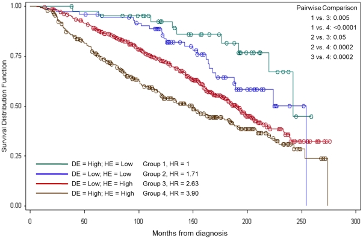
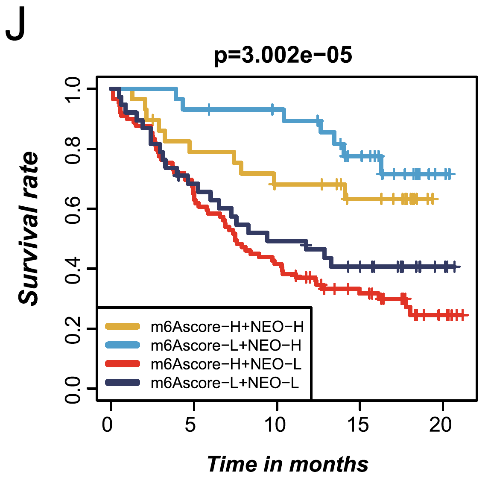

**Author(s)**: `r params$author`  
**Date**: `r Sys.Date()`  


# Academic Citation
If you use this code in your work or research, we kindly request that you cite our publication:

Xiaofan Lu, et al. (2025). FigureYa: A Standardized Visualization Framework for Enhancing Biomedical Data Interpretation and Research Efficiency. iMetaMed. https://doi.org/10.1002/imm3.70005


```{r setup, include=FALSE}
knitr::opts_chunk$set(echo = TRUE)
```

# 需求描述
# Requirement description

用R画出paper里的双因子生存分析图，计算p value。

Use R to draw the two-factor survival analysis plot from the paper and calculate the p value.



出自<https://www.ncbi.nlm.nih.gov/pmc/articles/PMC3282708/>

图 4. 使用DE和HE表达水平组合的总生存率曲线。单变量Cox回归用于确定HR；报告的是对数检验p值；配对比较的Bonferroni多重检验调整 p = 0.05/5 = 0.01。DE：恶性上皮组织中的Decorin 染色。上皮组织中的Decorin染色。HE：恶性上皮组织中的HSP90B1染色。HR：危险比

另外，小伙伴用到这个FigureYa发表了文章，供参考：

from<https://www.ncbi.nlm.nih.gov/pmc/articles/PMC3282708/>

Figure 4. Overall survival curves using combinations of DE and HE expression levels. Univariate Cox regression used to determine HR;
logrank p-values reported; Bonferroni multiple testing adjustment for pairwise comparisons p = 0.05/5 = 0.01. DE: Decorin staining in malignant
epithelial tissue. HE: HSP90B1 staining in malignant epithelial tissue. HR: Hazard ratio

Additionally, a colleague used this FigureYa to publish an article for reference:

{width=300px}")

出自<https://molecular-cancer.biomedcentral.com/articles/10.1186/s12943-020-01170-0>

from<https://molecular-cancer.biomedcentral.com/articles/10.1186/s12943-020-01170-0>

# 应用场景
# Application scenario

对比两个因素对生存的影响。

例如，基因A和B都高表达，跟基因A和B都低表达比起来，生存期是否更长？

Compare the effects of two factors on survival.

For example, does high expression of both genes A and B result in longer survival compared to low expression of both genes A and B?

# 环境设置
# Environment setting


use the domestic mirror installation package

```{r}
source("install_dependencies.R")
```


load package

```{r}
library(survival)
library(survminer)
Sys.setenv(LANGUAGE = "en") #显示英文报错信息 display English error messages
options(stringsAsFactors = FALSE) #禁止chr转成factor prohibit the conversion of chr to factor
```

# 输入文件
# Input file

至少包含5列：依次是sample名字、Time、Death、第一个基因的表达量（基因名作为列名）、第二个基因的表达量（基因名作为列名）。**顺序不要变**

此处提取FigureYa35batch_bestSeparation的基因AKAP12和MAP2K6作为输入文件，以基因AKAP12和MAP2K6作为双因素。

It contains at least 5 columns: sample name, Time, Death, expression of the first gene (gene name as column name), and expression of the second gene (gene name as column name), in that order. **don't change the order**

Here the genes AKAP12 and MAP2K6 of FigureYa35batch_bestSeparation are extracted as input files, and the genes AKAP12 and MAP2K6 are used as two-factors.

```{r}
df <- read.csv("easy_input.csv",row.names = 1)
head(df)
```

# 基因表达量高低的划分
# Classification of gene expression levels low and high

这里提供两种方法划分基因表达水平的low和high：

- 方法1. 用FigureYa35batch_bestSeparation找出最佳分组，获得划分low和high的分界表达量；基因AKAP12和MAP2K6的low跟high的分界表达量分别是766.37和880.23。

Here are two methods to classify gene expression levels as low and high:

- Method 1. Use FigureYa35batch_bestSeparation to find out the best grouping and get the cut-off expression amount for dividing the low and high; the cut-off expression amounts of low and high for genes AKAP12 and MAP2K6 are 766.37 and 880.23 respectively.

```{r}
df$bestA <- cut(df[,3],breaks=c(-Inf,766.37, Inf), #其中766.37要改成你的基因A的高低分界值 among them, 766.37 should be changed to the high and low boundary value of your gene A
                   labels=c("0","1"))
df$bestB <- cut(df[,4],breaks=c(-Inf,880.23, Inf), #其中880.23要改成你的基因B的高低分界值 among them, 880.23 should be changed to the high and low boundary value of your gene B
                   labels=c("0","1"))
df$bestGroup <- paste0(df$bestA,df$bestB)
#按照两个基因表达量高低的排列组合分成4组
#divided into 4 groups according to the arrangement of high and low expression of the two genes
df$bestGroup <- ifelse(df$bestGroup=='00','1',ifelse(df$bestGroup=='10','2',ifelse(df$bestGroup=="01","3","4")))
head(df)

df$group <- df$bestGroup
```

- 方法2. 用中位数划分表达量的高与低

- Method 2: Classify high and low expression levels by medians

```{r eval=FALSE}
df$medA <- cut(df[,3],breaks=c(-Inf,median(df[,3]), Inf),
                   labels=c("0","1"))
df$medB <- cut(df[,4],breaks=c(-Inf,median(df[,4]), Inf),
                   labels=c("0","1"))
df$medGroup <- paste0(df$medA,df$medB)
#按照两个基因表达量高低的排列组合分成4组
#divided into 4 groups according to the arrangement of high and low expression of the two genes
df$medGroup <- ifelse(df$medGroup=='00','1',ifelse(df$medGroup=='10','2',ifelse(df$medGroup=="01","3","4")))
head(df)

df$group <- df$medGroup
```

# 统计运算
# Statistical operations

```{r}
#定义结局变量，生存时间和结局
#define ending variables, survival times and endings
y <- Surv(df$futime, df$fustat==1)

#logrank检验两两比较的结果
#logrank test for two-by-two comparisons
comp <- pairwise_survdiff(Surv(futime,fustat) ~ group, data = df)
pvalue <- as.vector(unlist(comp$p.value))

#将p value和两两比较的组别生成两列的数据集
#generate a two-column dataset of p values and two-by-two comparison groups
name <- array(dim=c(3,3))
for(i in 1:3){
  for(j in 2:4){
    name[i,j-1] = print(paste(i,j,sep = " vs "))
  }
}
pvalue_name <- as.vector(t(name))
logrank <- data.frame(pvalue_name,pvalue)
logrank

#挑选p value小于0.05的记录
#select records with p value less than 0.05
logrank_sig <- subset(logrank, pvalue < 0.05)
#如果p值太小，就写“<0.0001”，否则保留小数点后4位
#if the p-value is too small, write “<0.0001”, otherwise keep 4 decimal places
logrank_sig$pvalue <- lapply(logrank_sig$pvalue,function(i)
  ifelse (i<0.0001,"<0.0001",round(i, 4)))
logrank_sig

#进行COX回归，导出每组对应的HR值，并将1赋值给对照组
#perform COX regression, derive the corresponding HR values for each group, and assign 1 to the control group
coxph.fit <- coxph(y ~ as.factor(group), data = df) 
hr <- round(coef(summary(coxph.fit))[,2],3)
HR <- c(1,as.vector(unlist(hr)))
```

# 开始画图
# Start drawing

右上角的图例有时会跟曲线重叠，因此，我们把图例画到图右侧。

The legend in the upper right corner sometimes overlaps the curve, so we draw the legend to the right side of the graph.

```{r}
#KM曲线的绘制
#KM curve plotting
kmfit <- survfit(y~df$group,)

#写legend
#write legend
A = c("Low; ", "High;", "Low; ", "High;")
B = c("Low; ", "Low; ", "High;", "High;")
Group = c(1,2,3,4)
text.legend1 <- paste0(colnames(df)[3], " = ", A, colnames(df)[4], " = ", B, " Group = ", Group, ", HR = ", HR)
text.legend2 <- paste0(logrank_sig$pvalue_name," : ",logrank_sig$pvalue)

#自定义足够你用的颜色
#customize enough colors for you
mycol <- c("#223D6C","#D20A13","#FFD121","#088247","#11AA4D","#58CDD9","#7A142C","#5D90BA","#431A3D","#91612D","#6E568C","#E0367A","#D8D155","#64495D","#7CC767")

#画图，并保存到pdf文件
#draw and save to a pdf file
pdf("nSurv.pdf",width = 7,height = 6)
par(xpd = T, 
    mar = par()$mar + c(0,0,0,5)#,#在右侧给图例留出空间 leave space for the legend on the right side
    #cex.axis=0.8, cex.lab=1, cex.main=1, cex.sub=1 #修改字体大小 modify font size
    )
plot(kmfit, 
     col= mycol, 
     lwd = 1.4,#线的粗细 thickness of line
     #pch = "o", #如果你也想让观测点的形状是o，就运行这行 if you also want the observation point to be shaped like an o, run this line
     xlab="Months from diagnosis", 
     ylab="Survival Distribution Function", 
     mark.time=TRUE)
legend("bottomleft", lty=c("solid","solid","solid","solid"),
       col=mycol, 
       legend=text.legend1, 
       bty="n", 
       lwd = 2,
       cex=0.8)
legend("topright", 
       inset=c(-0.3,0), #图例画到图外面 legend is drawn to the outside of the figure
       legend=c("Pairwise comparison",text.legend2), 
       bty="n", 
       cex=0.8)
dev.off()
```

# 对比两种方法的效果
# Compare the effects of the two methods

用FigureYa35找到最佳分组的分界表达量划分low与high

Use FigureYa35 to find the optimal grouping of the cutoff expression dividing low and high


用中位数划分low与high

Use the median to divide low and high


```{r}
sessionInfo()
```