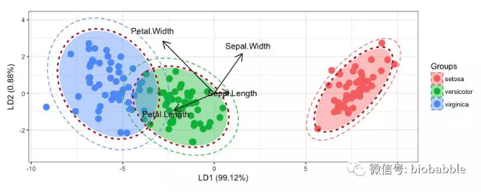
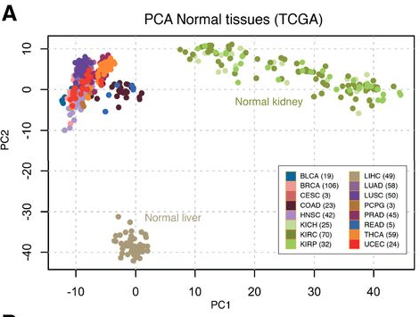

**Author(s)**: `r params$author`  
**Date**: `r Sys.Date()`  


# Academic Citation
If you use this code in your work or research, we kindly request that you cite our publication:

Xiaofan Lu, et al. (2025). FigureYa: A Standardized Visualization Framework for Enhancing Biomedical Data Interpretation and Research Efficiency. iMetaMed. https://doi.org/10.1002/imm3.70005

```{r setup, include=FALSE}
knitr::opts_chunk$set(echo = TRUE)
```

## 需求描述
## Requirement description

用TCGA数据画主成分分析(pricinple components analysis，PCA)的图。

例如：[画个小圈圈](https://mp.weixin.qq.com/s/8kqTVSDjuHpivGaim6ukNg)里的这个图：

Draw plot of principal components analysis (PCA) with TCGA data.

For example, this graph in [draw a small circle](https://mp.weixin.qq.com/s/8kqTVSDjuHpivGaim6ukNg):




出自<http://www.haematologica.org/content/102/7/e245>

from<http://www.haematologica.org/content/102/7/e245>



出自<http://clincancerres.aacrjournals.org/content/23/8/2105.figures-only>

from<http://clincancerres.aacrjournals.org/content/23/8/2105.figures-only>

## 应用场景
## Application scenario

通常我们拿到的数据集，例如转录组的表达量矩阵都有成千上万个基因，这类高维度数据很难直接进行可视化展示。

为了能够在二维平面上展示，就需要对其进行降维，而PCA分析是目前最常用的降维工具。

然后你就能在图上一眼看出哪些样品之间更像，哪些样品属于/不属于同一组。不仅适用于测序数据。

场景一：多个分组，每组三次生物学重复。做PCA，看到某个样品远离了组内其他样品，它有什么问题？

场景二：多个分组，分三批送去测序。做PCA，看不出分组的规律，却看到同一批次的样品间距离更近，批次效应？

Usually we get datasets, for example, the expression matrix of transcriptome has thousands of genes, and this kind of high-dimensional data is difficult to visualize and display directly.

In order to be able to display it on a two-dimensional plane, it needs to be downscaled, and PCA analysis is currently the most commonly used downscaling tool.

Then you can see at a glance on the graph which samples are more similar to each other and which samples belong/do not belong to the same group. Not only applicable to sequencing data.

Scenario 1: Multiple subgroups, three biological replicates per group. Do PCA and see that one sample is far away from the other samples in the group, what's wrong with it?

Scenario 2: Multiple subgroups, sent for sequencing in three batches. Do PCA, don't see a pattern in the grouping, but see samples in the same batch closer to each other, batch effect?

## 环境设置
## Environment Setup

```{r}
source("install_dependencies.R")
source("ggord.R") # from ggord packge, https://github.com/fawda123/ggord
source("geom_ord_ellipse.R") # from gglayer package, https://github.com/GuangchuangYu/gglayer
library(ggplot2)
library(plyr)
library(ggplot2)
library(dplyr)
library(plyr)
```

## 输入数据
## Input data

两个输入文件:

- 表达量矩阵：easy_input_expr.csv，第一列是样品名，后续几列是各个基因的表达量，或者其他属性
- 样品分组：easy_input_meta.csv，第一列是样品名，第二列是分组

此处输入数据为3种癌症BRCA、OV、LUSC里，5个基因"GATA3", "PTEN", "XBP1","ESR1", "MUC1"的表达量。

数据来源：用R包`RTCGA.mRNA`提取TCGA数据。也可参考FigureYa18、21（临床信息）、FigureYa22、23、34（表达矩阵）里的数据下载方法。

Two input files:

- Expression matrix: easy_input_expr.csv, the first column is the sample name, the subsequent columns are the expression of each gene, or other attributes
- Sample grouping: easy_input_meta.csv, the first column is the sample name, the second column is the grouping.

The input data here is the expression of 5 genes "GATA3", "PTEN", "XBP1", "ESR1", "MUC1" in 3 cancers BRCA, OV, LUSC.

Data source: using the R package `RTCGA.mRNA` extracts TCGA data. See also the data download methods in FigureYa18, 21 (clinical information) and FigureYa22, 23, 34 (expression matrix).

```{r}
expr_df <- read.csv(file='easy_input_expr.csv',row.names = 1, 
                    header = TRUE, sep=",", stringsAsFactors = FALSE)
meta_df <- read.csv(file='easy_input_meta.csv', row.names = 1,
                    header = TRUE, sep=",",stringsAsFactors = FALSE)
#查看前3个基因在前4个sample中的表达矩阵
#view the expression matrix of the first 3 genes in the first 4 samples
expr_df[1:3,1:4]
#查看样本信息前3行
#view the first 3 lines of sample information
head(meta_df, n=3)
```

## 做PCA
## Do PCA

```{r,fig.width=6,fig.height=6}
#用`prcomp`进行PCA分析
#PCA analysis with `prcomp`
pca.results <- prcomp(expr_df, center = TRUE, scale. = FALSE)

#定义足够多的颜色，用于展示分组
#define enough colors for display groupings
mycol <- c("#223D6C","#D20A13","#088247","#FFD121","#11AA4D","#58CDD9","#7A142C","#5D90BA","#431A3D","#91612D","#6E568C","#E0367A","#D8D155","#64495D","#7CC767")
```

## 开始画图
## Start drawing

这里提供两种方法：

- 方法一：自动画图。用现成的R包全自动画图，必要时只需调整参数。

- 方法二：提取PCA分析结果，手动画图。

Two methods are provided here:

- Method 1: Automatic drawing. Use the ready-made R package to draw graphs automatically, and only need to adjust the parameters when necessary.

- Method 2: Extract the PCA analysis results and draw the graph manually.

### 方法一：自动画图
### Method 1: Automatic drawing

用到做PCA的R包`ggord`，优点是能用背景色展示置信区间，缺点是没有画圈功能。

Guangchuang Yu对ggord进行了加强，放在R包`gglayer`里，详情看这篇：<https://mp.weixin.qq.com/s/iA0IuyRx_Ojk639sxenmvg>。`geom_ord_ellipse`能画出多个圆圈，用来展示不同的置信区间，并且可以反复叠加，想画几个圈就画几个圈。

The R package `ggord` used for PCA has the advantage of displaying confidence intervals with background color, but the disadvantage is that it does not have the function of drawing circles.

Guangchuang Yu enhanced ggord and put it in the R package `gglayer`, see this article for details: <https://mp.weixin.qq.com/s/iA0IuyRx_Ojk639sxenmvg>. `geom_ord_ellipse` which can draw multiple circles to show different confidence intervals, and can be stacked over and over again to draw as many circles as you want.

#### 经典版
#### Classic version

```{r}
#用ggord画基本PCA图
#draw basic PCA graph with ggord
ggord(pca.results, grp_in = meta_df$group, repel=TRUE,
      ellipse = FALSE, #不显示置信区间背景色 confidence interval background color is not displayed
      size = 2, #样本的点大小 point size of the sample
      alpha=0.5, #设置点为半透明，出现叠加的效果 set the point to be semi-transparent, resulting in an overlay effect.
      #如果用自定义的颜色，就运行下面这行
      #if using a custom color, run the following line
      cols = mycol[1:length(unique(meta_df$group))],
      arrow = NULL,txt = NULL) + #不画箭头和箭头上的文字 no drawing of arrows and text on arrows
  theme(panel.grid =element_blank()) + #去除网格线 remove gridlines
  
  #用gglayer添加置信区间圆圈
  #add confidence interval circles with gglayer
  geom_ord_ellipse(ellipse_pro = .95, #设置置信区间 set confidence interval
                   size=1.5, #线的粗细 thickness of the line
                   lty=1 ) #实线 solid line

#保存到pdf文件
#save to pdf file
ggsave("PCA_classic.pdf", width = 6, height = 6)
```

#### 箭头版
#### Arrowhead version

```{r}
#用ggord画基本PCA图和置信区间背景色
#draw basic PCA plots and confidence interval background colors with ggord
ggord(pca.results, grp_in = meta_df$group, repel=TRUE,
      alpha = 0.6,#点和置信区间背景设为半透明，以凸显箭头和文字 the point and confidence interval backgrounds are set to semi-transparent to emphasize the arrows and the text
      #或者单独修改置信区间背景的透明度
      #or modify the transparency of the background of the confidence interval individually
      #alpha_el = 0.3,
      ellipse_pro = 0.95,#置信区间 confidence interval
      size = 2,
      #如果想用默认的颜色，就在下面这行前面加个#
      #if you want to use the default colors, put a # in front of the following line
      #cols = mycol[1:length(unique(meta_df$group))],
      arrow=0.2, #箭头的头的大小 size of the head of the arrow
      vec_ext = 5,#箭头尾巴长短 length of arrow tail
      veccol="brown",#箭头颜色 arrow Color
      txt=3) + #箭头指向的基因名的字体大小 font size of the gene name pointed to by the arrow
  theme(panel.grid =element_blank()) + 
  
  #用gglayer继续添加虚线的置信区间
  #continue to add dashed confidence intervals with gglayer
  geom_ord_ellipse(ellipse_pro = .95, #先画个.95的圆圈 draw a .95 circle first
                   color='darkgrey', #圈圈的颜色 color of the circle
                   size=0.5, 
                   lty=2 ) + #画成虚线，可以用1-6的数字设置为其他线型 draw as a dotted line, which can be set to other line types using the numbers 1-6
  geom_ord_ellipse(ellipse_pro = .98, #再画个.98的圆圈 draw another .98 circle
                   #color='grey', #把这行注释掉，就是跟点一样的颜色 comment out this line, it's the same color as the dot
                   size=0.5, lty=2 ) 

#保存到pdf文件
#save to pdf file
ggsave("PCA_arrow.pdf", width = 6, height = 6)
```

### 方法二：提取PCA分析结果，手动画图
### Method 2: Extract the PCA analysis results and draw the graph manually

#### 从PCA结果到画图所需的输入数据整理
#### Organize the input data needed from PCA results to drawing graph

用`prcomp`进行PCA分析后，获取降维后每个样本对应的主成分值和每个主成分的解释的变异。

After PCA analysis with `prcomp`, obtain the principal component values corresponding to each sample after dimensionality reduction and the variance explained by each principal component.

```{r,message=FALSE}
pca.rotation <- pca.results$rotation
pca.rotation
pca.pv <- summary(pca.results)$importance[2,]
pca.pv
```

调整数据结构，用于作图

提取前两个主成分构建数据框，并增加分组信息列

Adjust data structure for graphing

Extract the first two principal components to construct the data frame and add columns for grouping information

```{r}
low_dim_df <- as.data.frame(pca.results$x[,c(1,2)])
low_dim_df$group <- meta_df$group
#查看前3行
#view the first 3 rows
low_dim_df[1:3,]
```

下面以PCA分析得到的"low\_dim\_df"作为输入，画图

The following is a graph using "low\_dim\_df" obtained from PCA analysis as input

#### 画置信区间圆圈的函数
#### Function to draw confidence interval circle

先运行函数`add_ellipase`，用来增加置信区间椭圆线。

通过调整参数，以达到你想要的效果，参数含义为：

- p: ggplot2返回的对象
- x,y: 主成分的列名
- group: 分组列
- ellipse_pro: 置信区间，默认0.95
- linetype可选类型: blank, solid, dashed, dotted, dotdash, longdash, twodash
- colour：颜色
- lwd：线的粗细

First run the function `add_ellipase` to add confidence interval ellipse.

By adjusting the parameters to achieve your desired effect, the meanings of the parameters are:

- p: object returned by ggplot2
- x,y: column names of the principal components
- group: grouped columns
- ellipse_pro: confidence interval, default 0.95
- linetype options: blank, solid, dashed, dotted, dotdash, longdash, twodash
- colour: color
- lwd: thickness of the line

```{r}
add_ellipase <- function(p, x="PC1", y="PC2", group="group",
                         ellipase_pro = 0.95,
                         linetype="dashed",
                         colour = "black",
                         lwd = 2,...){
  obs <- p$data[,c(x, y, group)]
  colnames(obs) <- c("x", "y", "group")
  ellipse_pro <- ellipase_pro
  theta <- c(seq(-pi, pi, length = 50), seq(pi, -pi, length = 50))
  circle <- cbind(cos(theta), sin(theta))
  ell <- ddply(obs, 'group', function(x) {
    if(nrow(x) <= 2) {
      return(NULL)
    }
    sigma <- var(cbind(x$x, x$y))
    mu <- c(mean(x$x), mean(x$y))
    ed <- sqrt(qchisq(ellipse_pro, df = 2))
    data.frame(sweep(circle %*% chol(sigma) * ed, 2, mu, FUN = '+'))
    })
  names(ell)[2:3] <- c('x', 'y')
  
  ell <- ddply(ell, .(group) , function(x) x[chull(x$x, x$y), ])
  p <- p + geom_polygon(data = ell, aes(x=x,y=y,group = group), 
                   colour = colour,
                   alpha = 1,fill = NA,
                   linetype=linetype,
                   lwd =lwd)
  return(p)
}
```

#### 开始画图
#### Start drawing

```{r}
#计算坐标轴标签
#calculate axis labels
pc1.pv <- paste0(round(pca.pv['PC1'],digits = 3) * 100, "%")
pc2.pv <- paste0(round(pca.pv['PC2'],digits = 3) * 100, "%")

#画出各个样本在二维空间的点
#draw the points of each sample in two-dimensional space
p <- ggplot(low_dim_df) + 
  geom_point(aes(x=PC1, y=PC2, color=group), size=2, #点的大小 size of the dot
             shape=20,#点的形状 shape of the dot
             alpha=0.5) +#设置点为半透明，出现叠加的效果 set the dot to be semi-transparent, resulting in an overlay effect.
  #如果使用默认的颜色，就在下面这行前面加个#
  #if you use the default colors, put a # in front of the following line
  scale_color_manual(values = mycol[1:length(unique(meta_df$group))]) +
  #还能调整整体的颜色亮度
  #it also adjusts the overall color brightness
  #scale_colour_hue(l=45) + 
  theme_bw() + #去除背景色 remove background color
  theme(panel.grid =element_blank()) + #去除网格线 remove gridlines
  
  #添加标签，同样可以加到方法一的同一位置
  #add labels, which can also be added to the same location as method one
  annotate("text",x=-8.5,y=-1.2,label = "BRCA",color = mycol[1]) +
  annotate("text",x=5,y=5.6,label = "LUCA",color = mycol[2]) +
  annotate("text",x=5,y=-2.5,label = "OV",color = mycol[3]) +
  
  #图例
  #legend
  guides(color=guide_legend(title = NULL)) +
  theme(legend.background = element_blank(), #移除整体边框 remove overall border
        #图例的左上角置于绘图区域的左上角
        #the upper left corner of the legend is placed in the upper left corner of the drawing area
        legend.position = c(0,1),legend.justification = c(0,1),
        legend.text = element_text(size=12)) + #字体大小 font size

  #调整坐标轴标签
  #adjust axis labels
  xlab(paste0("PC1 ( ", pc1.pv," variance )")) + 
  ylab(paste0("PC2 ( ", pc2.pv," variance )")) 
p
#画圈圈
#draw circles
p1 <- add_ellipase(p,ellipase_pro = 0.95,colour = "dimgrey",linetype=1,lwd=1)
p1
#保存为PDF文件
#save as PDF file
ggsave('PCA_DIY1.pdf',width = 5.5,height = 4)

#也可以多次叠加，画两个圆圈
#you can also stack it multiple times and draw two circles
p2 <- add_ellipase(p,ellipase_pro = 0.95,colour = "dimgrey",linetype=2,lwd=0.5)
p2 <- add_ellipase(p2,ellipase_pro = 0.98,colour = "dimgrey",linetype=2,lwd=0.5)
p2

#保存为PDF文件
#save as PDF file
ggsave('PCA_DIY2.pdf',width = 5.5,height = 4)
```

## 附录
## Appendix

之前提到三个癌症的全称

- BRCA： 乳腺浸润癌
- OV： 卵巢浆液性囊腺癌 
- LUSC： 肺鳞状细胞癌 

Full names of the three previously mentioned cancers

- BRCA: Breast invasive carcinoma
- OV: Ovarian serous cystadenocarcinoma
- LUSC: Lung squamous cell carcinoma

# Session Info

```{r}
sessionInfo()
```