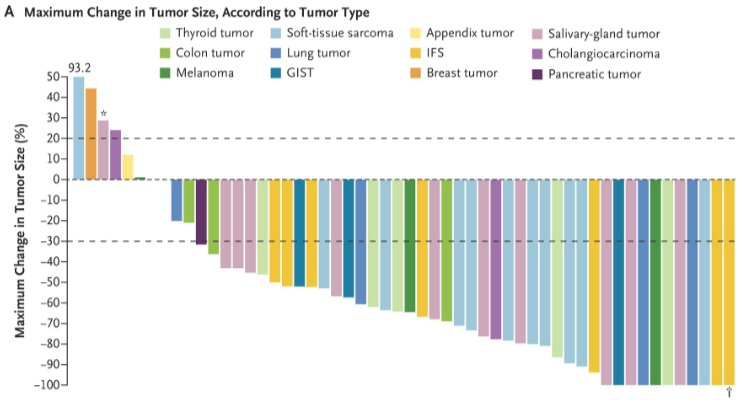
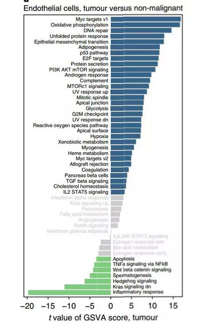

**Author(s)**: `r params$author`  
**Date**: `r Sys.Date()`  


# Academic Citation
If you use this code in your work or research, we kindly request that you cite our publication:

Xiaofan Lu, et al. (2025). FigureYa: A Standardized Visualization Framework for Enhancing Biomedical Data Interpretation and Research Efficiency. iMetaMed. https://doi.org/10.1002/imm3.70005


```{r setup, include=FALSE}
knitr::opts_chunk$set(echo = TRUE)
```

## 需求描述
## Requirement description

图一：不同的癌症用不同的颜色展示

Figure 1: Different cancers shown in different colors



出自<https://www.nejm.org/doi/full/10.1056/NEJMoa1714448>

from<https://www.nejm.org/doi/full/10.1056/NEJMoa1714448>

图二：做类似的图用于GO、KEGG富集分析结果展示，不显著的显示灰色，左右分开的名称，正负富集分开，左右分开画在一张图上。

Figure 2: Do similar diagrams for GO, KEGG enrichment analysis results show. Display non-significant results in gray, separate names on the left and right, with positive and negative enrichment separated, left and right separate drawn on a graph.



出自<https://www.nature.com/articles/s41591-018-0096-5>

原文的输入数据是GSVA score，本代码只模仿形式，不包括GSVA分析。

from<https://www.nature.com/articles/s41591-018-0096-5>

The input data for the original article is the GSVA score; this code only mimics the form and does not include GSVA analysis.

## 应用场景
## Application scenario

场景一：各肿瘤某一指标的比较，例如图一的肿瘤缓解率。

场景二：GSVA结果展示，类似于图二。

Scenario 1: Comparison of a certain index across tumors, such as tumor remission rate in Figure 1.

Scenario 2: GSVA results are presented, similar to Figure 2.

### 场景一
### Scenario 1

每个ID显示为一种颜色

Each ID is shown as a color

### 输入数据
### Input data

```{r}
source("install_dependencies.R")
df<-read.csv("easy_input1.csv")
head(df)

#按照score排序
#sort by score
df<-df[order(df$score,decreasing = T),]
df$index<-seq(1,nrow(df))
head(df)
```

### 开始画图
### Start drawing

```{r,fig.width=7,fig.height=5}
library(ggplot2)
p<-ggplot(df,aes(x=index,y=score,fill=ID)) + 
  geom_bar(stat = 'identity',width = 0.8) + 
  scale_fill_brewer(type = "Qualitative", palette = "Paired") + #bar的颜色 color of bar
  
  scale_y_continuous(breaks=seq(-100, 100, 10), #y轴刻度 y-axis scale
                     expand = c(0,0)) + #上下都不留空 there's no space between the top and the bottom
  scale_x_discrete(expand = expand_scale(mult = c(0.01,0))) + #左边留空，右边到头 leave the left side blank, the right side goes to the end

  #画3条横线
  #draw 3 horizontal lines
  geom_hline(yintercept = c(-30,0,20), 
             linetype = 5, #画虚线 draw a dotted line
             size = 0.3) + #线的粗细 thickness of line
  
  #其他主题
  #other themes
  labs(x = "", y = "Maximum Change in Tumor Size (%)", 
       title = "A Maximum Change in Tumor Size, According to Tumor Type") +
  theme_bw() + #去除背景色 remove background color
  theme(panel.grid =element_blank()) + #去除网格线 remove gridlines
  theme(panel.border = element_blank()) + #去除外层边框 remove outer border
  theme(axis.line = element_line(colour = "black")) + #沿坐标轴显示直线 display lines along the axes
  theme(axis.line.x = element_blank(), axis.ticks.x = element_blank(), axis.text.x = element_blank()) + #去除x轴 remove x-axis
  
  #图例
  #legend
  guides(fill = guide_legend(ncol = 5,title = NULL)) + #图例分5列 legend divided into 5 columns
  scale_size(range=c(5,20)) +
  theme(legend.background = element_blank(), #移除整体边框 remove overall border
        #图例的左下角置于绘图区域的左下角
        #the lower left corner of the legend is placed in the lower left corner of the drawing area
        legend.position=c(0,0),legend.justification = c(0,0)) 
        #改用下面这行，图例就会位于顶部 change to the following line and the legend will be at the top
        #legend.position="top")
p
#保存到PDF文件
#save to PDF file
ggsave("CancerBar.pdf",width = 8,height = 5)
```

### 极大值的处理
### Handling of maximum value

有一个值远高于其他值，右侧会很空。

因此，原图作者让y轴适合大部分数据，然后在最高的那个bar上标出实际数据

Having one value much higher than the others would be very empty on the right side.

So the author of the original graph made the y-axis fit most of the data, and then labeled the highest one bar with the actual data

```{r}
#设置坐标轴范围，最大值设为50，以适应大多数数据
#set the axis range to a maximum of 50 to accommodate most data.
p<-p + coord_cartesian(ylim = c(-90,50)) + #y轴范围，根据实际情况调整 y-axis range, adjust according to actual condition
  #添加数据标签 
  #add data labels 
  geom_text(data = subset(df, score > 50),
            aes(index, 48,label=round(score))) + #在超过50的bar上标出实际数据 labeling of actual data on bar over 50
  geom_text(data = subset(df, index == 3),
            aes(index, score + 1,label = "*")) + #作者的特殊标记 author's special marks
  geom_text(data = subset(df, index == nrow(df)),
            aes(index, score - 3, label = "T"))  #作者的特殊标记 author's special marks
p

#保存到PDF文件
#save to PDF file
ggsave("CancerBar_label.pdf",width = 8,height = 5)
```

## 场景二·原文
## Scenario 2·Original

score绝对值小于阈值的bar显示为灰色

Bars with score absolute values less than the threshold are displayed in gray.

### 输入数据
### Input data

包含两列：ID和score

It contains two columns: ID and score

```{r}
df<-read.csv("easy_input2.csv")
head(df)

#按照score的值分组
#grouped by score value
df$group<-cut(df$score, breaks = c(-Inf,-4,4,Inf),labels = c(1,2,3))
head(df)

#按照score排序
#sort by score
df<-df[order(df$score,decreasing = F),]
df$index<-seq(1,nrow(df))
head(df)
```

### 开始画图
### Start drawing

```{r,fig.width=5,fig.height=8}
library(ggplot2)
ggplot(df,aes(x=index,y=score,fill=group)) + 
  geom_bar(stat = 'identity',width = 0.8) + 
  scale_fill_manual(values = c("palegreen3","snow3","dodgerblue4")) + #bar的颜色 color of bar
  scale_x_discrete(expand = expand_scale(add = .6)) + 
  scale_y_continuous(breaks=seq(-30, 20, 5)) +
  coord_flip() + #坐标轴互换 coordinate axis interchange
  
  #画2条横线
  #draw 2 horizontal lines
  geom_hline(yintercept = c(-4,4), 
             color="white",
             linetype = 2,#画虚线 draw a dotted line
             size = 0.3) + #线的粗细 thickness of line

  #写label
  #write label
  geom_text(data = subset(df, score > 0),
            aes(x=index, y=-0.3, label=ID, color = group),#bar跟坐标轴间留出间隙 leave a gap between the bar and the axes
            size = 3, #字的大小 font size
            hjust = "inward" ) +  #字的对齐方式  the alignment of character
  geom_text(data = subset(df, score < 0),
            aes(x=index, y=0.3, label=ID, color = group),
            size = 3, hjust = "outward") +  
  scale_colour_manual(values = c("snow3","black","black")) +

  #其他主题
  #other themes
  labs(x = "", y = "t value of GSVA score, tumor \n versus non-malignant", 
       title = "Endothelial cells, tumour versus non-malignant") +
  theme_bw() + #去除背景色 remove background color
  theme(panel.grid =element_blank()) + #去除网格线 remove gridlines
  theme(panel.border = element_rect(size = 0.6)) + #边框粗细 border thickness
  theme(axis.line.y = element_blank(), axis.ticks.y = element_blank(), axis.text.y = element_blank()) + #去除y轴 remove y-axis

  guides(fill=FALSE,color=FALSE) #不显示图例 legend not displayed
  
#保存到PDF文件
#save to PDF file
ggsave("GObar.pdf",width = 5,height = 8)
```

## 场景二·不显著的显示为灰色
## Scenario 2·Display non-significant results in gray

pvalue>0.05的bar显示为灰色

Bar with pvalue > 0.05 is shown in gray

### 输入数据
### Input data

包含三列，ID、score和pvalue

It contains three columns, ID, score and pvalue

```{r}
df<-read.csv("easy_input3.csv")
head(df)

#按照pvalue分组
#grouped by pvalue
df$p.group<-cut(df$pval, breaks = c(-Inf,0.05,Inf),labels = c(1,0))
#按照score分组
#grouped by score
df$s.group<-cut(df$score, breaks = c(-Inf,0,Inf),labels = c(0,1))
#合并
#merge
df$ps.group <- paste0(df$p.group,df$s.group)

#根据pvalue和score分为3组
#divided into 3 groups based on pvalue and score
df$group <- ifelse(df$ps.group=='10','1',ifelse(df$ps.group=='11','2','3'))
head(df)

#按照score排序
#sort by score
df<-df[order(df$score,decreasing = F),]
df$index<-seq(1,nrow(df))
head(df)
```

### 开始画图
### Start drawing

只调整了颜色顺序，其余跟“场景二·原文”的画图代码是一样的

Only adjust the color order, the rest of the drawing code is the same as "Scenario 2·Original".

```{r,fig.width=5,fig.height=8}
library(ggplot2)
ggplot(df,aes(x=index,y=score,fill=group)) + 
  geom_bar(stat = 'identity',width = 0.8) + 
  scale_fill_manual(values = c("palegreen3","dodgerblue4","snow3")) + #颜色 color
  scale_x_discrete(expand = expand_scale(add = .6)) + 
  scale_y_continuous(breaks=seq(-30, 20, 5)) +
  coord_flip() + 
  
  geom_hline(yintercept = c(-4,4), 
             color="white",
             linetype = 2,
             size = 0.3) + 

  geom_text(data = subset(df, score > 0),
            aes(x=index, y=-0.3, label=ID, color = p.group),
            size=3,
            hjust = "inward") + 
  geom_text(data = subset(df, score < 0),
            aes(x=index, y=0.3, label=ID, color = p.group),
            size=3,hjust = "outward") +  
  scale_colour_manual(values = c("black","snow3")) +

  labs(x = "", y = "t value of GSVA score, tumor \n versus non-malignant", 
       title = "Endothelial cells, tumour versus non-malignant") +
  theme_bw() + 
  theme(panel.grid =element_blank()) + 
  theme(panel.border = element_rect(size = 0.6)) + 
  theme(axis.line.y = element_blank(), axis.ticks.y = element_blank(), axis.text.y = element_blank()) + 
  guides(fill=FALSE,color=FALSE) 
  
#保存到PDF文件
#save to PDF file
ggsave("GObar_pval.pdf",width = 5,height = 8)
```

```{r}
sessionInfo()
```