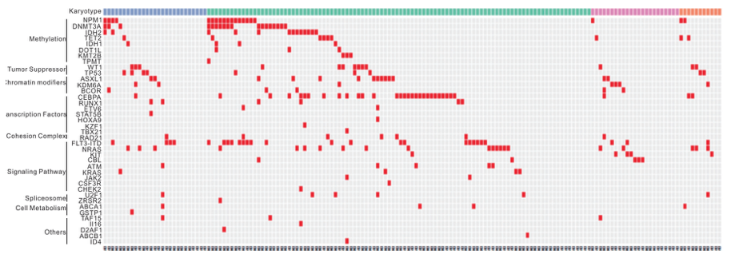
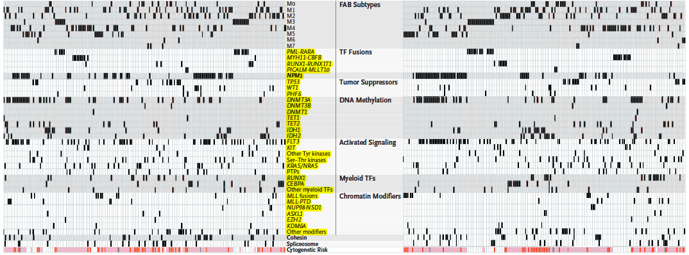

**Author(s)**: `r params$author`  
**Date**: `r Sys.Date()`  

# Academic Citation
If you use this code in your work or research, we kindly request that you cite our publication:

Xiaofan Lu, et al. (2025). FigureYa: A Standardized Visualization Framework for Enhancing Biomedical Data Interpretation and Research Efficiency. iMetaMed. https://doi.org/10.1002/imm3.70005

If you use ComplexHeatmap in published research, please cite:

Zuguang Gu, et al., Complex heatmaps reveal patterns and correlations in multidimensional genomic data, Bioinformatics, 2016.

Zuguang Gu. Complex Heatmap Visualization, iMeta, 2022.

```{r setup, include=FALSE}
knitr::opts_chunk$set(echo = TRUE)
```

# 需求描述
# Requirement description

没有具体突变位点信息，只有临床信息和突变名称，对应着每个个体，01矩阵，需要画这样的oncoprint图，按照pathway分开。

There is no specific mutation site information, only clinical information and mutation names, corresponding to each individual, 01 matrix, which needs to be drawn such oncoprint plots, separated by pathway.



或者这种

Or this


出自<https://www.nejm.org/doi/full/10.1056/NEJMoa1301689>

from<https://www.nejm.org/doi/full/10.1056/NEJMoa1301689>

# 应用场景
# Application scenario

展示多个样本中多个基因的变异，以及临床信息。

- 场景一：01矩阵代表的一种变异类型。例如从基因检测报告中收集的变异基因。

- 场景二：多种变异类型，外显子测序数据。例如用FigureYa18oncoplot输出变异和临床信息，然后用本套代码修改成自己想要的效果。

如果在已发表的研究中使用，请注明出处：

Gu, Z. Complex heatmaps reveal patterns and correlations in multidimensional genomic data. Bioinformatics 2016.

Demonstrate variants in multiple genes in multiple samples, along with clinical information.

- Scenario 1: One variant type represented by the 01 matrix. For example, a variant gene collected from a genetic test report.

- Scenario 2: Multiple variant types with exome sequencing data. For example, use FigureYa18oncoplot to output variants and clinical information, and then use this code to modify it to your desired effect.

If you use it in published research, please cite:

Gu, Z. Complex heatmaps reveal patterns and correlations in multidimensional genomic data. Bioinformatics 2016.

# 环境设置
# Environment setting

```{r}
source("install_dependencies.R")

library(ComplexHeatmap)
Sys.setenv(LANGUAGE = "en") #显示英文报错信息 display English error messages
options(stringsAsFactors = FALSE) #禁止chr转成factor prohibit the conversion of chr to factor
```

# 场景一：01矩阵代表的一种变异类型
# Scenario 1: A variant type represented by the 01 matrix

## 生成输入文件
## Generate input file

这一步仅用于产生示例数据。可跳过这步，直接进入“输入文件”。

此处借用FigureYa18oncoplot的输出文件`onco_matrix.txt`，整理成小伙伴常用的**01矩阵**。

This step is only for generating example data. You can skip this step and go directly to "Input file".

The output file `onco_matrix.txt` of FigureYa18oncoplot is used here, and is organized into the commonly used **01 matrix**.

```{r}
onco_matrix <- read.table("onco_matrix.txt", header = T, row.names = 1, sep = "\t", as.is = T)
#查看部分数据格式
#view some of the data formats
onco_matrix[1:3,1:4]

#把"Missense_Mutation"和"Sense_Mutation"替换为1，其他替换为0
#replace "Missense_Mutation" and "Sense_Mutation" with 1 and others with 0.
onco_matrix[onco_matrix == "Missense_Mutation"] <- "1"
onco_matrix[onco_matrix == "Sense_Mutation"] <- "1"
onco_matrix[onco_matrix != "1"] <- "0"

write.csv(onco_matrix, "easy_input.csv", quote = F)
```

## 输入文件
## Input file

`easy_input.csv`，01矩阵，每行一个基因，每列一个sample。01矩阵代表基因在这个sample里是否变异。

`easy_input_pathway.txt`，基因所在的pathway；

`easy_input_cli.csv`，临床信息，例如人种、病史、治疗方式等。

不同文件之间，基因名、sampleID必须一致。

`easy_input.csv`, 01 matrix, one gene per row, one sample per column. The 01 matrix represents whether the gene is mutated or not in this sample.

`easy_input_pathway.txt`, the pathway where the gene is located;

`easy_input_cli.csv`, clinical information such as ethnicity, medical history, treatment modality, etc.

The gene name and sampleID must be consistent between different files.

```{r}
#读取基因变异数据
#read genetic variation data
mygene <- read.csv("easy_input.csv", header = T,row.names = 1, as.is = T)
#查看部分数据的格式
#view the format of some data
mygene[1:3,1:4]
#用"mut"替换1，用""替换0
#replace 1 with "mut" and 0 with ""
mygene[mygene == 1] <- "mut"
mygene[mygene == 0] <- ""

#读取基因所在的pathway
#read the pathway where the gene is located
mypathway <- read.csv("easy_input_pathway.csv", header = T, row.names = 1, as.is = T)
head(mypathway)
#把pathway添加到mygene的最后一列
#add pathway to the last column of mygene
mygene$pathway <- mypathway[as.character(rownames(mygene)),]

#读取临床信息
#read clinical information
mytype <- read.csv("easy_input_cli.csv")
head(mytype)
#查看有多少种临床信息类型
#view how many clinical information types are available
unique(mytype$type_A)
unique(mytype$type_B)
unique(mytype$type_C)
```

## 设置变异的颜色、形状
## Set the color and shape of the variant

```{r}
#用fill = 设置mutation以及背景用什么颜色
#use fill = to set the mutation and what color to use for the background
alter_fun = list(
  background = function(x, y, w, h) {
    grid.rect(x, y, w-unit(0.5, "mm"), h-unit(0.5, "mm"), gp = gpar(fill = NA, col = NA)) #不要背景色 no background color
  },
  mut = function(x, y, w, h) {
    grid.rect(x, y, w-unit(0.5, "mm"), h-unit(0.5, "mm"), gp = gpar(fill = "#008000", col = NA)) #mut是绿色 mut is green
  })

#mutation bar plot的颜色，跟瀑布图一致
#the color of the mutation bar plot, consistent with the oncoplot
col = c("mut" = "#008000")

#定义足够多的颜色
#define enough colors
mycol <- c("#223D6C","#D20A13","#FFD121","#088247","#11AA4D","#58CDD9","#7A142C","#5D90BA","#431A3D","#91612D","#6E568C","#E0367A","#D8D155","#64495D","#7CC767")
```

## 从临床数据中删除没有变异的sample
## Remove samples without variants from clinical data

参数`remove_empty_columns = TRUE`会删掉没有变异的sample，我们需要把临床数据中相应的sample也删掉。

**注意：**在后面所有画图命令中，column_order和remove_empty_columns这两个参数，都要跟p1的参数一致。

The parameter `remove_empty_columns = TRUE` deletes samples without variants, and we need to delete the corresponding samples from the clinical data as well.

**Note:** In all later drawing commands, the parameters column_order and remove_empty_columns, should be the same as the parameters of p1.

```{r,fig.width=10,highlight=4}
#提取瀑布图中画出的sample
#extract the sample drawn in the oncoplot
p1 <- oncoPrint(mygene[1:(ncol(mygene)-1)], get_type = function(x) x,
                     alter_fun = alter_fun, col = col,
                     #remove_empty_columns = TRUE, #删除没有突变的sample remove samples without mutations
                     #column_order = NULL, #不按突变频率给sample排序 do not sort samples by mutation frequency
                     #row_order = NULL, #不按突变频率给基因排序 do not sort genes by mutation frequency
                     row_split = mygene$path)

matrix <- p1@matrix
sampleOrder <-  data.frame(p1@column_order)
rownames(sampleOrder) <- p1@column_names_param$labels
sampleOrder$oriOrder <- row.names(sampleOrder)
sampleOrder <- sampleOrder[order(as.numeric(sampleOrder[,1]),decreasing=F),]
rownames(mytype) <- mytype$sample

#在临床数据中，只保留瀑布图中画出的sample
#in the clinical data, only the samples drawn in the oncoplot are kept
mytype <- mytype[sampleOrder$oriOrder,]
```

现在，这个mytype就跟瀑布图中的sample一致了。

Now, this mytype matches the sample in the oncoplot.

## 开始画图
## Start drawing

把临床信息画在下面

Draw clinical information below

```{r,fig.width=10,highlight=4}
#画临床数据的heatmap
#draw heatmap of clinical data
my_annotation = HeatmapAnnotation(df = data.frame(mytype[2:4]),
                                  col = list(type_A = c("type1" = mycol[1], "type2" = mycol[2]),
                                             type_B = c("type3" = mycol[3], "type4" = mycol[4], "type5" = mycol[5]),
                                             type_C = c("type6" = mycol[6], "type7" = mycol[7], "type8" = mycol[8], "type9" = mycol[9])))

#画瀑布图
#draw oncoplot
p <- oncoPrint(mygene[1:(ncol(mygene)-1)], get_type = function(x) x,
               alter_fun = alter_fun, col = col,
               #remove_empty_columns = TRUE,#删除没有突变的sample remove samples without mutations
               #column_order = NULL, #不按突变频率给sample排序 do not sort samples by mutation frequency
               #row_order = NULL, #不按突变频率给基因排序 do not sort genes by mutation frequency
               show_pct = FALSE, #左侧不显示百分比 percentage not shown on the left
               bottom_annotation = my_annotation,#把临床信息画在下面 draw clinical information below
               row_split = mygene$path, #按照pathway分开画 draw separately according to the pathway
               show_heatmap_legend = FALSE) #不显示突变的图例 legend for mutations not shown
p

#保存到pdf文件
#save to PDF file
pdf("oncoprint_cli.pdf",width = 10,height = 5)
p
dev.off()
```

有人喜欢把临床数据画在上面

Some people like to draw clinical data above

```{r,fig.width=12,highlight=4}
oncoPrint(mygene[1:(ncol(mygene)-1)], get_type = function(x) x,
          alter_fun = alter_fun, col = col,
          #remove_empty_columns = TRUE,
          #column_order = NULL, 
          #row_order = NULL, 
          #show_pct = FALSE, 
          top_annotation = my_annotation, #把临床信息画在上面 draw clinical data above
          row_split = mygene$path,
          show_heatmap_legend = FALSE)
```

还可以分开画两组临床信息，分别放在上面和下面

It is also possible to draw two separate sets of clinical information, placed above and below

```{r,fig.width=10,highlight=4}
top_annotation = HeatmapAnnotation(df = data.frame(mytype[3]),
                                   col = list(type_B = c("type3" = mycol[3], "type4" = mycol[4], "type5" = mycol[5])),
                                   annotation_height = unit(0.2, "cm")) #临床信息heatmap的高度 height of clinical information heatmap
bottom_annotation = HeatmapAnnotation(df = data.frame(mytype[c(2,4)]),
                                      col = list(type_A = c("type1" = mycol[1], "type2" = mycol[2]),
                                                 type_C = c("type6" = mycol[6], "type7" = mycol[7], "type8" = mycol[8], "type9" = mycol[9])))

p <- oncoPrint(mygene[1:(ncol(mygene)-1)], get_type = function(x) x,
         alter_fun = alter_fun, col = col,
         #remove_empty_columns = TRUE,
         #column_order = NULL, 
         #row_order = NULL, 
         show_pct = FALSE, 
         top_annotation = top_annotation,#上面的临床信息 clinical information above
         bottom_annotation = bottom_annotation,#下面的临床信息 clinical information below
         row_split = mygene$path,
         show_heatmap_legend = FALSE)
p

#保存到pdf文件
#save to PDF file
pdf("oncoprint_cli_nobar.pdf",width = 12,height = 5)
p
dev.off()
```

# 场景二：多种变异类型
# Scenario 2: Multiple variant types

## 输入文件
## Input file

`onco_matrix.txt`，基因变异矩阵，此处以FigureYa18的输出文件作为输入；

`easy_input_pathway.txt`，基因所在的pathway；

`easy_input_cli.csv`，临床信息，例如人种、病史、治疗方式等。

`onco_matrix.txt`, the gene variant matrix, here the output file from FigureYa18 is used as input;

`easy_input_pathway.txt`, the pathway where the genes are located;

`easy_input_cli.csv`, clinical information such as ethnicity, medical history, treatment modality, etc.

```{r}
#读取基因变异数据
#read genetic variation data
mygene <- read.table("onco_matrix.txt",header = T,row.names = 1,sep = "\t",as.is = T)
#查看部分数据的格式
#view the format of some data
mygene[1:3,1:3]

#查看一共有多少种变异类型
#view how many variant types there are in total
mygene_new <- as.matrix(mygene)
dim(mygene_new) <- c(ncol(mygene)*nrow(mygene),1)
unique(mygene_new)

#读取基因所在的pathway
#read the pathway where the gene is located
mypathway <- read.csv("easy_input_pathway.csv", header = T, row.names = 1, as.is = T)
head(mypathway)

#把pathway添加到mygene的最后一列
#add pathway to the last column of mygene
mygene$pathway <- mypathway[as.character(rownames(mygene)),]

#读取临床信息
#read clinical information
mytype <- read.csv("easy_input_cli.csv")
head(mytype)
```

## 设置变异的颜色、形状
## Set the color and shape of the variant

```{r}
#先定义足够多的颜色
#define enough colors first
mycol <- c("#223D6C","#D20A13","#FFD121","#088247","#11AA4D","#58CDD9","#7A142C","#5D90BA","#431A3D","#91612D","#6E568C","#E0367A","#D8D155","#64495D","#7CC767")

#Multi_Hit为短矩形，其余为长矩形
#Multi_Hit is short rectangle, the rest are long rectangle
alter_fun = list(
  background = function(x, y, w, h) {
    grid.rect(x, y, w-unit(0.5, "mm"), h-unit(0.5, "mm"), gp = gpar(fill = NA, col = NA)) #不要背景色 no background color
  },
  Nonsense_Mutation = function(x, y, w, h) {
    grid.rect(x, y, w-unit(0.5, "mm"), h-unit(0.5, "mm"), gp = gpar(fill = mycol[4], col = NA)) 
  },
  Missense_Mutation = function(x, y, w, h) {
    grid.rect(x, y, w-unit(0.5, "mm"), h-unit(0.5, "mm"), gp = gpar(fill = mycol[5], col = NA)) 
  },
  Frame_Shift_Del = function(x, y, w, h) {
    grid.rect(x, y, w-unit(0.5, "mm"), h-unit(0.5, "mm"), gp = gpar(fill = mycol[1], col = NA)) 
  },
  Frame_Shift_Ins = function(x, y, w, h) {
    grid.rect(x, y, w-unit(0.5, "mm"), h-unit(0.5, "mm"), gp = gpar(fill = mycol[2], col = NA)) 
  },
  Splice_Site = function(x, y, w, h) {
    grid.rect(x, y, w-unit(0.5, "mm"), h-unit(0.5, "mm"), gp = gpar(fill = mycol[6], col = NA)) 
  },
  In_Frame_Del = function(x, y, w, h) {
    grid.rect(x, y, w-unit(0.5, "mm"), h-unit(0.5, "mm"), gp = gpar(fill = mycol[7], col = NA)) 
  },
  In_Frame_Ins = function(x, y, w, h) {
    grid.rect(x, y, w-unit(0.5, "mm"), h-unit(0.5, "mm"), gp = gpar(fill = mycol[8], col = NA)) 
  },
  Multi_Hit = function(x, y, w, h) {
    grid.rect(x, y, w-unit(0.5, "mm"), h*0.33, gp = gpar(fill = "black", col = NA)) 
  }
)

#bar plot的颜色，跟瀑布图一致
#the color of the bar plot, consistent with the oncoplot
col = c("Nonsense_Mutation" = mycol[4], 
        "Missense_Mutation" = mycol[5], 
        "Frame_Shift_Del" = mycol[1], 
        "Frame_Shift_Ins" = mycol[2], 
        "Splice_Site" = mycol[6], 
        "In_Frame_Del" = mycol[7],
        "In_Frame_Ins" = mycol[8],
        "Multi_Hit" = "black")
```

## 从临床数据中删除没有变异的sample
## Remove samples with no variants from clinical data

```{r}
#提取瀑布图中画出的sample
#extract the sample drawn in the oncoplot
p1 <- oncoPrint(mygene[1:(ncol(mygene)-1)], get_type = function(x) x,
                     alter_fun = alter_fun, col = col,
                     remove_empty_columns = TRUE, #删除没有突变的sample remove samples without mutations
                     #column_order = NULL, #不按突变频率给sample排序 do not sort samples by mutation frequency
                     #row_order = NULL, #不按突变频率给基因排序 do not sort genes by mutation frequency
                     row_split = mygene$path)

matrix <- p1@matrix
sampleOrder <-  data.frame(p1@column_order)
rownames(sampleOrder) <- p1@column_names_param$labels
sampleOrder$oriOrder <- row.names(sampleOrder)
sampleOrder <- sampleOrder[order(as.numeric(sampleOrder[,1]),decreasing=F),]
rownames(mytype) <- mytype$sample

#在临床数据中，只保留瀑布图中画出的sample
#in the clinical data, only the samples drawn in the oncoplot are kept
mytype <- mytype[sampleOrder$oriOrder,]
```

现在，这个mytype就跟瀑布图中的sample一致了。

Now, this mytype matches the sample in the oncoplot.

## 开始画图
## Start drawing

```{r, fig.width=12, fig.height=5}
#画临床数据的heatmap
#draw heatmap of clinical data
my_annotation = HeatmapAnnotation(df = data.frame(mytype[2:4]),
                                  col = list(type_A = c("type1" = mycol[1], "type2" = mycol[2]),
                                             type_B = c("type3" = mycol[3], "type4" = mycol[4], "type5" = mycol[5]),
                                             type_C = c("type6" = mycol[6], "type7" = mycol[7], "type8" = mycol[8], "type9" = mycol[9])))

#画瀑布图
#draw oncoplot
p <- oncoPrint(mygene[1:(ncol(mygene)-1)], get_type = function(x) x,
               alter_fun = alter_fun, col = col,
               remove_empty_columns = TRUE,
               #column_order = NULL, 
               #row_order = NULL, 
               show_pct = FALSE, 
               bottom_annotation = my_annotation,
               row_split = mygene$path)
p

#保存到pdf文件
#save to PDF file
pdf("oncoprint_cli_multi.pdf",width = 12,height = 5)
p
dev.off()
```

```{r}
sessionInfo()
```